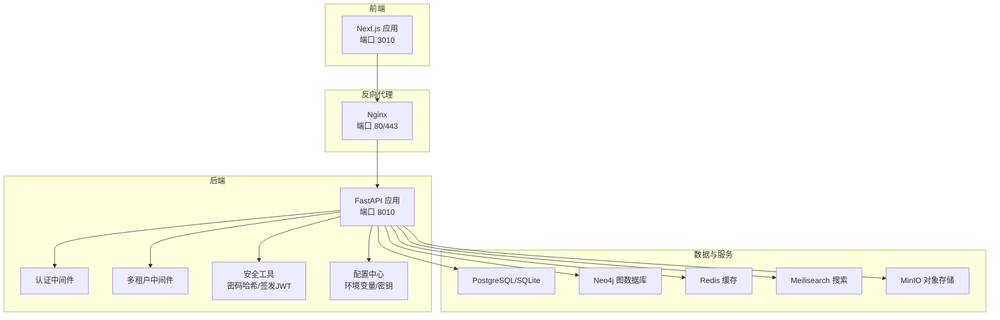
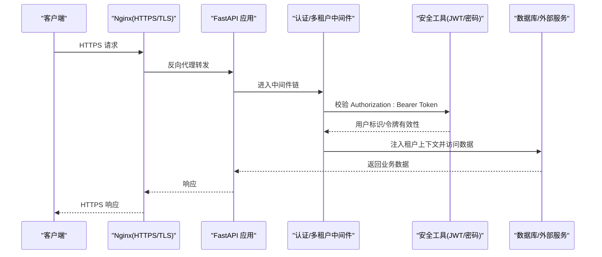
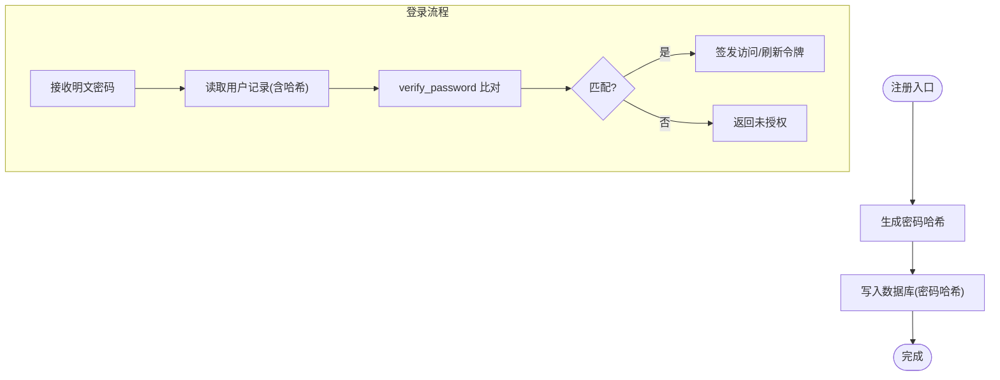
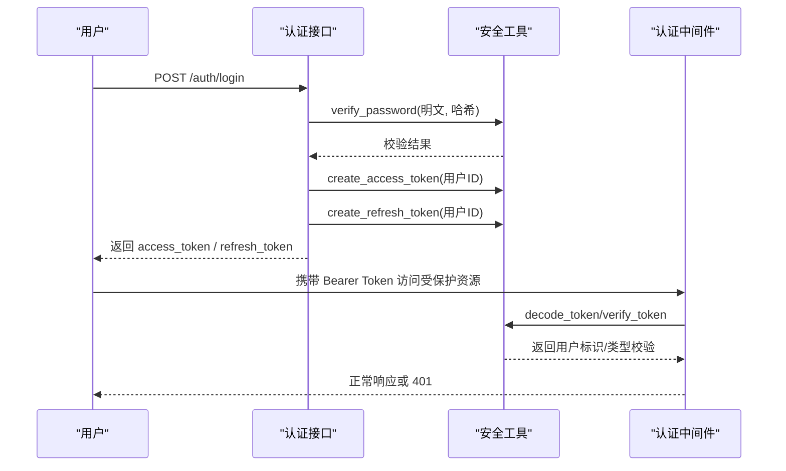
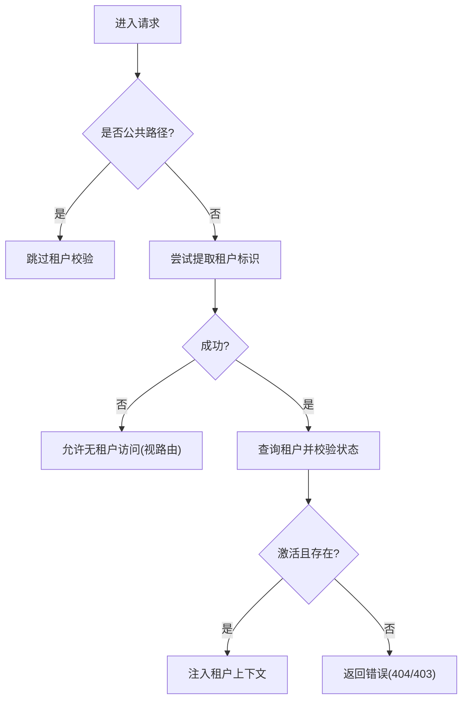
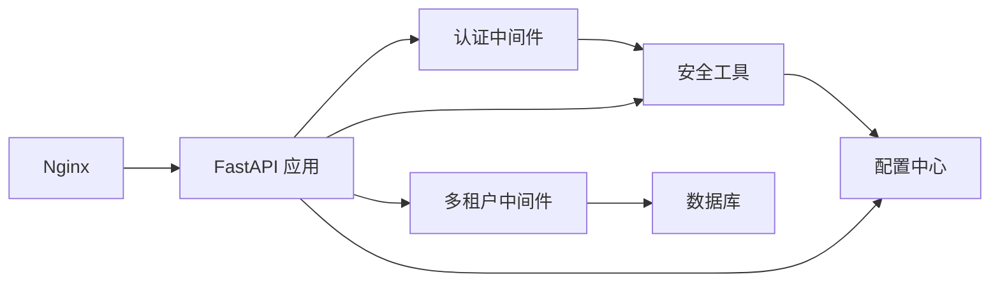

# 数据保护与加密

<cite>
**本文引用的文件**
- [backend/app/core/security.py](file://backend/app/core/security.py)
- [backend/app/core/config.py](file://backend/app/core/config.py)
- [backend/app/api/v1/endpoints/auth.py](file://backend/app/api/v1/endpoints/auth.py)
- [backend/app/middleware/auth.py](file://backend/app/middleware/auth.py)
- [backend/app/middleware/tenant.py](file://backend/app/middleware/tenant.py)
- [backend/app/models/system.py](file://backend/app/models/system.py)
- [backend/app/models/tenant.py](file://backend/app/models/tenant.py)
- [backend/app/main.py](file://backend/app/main.py)
- [docker/nginx/nginx.conf](file://docker/nginx/nginx.conf)
- [docker/nginx/conf.d/default.conf](file://docker/nginx/conf.d/default.conf)
- [docker-compose.yml](file://docker-compose.yml)
- [docker-compose.prod.yml](file://docker-compose.prod.yml)
- [docker/prometheus/prometheus.yml](file://docker/prometheus/prometheus.yml)
- [backend/tests/test_auth.py](file://backend/tests/test_auth.py)
</cite>

## 目录
1. [简介](#简介)
2. [项目结构](#项目结构)
3. [核心组件](#核心组件)
4. [架构总览](#架构总览)
5. [详细组件分析](#详细组件分析)
6. [依赖分析](#依赖分析)
7. [性能考虑](#性能考虑)
8. [故障排查指南](#故障排查指南)
9. [结论](#结论)
10. [附录](#附录)

## 简介
本文件面向多租户族谱管理系统，系统性阐述数据保护与加密机制，覆盖以下方面：
- 敏感数据的加密存储策略：密码哈希、令牌签名与传输加密
- JWT 密钥管理最佳实践：密钥轮换与安全存储
- 数据传输安全：HTTPS 配置与 TLS 设置
- 数据访问日志与审计跟踪：敏感操作监控与告警
- 数据泄露防护与合规性：基于现有实现的加固建议
- 具体配置示例与安全测试方法

## 项目结构
后端采用 FastAPI + SQLAlchemy 异步 ORM，结合 Nginx 反向代理与多服务容器编排，形成“前端 → Nginx → 后端 API”的典型生产部署形态；同时通过中间件实现多租户上下文注入与鉴权。

图表来源
- [backend/app/main.py:45-92](file://backend/app/main.py#L45-L92)
- [docker-compose.yml:89-132](file://docker-compose.yml#L89-L132)
- [docker/nginx/conf.d/default.conf:1-113](file://docker/nginx/conf.d/default.conf#L1-L113)

章节来源
- [backend/app/main.py:45-92](file://backend/app/main.py#L45-L92)
- [docker-compose.yml:1-145](file://docker-compose.yml#L1-L145)
- [docker/nginx/conf.d/default.conf:1-113](file://docker/nginx/conf.d/default.conf#L1-L113)

## 核心组件
- 安全工具模块：负责密码哈希、JWT 签发与校验、令牌类型验证
- 配置模块：集中管理应用配置与密钥（含 JWT 密钥）
- 认证中间件：从请求头解析 Bearer Token，调用安全工具进行校验并加载用户
- 多租户中间件：识别租户上下文（子域名/路径/Header），注入租户信息
- 数据模型：系统级与租户级模型，支持审计日志表结构
- 反向代理：Nginx 提供 HTTPS/TLS、HSTS、速率限制等传输层安全

章节来源
- [backend/app/core/security.py:1-103](file://backend/app/core/security.py#L1-L103)
- [backend/app/core/config.py:11-89](file://backend/app/core/config.py#L11-L89)
- [backend/app/middleware/auth.py:1-88](file://backend/app/middleware/auth.py#L1-L88)
- [backend/app/middleware/tenant.py:15-142](file://backend/app/middleware/tenant.py#L15-L142)
- [backend/app/models/system.py:23-223](file://backend/app/models/system.py#L23-L223)
- [backend/app/models/tenant.py:214-243](file://backend/app/models/tenant.py#L214-L243)
- [docker/nginx/nginx.conf:12-57](file://docker/nginx/nginx.conf#L12-L57)

## 架构总览
下图展示从客户端到后端 API 的端到端数据流，以及各环节的加密与安全控制点。

图表来源
- [backend/app/middleware/auth.py:15-57](file://backend/app/middleware/auth.py#L15-L57)
- [backend/app/middleware/tenant.py:39-84](file://backend/app/middleware/tenant.py#L39-L84)
- [backend/app/core/security.py:26-103](file://backend/app/core/security.py#L26-L103)
- [docker/nginx/conf.d/default.conf:10-63](file://docker/nginx/conf.d/default.conf#L10-L63)

## 详细组件分析

### 密码哈希与存储
- 实现要点
  - 使用 bcrypt 进行密码哈希，确保不可逆且抗彩虹表
  - 登录时使用哈希校验函数比对明文与存储值
  - 注册流程中将明文密码转换为哈希后写入数据库
- 复杂度与性能
  - 哈希计算为 O(1) 时间复杂度，但 bcrypt 的成本参数可调以平衡安全性与性能
- 错误处理
  - 登录失败返回未授权错误，避免泄露具体原因
- 审计与合规
  - 建议在变更密码或登录事件记录审计日志（当前模型已具备审计表结构）

图表来源
- [backend/app/api/v1/endpoints/auth.py:55-86](file://backend/app/api/v1/endpoints/auth.py#L55-L86)
- [backend/app/api/v1/endpoints/auth.py:89-123](file://backend/app/api/v1/endpoints/auth.py#L89-L123)
- [backend/app/core/security.py:16-23](file://backend/app/core/security.py#L16-L23)

章节来源
- [backend/app/api/v1/endpoints/auth.py:55-123](file://backend/app/api/v1/endpoints/auth.py#L55-L123)
- [backend/app/core/security.py:16-23](file://backend/app/core/security.py#L16-L23)

### JWT 令牌签名与验证
- 实现要点
  - 支持访问令牌与刷新令牌两类，分别设置过期时间
  - 使用 HS256 算法与共享密钥进行签名与验证
  - 中间件从 Authorization 头提取 Bearer Token 并调用解码函数
- 密钥管理现状
  - 密钥定义于配置类中，开发默认值需替换为强随机密钥
- 安全建议
  - 生产环境必须启用密钥轮换与密钥备份
  - 建议引入密钥管理服务（KMS）或环境变量注入

图表来源
- [backend/app/api/v1/endpoints/auth.py:89-158](file://backend/app/api/v1/endpoints/auth.py#L89-L158)
- [backend/app/middleware/auth.py:15-57](file://backend/app/middleware/auth.py#L15-L57)
- [backend/app/core/security.py:26-103](file://backend/app/core/security.py#L26-L103)

章节来源
- [backend/app/api/v1/endpoints/auth.py:89-158](file://backend/app/api/v1/endpoints/auth.py#L89-L158)
- [backend/app/middleware/auth.py:15-57](file://backend/app/middleware/auth.py#L15-L57)
- [backend/app/core/security.py:26-103](file://backend/app/core/security.py#L26-L103)

### 多租户上下文与访问控制
- 租户识别顺序
  - 路径前缀 /t/{slug}/...
  - 子域名 tenant.domain.com
  - 自定义头部 X-Tenant-ID
- 上下文注入
  - 将租户对象与模式名注入请求状态，后续数据库访问按租户隔离
- 权限检查
  - 当前中间件提供认证依赖，权限检查留有扩展点

图表来源
- [backend/app/middleware/tenant.py:39-84](file://backend/app/middleware/tenant.py#L39-L84)
- [backend/app/middleware/tenant.py:93-125](file://backend/app/middleware/tenant.py#L93-L125)

章节来源
- [backend/app/middleware/tenant.py:15-142](file://backend/app/middleware/tenant.py#L15-L142)

### 数据库与模型中的隐私字段
- 系统级模型
  - 用户模型包含邮箱、密码哈希、状态与时间戳等字段
- 租户级模型
  - 人员模型包含可见性字段，用于隐私控制
- 审计日志
  - 已定义变更日志表结构，可用于记录敏感操作

章节来源
- [backend/app/models/system.py:73-121](file://backend/app/models/system.py#L73-L121)
- [backend/app/models/tenant.py:61-132](file://backend/app/models/tenant.py#L61-L132)
- [backend/app/models/tenant.py:214-243](file://backend/app/models/tenant.py#L214-L243)

### 传输加密与 HTTPS 配置
- Nginx 配置要点
  - 强制重定向至 HTTPS
  - 启用 TLSv1.2/1.3、现代密码套件
  - 启用 HSTS 与安全响应头
  - 速率限制与健康检查端点
- 生产环境建议
  - 使用 Let’s Encrypt 获取证书并自动续期
  - 关闭会话票据、禁用弱协议与密码套件
  - 在反向代理层开启缓存与压缩，减少后端压力

章节来源
- [docker/nginx/nginx.conf:12-57](file://docker/nginx/nginx.conf#L12-L57)
- [docker/nginx/conf.d/default.conf:10-91](file://docker/nginx/conf.d/default.conf#L10-L91)

## 依赖分析
- 组件耦合
  - 认证中间件依赖安全工具进行令牌校验
  - 多租户中间件依赖数据库查询加载租户信息
  - 安全工具依赖配置模块读取密钥与算法
- 外部依赖
  - Nginx 作为统一入口，承担 TLS 终止与安全加固
  - 容器编排文件定义了数据库、搜索引擎、缓存与对象存储的连接参数

图表来源
- [backend/app/middleware/auth.py:10-12](file://backend/app/middleware/auth.py#L10-L12)
- [backend/app/middleware/tenant.py:11-12](file://backend/app/middleware/tenant.py#L11-L12)
- [backend/app/core/security.py:10](file://backend/app/core/security.py#L10)
- [backend/app/main.py:66-70](file://backend/app/main.py#L66-L70)
- [docker/nginx/conf.d/default.conf:33-43](file://docker/nginx/conf.d/default.conf#L33-L43)

章节来源
- [backend/app/middleware/auth.py:10-12](file://backend/app/middleware/auth.py#L10-L12)
- [backend/app/middleware/tenant.py:11-12](file://backend/app/middleware/tenant.py#L11-L12)
- [backend/app/core/security.py:10](file://backend/app/core/security.py#L10)
- [backend/app/main.py:66-70](file://backend/app/main.py#L66-L70)
- [docker/nginx/conf.d/default.conf:33-43](file://docker/nginx/conf.d/default.conf#L33-L43)

## 性能考虑
- 密码哈希成本参数可调，建议在生产环境适当提高以增强抗暴力破解能力
- JWT 解析为轻量操作，瓶颈通常不在令牌验证
- Nginx 层面的速率限制与健康检查有助于保护后端免受突发流量冲击
- 数据库连接池与租户隔离策略需结合实际并发与数据规模调整

## 故障排查指南
- 认证失败
  - 检查 Authorization 头格式是否为 Bearer Token
  - 确认令牌类型与有效期，必要时刷新令牌
- 租户上下文缺失
  - 核对请求路径、子域名或自定义头部是否正确
  - 查看租户状态与激活情况
- 传输层问题
  - 检查 Nginx 日志与证书链
  - 确认 TLS 协议与密码套件兼容性

章节来源
- [backend/app/middleware/auth.py:15-57](file://backend/app/middleware/auth.py#L15-L57)
- [backend/app/middleware/tenant.py:39-84](file://backend/app/middleware/tenant.py#L39-L84)
- [docker/nginx/conf.d/default.conf:10-63](file://docker/nginx/conf.d/default.conf#L10-L63)

## 结论
系统在密码哈希、JWT 签名与传输加密方面具备基础能力，但在生产环境中仍需补齐以下关键项：
- 强化密钥管理：启用密钥轮换与安全存储，避免硬编码密钥
- 完善审计与告警：利用现有审计表结构记录敏感操作并接入监控告警
- 加强传输安全：完善 TLS 配置与证书管理，强化安全响应头
- 完善权限体系：在中间件中实现细粒度权限检查

## 附录

### JWT 密钥管理最佳实践
- 密钥轮换
  - 新旧密钥并行验证，过渡期内同时支持两种密钥解码
  - 刷新令牌使用新密钥签发，旧令牌到期后回收
- 安全存储
  - 使用环境变量或密钥管理服务注入密钥
  - 严格控制密钥访问权限与日志脱敏

章节来源
- [backend/app/core/config.py:54-57](file://backend/app/core/config.py#L54-L57)
- [backend/app/core/security.py:48-52](file://backend/app/core/security.py#L48-L52)

### 数据传输安全配置示例
- Nginx
  - 启用 TLSv1.2/1.3、现代密码套件与 HSTS
  - 速率限制与健康检查端点
- 容器编排
  - 生产环境使用独立环境变量注入密钥与主密钥

章节来源
- [docker/nginx/conf.d/default.conf:10-91](file://docker/nginx/conf.d/default.conf#L10-L91)
- [docker-compose.prod.yml:107-119](file://docker-compose.prod.yml#L107-L119)

### 数据访问日志与审计跟踪设计
- 审计表结构
  - 已定义变更日志模型，支持记录表名、记录 ID、动作、旧值、新值、变更人与时间
- 建议
  - 对敏感操作（如用户删除、密码修改、角色提升）强制记录审计
  - 将审计日志与监控系统联动，触发异常告警

章节来源
- [backend/app/models/tenant.py:214-243](file://backend/app/models/tenant.py#L214-L243)

### 数据泄露防护与合规性
- 防护措施
  - 最小权限原则与职责分离
  - 定期轮换密钥与访问凭证
  - 数据最小化与匿名化处理
- 合规性
  - 建议参考 GDPR、网络安全等级保护等标准，完善数据处理流程与用户权利保障

### 安全测试方法
- 单元测试
  - 验证密码哈希与校验逻辑
  - 验证注册、登录与令牌刷新流程
- 端到端测试
  - 使用测试客户端模拟认证与受保护资源访问
  - 检查 401/403 行为与错误响应一致性

章节来源
- [backend/tests/test_auth.py:12-149](file://backend/tests/test_auth.py#L12-L149)