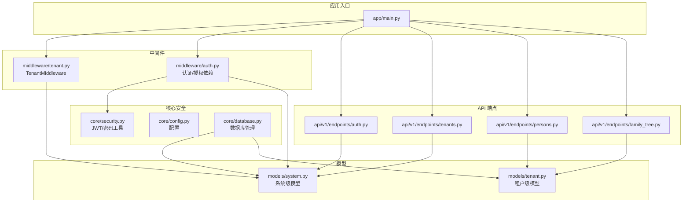
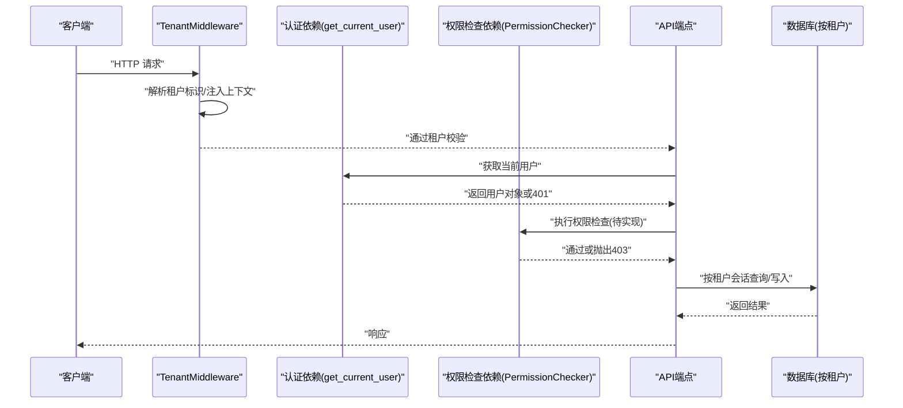
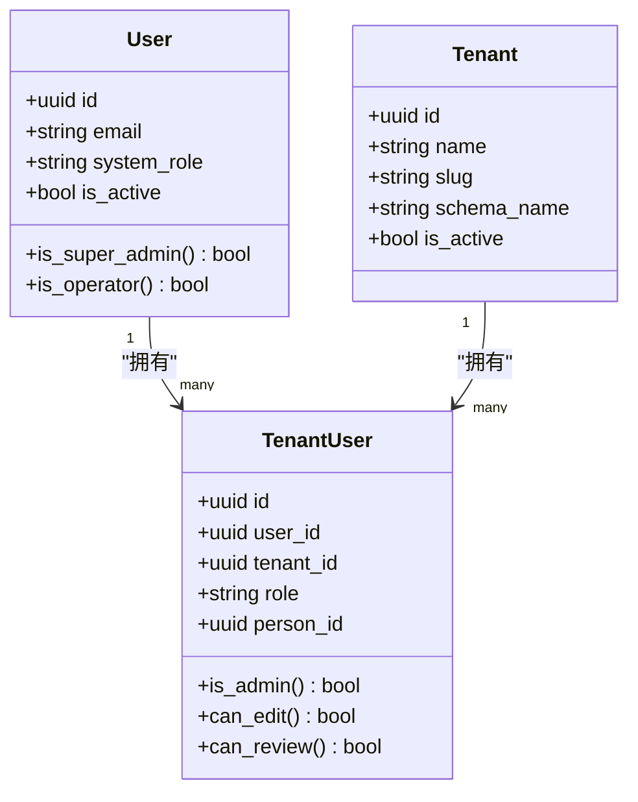
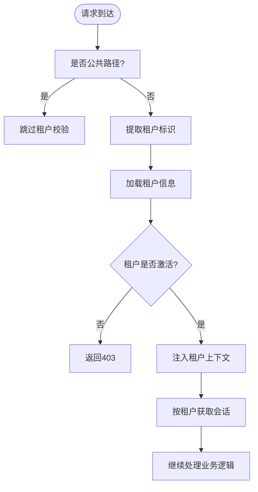
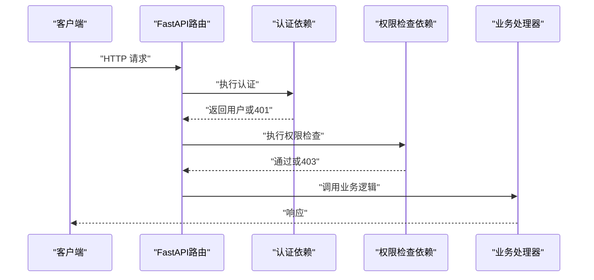
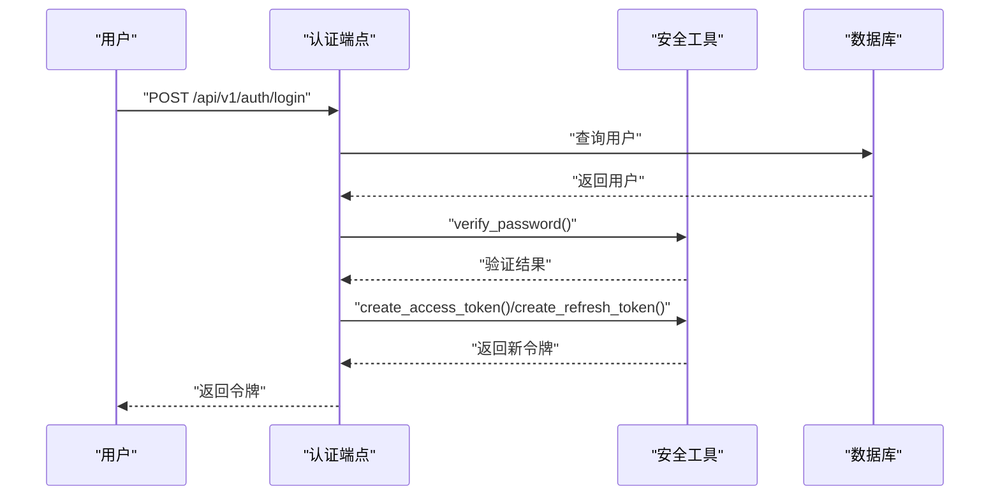
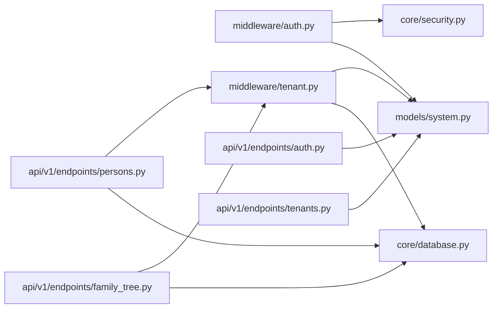

# 权限控制与授权

<cite>
**本文档引用的文件**
- [backend/app/core/security.py](file://backend/app/core/security.py)
- [backend/app/middleware/auth.py](file://backend/app/middleware/auth.py)
- [backend/app/middleware/tenant.py](file://backend/app/middleware/tenant.py)
- [backend/app/models/system.py](file://backend/app/models/system.py)
- [backend/app/models/tenant.py](file://backend/app/models/tenant.py)
- [backend/app/api/v1/endpoints/auth.py](file://backend/app/api/v1/endpoints/auth.py)
- [backend/app/api/v1/endpoints/tenants.py](file://backend/app/api/v1/endpoints/tenants.py)
- [backend/app/api/v1/endpoints/persons.py](file://backend/app/api/v1/endpoints/persons.py)
- [backend/app/api/v1/endpoints/family_tree.py](file://backend/app/api/v1/endpoints/family_tree.py)
- [backend/app/core/config.py](file://backend/app/core/config.py)
- [backend/app/core/database.py](file://backend/app/core/database.py)
- [backend/app/main.py](file://backend/app/main.py)
</cite>

## 目录
1. [简介](#简介)
2. [项目结构](#项目结构)
3. [核心组件](#核心组件)
4. [架构总览](#架构总览)
5. [详细组件分析](#详细组件分析)
6. [依赖分析](#依赖分析)
7. [性能考虑](#性能考虑)
8. [故障排除指南](#故障排除指南)
9. [结论](#结论)
10. [附录](#附录)

## 简介
本文件面向多租户族谱管理系统，系统性阐述权限控制与授权机制，重点覆盖以下方面：
- RBAC（基于角色的访问控制）模型设计与实现：系统级角色与租户级角色的职责划分、权限矩阵与继承关系。
- 多租户数据访问控制策略：租户间数据隔离、跨租户访问限制与上下文注入。
- API 端点级权限验证：装饰器模式应用、权限检查流程与中间件协作。
- 动态权限与继承：用户在不同租户中的角色继承、权限动态分配与扩展点。
- 实战示例：权限配置清单与常见权限场景的解决方案。

## 项目结构
后端采用 FastAPI + SQLAlchemy 异步 ORM 架构，安全与权限相关模块分布如下：
- 核心安全工具：JWT 编解码、密码哈希、令牌生成与校验。
- 认证与授权中间件：用户认证、超级用户校验、权限检查依赖。
- 多租户中间件：租户识别、上下文注入、路径与子域解析。
- 模型层：系统级模型（用户、租户、订阅）与租户级模型（族谱数据）。
- API 层：认证、租户管理、族谱数据等端点。
- 配置与数据库：全局设置、数据库连接与多租户引擎管理。

图表来源
- [backend/app/main.py:45-92](file://backend/app/main.py#L45-L92)
- [backend/app/middleware/tenant.py:15-84](file://backend/app/middleware/tenant.py#L15-L84)
- [backend/app/middleware/auth.py:15-87](file://backend/app/middleware/auth.py#L15-L87)
- [backend/app/core/security.py:26-103](file://backend/app/core/security.py#L26-L103)
- [backend/app/core/database.py:24-171](file://backend/app/core/database.py#L24-L171)
- [backend/app/models/system.py:23-223](file://backend/app/models/system.py#L23-L223)
- [backend/app/models/tenant.py:23-244](file://backend/app/models/tenant.py#L23-L244)
- [backend/app/api/v1/endpoints/auth.py:55-179](file://backend/app/api/v1/endpoints/auth.py#L55-L179)
- [backend/app/api/v1/endpoints/tenants.py:118-164](file://backend/app/api/v1/endpoints/tenants.py#L118-L164)
- [backend/app/api/v1/endpoints/persons.py:172-493](file://backend/app/api/v1/endpoints/persons.py#L172-L493)
- [backend/app/api/v1/endpoints/family_tree.py:43-274](file://backend/app/api/v1/endpoints/family_tree.py#L43-L274)

章节来源
- [backend/app/main.py:45-92](file://backend/app/main.py#L45-L92)
- [backend/app/core/database.py:24-171](file://backend/app/core/database.py#L24-L171)

## 核心组件
- 安全工具与令牌
  - 密码哈希与校验、JWT 访问/刷新令牌生成、令牌解码与类型校验。
- 认证与授权中间件
  - 从请求头提取 Bearer 令牌，解析用户身份；提供超级用户校验与权限检查依赖占位。
- 多租户中间件
  - 支持子域、URL 路径、自定义头部三种租户标识方式；对公共路径放行；加载租户并注入上下文。
- 模型与角色
  - 系统级角色：普通用户、运营人员、超级管理员；租户级角色：成员、编辑者、审核者、租户管理员。
- 数据库与会话
  - 多租户引擎管理器，支持 PostgreSQL schema 与 SQLite 文件隔离；按租户切换 search_path 或使用独立数据库文件。

章节来源
- [backend/app/core/security.py:16-103](file://backend/app/core/security.py#L16-L103)
- [backend/app/middleware/auth.py:15-87](file://backend/app/middleware/auth.py#L15-L87)
- [backend/app/middleware/tenant.py:15-142](file://backend/app/middleware/tenant.py#L15-L142)
- [backend/app/models/system.py:73-181](file://backend/app/models/system.py#L73-L181)
- [backend/app/core/database.py:24-171](file://backend/app/core/database.py#L24-L171)

## 架构总览
下图展示从请求进入至数据访问的关键流程，以及权限与租户上下文如何贯穿其中：

图表来源
- [backend/app/middleware/tenant.py:39-84](file://backend/app/middleware/tenant.py#L39-L84)
- [backend/app/middleware/auth.py:15-87](file://backend/app/middleware/auth.py#L15-L87)
- [backend/app/api/v1/endpoints/persons.py:172-330](file://backend/app/api/v1/endpoints/persons.py#L172-L330)
- [backend/app/core/database.py:136-171](file://backend/app/core/database.py#L136-L171)

## 详细组件分析

### RBAC 模型与角色体系
- 系统级角色
  - 用户：基础注册用户，默认最低权限。
  - 运营人员：具备部分系统管理能力，但不等于超级管理员。
  - 超级管理员：最高权限，可进行系统级操作。
- 租户级角色
  - 成员：默认成员，可查看公开数据。
  - 编辑者：可在租户内进行编辑操作。
  - 审核者：可参与变更审核流程。
  - 租户管理员：租户内的最高权限，可管理成员与配置。
- 角色属性与继承
  - 系统级角色通过用户实体属性体现；租户级角色通过用户-租户关联实体体现。
  - 可通过属性方法实现继承判断，如“是否管理员”、“是否可编辑”等。

图表来源
- [backend/app/models/system.py:73-181](file://backend/app/models/system.py#L73-L181)

章节来源
- [backend/app/models/system.py:73-181](file://backend/app/models/system.py#L73-L181)

### 多租户数据隔离与访问控制
- 租户识别与上下文注入
  - 支持子域、URL 路径前缀、自定义头部三种方式；公共路径无需租户上下文。
  - 加载租户后注入到请求状态，包含 schema 名称与 Neo4j 数据库名。
- 数据库隔离策略
  - PostgreSQL：通过 search_path 切换 schema，实现逻辑隔离。
  - SQLite：为每个租户使用独立数据库文件，避免 schema 限制。
- 端点级租户约束
  - 所有租户级 API 在处理前调用租户校验依赖，确保仅在有效租户上下文中操作。

图表来源
- [backend/app/middleware/tenant.py:39-84](file://backend/app/middleware/tenant.py#L39-L84)
- [backend/app/core/database.py:136-171](file://backend/app/core/database.py#L136-L171)

章节来源
- [backend/app/middleware/tenant.py:15-142](file://backend/app/middleware/tenant.py#L15-L142)
- [backend/app/core/database.py:58-106](file://backend/app/core/database.py#L58-L106)

### API 端点级权限验证与装饰器模式
- 认证依赖
  - 从 Authorization 头部提取 Bearer 令牌，解码并加载用户；未提供或无效则返回 401。
- 授权依赖
  - 超级用户依赖：校验系统级角色是否为超级管理员，否则返回 403。
  - 权限检查依赖：当前为占位实现，需扩展具体权限逻辑。
- 装饰器模式应用
  - 使用 FastAPI 的 Depends 将认证/授权依赖作为路由装饰器，统一在端点入口处执行。
- 典型端点实践
  - 租户管理端点：创建租户时预留超级用户校验（当前为注释）。
  - 族谱数据端点：在每个端点前置 require_tenant，确保租户上下文存在。

图表来源
- [backend/app/middleware/auth.py:15-87](file://backend/app/middleware/auth.py#L15-L87)
- [backend/app/api/v1/endpoints/tenants.py:118-123](file://backend/app/api/v1/endpoints/tenants.py#L118-L123)
- [backend/app/api/v1/endpoints/persons.py:172-330](file://backend/app/api/v1/endpoints/persons.py#L172-L330)

章节来源
- [backend/app/middleware/auth.py:15-87](file://backend/app/middleware/auth.py#L15-L87)
- [backend/app/api/v1/endpoints/tenants.py:118-123](file://backend/app/api/v1/endpoints/tenants.py#L118-L123)
- [backend/app/api/v1/endpoints/persons.py:172-330](file://backend/app/api/v1/endpoints/persons.py#L172-L330)

### 令牌生成与验证流程
- 登录与令牌发放
  - 登录成功后生成访问令牌与刷新令牌，设置过期时间与算法。
- 刷新令牌
  - 使用刷新令牌换取新的访问/刷新令牌，同时校验用户状态。
- 令牌解码与校验
  - 解析 JWT 载荷，校验类型（access/refresh），返回用户标识用于后续鉴权。

图表来源
- [backend/app/api/v1/endpoints/auth.py:89-158](file://backend/app/api/v1/endpoints/auth.py#L89-L158)
- [backend/app/core/security.py:26-103](file://backend/app/core/security.py#L26-L103)

章节来源
- [backend/app/api/v1/endpoints/auth.py:89-158](file://backend/app/api/v1/endpoints/auth.py#L89-L158)
- [backend/app/core/security.py:26-103](file://backend/app/core/security.py#L26-L103)

### 权限矩阵与继承（建议实现）
- 系统级权限矩阵（示例）
  - 登录/注册：匿名可访问。
  - 创建租户：仅超级管理员。
  - 查看/修改用户信息：本人或超级管理员。
- 租户级权限矩阵（示例）
  - 查看族谱：成员可读。
  - 新增/编辑人物：编辑者及以上。
  - 审核变更：审核者及以上。
  - 管理成员：租户管理员。
- 继承与动态分配
  - 租户管理员自动继承编辑者权限。
  - 可根据用户在不同租户的角色叠加权限，形成“多租户动态权限集”。

说明：当前代码中权限检查依赖为占位实现，需结合上述矩阵进行扩展。

章节来源
- [backend/app/middleware/auth.py:72-81](file://backend/app/middleware/auth.py#L72-L81)
- [backend/app/models/system.py:170-181](file://backend/app/models/system.py#L170-L181)

## 依赖分析
- 组件耦合
  - 认证依赖依赖安全工具与数据库；多租户中间件依赖系统模型与数据库管理器。
  - API 端点依赖中间件与数据库会话，确保在租户上下文中执行。
- 外部依赖
  - JWT 库、密码哈希库、SQLAlchemy 异步引擎、可选服务（Neo4j、Redis、Meilisearch）。
- 循环依赖
  - 当前模块间无明显循环导入；注意在扩展权限检查时避免循环引用。

图表来源
- [backend/app/middleware/auth.py:10-12](file://backend/app/middleware/auth.py#L10-L12)
- [backend/app/middleware/tenant.py:11-12](file://backend/app/middleware/tenant.py#L11-L12)
- [backend/app/api/v1/endpoints/persons.py:13-15](file://backend/app/api/v1/endpoints/persons.py#L13-L15)
- [backend/app/api/v1/endpoints/family_tree.py:12-15](file://backend/app/api/v1/endpoints/family_tree.py#L12-L15)
- [backend/app/api/v1/endpoints/auth.py:12-20](file://backend/app/api/v1/endpoints/auth.py#L12-L20)
- [backend/app/api/v1/endpoints/tenants.py:11-12](file://backend/app/api/v1/endpoints/tenants.py#L11-L12)

章节来源
- [backend/app/middleware/auth.py:10-12](file://backend/app/middleware/auth.py#L10-L12)
- [backend/app/middleware/tenant.py:11-12](file://backend/app/middleware/tenant.py#L11-L12)
- [backend/app/api/v1/endpoints/persons.py:13-15](file://backend/app/api/v1/endpoints/persons.py#L13-L15)
- [backend/app/api/v1/endpoints/family_tree.py:12-15](file://backend/app/api/v1/endpoints/family_tree.py#L12-L15)
- [backend/app/api/v1/endpoints/auth.py:12-20](file://backend/app/api/v1/endpoints/auth.py#L12-L20)
- [backend/app/api/v1/endpoints/tenants.py:11-12](file://backend/app/api/v1/endpoints/tenants.py#L11-L12)

## 性能考虑
- 数据库连接池
  - PostgreSQL 使用连接池参数优化吞吐；SQLite 在多租户场景下按租户独立文件，避免 schema 切换开销。
- 令牌缓存
  - 对频繁使用的用户信息可引入短期缓存（如 Redis），减少数据库查询。
- 查询优化
  - 租户级查询强制使用租户上下文，避免跨租户扫描；合理使用索引与分页。
- 中间件顺序
  - 租户中间件应尽早执行，以便快速拒绝无效租户请求。

## 故障排除指南
- 401 未认证
  - 检查请求头是否包含有效的 Bearer 令牌；确认令牌未过期且算法正确。
- 403 权限不足
  - 确认用户系统级角色或租户级角色是否满足端点要求；检查权限检查依赖是否启用。
- 404 未找到租户
  - 检查租户标识来源（子域/路径/头部）是否正确；确认租户存在且处于激活状态。
- 数据越权
  - 确保所有租户级端点均调用租户校验依赖；检查数据库会话是否按租户上下文打开。

章节来源
- [backend/app/middleware/auth.py:47-87](file://backend/app/middleware/auth.py#L47-L87)
- [backend/app/middleware/tenant.py:40-84](file://backend/app/middleware/tenant.py#L40-L84)
- [backend/app/api/v1/endpoints/persons.py:172-330](file://backend/app/api/v1/endpoints/persons.py#L172-L330)

## 结论
本系统以多租户中间件与认证/授权中间件为核心，结合系统级与租户级角色模型，实现了清晰的数据隔离与权限控制边界。当前权限检查依赖仍为占位实现，建议尽快基于 RBAC 矩阵完成具体权限逻辑，以满足生产环境的安全需求。

## 附录

### 权限配置示例（建议）
- 系统级
  - 创建租户：超级管理员。
  - 用户管理：超级管理员或运营人员。
- 租户级
  - 查看族谱：成员。
  - 新增人物：编辑者。
  - 审核变更：审核者。
  - 管理成员：租户管理员。

章节来源
- [backend/app/models/system.py:170-181](file://backend/app/models/system.py#L170-L181)
- [backend/app/api/v1/endpoints/tenants.py:118-123](file://backend/app/api/v1/endpoints/tenants.py#L118-L123)