# 身份认证系统

<cite>
**本文档引用的文件**
- [backend/app/api/v1/endpoints/auth.py](file://backend/app/api/v1/endpoints/auth.py)
- [backend/app/middleware/auth.py](file://backend/app/middleware/auth.py)
- [backend/app/core/security.py](file://backend/app/core/security.py)
- [backend/app/core/config.py](file://backend/app/core/config.py)
- [backend/app/models/system.py](file://backend/app/models/system.py)
- [backend/app/middleware/tenant.py](file://backend/app/middleware/tenant.py)
- [backend/app/api/v1/__init__.py](file://backend/app/api/v1/__init__.py)
- [backend/app/main.py](file://backend/app/main.py)
- [backend/tests/test_auth.py](file://backend/tests/test_auth.py)
- [frontend/app/login/page.tsx](file://frontend/app/login/page.tsx)
- [frontend/app/register/page.tsx](file://frontend/app/register/page.tsx)
</cite>

## 目录
1. [简介](#简介)
2. [项目结构](#项目结构)
3. [核心组件](#核心组件)
4. [架构总览](#架构总览)
5. [详细组件分析](#详细组件分析)
6. [依赖关系分析](#依赖关系分析)
7. [性能考虑](#性能考虑)
8. [故障排除指南](#故障排除指南)
9. [结论](#结论)
10. [附录](#附录)

## 简介
本文件为多租户族谱管理系统的身份认证系统提供全面技术文档。重点覆盖以下方面：
- JWT 令牌机制：访问令牌与刷新令牌的生成、验证与过期管理
- 密码哈希：基于 bcrypt 的密码哈希与安全存储策略
- 用户生命周期：注册、登录、刷新令牌与个人信息查询的完整流程
- 多租户环境：用户身份识别与会话上下文管理
- 安全防护：输入验证、错误处理与中间件配置
- 前后端集成：API 调用示例与前端页面实现要点

## 项目结构
后端采用 FastAPI + SQLAlchemy 异步 ORM 架构，认证相关代码分布如下：
- 认证接口层：`backend/app/api/v1/endpoints/auth.py`
- 认证中间件与依赖：`backend/app/middleware/auth.py`
- 安全工具与配置：`backend/app/core/security.py`、`backend/app/core/config.py`
- 模型定义：`backend/app/models/system.py`
- 多租户中间件：`backend/app/middleware/tenant.py`
- 应用入口与路由聚合：`backend/app/main.py`、`backend/app/api/v1/__init__.py`
- 测试用例：`backend/tests/test_auth.py`
- 前端登录/注册页面：`frontend/app/login/page.tsx`、`frontend/app/register/page.tsx`

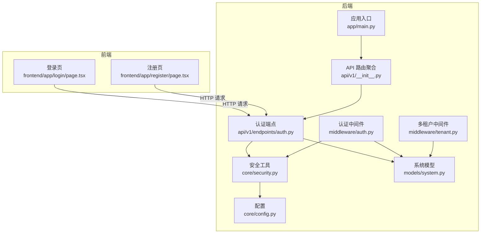

**图表来源**
- [backend/app/main.py:45-92](file://backend/app/main.py#L45-L92)
- [backend/app/api/v1/__init__.py:1-20](file://backend/app/api/v1/__init__.py#L1-L20)
- [backend/app/api/v1/endpoints/auth.py:1-179](file://backend/app/api/v1/endpoints/auth.py#L1-L179)
- [backend/app/middleware/auth.py:1-88](file://backend/app/middleware/auth.py#L1-L88)
- [backend/app/core/security.py:1-103](file://backend/app/core/security.py#L1-L103)
- [backend/app/core/config.py:1-89](file://backend/app/core/config.py#L1-L89)
- [backend/app/models/system.py:1-223](file://backend/app/models/system.py#L1-L223)
- [backend/app/middleware/tenant.py:1-142](file://backend/app/middleware/tenant.py#L1-L142)
- [frontend/app/login/page.tsx:1-94](file://frontend/app/login/page.tsx#L1-L94)
- [frontend/app/register/page.tsx:1-131](file://frontend/app/register/page.tsx#L1-L131)

**章节来源**
- [backend/app/main.py:45-92](file://backend/app/main.py#L45-L92)
- [backend/app/api/v1/__init__.py:1-20](file://backend/app/api/v1/__init__.py#L1-L20)
- [backend/app/api/v1/endpoints/auth.py:1-179](file://backend/app/api/v1/endpoints/auth.py#L1-L179)
- [backend/app/middleware/auth.py:1-88](file://backend/app/middleware/auth.py#L1-L88)
- [backend/app/core/security.py:1-103](file://backend/app/core/security.py#L1-L103)
- [backend/app/core/config.py:1-89](file://backend/app/core/config.py#L1-L89)
- [backend/app/models/system.py:1-223](file://backend/app/models/system.py#L1-L223)
- [backend/app/middleware/tenant.py:1-142](file://backend/app/middleware/tenant.py#L1-L142)
- [frontend/app/login/page.tsx:1-94](file://frontend/app/login/page.tsx#L1-L94)
- [frontend/app/register/page.tsx:1-131](file://frontend/app/register/page.tsx#L1-L131)

## 核心组件
- JWT 安全工具：密码哈希、访问/刷新令牌生成与校验、令牌解码与类型验证
- 认证端点：注册、登录、刷新令牌、获取当前用户信息
- 认证中间件：从请求头提取 Bearer 令牌、验证并加载用户对象
- 配置中心：JWT 密钥、算法、过期时间等参数
- 模型层：User、Tenant、TenantUser 等用户与租户关系模型
- 多租户中间件：根据子域名、路径或自定义头部识别租户上下文

**章节来源**
- [backend/app/core/security.py:1-103](file://backend/app/core/security.py#L1-L103)
- [backend/app/api/v1/endpoints/auth.py:1-179](file://backend/app/api/v1/endpoints/auth.py#L1-L179)
- [backend/app/middleware/auth.py:1-88](file://backend/app/middleware/auth.py#L1-L88)
- [backend/app/core/config.py:53-58](file://backend/app/core/config.py#L53-L58)
- [backend/app/models/system.py:73-121](file://backend/app/models/system.py#L73-L121)
- [backend/app/middleware/tenant.py:15-84](file://backend/app/middleware/tenant.py#L15-L84)

## 架构总览
下图展示认证系统在多租户环境中的整体交互：

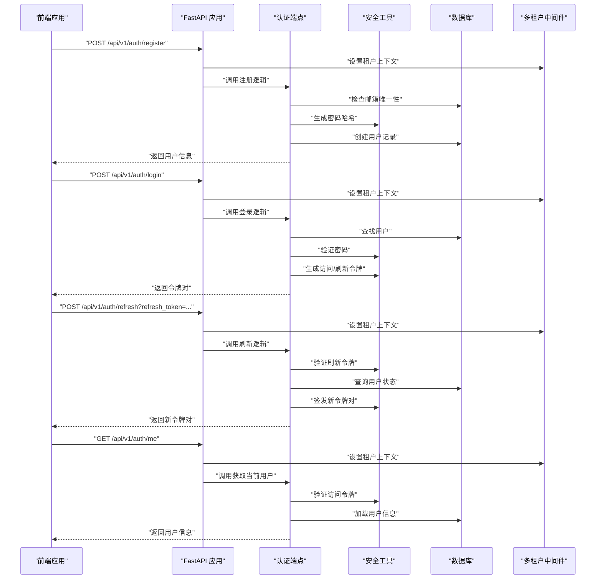

**图表来源**
- [backend/app/api/v1/endpoints/auth.py:55-179](file://backend/app/api/v1/endpoints/auth.py#L55-L179)
- [backend/app/middleware/auth.py:15-57](file://backend/app/middleware/auth.py#L15-L57)
- [backend/app/core/security.py:26-103](file://backend/app/core/security.py#L26-L103)
- [backend/app/middleware/tenant.py:39-84](file://backend/app/middleware/tenant.py#L39-L84)

## 详细组件分析

### JWT 令牌机制
- 访问令牌（Access Token）
  - 用途：用于受保护资源的短期访问
  - 过期时间：默认 24 小时（可配置）
  - 结构：包含 sub（用户标识）、exp（过期时间）、type（类型）
- 刷新令牌（Refresh Token）
  - 用途：在访问令牌过期后换取新的令牌对
  - 过期时间：默认 30 天（可配置）
  - 结构：包含 sub、exp、type=refresh
- 令牌验证
  - 使用对称密钥与指定算法进行签名与解码
  - 校验 type 字段以区分访问与刷新令牌
  - 返回 payload 中的 sub（用户 ID）

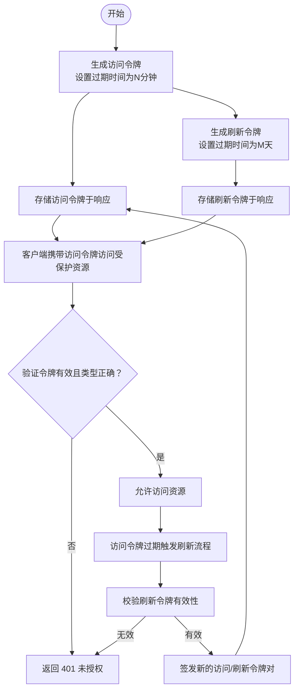

**图表来源**
- [backend/app/core/security.py:26-77](file://backend/app/core/security.py#L26-L77)
- [backend/app/core/security.py:93-103](file://backend/app/core/security.py#L93-L103)
- [backend/app/core/config.py:56-57](file://backend/app/core/config.py#L56-L57)

**章节来源**
- [backend/app/core/security.py:26-77](file://backend/app/core/security.py#L26-L77)
- [backend/app/core/security.py:93-103](file://backend/app/core/security.py#L93-L103)
- [backend/app/core/config.py:53-58](file://backend/app/core/config.py#L53-L58)

### 密码哈希与安全存储
- 使用 bcrypt 作为密码哈希方案
- 注册时对明文密码进行哈希处理并存储
- 登录时使用 verify_password 对比哈希值
- 存储字段为 password_hash，确保明文密码永不落盘

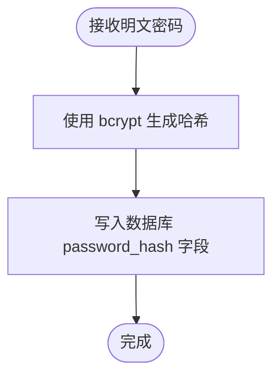

**图表来源**
- [backend/app/core/security.py:16-24](file://backend/app/core/security.py#L16-L24)
- [backend/app/api/v1/endpoints/auth.py:70-78](file://backend/app/api/v1/endpoints/auth.py#L70-L78)
- [backend/app/models/system.py:85](file://backend/app/models/system.py#L85)

**章节来源**
- [backend/app/core/security.py:16-24](file://backend/app/core/security.py#L16-L24)
- [backend/app/api/v1/endpoints/auth.py:70-78](file://backend/app/api/v1/endpoints/auth.py#L70-L78)
- [backend/app/models/system.py:85](file://backend/app/models/system.py#L85)

### 用户注册流程
- 输入验证：邮箱格式、密码长度等（前端与后端共同保障）
- 唯一性检查：按邮箱查询是否已存在
- 密码哈希：对提交的密码进行哈希
- 数据持久化：创建用户记录并返回用户信息（不含敏感字段）

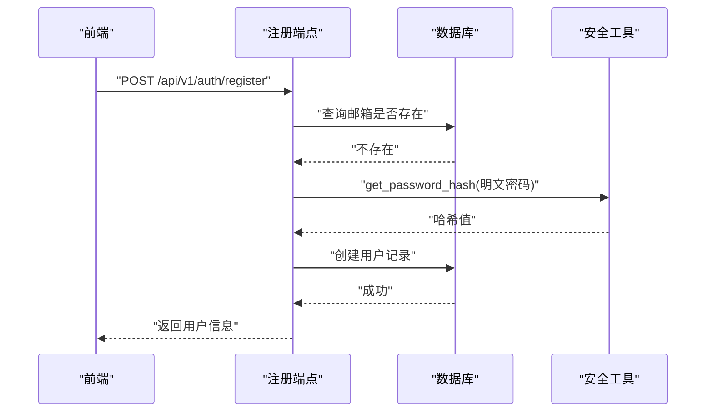

**图表来源**
- [backend/app/api/v1/endpoints/auth.py:55-86](file://backend/app/api/v1/endpoints/auth.py#L55-L86)
- [backend/app/core/security.py:21](file://backend/app/core/security.py#L21)

**章节来源**
- [backend/app/api/v1/endpoints/auth.py:55-86](file://backend/app/api/v1/endpoints/auth.py#L55-L86)
- [backend/tests/test_auth.py:12-29](file://backend/tests/test_auth.py#L12-L29)

### 用户登录流程
- 查找用户：按邮箱查询用户
- 密码验证：verify_password 对比哈希
- 账户状态：检查 is_active
- 更新最后登录时间
- 生成访问/刷新令牌对并返回

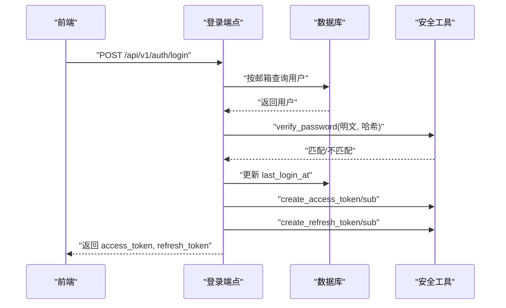

**图表来源**
- [backend/app/api/v1/endpoints/auth.py:89-123](file://backend/app/api/v1/endpoints/auth.py#L89-L123)
- [backend/app/core/security.py:26-77](file://backend/app/core/security.py#L26-L77)

**章节来源**
- [backend/app/api/v1/endpoints/auth.py:89-123](file://backend/app/api/v1/endpoints/auth.py#L89-L123)
- [backend/tests/test_auth.py:56-81](file://backend/tests/test_auth.py#L56-L81)

### 刷新令牌流程
- 校验刷新令牌：verify_token(type="refresh")
- 查询用户并检查账户状态
- 重新签发新的访问/刷新令牌对

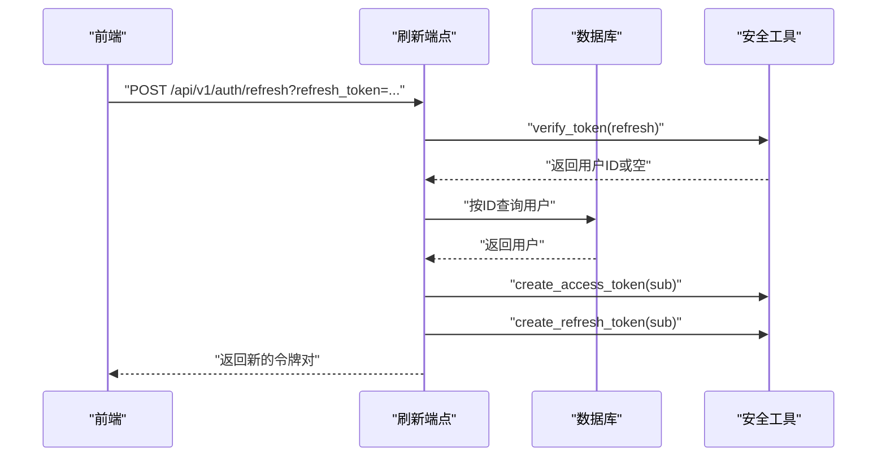

**图表来源**
- [backend/app/api/v1/endpoints/auth.py:126-158](file://backend/app/api/v1/endpoints/auth.py#L126-L158)
- [backend/app/core/security.py:93-103](file://backend/app/core/security.py#L93-L103)

**章节来源**
- [backend/app/api/v1/endpoints/auth.py:126-158](file://backend/app/api/v1/endpoints/auth.py#L126-L158)
- [backend/tests/test_auth.py:108-138](file://backend/tests/test_auth.py#L108-L138)

### 获取当前用户信息
- 通过认证中间件解析 Authorization 头中的 Bearer 令牌
- 验证令牌并加载用户对象
- 返回用户基本信息（不含敏感字段）

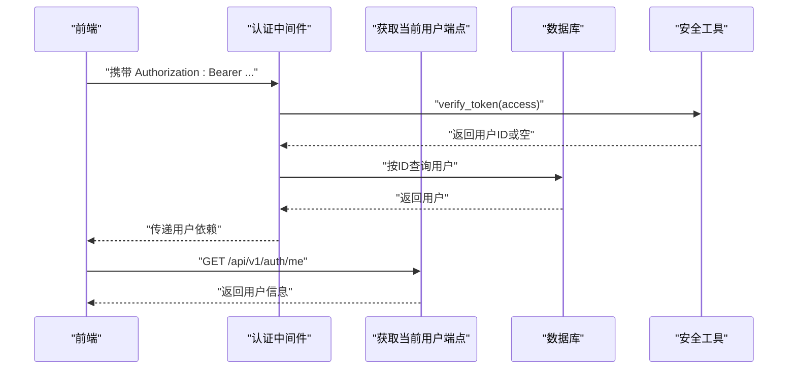

**图表来源**
- [backend/app/middleware/auth.py:15-57](file://backend/app/middleware/auth.py#L15-L57)
- [backend/app/api/v1/endpoints/auth.py:161-179](file://backend/app/api/v1/endpoints/auth.py#L161-L179)

**章节来源**
- [backend/app/middleware/auth.py:15-57](file://backend/app/middleware/auth.py#L15-L57)
- [backend/app/api/v1/endpoints/auth.py:161-179](file://backend/app/api/v1/endpoints/auth.py#L161-L179)

### 多租户环境下的用户身份识别与会话管理
- 租户识别顺序：子域名 → 路径前缀 → 自定义头部
- 公共路径跳过租户校验（如认证、租户管理、健康检查等）
- 为每个请求设置 tenant、tenant_schema、tenant_neo4j 上下文
- 认证中间件在获取用户时仅依赖 JWT，不直接绑定租户上下文

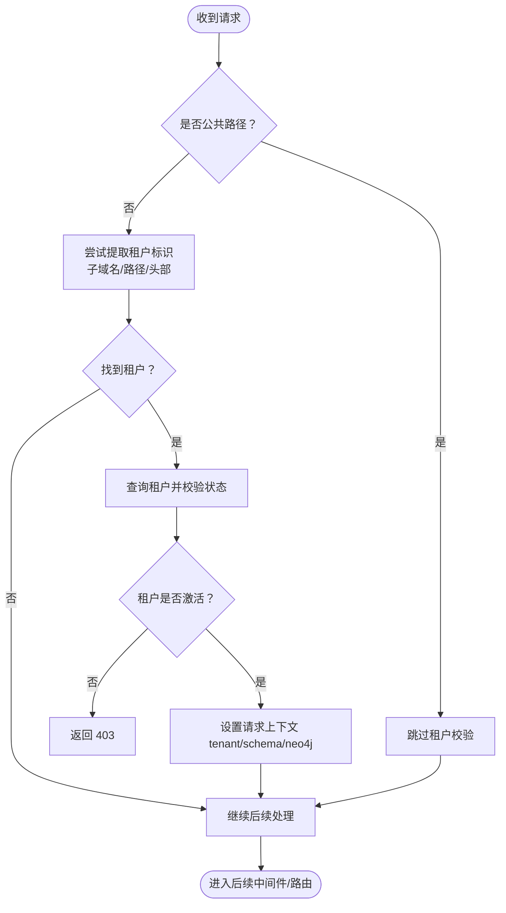

**图表来源**
- [backend/app/middleware/tenant.py:39-84](file://backend/app/middleware/tenant.py#L39-L84)
- [backend/app/middleware/tenant.py:93-125](file://backend/app/middleware/tenant.py#L93-L125)

**章节来源**
- [backend/app/middleware/tenant.py:15-84](file://backend/app/middleware/tenant.py#L15-L84)
- [backend/app/middleware/tenant.py:93-125](file://backend/app/middleware/tenant.py#L93-L125)

### 认证中间件与依赖
- get_current_user：从 Authorization 头解析 Bearer 令牌，验证后从数据库加载用户
- get_current_user_required：若未认证则抛出 401
- get_superuser：在已认证基础上进一步校验超级管理员角色
- PermissionChecker：权限检查占位实现（当前简化为仅认证检查）

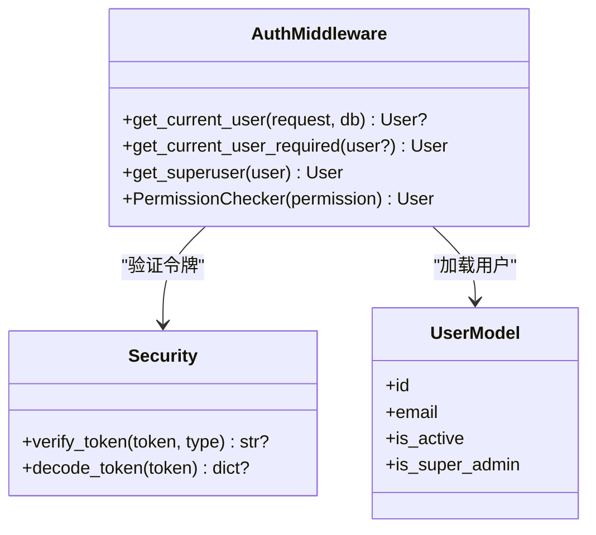

**图表来源**
- [backend/app/middleware/auth.py:15-88](file://backend/app/middleware/auth.py#L15-L88)
- [backend/app/core/security.py:80-103](file://backend/app/core/security.py#L80-L103)
- [backend/app/models/system.py:73-121](file://backend/app/models/system.py#L73-L121)

**章节来源**
- [backend/app/middleware/auth.py:15-88](file://backend/app/middleware/auth.py#L15-L88)
- [backend/app/models/system.py:73-121](file://backend/app/models/system.py#L73-L121)

### 前端集成与 API 调用示例
- 登录页：向 /api/v1/auth/login 发送邮箱与密码，保存返回的 access_token 与 refresh_token 至本地存储
- 注册页：先调用 /api/v1/auth/register 创建用户，再调用 /api/v1/auth/login 获取令牌
- 令牌刷新：调用 /api/v1/auth/refresh 并传入 refresh_token 查询字符串参数
- 获取当前用户：调用 /api/v1/auth/me，需在请求头携带 Authorization: Bearer <access_token>

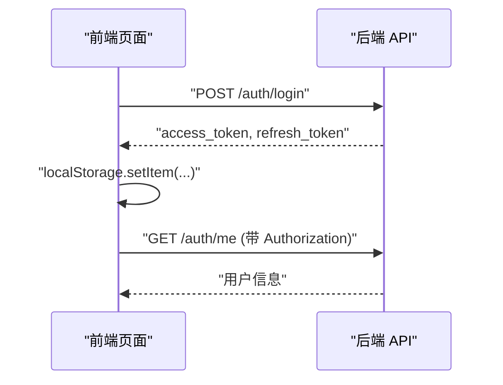

**图表来源**
- [frontend/app/login/page.tsx:18-38](file://frontend/app/login/page.tsx#L18-L38)
- [frontend/app/register/page.tsx:20-52](file://frontend/app/register/page.tsx#L20-L52)
- [backend/app/api/v1/endpoints/auth.py:161-179](file://backend/app/api/v1/endpoints/auth.py#L161-L179)

**章节来源**
- [frontend/app/login/page.tsx:18-38](file://frontend/app/login/page.tsx#L18-L38)
- [frontend/app/register/page.tsx:20-52](file://frontend/app/register/page.tsx#L20-L52)
- [backend/app/api/v1/endpoints/auth.py:161-179](file://backend/app/api/v1/endpoints/auth.py#L161-L179)

## 依赖关系分析
- 认证端点依赖安全工具进行令牌生成与校验，并依赖数据库模型进行用户查询与持久化
- 认证中间件依赖安全工具进行令牌验证，并依赖数据库模型加载用户
- 多租户中间件独立于认证流程，负责设置租户上下文，但不影响认证中间件的用户解析
- 配置模块集中管理 JWT 密钥、算法与过期时间等参数

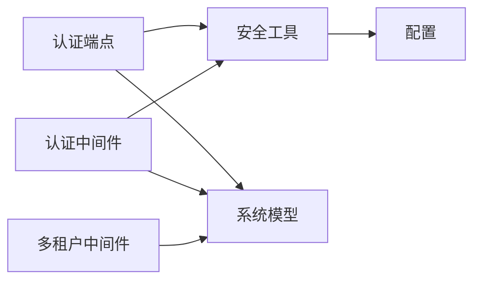

**图表来源**
- [backend/app/api/v1/endpoints/auth.py:13-19](file://backend/app/api/v1/endpoints/auth.py#L13-L19)
- [backend/app/middleware/auth.py:10-12](file://backend/app/middleware/auth.py#L10-L12)
- [backend/app/core/security.py:10](file://backend/app/core/security.py#L10)
- [backend/app/core/config.py:53-58](file://backend/app/core/config.py#L53-L58)

**章节来源**
- [backend/app/api/v1/endpoints/auth.py:13-19](file://backend/app/api/v1/endpoints/auth.py#L13-L19)
- [backend/app/middleware/auth.py:10-12](file://backend/app/middleware/auth.py#L10-L12)
- [backend/app/core/security.py:10](file://backend/app/core/security.py#L10)
- [backend/app/core/config.py:53-58](file://backend/app/core/config.py#L53-L58)

## 性能考虑
- 令牌生成与验证为轻量级操作，主要开销在数据库查询
- 建议：
  - 合理设置访问令牌过期时间，平衡安全性与用户体验
  - 刷新令牌过期时间较长，注意客户端安全存储
  - 在高并发场景下，确保数据库连接池配置充足
  - 对频繁的用户查询可考虑缓存用户基础信息（避免重复查询）

## 故障排除指南
- 400 错误（注册邮箱已存在）
  - 现象：注册接口返回 400
  - 排查：确认邮箱唯一性约束与前端提示
  - 参考：[注册端点:61-68](file://backend/app/api/v1/endpoints/auth.py#L61-L68)
- 401 错误（未认证/无效凭据）
  - 现象：登录失败或访问受保护资源返回 401
  - 排查：确认 Authorization 头格式、令牌类型与有效期；检查用户状态
  - 参考：[登录端点:100-104](file://backend/app/api/v1/endpoints/auth.py#L100-L104)、[认证中间件:23-34](file://backend/app/middleware/auth.py#L23-L34)
- 403 错误（账户被禁用/权限不足）
  - 现象：登录后仍被拒绝
  - 排查：确认用户 is_active 与角色权限
  - 参考：[登录端点:106-110](file://backend/app/api/v1/endpoints/auth.py#L106-L110)、[超级管理员检查:64-68](file://backend/app/middleware/auth.py#L64-L68)
- 刷新令牌无效
  - 现象：刷新接口返回 401
  - 排查：确认传入的是 refresh_token 参数且类型正确
  - 参考：[刷新端点:132-137](file://backend/app/api/v1/endpoints/auth.py#L132-L137)

**章节来源**
- [backend/app/api/v1/endpoints/auth.py:61-68](file://backend/app/api/v1/endpoints/auth.py#L61-L68)
- [backend/app/api/v1/endpoints/auth.py:100-110](file://backend/app/api/v1/endpoints/auth.py#L100-L110)
- [backend/app/middleware/auth.py:23-34](file://backend/app/middleware/auth.py#L23-L34)
- [backend/app/middleware/auth.py:64-68](file://backend/app/middleware/auth.py#L64-L68)
- [backend/app/api/v1/endpoints/auth.py:132-137](file://backend/app/api/v1/endpoints/auth.py#L132-L137)

## 结论
本认证系统围绕 JWT 实现了完整的访问与刷新令牌机制，结合 bcrypt 密码哈希与严格的输入验证，提供了安全可靠的用户管理能力。多租户中间件与认证中间件职责清晰，既保证了租户隔离，又实现了统一的用户身份识别。建议在生产环境中妥善保管 JWT 密钥、合理设置过期时间，并加强客户端的安全存储与传输。

## 附录
- 配置项摘要
  - jwt_secret_key：JWT 对称密钥
  - jwt_algorithm：签名算法（如 HS256）
  - jwt_access_token_expire_minutes：访问令牌过期分钟数
  - jwt_refresh_token_expire_days：刷新令牌过期天数
- 关键模型字段
  - User.password_hash：存储密码哈希
  - User.is_active：控制账户启用状态
  - TenantUser.role：租户内用户角色（成员/编辑者/审核者/管理员）

**章节来源**
- [backend/app/core/config.py:53-58](file://backend/app/core/config.py#L53-L58)
- [backend/app/models/system.py:85](file://backend/app/models/system.py#L85)
- [backend/app/models/system.py:93](file://backend/app/models/system.py#L93)
- [backend/app/models/system.py:147](file://backend/app/models/system.py#L147)