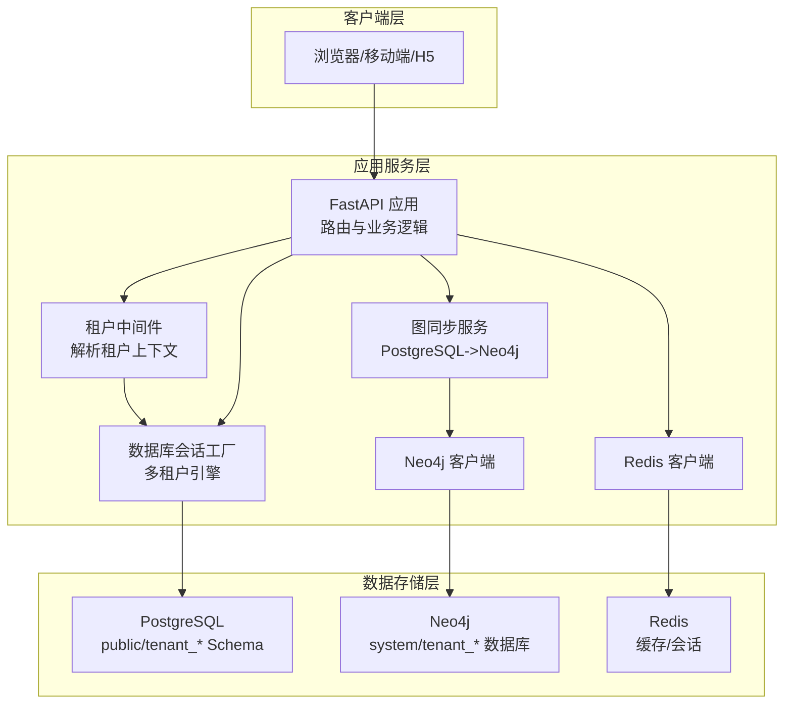
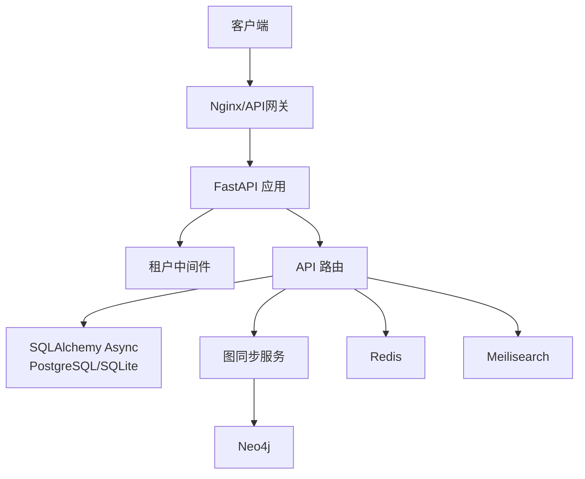
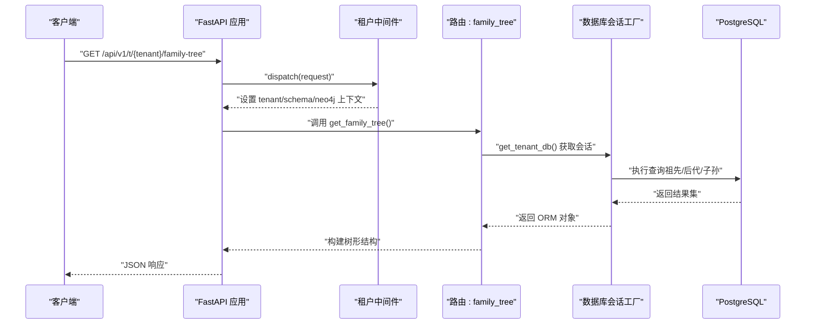
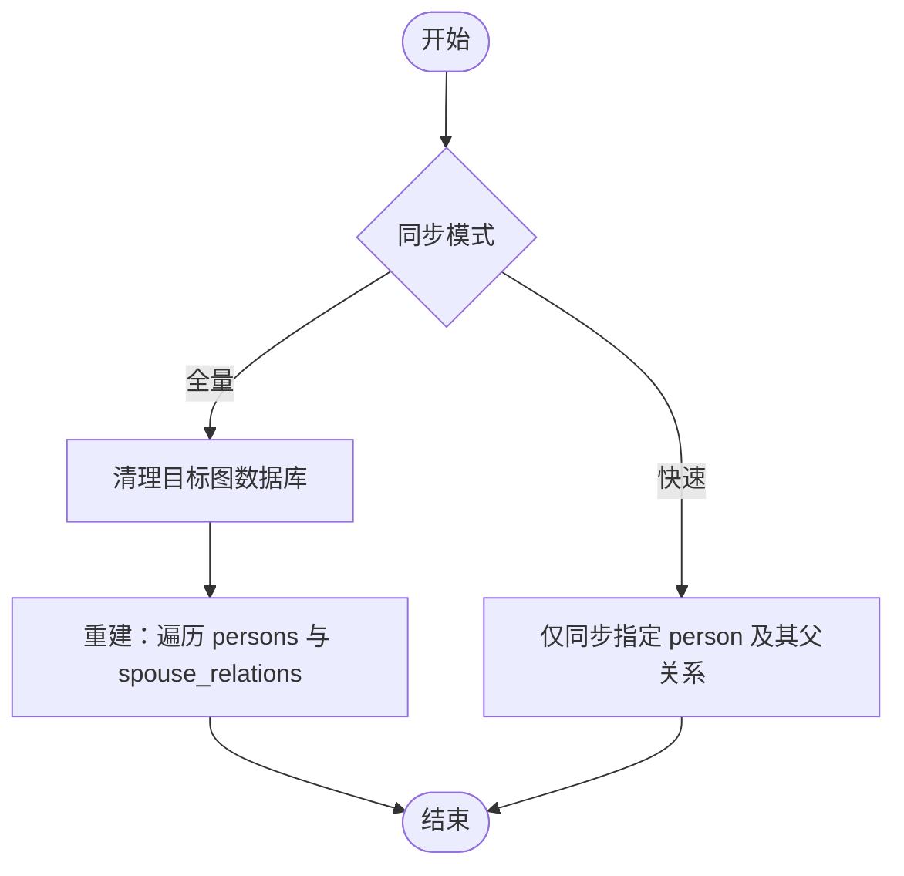
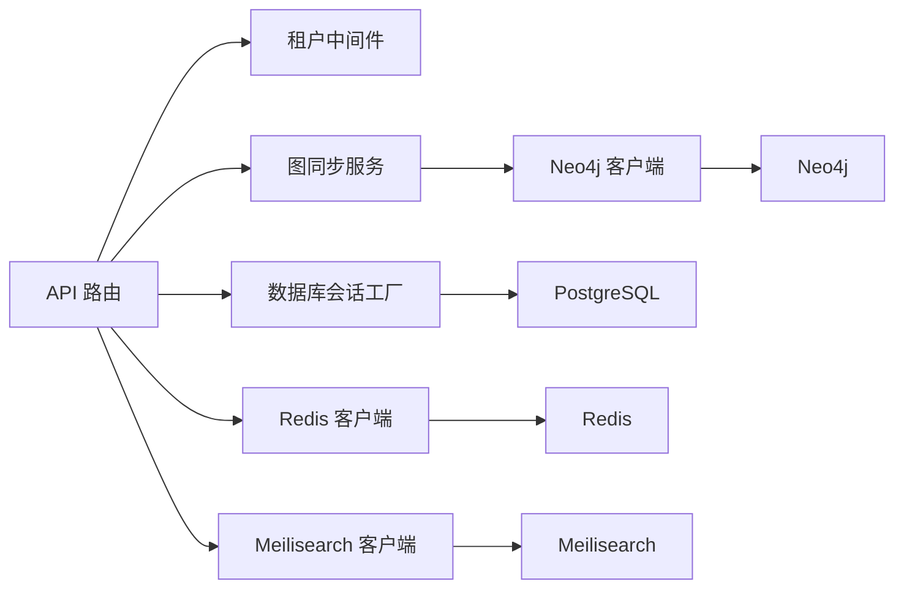

# 数据流设计

<cite>
**本文引用的文件**
- [backend/app/main.py](file://backend/app/main.py)
- [backend/app/core/database.py](file://backend/app/core/database.py)
- [backend/app/middleware/tenant.py](file://backend/app/middleware/tenant.py)
- [backend/app/models/tenant.py](file://backend/app/models/tenant.py)
- [backend/app/models/system.py](file://backend/app/models/system.py)
- [backend/app/api/v1/endpoints/family_tree.py](file://backend/app/api/v1/endpoints/family_tree.py)
- [backend/app/api/v1/endpoints/persons.py](file://backend/app/api/v1/endpoints/persons.py)
- [backend/app/services/graph_sync.py](file://backend/app/services/graph_sync.py)
- [backend/app/services/neo4j_service.py](file://backend/app/services/neo4j_service.py)
- [backend/app/core/services.py](file://backend/app/core/services.py)
- [backend/app/core/config.py](file://backend/app/core/config.py)
- [scripts/sync_neo4j.py](file://scripts/sync_neo4j.py)
- [docker-compose.yml](file://docker-compose.yml)
- [docs/ARCHITECTURE.md](file://docs/ARCHITECTURE.md)
</cite>

## 目录
1. [简介](#简介)
2. [项目结构](#项目结构)
3. [核心组件](#核心组件)
4. [架构总览](#架构总览)
5. [详细组件分析](#详细组件分析)
6. [依赖分析](#依赖分析)
7. [性能考虑](#性能考虑)
8. [故障排查指南](#故障排查指南)
9. [结论](#结论)
10. [附录](#附录)

## 简介
本文件面向多租户族谱管理系统，提供从“客户端请求”到“数据库查询”的完整数据流设计文档。重点覆盖以下方面：
- 请求在系统中的流转路径与关键节点
- PostgreSQL（关系数据）、Neo4j（图数据）、Redis（缓存）之间的数据流转与同步策略
- 实时与异步同步机制
- 查询优化（索引、查询计划、缓存策略）
- 数据一致性保障（事务、冲突处理）
- 备份与恢复流程设计

## 项目结构
后端采用 FastAPI + SQLAlchemy Async + 多租户架构，结合可选的 Neo4j、Redis、Meilisearch。系统通过租户中间件解析租户上下文，按租户隔离数据并路由至对应 Schema 或数据库。

图表来源
- [backend/app/main.py:45-91](file://backend/app/main.py#L45-L91)
- [backend/app/middleware/tenant.py:15-84](file://backend/app/middleware/tenant.py#L15-L84)
- [backend/app/core/database.py:24-118](file://backend/app/core/database.py#L24-L118)
- [backend/app/services/graph_sync.py:20-104](file://backend/app/services/graph_sync.py#L20-L104)
- [backend/app/services/neo4j_service.py:12-61](file://backend/app/services/neo4j_service.py#L12-L61)
- [backend/app/core/services.py:9-284](file://backend/app/core/services.py#L9-L284)

章节来源
- [backend/app/main.py:17-42](file://backend/app/main.py#L17-L42)
- [backend/app/middleware/tenant.py:15-84](file://backend/app/middleware/tenant.py#L15-L84)
- [backend/app/core/database.py:24-118](file://backend/app/core/database.py#L24-L118)
- [docs/ARCHITECTURE.md:30-78](file://docs/ARCHITECTURE.md#L30-L78)

## 核心组件
- 应用入口与生命周期：负责初始化数据库引擎、连接可选外部服务、注册中间件与路由。
- 租户中间件：解析租户标识（子域/路径/头），加载租户元数据，设置数据库 Schema 与 Neo4j 数据库上下文。
- 数据库管理器：按租户动态创建/复用引擎与会话，支持 SQLite（文件隔离）与 PostgreSQL（Schema 隔离）。
- API 层：提供族谱树、人物 CRUD、关系等接口；依赖租户上下文进行数据隔离。
- 图同步服务：将 PostgreSQL 中的人口与关系数据同步到 Neo4j。
- Neo4j 客户端：封装节点与关系创建、查询与统计。
- 可选服务：Redis（缓存）、Meilisearch（搜索）。

章节来源
- [backend/app/main.py:17-42](file://backend/app/main.py#L17-L42)
- [backend/app/middleware/tenant.py:15-84](file://backend/app/middleware/tenant.py#L15-L84)
- [backend/app/core/database.py:24-118](file://backend/app/core/database.py#L24-L118)
- [backend/app/api/v1/endpoints/family_tree.py:43-68](file://backend/app/api/v1/endpoints/family_tree.py#L43-L68)
- [backend/app/api/v1/endpoints/persons.py:172-235](file://backend/app/api/v1/endpoints/persons.py#L172-L235)
- [backend/app/services/graph_sync.py:20-104](file://backend/app/services/graph_sync.py#L20-L104)
- [backend/app/services/neo4j_service.py:12-61](file://backend/app/services/neo4j_service.py#L12-L61)
- [backend/app/core/services.py:9-284](file://backend/app/core/services.py#L9-L284)

## 架构总览
系统采用“多租户隔离 + 可选图/缓存/搜索”的分层架构。请求进入后，先由租户中间件解析租户上下文，再根据 API 路由选择使用关系数据库或图数据库能力。可选服务在可用时增强功能，不可用时提供降级路径。

图表来源
- [docs/ARCHITECTURE.md:30-78](file://docs/ARCHITECTURE.md#L30-L78)
- [backend/app/main.py:45-91](file://backend/app/main.py#L45-L91)
- [backend/app/middleware/tenant.py:15-84](file://backend/app/middleware/tenant.py#L15-L84)
- [backend/app/core/services.py:268-284](file://backend/app/core/services.py#L268-L284)

## 详细组件分析

### 请求到数据库的完整数据流
以“获取族谱树”为例，展示从客户端到数据库的完整数据流：

图表来源
- [backend/app/api/v1/endpoints/family_tree.py:43-68](file://backend/app/api/v1/endpoints/family_tree.py#L43-L68)
- [backend/app/core/database.py:136-171](file://backend/app/core/database.py#L136-L171)
- [backend/app/middleware/tenant.py:39-84](file://backend/app/middleware/tenant.py#L39-L84)

章节来源
- [backend/app/api/v1/endpoints/family_tree.py:43-68](file://backend/app/api/v1/endpoints/family_tree.py#L43-L68)
- [backend/app/core/database.py:136-171](file://backend/app/core/database.py#L136-L171)
- [backend/app/middleware/tenant.py:39-84](file://backend/app/middleware/tenant.py#L39-L84)

### 多租户数据隔离与路由
- 租户识别顺序：子域 → 路径 → 头部；公共路径（如认证、租户管理）不强制租户上下文。
- 租户加载：从 public Schema 的 tenants 表中查询租户元数据，包含 schema_name 与 neo4j_database。
- 数据库切换：SQLAlchemy 会话在非 SQLite 场景下通过 SET search_path 切换到租户 Schema；SQLite 使用独立数据库文件。
- Neo4j 切换：通过租户元数据指定 Neo4j 数据库名，后续所有图操作在该数据库内执行。

章节来源
- [backend/app/middleware/tenant.py:15-84](file://backend/app/middleware/tenant.py#L15-L84)
- [backend/app/core/database.py:58-106](file://backend/app/core/database.py#L58-L106)
- [backend/app/models/system.py:23-70](file://backend/app/models/system.py#L23-L70)

### PostgreSQL 关系数据模型与查询
- 模型概览：人物、世代、支系、配偶关系、人物图片/视频、变更日志等均位于租户 Schema 下。
- 查询模式：API 层通过 SQLAlchemy Async 执行查询，支持分页、过滤、排序；部分复杂关系查询通过 Cypher（Neo4j）替代。
- 事务语义：每个会话在异常时回滚，成功时提交，确保写入一致性。

章节来源
- [backend/app/models/tenant.py:23-244](file://backend/app/models/tenant.py#L23-L244)
- [backend/app/api/v1/endpoints/persons.py:172-235](file://backend/app/api/v1/endpoints/persons.py#L172-L235)
- [backend/app/api/v1/endpoints/family_tree.py:90-150](file://backend/app/api/v1/endpoints/family_tree.py#L90-L150)
- [backend/app/core/database.py:124-171](file://backend/app/core/database.py#L124-L171)

### Neo4j 图数据与同步机制
- 图模型：Person 节点与父子、配偶关系边；查询基于 Cypher，支持祖先链、后代链、兄弟姐妹、配偶等。
- 同步策略：
  - 全量重建：清理目标数据库后重放全部数据，适合初始化或修复。
  - 快速同步：针对单个实体及其直接关系进行增量更新，适合实时写入后的局部刷新。
- 同步触发：可在数据变更后调用同步服务，或通过 CLI 批量执行。

图表来源
- [backend/app/services/graph_sync.py:94-115](file://backend/app/services/graph_sync.py#L94-L115)
- [backend/app/services/graph_sync.py:117-138](file://backend/app/services/graph_sync.py#L117-L138)
- [backend/app/services/neo4j_service.py:101-144](file://backend/app/services/neo4j_service.py#L101-L144)

章节来源
- [backend/app/services/graph_sync.py:20-104](file://backend/app/services/graph_sync.py#L20-L104)
- [backend/app/services/neo4j_service.py:65-144](file://backend/app/services/neo4j_service.py#L65-L144)
- [scripts/sync_neo4j.py:14-38](file://scripts/sync_neo4j.py#L14-L38)

### Redis 缓存与可选服务
- Redis：提供键值缓存能力，支持过期时间；当不可用时，系统降级为无缓存模式。
- Meilisearch：提供全文检索能力；当不可用时，使用 SQL LIKE 作为降级方案。
- Neo4j：在可用时提供高效的关系查询；不可用时，API 退化为基于 SQL 的树构建。

章节来源
- [backend/app/core/services.py:142-284](file://backend/app/core/services.py#L142-L284)
- [backend/app/main.py:25-35](file://backend/app/main.py#L25-L35)

### 数据一致性与事务处理
- 写入一致性：SQLAlchemy Async 会话在异常时回滚，成功时提交；多租户场景下每个租户使用独立引擎与会话。
- 读写分离：图查询优先走 Neo4j（若可用），否则回退到 SQL；缓存命中则直接返回，未命中再查询数据库。
- 冲突解决：当前实现未显式引入分布式锁或版本号冲突检测，建议在高并发写入场景下引入乐观锁或变更日志审计。

章节来源
- [backend/app/core/database.py:124-171](file://backend/app/core/database.py#L124-L171)
- [backend/app/api/v1/endpoints/persons.py:323-403](file://backend/app/api/v1/endpoints/persons.py#L323-L403)

### 查询优化方案
- 索引与约束：
  - PostgreSQL：租户表与用户表存在唯一/索引约束；建议在常用过滤字段（如 generation_id、branch_id、visibility）建立索引。
  - Neo4j：按查询模式建立节点标签与属性索引（如 Person(generation)、Person(name/courtesy_name/art_name/alias)）。
- 查询计划：
  - API 层使用分页与排序（generation_id、sort_order、id）减少一次性返回量。
  - 图查询限制深度（ancestors/descendants）避免全图扫描。
- 缓存策略：
  - Redis 缓存热点树片段（如根节点下的多代节点）与统计信息。
  - 缓存搜索结果与热门人物详情，降低重复查询压力。

章节来源
- [backend/app/api/v1/endpoints/persons.py:172-235](file://backend/app/api/v1/endpoints/persons.py#L172-L235)
- [backend/app/api/v1/endpoints/family_tree.py:152-231](file://backend/app/api/v1/endpoints/family_tree.py#L152-L231)
- [backend/app/services/neo4j_service.py:146-290](file://backend/app/services/neo4j_service.py#L146-L290)
- [backend/app/core/services.py:142-199](file://backend/app/core/services.py#L142-L199)

### 备份与恢复流程设计
- PostgreSQL 备份：
  - 使用逻辑备份（如 pg_dump）定期导出 public 与各 tenant_* Schema。
  - 恢复时先恢复 public，再逐个恢复租户 Schema；注意租户元数据与 Neo4j 映射关系。
- Neo4j 备份：
  - 使用快照或 APOC 备份；恢复时重建目标数据库并重新执行全量同步。
- Redis 备份：
  - 使用 RDB/AOF 持久化；恢复时重启容器即可。
- 恢复验证：
  - 恢复后执行健康检查与代表性查询（如获取根节点树、统计信息）确认数据完整性。

章节来源
- [docker-compose.yml:5-70](file://docker-compose.yml#L5-L70)
- [docs/ARCHITECTURE.md:734-765](file://docs/ARCHITECTURE.md#L734-L765)

## 依赖分析
- 组件耦合：
  - API 层依赖租户中间件与数据库会话工厂；图同步服务依赖数据库会话与 Neo4j 客户端。
  - 可选服务（Redis/Meilisearch/Neo4j）通过全局实例注入，失败时提供降级路径。
- 外部依赖：
  - PostgreSQL（关系数据）、Neo4j（图数据）、Redis（缓存）、Meilisearch（搜索）、MinIO（对象存储）。

图表来源
- [backend/app/api/v1/endpoints/persons.py:172-235](file://backend/app/api/v1/endpoints/persons.py#L172-L235)
- [backend/app/services/graph_sync.py:20-104](file://backend/app/services/graph_sync.py#L20-L104)
- [backend/app/services/neo4j_service.py:12-61](file://backend/app/services/neo4j_service.py#L12-L61)
- [backend/app/core/services.py:268-284](file://backend/app/core/services.py#L268-L284)

章节来源
- [backend/app/core/database.py:24-118](file://backend/app/core/database.py#L24-L118)
- [backend/app/middleware/tenant.py:15-84](file://backend/app/middleware/tenant.py#L15-L84)
- [backend/app/core/services.py:268-284](file://backend/app/core/services.py#L268-L284)

## 性能考虑
- 连接池与并发：
  - PostgreSQL 使用连接池参数（pool_size/max_overflow），SQLite 在本地开发场景下使用较小连接数。
- 查询优化：
  - API 层分页与排序；Neo4j 查询限制深度；必要时引入物化视图或汇总表。
- 缓存策略：
  - 针对高频读取的树片段与统计信息进行缓存；设置合理过期时间。
- 可选服务：
  - 当 Redis/Meilisearch 不可用时，系统自动降级，保证基本功能可用。

章节来源
- [backend/app/core/config.py:34-51](file://backend/app/core/config.py#L34-L51)
- [backend/app/core/database.py:33-56](file://backend/app/core/database.py#L33-L56)
- [backend/app/core/services.py:142-199](file://backend/app/core/services.py#L142-L199)

## 故障排查指南
- 健康检查：
  - 应用提供 /health 接口，返回数据库、Neo4j、Redis、搜索服务状态。
- 租户不可用：
  - 检查租户 slug 是否正确；确认 tenants 表中是否存在该租户且 is_active。
- 数据库连接失败：
  - 检查 DATABASE_URL、连接池参数与网络连通性；确认 PostgreSQL/Neo4j/Redis 容器健康。
- 图同步失败：
  - 使用 CLI 脚本执行全量同步；检查 Neo4j 认证与数据库名映射。
- 缓存不可用：
  - 确认 Redis 可用性；若不可用，系统将自动禁用缓存功能。

章节来源
- [backend/app/main.py:73-86](file://backend/app/main.py#L73-L86)
- [backend/app/middleware/tenant.py:48-84](file://backend/app/middleware/tenant.py#L48-L84)
- [scripts/sync_neo4j.py:14-38](file://scripts/sync_neo4j.py#L14-L38)
- [backend/app/core/services.py:268-284](file://backend/app/core/services.py#L268-L284)

## 结论
本系统通过租户中间件实现强隔离，结合 PostgreSQL 的关系建模与 Neo4j 的图查询能力，形成“关系+图”的混合数据架构。通过可选的 Redis 与 Meilisearch，在可用时提供高性能缓存与搜索能力。写入采用事务保证一致性，读取通过缓存与降级策略提升稳定性。建议在高并发写入场景引入变更审计与冲突控制，持续优化索引与查询计划，确保大规模数据下的稳定与性能。

## 附录
- 部署与运行：
  - 使用 docker-compose 启动 PostgreSQL、Neo4j、Redis、Meilisearch、MinIO 与 API；容器间通过服务名通信。
- 配置项参考：
  - 数据库、Neo4j、Redis、Meilisearch、JWT、CORS 等配置集中于 settings。

章节来源
- [docker-compose.yml:89-114](file://docker-compose.yml#L89-L114)
- [backend/app/core/config.py:21-89](file://backend/app/core/config.py#L21-L89)
- [docs/ARCHITECTURE.md:30-78](file://docs/ARCHITECTURE.md#L30-L78)