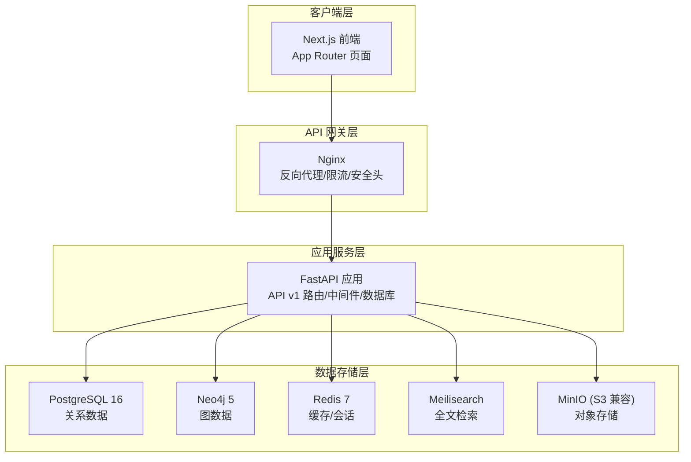
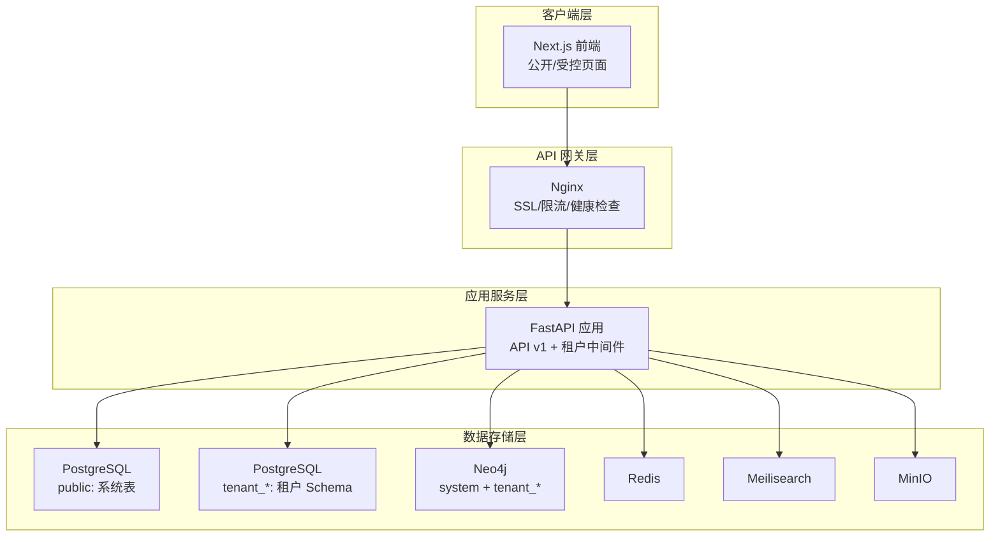
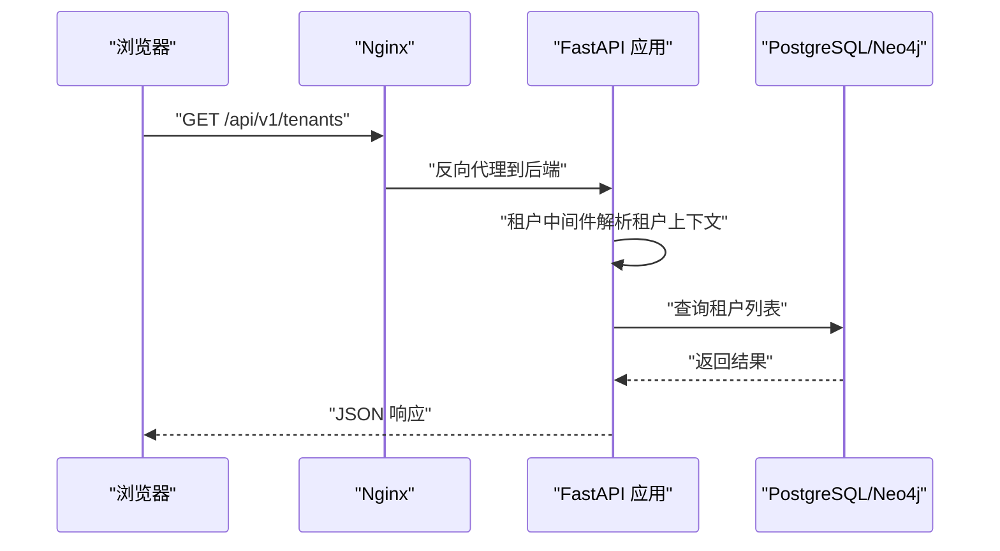
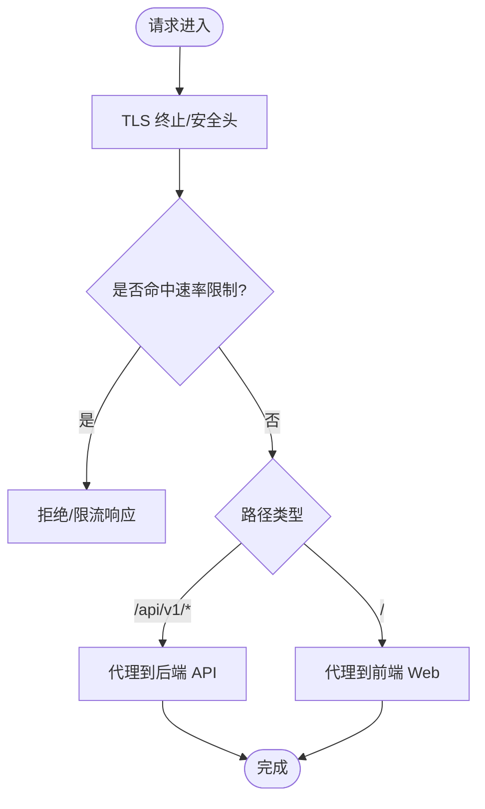
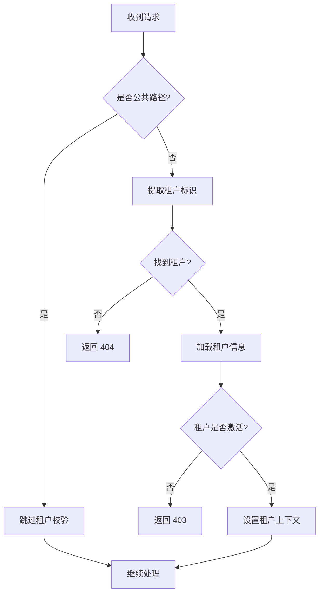
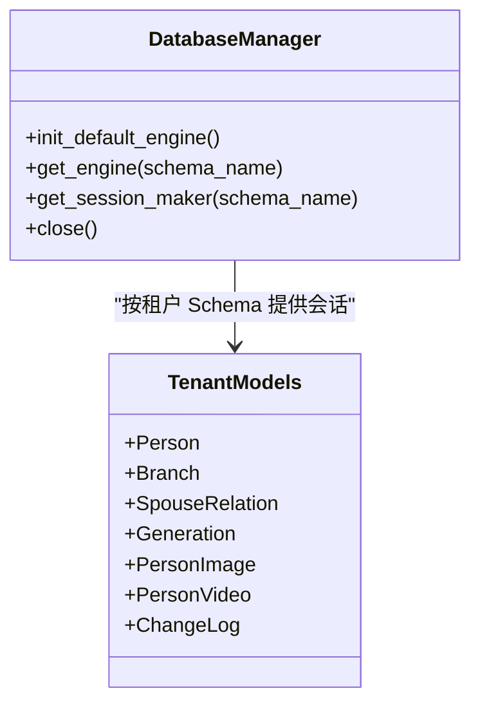
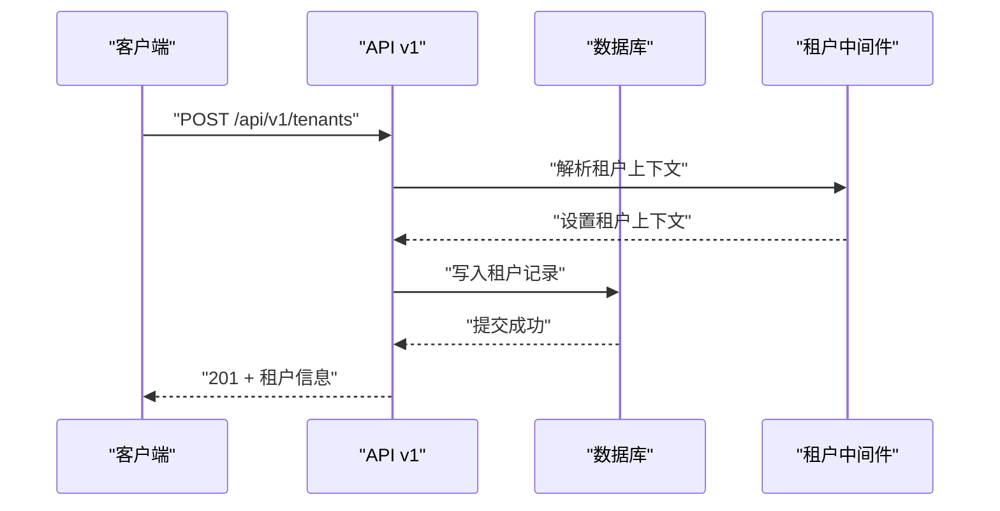
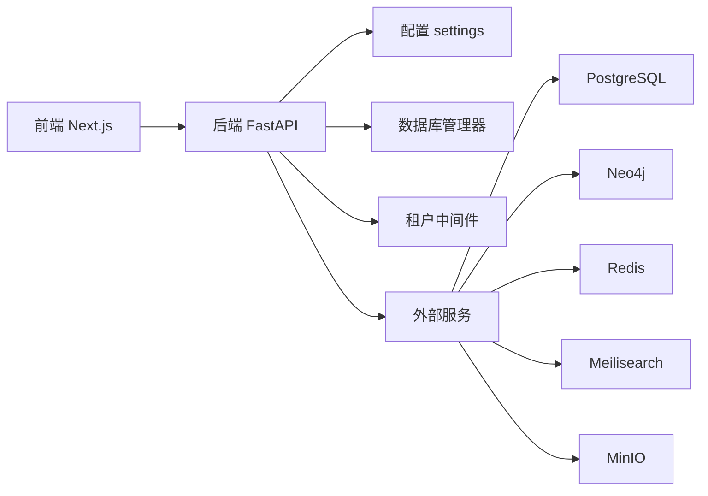

# 整体架构概览

<cite>
**本文引用的文件**
- [README.md](file://README.md)
- [ARCHITECTURE.md](file://docs/ARCHITECTURE.md)
- [main.py](file://backend/app/main.py)
- [config.py](file://backend/app/core/config.py)
- [database.py](file://backend/app/core/database.py)
- [tenant.py](file://backend/app/models/tenant.py)
- [tenant.py（中间件）](file://backend/app/middleware/tenant.py)
- [tenants.py](file://backend/app/api/v1/endpoints/tenants.py)
- [__init__.py（API v1）](file://backend/app/api/v1/__init__.py)
- [nginx.conf（全局）](file://docker/nginx/nginx.conf)
- [default.conf](file://docker/nginx/conf.d/default.conf)
- [docker-compose.yml](file://docker-compose.yml)
- [layout.tsx](file://frontend/app/layout.tsx)
- [package.json](file://frontend/package.json)
- [pyproject.toml](file://backend/pyproject.toml)
</cite>

## 目录
1. [简介](#简介)
2. [项目结构](#项目结构)
3. [核心组件](#核心组件)
4. [架构总览](#架构总览)
5. [详细组件分析](#详细组件分析)
6. [依赖分析](#依赖分析)
7. [性能考虑](#性能考虑)
8. [故障排查指南](#故障排查指南)
9. [结论](#结论)
10. [附录](#附录)

## 简介
本项目是一个现代化的多租户族谱 SaaS 平台，支持多个家族独立管理族谱数据，具备租户数据严格隔离、分级权限体系与高性能族谱树可视化能力。系统采用前后端分离架构：前端基于 Next.js 15（App Router），后端基于 FastAPI；通过 Nginx 作为 API 网关层进行请求分发与安全防护；应用服务层负责业务逻辑与租户中间件；数据存储层采用 PostgreSQL、Neo4j、Redis、Meilisearch、MinIO 的五层存储架构。

## 项目结构
系统采用模块化分层组织：
- 前端：Next.js 应用，采用 App Router，页面按租户维度组织，支持公开页面与受控管理页面。
- 后端：FastAPI 应用，包含 API v1 路由、核心配置、数据库管理、中间件与模型。
- 基础设施：Docker Compose 编排，包含 PostgreSQL、Neo4j、Redis、Meilisearch、MinIO、Nginx。
- 文档：架构设计文档与本地开发指南。

图表来源
- [docker-compose.yml:1-145](file://docker-compose.yml#L1-L145)
- [nginx.conf（全局）:1-57](file://docker/nginx/nginx.conf#L1-L57)
- [default.conf:1-113](file://docker/nginx/conf.d/default.conf#L1-L113)
- [main.py:1-103](file://backend/app/main.py#L1-L103)
- [config.py:1-89](file://backend/app/core/config.py#L1-L89)

章节来源
- [README.md:5-27](file://README.md#L5-L27)
- [docker-compose.yml:1-145](file://docker-compose.yml#L1-L145)

## 核心组件
- 前端（Next.js）：负责页面渲染、用户交互与 API 调用，使用 App Router 组织页面与租户命名空间。
- 后端（FastAPI）：提供 REST API，包含认证、租户管理、人物与族谱树接口等。
- API 网关（Nginx）：统一入口，处理 SSL、限流、健康检查与静态资源缓存。
- 数据层：PostgreSQL（系统与租户数据）、Neo4j（族谱关系图）、Redis（缓存/会话）、Meilisearch（全文检索）、MinIO（对象存储）。

章节来源
- [layout.tsx:1-25](file://frontend/app/layout.tsx#L1-L25)
- [package.json:1-45](file://frontend/package.json#L1-L45)
- [main.py:1-103](file://backend/app/main.py#L1-L103)
- [config.py:1-89](file://backend/app/core/config.py#L1-L89)
- [docker-compose.yml:1-145](file://docker-compose.yml#L1-L145)

## 架构总览
系统采用三层架构与五层存储：
- 三层架构
  - 客户端层：Next.js 前端应用，支持公开访问与受控管理页面。
  - API 网关层：Nginx 提供反向代理、安全头、限流与健康检查。
  - 应用服务层：FastAPI 提供 API v1，包含租户中间件与数据库连接管理。
- 五层存储
  - PostgreSQL：系统级表（租户、用户、订阅）与租户级 Schema。
  - Neo4j：族谱关系图，按租户隔离数据库。
  - Redis：会话与热点数据缓存。
  - Meilisearch：全文检索。
  - MinIO：对象存储（图片、视频、文档）。

图表来源
- [ARCHITECTURE.md:32-78](file://docs/ARCHITECTURE.md#L32-L78)
- [docker-compose.yml:1-145](file://docker-compose.yml#L1-L145)
- [main.py:1-103](file://backend/app/main.py#L1-L103)

章节来源
- [ARCHITECTURE.md:30-95](file://docs/ARCHITECTURE.md#L30-L95)

## 详细组件分析

### 前后端分离与协作
- 前端（Next.js）
  - 使用 App Router 组织页面，租户相关页面位于租户命名空间下，支持公开访问与受控管理页面。
  - 通过环境变量配置 API 地址，开发时指向本地后端。
- 后端（FastAPI）
  - 提供 API v1 路由，包含认证、租户管理、人物与族谱树接口。
  - 通过中间件注入租户上下文，确保请求在正确的租户 Schema 下执行。
- 协作关系
  - 前端通过 Next.js API Routes 或直接调用后端 API v1。
  - Nginx 将 /api/v1 请求转发至后端服务，静态资源由前端服务处理。

图表来源
- [tenants.py:1-164](file://backend/app/api/v1/endpoints/tenants.py#L1-L164)
- [tenant.py（中间件）:1-142](file://backend/app/middleware/tenant.py#L1-L142)
- [default.conf:29-44](file://docker/nginx/conf.d/default.conf#L29-L44)

章节来源
- [layout.tsx:1-25](file://frontend/app/layout.tsx#L1-L25)
- [package.json:1-45](file://frontend/package.json#L1-L45)
- [tenants.py:1-164](file://backend/app/api/v1/endpoints/tenants.py#L1-L164)
- [__init__.py（API v1）:1-20](file://backend/app/api/v1/__init__.py#L1-L20)

### API 网关与 Nginx 配置
- Nginx 作为统一入口，提供：
  - SSL/TLS 终止与现代加密套件。
  - 速率限制（API 与登录接口分别限流）。
  - 健康检查与静态资源缓存。
  - 反向代理到后端 API 与前端 Web。
- 配置要点
  - 上游服务：api（后端）、web（前端）。
  - 重定向与 HSTS 头部。
  - 代理头透传与超时设置。

图表来源
- [nginx.conf（全局）:1-57](file://docker/nginx/nginx.conf#L1-L57)
- [default.conf:1-113](file://docker/nginx/conf.d/default.conf#L1-L113)

章节来源
- [nginx.conf（全局）:1-57](file://docker/nginx/nginx.conf#L1-L57)
- [default.conf:1-113](file://docker/nginx/conf.d/default.conf#L1-L113)

### 多租户中间件与租户识别
- 租户识别顺序
  - URL 路径前缀 /t/{tenant_slug}/。
  - 子域名（如 liu.genealogy.com）。
  - 请求头 X-Tenant-ID。
- 中间件职责
  - 校验租户存在性与激活状态。
  - 设置租户上下文（Schema 名称、Neo4j 数据库名）。
  - 对公共路径（认证、租户列表、健康检查等）跳过租户校验。

图表来源
- [tenant.py（中间件）:1-142](file://backend/app/middleware/tenant.py#L1-L142)

章节来源
- [tenant.py（中间件）:1-142](file://backend/app/middleware/tenant.py#L1-L142)

### 数据库与租户 Schema 管理
- 数据库管理器
  - 默认引擎用于系统数据库（public）。
  - 按租户 Schema 获取或创建引擎与 Session Maker。
  - SQLite 与 PostgreSQL 的差异化处理：SQLite 不支持 Schema，采用独立数据库文件；PostgreSQL 使用 search_path 切换 Schema。
- 租户模型
  - 租户级模型（如人物、支系、配偶关系、变更日志）位于租户 Schema 下。
  - 系统级模型（租户、用户、订阅）位于 public Schema。

图表来源
- [database.py:1-171](file://backend/app/core/database.py#L1-L171)
- [tenant.py:1-244](file://backend/app/models/tenant.py#L1-L244)

章节来源
- [database.py:1-171](file://backend/app/core/database.py#L1-L171)
- [tenant.py:1-244](file://backend/app/models/tenant.py#L1-L244)

### API 路由与租户级接口
- API v1 路由
  - 包含认证、租户管理、人物与族谱树等接口。
  - 租户级路由以 /t/{tenant_slug} 前缀组织。
- 租户管理接口
  - 列表（支持分页与筛选）、详情、创建（超管）。
  - 创建租户时生成 Schema 名称与 Neo4j 数据库名，后续可扩展迁移与初始化。

图表来源
- [__init__.py（API v1）:1-20](file://backend/app/api/v1/__init__.py#L1-L20)
- [tenants.py:1-164](file://backend/app/api/v1/endpoints/tenants.py#L1-L164)
- [tenant.py（中间件）:1-142](file://backend/app/middleware/tenant.py#L1-L142)

章节来源
- [__init__.py（API v1）:1-20](file://backend/app/api/v1/__init__.py#L1-L20)
- [tenants.py:1-164](file://backend/app/api/v1/endpoints/tenants.py#L1-L164)

### 技术栈选择与替代方案
- 前端：Next.js 15（App Router）替代 Nuxt 3/SvelteKit，强调 React 生态与 SSR/SSG。
- 后端：FastAPI 替代 Django REST Framework，强调高性能异步与自动文档。
- 数据库：PostgreSQL 16（替代 MySQL 8），支持 Schema 隔离。
- 图数据库：Neo4j 5（替代 ArangoDB），适合族谱关系建模。
- 搜索：Meilisearch（替代 Elasticsearch），轻量且中文支持良好。
- 缓存：Redis 7（替代 Memcached），支持会话与热点数据。
- 存储：MinIO（替代 AWS S3），开源兼容 S3。
- 容器化：Docker + Docker Compose（替代 Kubernetes），便于开发与部署一致性。

章节来源
- [ARCHITECTURE.md:80-95](file://docs/ARCHITECTURE.md#L80-L95)

## 依赖分析
- 组件耦合
  - 前端通过 API v1 与后端解耦，Nginx 作为网关层进一步解耦。
  - 后端通过租户中间件与数据库管理器实现租户隔离。
- 外部依赖
  - PostgreSQL、Neo4j、Redis、Meilisearch、MinIO 通过环境变量与 Docker Compose 管理。
  - Nginx 通过上游配置与健康检查保障可用性。

图表来源
- [config.py:1-89](file://backend/app/core/config.py#L1-L89)
- [database.py:1-171](file://backend/app/core/database.py#L1-L171)
- [tenant.py（中间件）:1-142](file://backend/app/middleware/tenant.py#L1-L142)
- [docker-compose.yml:1-145](file://docker-compose.yml#L1-L145)

章节来源
- [config.py:1-89](file://backend/app/core/config.py#L1-L89)
- [database.py:1-171](file://backend/app/core/database.py#L1-L171)
- [docker-compose.yml:1-145](file://docker-compose.yml#L1-L145)

## 性能考虑
- 数据库连接池：PostgreSQL 使用连接池参数优化并发。
- 异步 I/O：FastAPI 与 SQLAlchemy Async 支持高并发。
- 缓存：Redis 用于热点数据与会话缓存，降低数据库压力。
- 搜索：Meilisearch 提供快速全文检索。
- CDN/静态资源：Nginx 提供静态资源缓存与压缩。
- 限流：Nginx 对 API 与登录接口进行限流，防止滥用。

## 故障排查指南
- 健康检查
  - 后端提供 /health 接口，返回数据库、Neo4j、Redis、Search 的连接状态。
- 日志与可观测性
  - Nginx 访问/错误日志，后端 Uvicorn 日志。
- 常见问题
  - 租户不存在：租户中间件返回 404。
  - 租户未激活：返回 403。
  - 数据库连接失败：检查 Docker Compose 服务健康状态与连接字符串。
  - 搜索/缓存不可用：确认 Meilisearch/Redis 服务状态。

章节来源
- [main.py:73-86](file://backend/app/main.py#L73-L86)
- [nginx.conf（全局）:16-20](file://docker/nginx/nginx.conf#L16-L20)

## 结论
该系统通过前后端分离、API 网关与多租户中间件实现了清晰的三层架构；结合 PostgreSQL、Neo4j、Redis、Meilisearch、MinIO 的五层存储，满足多家族数据隔离、高性能族谱关系查询与可视化展示需求。技术栈选择兼顾性能、可维护性与生态成熟度，适合规模化部署与演进。

## 附录
- 快速开始与部署参考
  - 本地开发：使用 SQLite，启动命令与端口见 README。
  - Docker Compose：开发与生产环境编排。
  - 一键部署：部署脚本与环境变量配置。
- 本地开发指南与架构设计文档详见 docs 目录。

章节来源
- [README.md:29-98](file://README.md#L29-L98)
- [docker-compose.yml:1-145](file://docker-compose.yml#L1-L145)
- [ARCHITECTURE.md:1-1020](file://docs/ARCHITECTURE.md#L1-L1020)