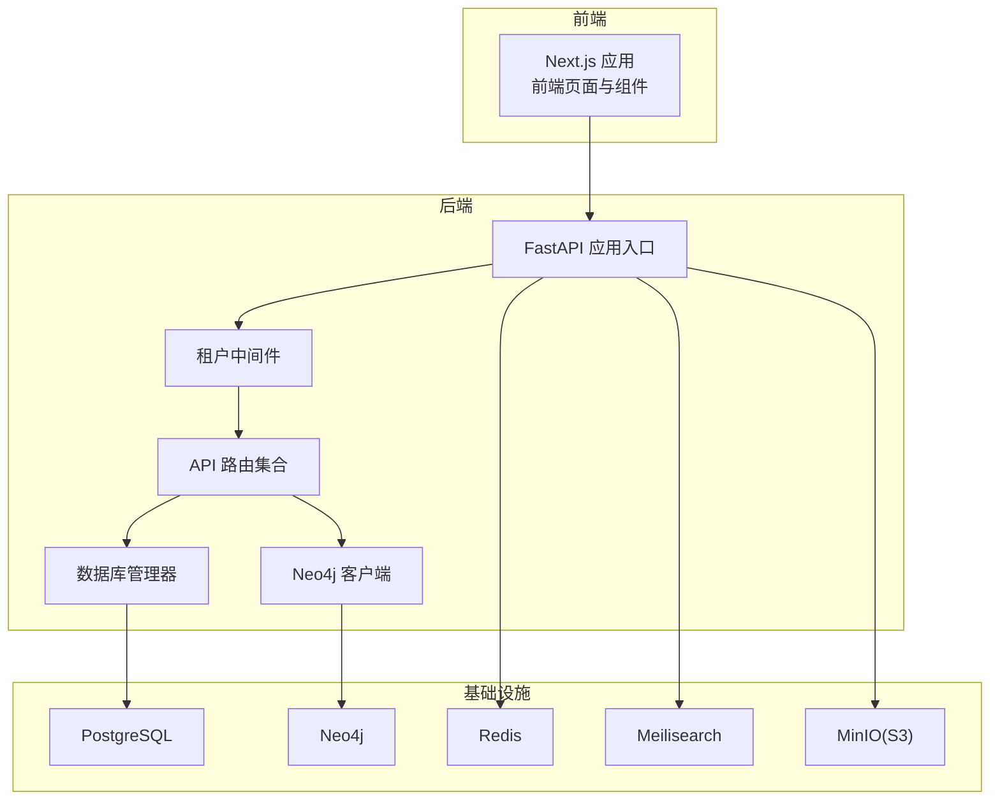
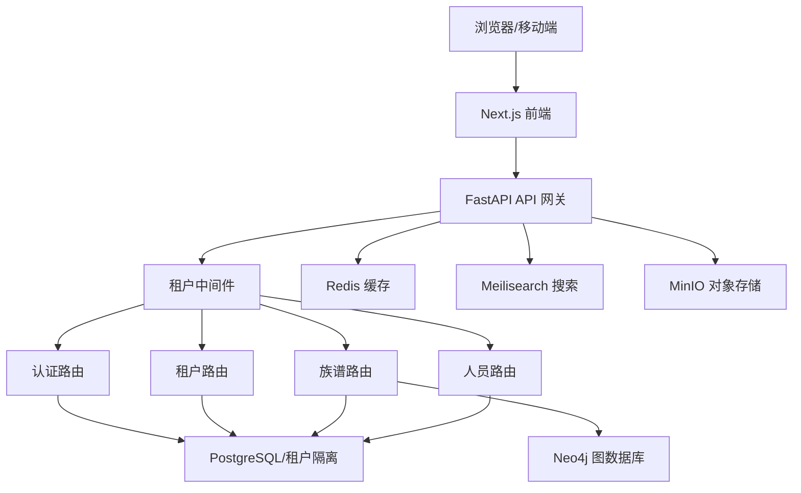
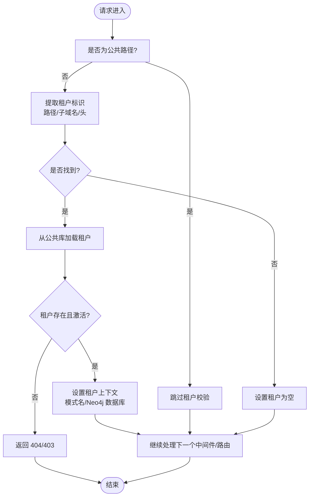
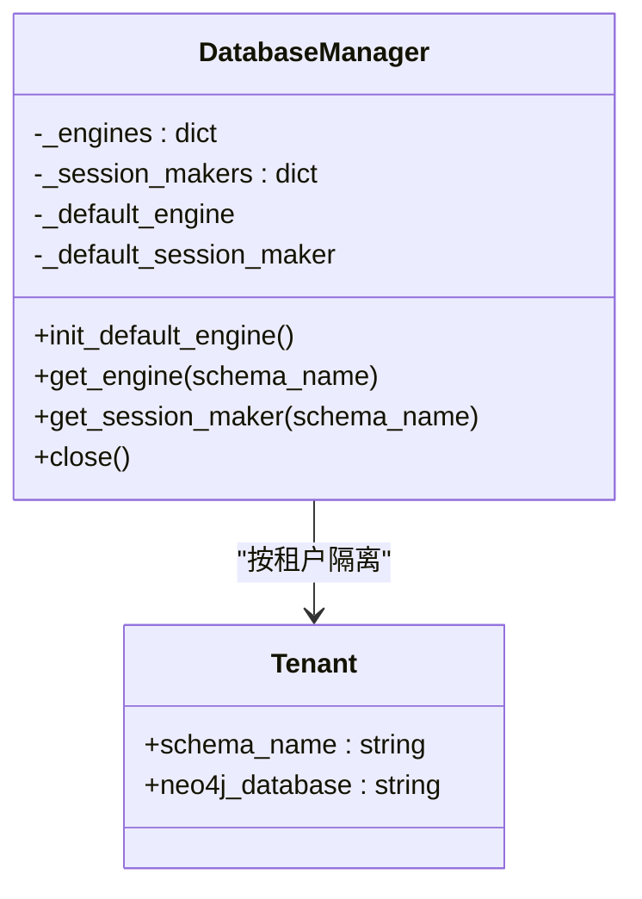
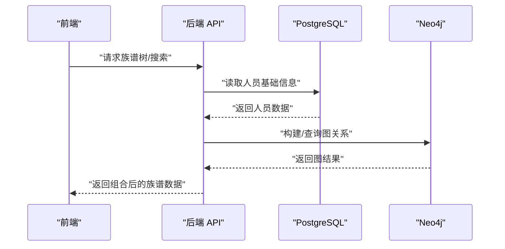
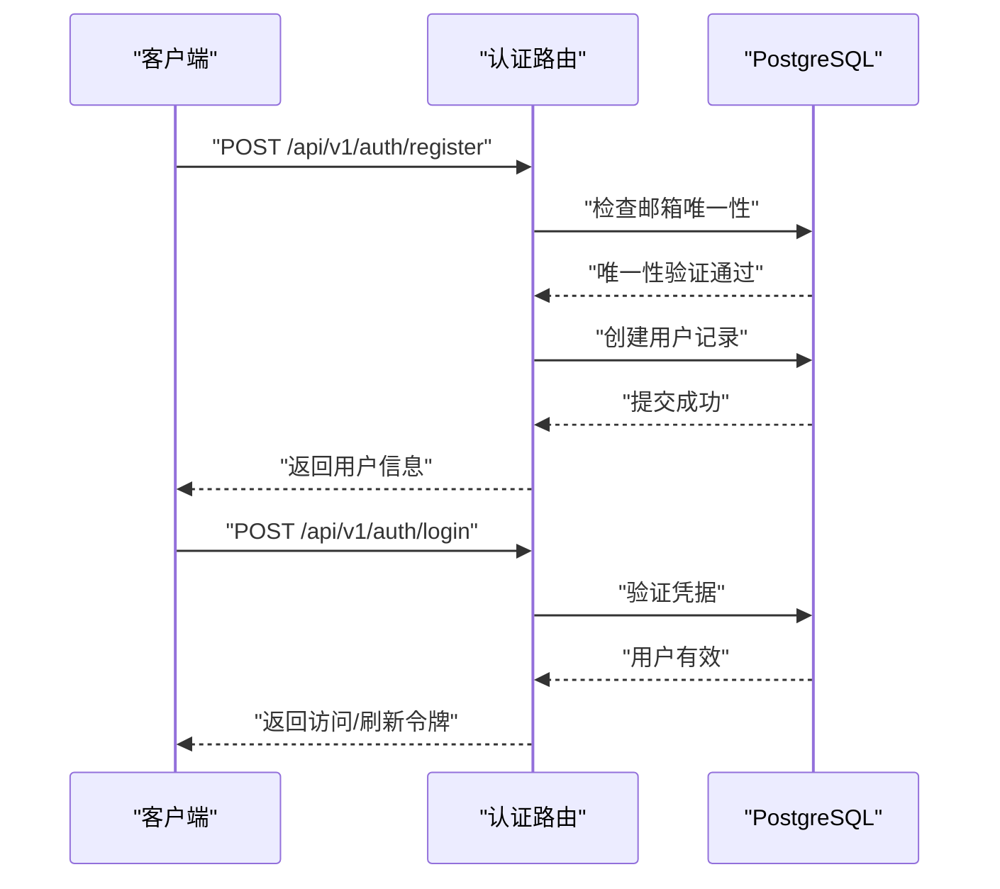
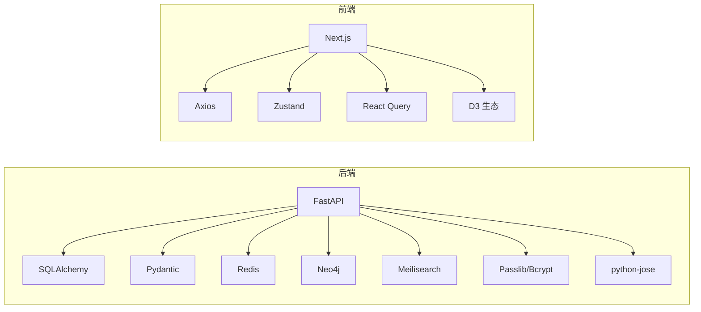

# 架构设计

<cite>
**本文引用的文件**
- [backend/app/main.py](file://backend/app/main.py)
- [backend/app/core/config.py](file://backend/app/core/config.py)
- [backend/app/middleware/tenant.py](file://backend/app/middleware/tenant.py)
- [backend/app/models/system.py](file://backend/app/models/system.py)
- [backend/app/models/tenant.py](file://backend/app/models/tenant.py)
- [backend/app/api/v1/endpoints/tenants.py](file://backend/app/api/v1/endpoints/tenants.py)
- [backend/app/api/v1/endpoints/auth.py](file://backend/app/api/v1/endpoints/auth.py)
- [backend/app/core/database.py](file://backend/app/core/database.py)
- [backend/app/services/neo4j_service.py](file://backend/app/services/neo4j_service.py)
- [frontend/app/layout.tsx](file://frontend/app/layout.tsx)
- [docker-compose.yml](file://docker-compose.yml)
- [backend/pyproject.toml](file://backend/pyproject.toml)
- [frontend/package.json](file://frontend/package.json)
- [backend/Dockerfile](file://backend/Dockerfile)
- [frontend/Dockerfile](file://frontend/Dockerfile)
</cite>

## 目录
1. [引言](#引言)
2. [项目结构](#项目结构)
3. [核心组件](#核心组件)
4. [架构总览](#架构总览)
5. [详细组件分析](#详细组件分析)
6. [依赖分析](#依赖分析)
7. [性能考量](#性能考量)
8. [故障排查指南](#故障排查指南)
9. [结论](#结论)
10. [附录](#附录)

## 引言
本项目是一个多租户族谱管理系统，采用前后端分离架构：后端基于 FastAPI 提供多租户 API，前端基于 Next.js 构建单页应用。系统通过租户中间件实现请求级多租户上下文注入，结合 PostgreSQL（公共模式）与 Neo4j 图数据库实现结构化数据与关系图谱的协同存储。系统还集成了 Redis 缓存、Meilisearch 搜索、MinIO 对象存储等可选服务，以满足高并发、全文检索与媒体资源管理需求。

## 项目结构
系统采用“后端/前端/基础设施”三层组织方式：
- 后端（Python/FastAPI）：应用入口、配置、中间件、模型、API 路由、数据库与服务集成
- 前端（TypeScript/Next.js）：页面路由、UI 组件、状态管理与查询框架
- 基础设施（Docker Compose）：容器编排，包含 PostgreSQL、Neo4j、Redis、Meilisearch、MinIO 以及 API 和 Web 容器

图表来源
- [backend/app/main.py:45-91](file://backend/app/main.py#L45-L91)
- [backend/app/middleware/tenant.py:15-84](file://backend/app/middleware/tenant.py#L15-L84)
- [backend/app/core/database.py:24-121](file://backend/app/core/database.py#L24-L121)
- [backend/app/services/neo4j_service.py:12-61](file://backend/app/services/neo4j_service.py#L12-L61)
- [docker-compose.yml:4-145](file://docker-compose.yml#L4-L145)

章节来源
- [backend/app/main.py:17-43](file://backend/app/main.py#L17-L43)
- [docker-compose.yml:4-145](file://docker-compose.yml#L4-L145)

## 核心组件
- 应用入口与生命周期：负责初始化数据库引擎、连接可选服务、注册中间件与路由、健康检查端点
- 配置中心：集中管理环境变量、数据库连接、缓存、搜索、对象存储、JWT 等参数
- 租户中间件：从子域名、路径或自定义头提取租户标识，设置租户上下文（模式名、Neo4j 数据库）
- 数据库管理器：按租户隔离创建独立会话，支持 SQLite 单文件与 PostgreSQL schema 隔离
- Neo4j 客户端：封装图数据库连接、会话与常用查询（家谱树、祖先/后代、同辈、配偶等）
- 认证与租户管理 API：用户注册/登录/刷新令牌；租户列表/详情/创建（待完善）
- 前端布局与路由：Next.js 根布局与页面路由组织

章节来源
- [backend/app/main.py:17-43](file://backend/app/main.py#L17-L43)
- [backend/app/core/config.py:11-89](file://backend/app/core/config.py#L11-L89)
- [backend/app/middleware/tenant.py:15-84](file://backend/app/middleware/tenant.py#L15-L84)
- [backend/app/core/database.py:24-121](file://backend/app/core/database.py#L24-L121)
- [backend/app/services/neo4j_service.py:12-61](file://backend/app/services/neo4j_service.py#L12-L61)
- [backend/app/api/v1/endpoints/auth.py:22-179](file://backend/app/api/v1/endpoints/auth.py#L22-L179)
- [backend/app/api/v1/endpoints/tenants.py:14-164](file://backend/app/api/v1/endpoints/tenants.py#L14-L164)
- [frontend/app/layout.tsx:12-24](file://frontend/app/layout.tsx#L12-L24)

## 架构总览
系统采用“多租户 + 微服务化 API”的分层架构：
- 表现层：Next.js 前端，通过 API 前缀访问后端接口
- API 层：FastAPI 路由与中间件，统一处理跨域、租户上下文、鉴权占位
- 业务层：各领域 API（认证、租户、族谱、人员）
- 数据层：PostgreSQL（公共模式存放系统级数据，租户模式/文件隔离存放租户数据），Neo4j（族谱关系图）
- 基础设施层：Redis（缓存）、Meilisearch（搜索）、MinIO（对象存储）

图表来源
- [backend/app/main.py:45-91](file://backend/app/main.py#L45-L91)
- [backend/app/middleware/tenant.py:15-84](file://backend/app/middleware/tenant.py#L15-L84)
- [backend/app/api/v1/endpoints/auth.py:22-179](file://backend/app/api/v1/endpoints/auth.py#L22-L179)
- [backend/app/api/v1/endpoints/tenants.py:14-164](file://backend/app/api/v1/endpoints/tenants.py#L14-L164)
- [backend/app/core/database.py:24-121](file://backend/app/core/database.py#L24-L121)
- [backend/app/services/neo4j_service.py:12-61](file://backend/app/services/neo4j_service.py#L12-L61)
- [docker-compose.yml:4-145](file://docker-compose.yml#L4-L145)

## 详细组件分析

### 租户中间件与多租户设计
租户中间件负责在请求进入时解析租户上下文，支持三种识别方式：URL 路径前缀、子域名、自定义头。对于公共路径（认证、租户管理、健康检查等）跳过租户校验。加载到租户后，将租户模式名与 Neo4j 数据库名写入请求状态，后续路由可按需使用。

图表来源
- [backend/app/middleware/tenant.py:39-84](file://backend/app/middleware/tenant.py#L39-L84)
- [backend/app/middleware/tenant.py:93-126](file://backend/app/middleware/tenant.py#L93-L126)

章节来源
- [backend/app/middleware/tenant.py:15-142](file://backend/app/middleware/tenant.py#L15-L142)

### 数据库与多租户隔离策略
- 公共模式（public）：存放系统级数据（租户、用户、订阅等）
- 租户模式/文件：PostgreSQL 使用 schema 隔离；SQLite 使用独立文件（按租户目录组织）
- 会话管理：根据租户动态获取会话工厂，必要时设置 search_path 或切换数据库文件
- 生命周期：应用启动时初始化默认引擎，关闭时释放所有连接

图表来源
- [backend/app/core/database.py:24-121](file://backend/app/core/database.py#L24-L121)
- [backend/app/models/system.py:23-71](file://backend/app/models/system.py#L23-L71)

章节来源
- [backend/app/core/database.py:24-171](file://backend/app/core/database.py#L24-L171)
- [backend/app/models/system.py:23-71](file://backend/app/models/system.py#L23-L71)

### Neo4j 图数据库集成
- 客户端：异步驱动，支持连接验证、会话获取
- 查询能力：节点创建、父子/配偶关系建立、家谱树遍历、祖先/后代/同辈/配偶查询、按代际与名称搜索、统计信息
- 可视化：生成适合 D3 的树形结构

图表来源
- [backend/app/services/neo4j_service.py:65-373](file://backend/app/services/neo4j_service.py#L65-L373)

章节来源
- [backend/app/services/neo4j_service.py:12-373](file://backend/app/services/neo4j_service.py#L12-L373)

### 认证与租户管理 API
- 认证：注册、登录、刷新令牌、当前用户信息（占位鉴权）
- 租户：列表、详情、创建（创建时生成租户 schema 名与 Neo4j 数据库名，待完善迁移与初始化）

图表来源
- [backend/app/api/v1/endpoints/auth.py:55-124](file://backend/app/api/v1/endpoints/auth.py#L55-L124)

章节来源
- [backend/app/api/v1/endpoints/auth.py:22-179](file://backend/app/api/v1/endpoints/auth.py#L22-L179)
- [backend/app/api/v1/endpoints/tenants.py:118-164](file://backend/app/api/v1/endpoints/tenants.py#L118-L164)

### 前端布局与页面组织
- 根布局：设置站点元数据与全局字体变量
- 页面路由：包含租户空间、族谱树、人员详情等页面
- 技术栈：Next.js、React、TailwindCSS、TanStack React Query、Axios、Zustand 状态管理等

章节来源
- [frontend/app/layout.tsx:12-24](file://frontend/app/layout.tsx#L12-L24)
- [frontend/package.json:12-45](file://frontend/package.json#L12-L45)

## 依赖分析
- 后端依赖：FastAPI、SQLAlchemy 2.x、Pydantic、asyncpg/aiosqlite、Redis、Neo4j、Meilisearch、Passlib、python-jose、httpx、dotenv
- 前端依赖：Next.js、React、TailwindCSS、Axios、Zustand、TanStack React Query、D3 生态、Radix UI 等
- 运行时：Dockerfile 分阶段构建，生产镜像非 root 用户运行，健康检查

图表来源
- [backend/pyproject.toml:7-25](file://backend/pyproject.toml#L7-L25)
- [frontend/package.json:12-45](file://frontend/package.json#L12-L45)

章节来源
- [backend/pyproject.toml:1-61](file://backend/pyproject.toml#L1-L61)
- [frontend/package.json:1-45](file://frontend/package.json#L1-L45)
- [backend/Dockerfile:1-24](file://backend/Dockerfile#L1-L24)
- [frontend/Dockerfile:1-51](file://frontend/Dockerfile#L1-L51)

## 性能考量
- 数据库连接池：PostgreSQL 使用可配置池大小与溢出，SQLite 在开发环境使用轻量引擎
- 异步 I/O：使用 SQLAlchemy AsyncEngine 与 AsyncSession，减少阻塞
- 可选服务降级：Neo4j/Redis/Meilisearch 未就绪时不影响核心功能
- 前端缓存：React Query 提供本地缓存与请求去重
- 可观测性：健康检查端点返回服务可用性状态

章节来源
- [backend/app/core/config.py:34-51](file://backend/app/core/config.py#L34-L51)
- [backend/app/core/database.py:33-96](file://backend/app/core/database.py#L33-L96)
- [backend/app/main.py:25-42](file://backend/app/main.py#L25-L42)

## 故障排查指南
- 健康检查：访问 /health 端点查看数据库、Neo4j、Redis、搜索服务状态
- 租户不可用：确认租户是否存在、是否激活；检查中间件对路径的识别顺序
- 数据库连接失败：检查 DATABASE_URL、PostgreSQL 服务健康状态
- Neo4j 连接失败：确认 URI、账号密码、容器健康状态
- 前端无法访问：确认 NEXT_PUBLIC_API_URL 与后端端口映射一致

章节来源
- [backend/app/main.py:73-86](file://backend/app/main.py#L73-L86)
- [backend/app/middleware/tenant.py:48-83](file://backend/app/middleware/tenant.py#L48-L83)
- [docker-compose.yml:95-114](file://docker-compose.yml#L95-L114)

## 结论
该系统通过租户中间件实现了请求级多租户上下文注入，结合 PostgreSQL 与 Neo4j 的混合存储方案，满足族谱数据的结构化与关系查询需求。前后端分离架构清晰，容器化部署便于扩展与运维。建议后续完善租户创建的数据库迁移与初始化流程、增强鉴权依赖注入与权限控制，并补充监控与日志采集以提升可观测性。

## 附录
- 部署拓扑：Docker Compose 将数据库、图数据库、缓存、搜索与对象存储作为后端服务，API 与前端分别容器化运行
- 基础设施要求：根据并发与数据规模调整数据库连接池、Neo4j 内存参数、Redis 缓存容量
- 可扩展性：水平扩展 API 与前端容器，使用负载均衡；数据库可采用主从复制与只读副本；Neo4j 支持集群（需额外配置）

章节来源
- [docker-compose.yml:4-145](file://docker-compose.yml#L4-L145)