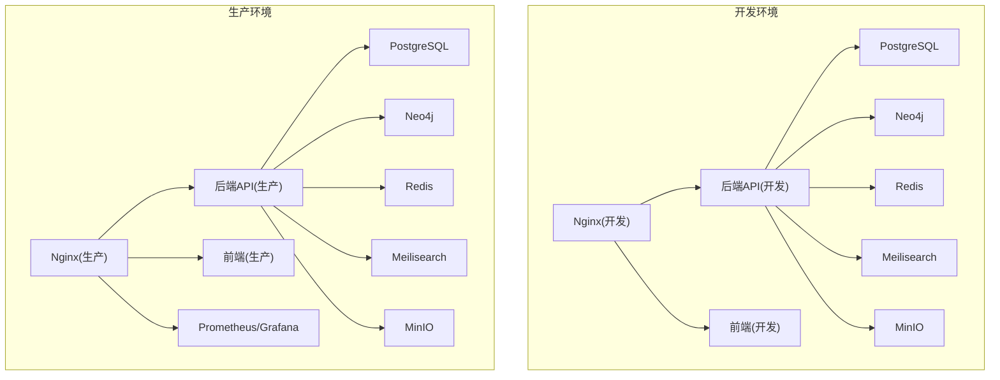
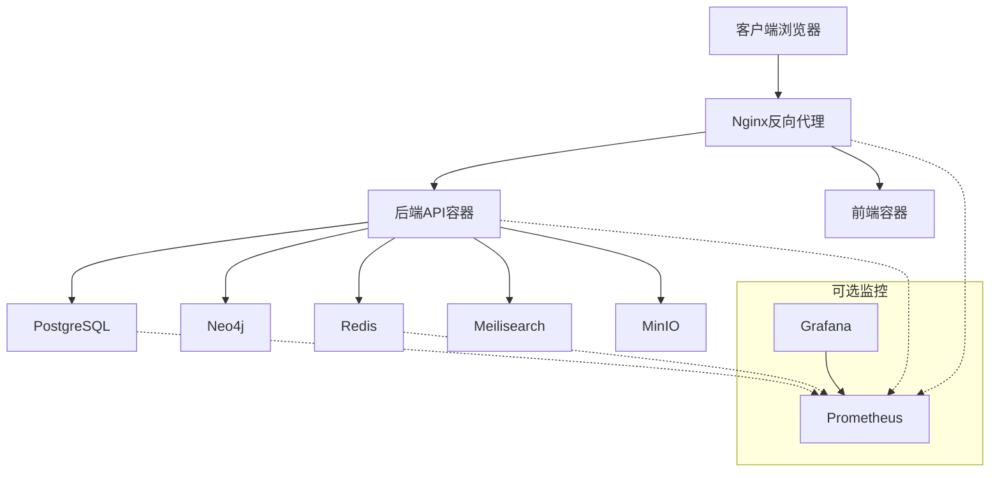
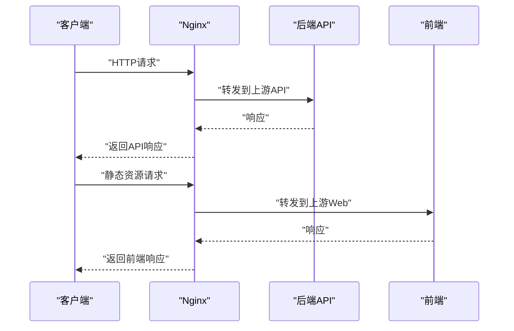
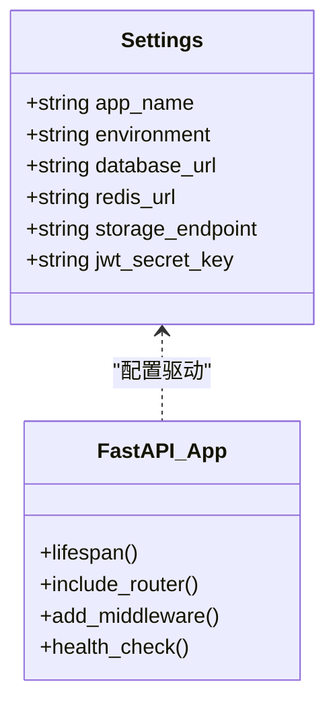
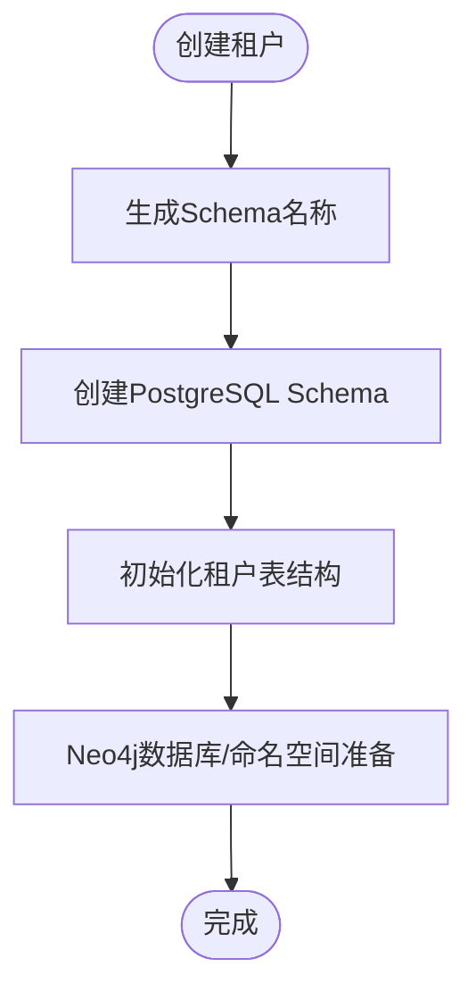
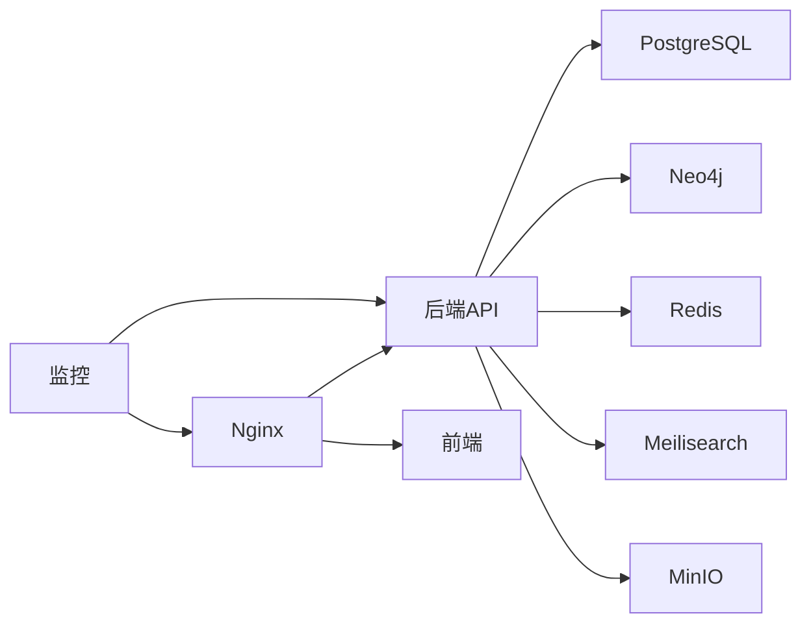
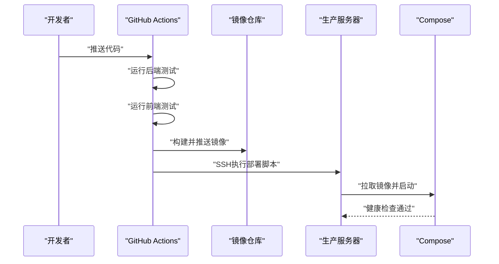

# 部署架构设计

<cite>
**本文档引用的文件**
- [backend/Dockerfile](file://backend/Dockerfile)
- [backend/Dockerfile.prod](file://backend/Dockerfile.prod)
- [docker-compose.yml](file://docker-compose.yml)
- [docker-compose.prod.yml](file://docker-compose.prod.yml)
- [deploy.sh](file://deploy.sh)
- [docker/nginx/nginx.conf](file://docker/nginx/nginx.conf)
- [docker/prometheus/prometheus.yml](file://docker/prometheus/prometheus.yml)
- [.github/workflows/ci-cd.yml](file://.github/workflows/ci-cd.yml)
- [backend/pyproject.toml](file://backend/pyproject.toml)
- [frontend/Dockerfile](file://frontend/Dockerfile)
- [backend/app/core/config.py](file://backend/app/core/config.py)
- [backend/app/main.py](file://backend/app/main.py)
- [backend/alembic.ini](file://backend/alembic.ini)
- [scripts/create_tenant.py](file://scripts/create_tenant.py)
- [docker/postgres/init.sql](file://docker/postgres/init.sql)
</cite>

## 目录
1. [简介](#简介)
2. [项目结构](#项目结构)
3. [核心组件](#核心组件)
4. [架构总览](#架构总览)
5. [详细组件分析](#详细组件分析)
6. [依赖关系分析](#依赖关系分析)
7. [性能考虑](#性能考虑)
8. [故障排除指南](#故障排除指南)
9. [结论](#结论)
10. [附录](#附录)

## 简介
本文件为多租户族谱管理系统的部署架构设计文档，涵盖开发与生产环境的差异化部署策略、容器化与Kubernetes集群部署建议、负载均衡与高可用性设计（含Nginx反向代理与多实例部署）、数据库集群与读写分离方案、监控与日志收集系统（Prometheus与ELK）、自动化部署流程（CI/CD与蓝绿部署）以及灾难恢复与备份策略。

## 项目结构
系统采用前后端分离与多服务编排的架构，核心由以下部分组成：
- 后端：基于FastAPI的Python应用，提供REST API与多租户能力
- 前端：基于Next.js的React应用，提供用户界面
- 数据库：PostgreSQL（主数据存储），Neo4j（图谱数据）
- 缓存与搜索：Redis（缓存），Meilisearch（全文检索）
- 对象存储：MinIO（S3兼容）
- 反向代理：Nginx
- 监控：Prometheus/Grafana（可选）

图表来源
- [docker-compose.yml:1-145](file://docker-compose.yml#L1-L145)
- [docker-compose.prod.yml:1-217](file://docker-compose.prod.yml#L1-L217)

章节来源
- [docker-compose.yml:1-145](file://docker-compose.yml#L1-L145)
- [docker-compose.prod.yml:1-217](file://docker-compose.prod.yml#L1-L217)

## 核心组件
- 应用容器化
  - 后端使用两阶段构建的生产镜像，包含健康检查与非root运行
  - 前端使用多阶段构建，优化体积与安全
- 开发与生产编排
  - 开发环境通过单机Compose快速启动所有服务
  - 生产环境通过Compose进行容器编排，并集成Nginx反向代理与监控
- 配置管理
  - 使用Pydantic设置类集中管理应用配置，支持不同环境变量
- 数据迁移
  - 使用Alembic进行数据库版本控制与迁移
- 多租户初始化
  - 提供脚本用于创建租户Schema、初始化表结构与Neo4j数据库

章节来源
- [backend/Dockerfile.prod:1-48](file://backend/Dockerfile.prod#L1-L48)
- [frontend/Dockerfile:1-51](file://frontend/Dockerfile#L1-L51)
- [backend/app/core/config.py:1-89](file://backend/app/core/config.py#L1-L89)
- [backend/alembic.ini:1-45](file://backend/alembic.ini#L1-L45)
- [scripts/create_tenant.py:1-306](file://scripts/create_tenant.py#L1-L306)

## 架构总览
系统采用“反向代理 + 多服务容器”的统一编排模式。生产环境通过Nginx统一入口，后端API与前端分别作为上游服务；数据库、图数据库、缓存、搜索与对象存储作为共享基础设施。监控组件按需启用，便于生产运维。

图表来源
- [docker-compose.prod.yml:156-201](file://docker-compose.prod.yml#L156-L201)
- [docker/nginx/nginx.conf:45-54](file://docker/nginx/nginx.conf#L45-L54)

## 详细组件分析

### 反向代理与负载均衡（Nginx）
- 功能特性
  - 定义后端上游组，分别指向API与Web服务
  - 支持keepalive连接池，提升并发性能
  - 配置基础安全头与限流策略
- 高可用设计
  - 单节点Nginx可通过健康检查与自动重启保障可用性
  - 扩展时可横向增加Nginx实例并配合外部负载均衡器实现高可用

图表来源
- [docker/nginx/nginx.conf:45-54](file://docker/nginx/nginx.conf#L45-L54)

章节来源
- [docker/nginx/nginx.conf:1-57](file://docker/nginx/nginx.conf#L1-L57)

### 后端API容器（FastAPI）
- 容器化与运行
  - 使用两阶段构建，最终镜像包含健康检查与非root用户
  - 暴露标准端口并通过Uvicorn运行
- 生命周期与中间件
  - 应用生命周期在启动时连接可选服务（Neo4j、Redis、Meilisearch），关闭时断开
  - 注入CORS与多租户中间件
  - 提供健康检查端点，返回服务状态

图表来源
- [backend/app/core/config.py:11-89](file://backend/app/core/config.py#L11-L89)
- [backend/app/main.py:17-87](file://backend/app/main.py#L17-L87)

章节来源
- [backend/Dockerfile.prod:1-48](file://backend/Dockerfile.prod#L1-L48)
- [backend/app/main.py:1-103](file://backend/app/main.py#L1-L103)
- [backend/app/core/config.py:1-89](file://backend/app/core/config.py#L1-L89)

### 前端容器（Next.js）
- 容器化与运行
  - 多阶段构建，最终仅包含运行时产物与健康检查
  - 在生产环境通过Nginx暴露静态资源与SSR内容
- 环境变量
  - 通过环境变量配置API地址等运行参数

章节来源
- [frontend/Dockerfile:1-51](file://frontend/Dockerfile#L1-L51)
- [docker-compose.prod.yml:138-152](file://docker-compose.prod.yml#L138-L152)

### 数据库与多租户（PostgreSQL）
- 初始化与扩展
  - 通过初始化SQL创建UUID与模糊搜索扩展
  - 租户Schema按租户slug生成，隔离数据
- 迁移与版本控制
  - 使用Alembic进行数据库迁移，支持版本演进

图表来源
- [scripts/create_tenant.py:18-282](file://scripts/create_tenant.py#L18-L282)
- [docker/postgres/init.sql:1-8](file://docker/postgres/init.sql#L1-L8)

章节来源
- [scripts/create_tenant.py:1-306](file://scripts/create_tenant.py#L1-L306)
- [docker/postgres/init.sql:1-8](file://docker/postgres/init.sql#L1-L8)
- [backend/alembic.ini:1-45](file://backend/alembic.ini#L1-L45)

### 图数据库（Neo4j）
- 集成方式
  - 通过Bolt协议连接，支持社区版多数据库或命名空间隔离
- 性能与可用性
  - 社区版限制多数据库，推荐使用命名空间前缀策略隔离租户

章节来源
- [docker-compose.yml:22-41](file://docker-compose.yml#L22-L41)
- [docker-compose.prod.yml:26-46](file://docker-compose.prod.yml#L26-L46)
- [scripts/create_tenant.py:208-228](file://scripts/create_tenant.py#L208-L228)

### 缓存与搜索（Redis/Meilisearch）
- Redis
  - 用于会话、缓存与限流
  - 生产环境配置持久化与内存策略
- Meilisearch
  - 提供全文检索能力，生产环境启用密钥保护

章节来源
- [docker-compose.yml:43-68](file://docker-compose.yml#L43-L68)
- [docker-compose.prod.yml:48-75](file://docker-compose.prod.yml#L48-L75)

### 对象存储（MinIO）
- S3兼容接口，提供图片、视频等媒体资源存储
- 生产环境配置访问密钥与桶策略

章节来源
- [docker-compose.yml:70-87](file://docker-compose.yml#L70-L87)
- [docker-compose.prod.yml:77-94](file://docker-compose.prod.yml#L77-L94)

### 监控与日志（Prometheus/Grafana）
- Prometheus
  - 抓取API、数据库、缓存与Nginx指标
- Grafana
  - 可视化监控面板，结合Prometheus数据源
- 日志收集
  - 建议引入ELK栈（Elasticsearch/Filebeat/Logstash/Kibana）统一采集Nginx、API与应用日志

章节来源
- [docker/prometheus/prometheus.yml:1-32](file://docker/prometheus/prometheus.yml#L1-L32)
- [docker-compose.prod.yml:174-201](file://docker-compose.prod.yml#L174-L201)

## 依赖关系分析
- 组件耦合
  - 后端API对数据库、图数据库、缓存、搜索与对象存储存在直接依赖
  - Nginx作为统一入口，解耦前端与后端
- 外部依赖
  - Docker Compose负责容器编排与网络
  - GitHub Actions负责CI/CD流水线

图表来源
- [docker-compose.prod.yml:98-172](file://docker-compose.prod.yml#L98-L172)

章节来源
- [docker-compose.yml:89-132](file://docker-compose.yml#L89-L132)
- [docker-compose.prod.yml:98-172](file://docker-compose.prod.yml#L98-L172)

## 性能考虑
- 连接池与并发
  - 后端数据库连接池参数可在配置中调整，避免过载
  - Nginx启用keepalive减少TCP握手开销
- 缓存策略
  - 利用Redis缓存热点数据与会话，降低数据库压力
- 搜索优化
  - Meilisearch索引与查询优化，结合模糊搜索扩展
- 存储与网络
  - MinIO分片与纠删码可提升可靠性与吞吐
- 资源限制
  - 为各容器设置CPU/内存限制，避免资源争用

## 故障排除指南
- 健康检查失败
  - 使用部署脚本中的健康检查命令验证API状态
  - 查看容器日志定位异常
- 数据库迁移
  - 通过Compose执行迁移命令，确保版本一致
- 缓存清理
  - 生产环境定期清理缓存，避免脏数据影响
- 环境变量
  - 确保生产环境变量文件存在且正确加载

章节来源
- [deploy.sh:38-51](file://deploy.sh#L38-L51)
- [docker-compose.prod.yml:107-133](file://docker-compose.prod.yml#L107-L133)

## 结论
本部署架构以容器化为核心，通过Nginx统一入口与多服务编排实现高内聚低耦合的系统组织。开发与生产环境采用差异化配置与编排文件，满足快速迭代与稳定运行的需求。建议在生产环境中进一步完善数据库集群、读写分离与灾备方案，并引入更完善的日志与监控体系。

## 附录

### 开发环境部署策略
- 使用开发Compose文件一键启动所有服务
- 本地调试时启用热重载与开发工具链

章节来源
- [docker-compose.yml:1-145](file://docker-compose.yml#L1-L145)

### 生产环境部署策略
- 使用生产Compose文件与部署脚本
- 集成Nginx反向代理与监控组件
- 通过环境变量注入敏感配置

章节来源
- [docker-compose.prod.yml:1-217](file://docker-compose.prod.yml#L1-L217)
- [deploy.sh:1-64](file://deploy.sh#L1-L64)

### Kubernetes集群部署建议
- Pod与Service
  - 将API与Web封装为Deployment，暴露Service
- Ingress
  - 使用Ingress控制器统一接入，支持TLS与路径路由
- ConfigMap与Secret
  - 将配置与密钥以ConfigMap/Secret形式注入
- 持久化存储
  - 使用PVC挂载数据库与缓存数据卷
- HPA/HPA
  - 根据CPU/自定义指标自动扩缩容
- 健康检查
  - 配置liveness/readiness探针

### 蓝绿部署策略
- 两个完全相同的环境（绿与蓝）
- 通过Ingress切换流量至目标环境
- 回滚时快速切回上一个环境

### 数据库集群与读写分离
- 主从复制
  - 主库负责写入，多个从库负责读取
- 读写分离
  - 应用层根据操作类型路由到主/从库
- 高可用
  - 引入VIP与自动故障转移机制

### 自动化部署流程（CI/CD）
- 测试阶段
  - 后端单元测试与覆盖率上报
  - 前端代码质量检查与构建
- 构建阶段
  - Docker镜像构建与推送
- 部署阶段
  - 服务器SSH执行部署脚本，自动迁移与健康检查

图表来源
- [.github/workflows/ci-cd.yml:142-160](file://.github/workflows/ci-cd.yml#L142-L160)

章节来源
- [.github/workflows/ci-cd.yml:1-160](file://.github/workflows/ci-cd.yml#L1-L160)

### 灾难恢复与备份策略
- 数据库备份
  - 定期逻辑/物理备份，异地存储
- 快照与镜像
  - 为关键服务配置快照与镜像备份
- 恢复演练
  - 定期进行恢复演练，验证备份有效性
- 监控告警
  - 建立完备的告警机制，及时发现异常