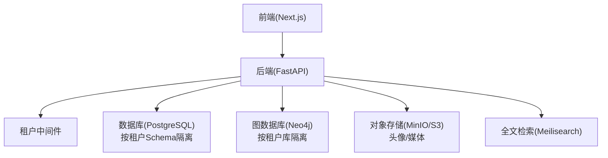
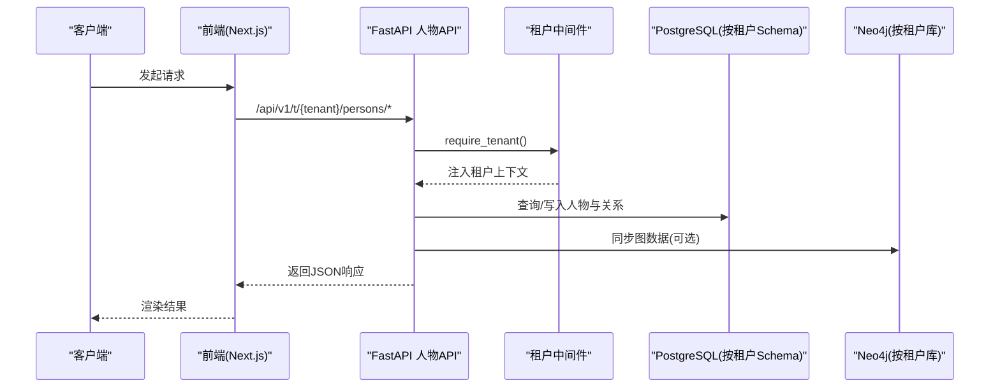
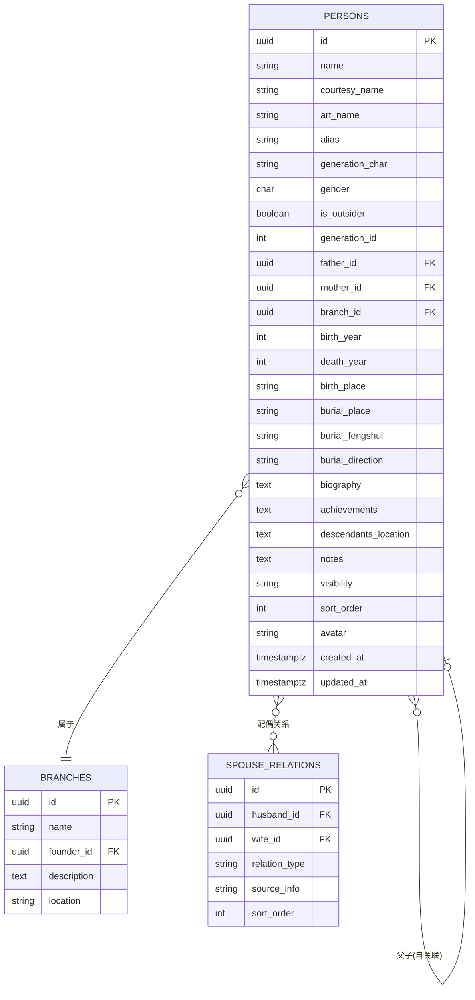
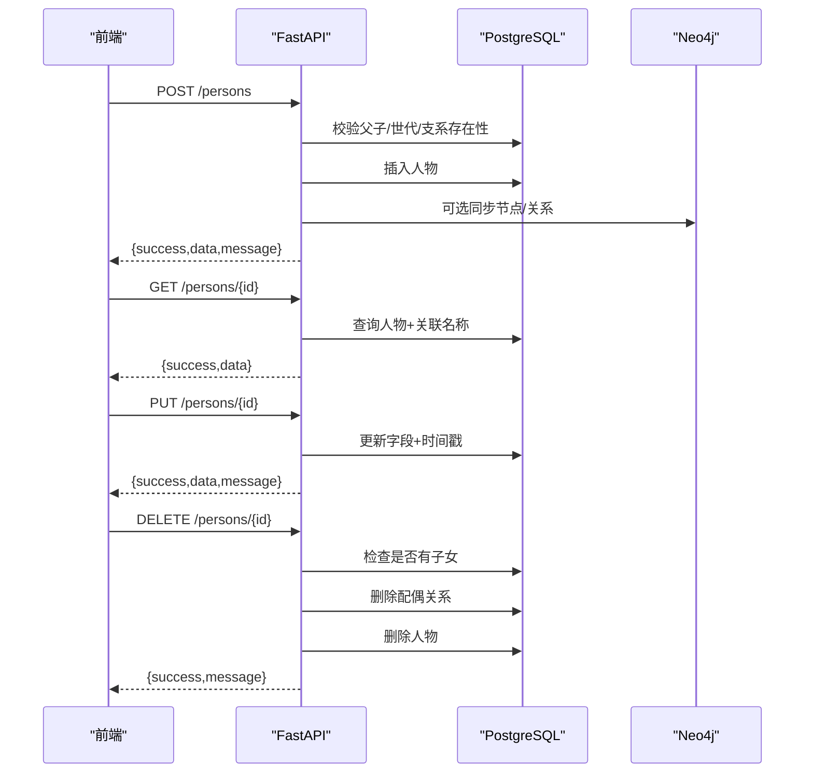
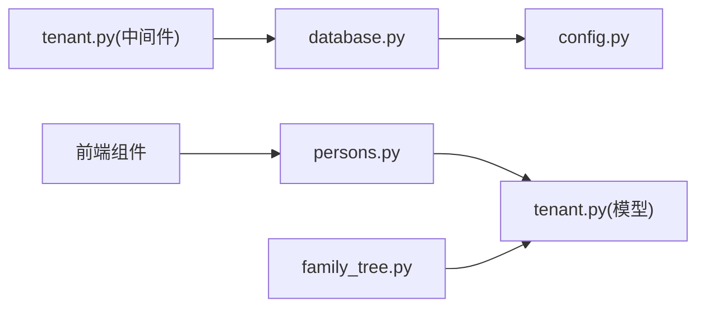

# 人物管理

<cite>
**本文引用的文件**
- [persons.py](file://backend/app/api/v1/endpoints/persons.py)
- [tenant.py](file://backend/app/models/tenant.py)
- [family_tree.py](file://backend/app/api/v1/endpoints/family_tree.py)
- [tenant.py](file://backend/app/middleware/tenant.py)
- [database.py](file://backend/app/core/database.py)
- [config.py](file://backend/app/core/config.py)
- [ARCHITECTURE.md](file://docs/ARCHITECTURE.md)
- [README.md](file://README.md)
- [export_data.py](file://django_backup/export_data.py)
- [import_data.py](file://django_backup/import_data.py)
- [models.py](file://django_backup/genealogy/models.py)
- [test_persons.py](file://backend/tests/test_persons.py)
</cite>

## 目录
1. [简介](#简介)
2. [项目结构](#项目结构)
3. [核心组件](#核心组件)
4. [架构总览](#架构总览)
5. [详细组件分析](#详细组件分析)
6. [依赖分析](#依赖分析)
7. [性能考虑](#性能考虑)
8. [故障排查指南](#故障排查指南)
9. [结论](#结论)
10. [附录](#附录)

## 简介
本文件面向多租户族谱管理系统的“人物管理”功能，围绕人物信息的增删改查、人物关系（父子、夫妻、兄弟姐妹）、批量导入导出、搜索与筛选、头像与媒体资源处理、API 接口、数据校验与错误处理、以及版本与变更审计进行系统化说明。文档同时结合后端 FastAPI 实现与前端交互，帮助开发者与产品人员快速理解与落地。

## 项目结构
后端采用 FastAPI + SQLAlchemy 异步 ORM，按模块化组织 API、模型与中间件；前端基于 Next.js App Router。多租户通过中间件识别租户上下文，数据库按租户 Schema 隔离。

图表来源
- [ARCHITECTURE.md](file://docs/ARCHITECTURE.md)
- [tenant.py](file://backend/app/middleware/tenant.py)
- [database.py](file://backend/app/core/database.py)
- [config.py](file://backend/app/core/config.py)

章节来源
- [README.md](file://README.md)
- [ARCHITECTURE.md](file://docs/ARCHITECTURE.md)

## 核心组件
- 人物模型与关系模型：定义人物基本信息、生卒年月、墓葬信息、备注、隐私可见性、排序、头像等字段，以及父子关系与配偶关系。
- 人物 API：提供列表、详情、创建、更新、删除、配偶关系查询与维护等接口。
- 族谱树 API：提供祖先链、后代树、统计信息等可视化支撑。
- 多租户中间件：统一识别租户、切换 Schema/Neo4j 库、注入租户上下文。
- 数据库管理：支持 SQLite/PostgreSQL，按租户动态创建引擎与会话。
- 配置中心：统一管理数据库、Neo4j、Redis、Meilisearch、存储等外部服务配置。
- 批量导入导出：提供 Django 脚本导出 Excel，支持从 Excel 导入数据。

章节来源
- [tenant.py](file://backend/app/models/tenant.py)
- [persons.py](file://backend/app/api/v1/endpoints/persons.py)
- [family_tree.py](file://backend/app/api/v1/endpoints/family_tree.py)
- [tenant.py](file://backend/app/middleware/tenant.py)
- [database.py](file://backend/app/core/database.py)
- [config.py](file://backend/app/core/config.py)
- [export_data.py](file://django_backup/export_data.py)
- [import_data.py](file://django_backup/import_data.py)

## 架构总览
下图展示人物管理在系统中的位置与交互：

图表来源
- [persons.py](file://backend/app/api/v1/endpoints/persons.py)
- [tenant.py](file://backend/app/middleware/tenant.py)
- [database.py](file://backend/app/core/database.py)
- [family_tree.py](file://backend/app/api/v1/endpoints/family_tree.py)

## 详细组件分析

### 数据模型与关系设计
- 人物表包含姓名、字、号、别名、辈分字、性别、是否外族配偶、世代、父/母、支系、生卒年月、出生地、墓葬信息、生平、备注、可见性、排序、头像、创建/更新时间等字段。
- 配偶关系表支持多种关系类型（婚姻、妾室、继配、招赘及多房排序），并记录来源信息与排序。
- 支持人物图片与视频扩展表，便于媒体资源管理。
- 变更审计表支持记录每次变更的旧值/新值、操作人、审核状态等。

图表来源
- [tenant.py](file://backend/app/models/tenant.py)

章节来源
- [tenant.py](file://backend/app/models/tenant.py)

### 人物 CRUD 与关系维护 API
- 列表与筛选：支持按世代、支系、性别、可见性、关键词搜索（姓名/字/号/别名）分页查询。
- 详情：按 ID 获取人物详情，可选包含关系信息。
- 创建：校验父子性别、存在性与世代/支系有效性，创建人物并返回标准响应。
- 更新：按需更新字段，自动更新时间戳。
- 删除：禁止删除仍有子女的人员；删除其配偶关系后级联删除人物。
- 配偶关系：查询指定人物的所有配偶关系；新增时校验双方性别与唯一性；删除时按双向匹配查找并删除。

图表来源
- [persons.py](file://backend/app/api/v1/endpoints/persons.py)

章节来源
- [persons.py](file://backend/app/api/v1/endpoints/persons.py)

### 搜索与筛选
- 基础搜索：支持关键词在姓名、字、号、别名上进行模糊匹配。
- 高级过滤：按世代、支系、性别、可见性过滤。
- 分页：支持页码与每页条数限制。
- 前端集成：管理后台列表页通过查询参数组合调用后端接口。

章节来源
- [persons.py](file://backend/app/api/v1/endpoints/persons.py)
- [frontend 组件](file://frontend/components/admin/PersonsList.tsx)

### 头像上传与媒体资源处理
- 头像字段：人物模型包含头像 URL 字段，支持存储于对象存储。
- 媒体扩展：提供人物图片与视频模型，支持标题、描述与排序。
- Django 侧验证：对图片/视频格式与大小进行校验，支持上传至指定目录。
- 前端上传：提供上传页面与已传资料展示，支持图片预览与视频播放。

章节来源
- [tenant.py](file://backend/app/models/tenant.py)
- [models.py](file://django_backup/genealogy/models.py)
- [views.py](file://django_backup/genealogy/views.py)

### 批量导入导出
- 导出：将世代、支系、人物、配偶关系导出为 Excel 多工作表，字段覆盖完整。
- 导入：从 Excel 读取数据，先创建人物（不含关系），再回填父子关系；同时导入世代、支系与配偶关系。
- 适用场景：从旧系统迁移、批量初始化数据。

章节来源
- [export_data.py](file://django_backup/export_data.py)
- [import_data.py](file://django_backup/import_data.py)

### 族谱树可视化与关系查询
- 族谱树：支持从根节点或首个祖先构建树，按深度递归获取后代。
- 祖先链：沿父系向上追溯指定上限。
- 后代树：从指定人物向下展开指定深度。
- 统计：统计总人数与各世代人数。

章节来源
- [family_tree.py](file://backend/app/api/v1/endpoints/family_tree.py)

### 多租户与数据库隔离
- 租户识别：支持子域、路径、Header 三种方式识别租户。
- Schema 切换：PostgreSQL 使用 search_path 切换到租户 Schema；SQLite 为每个租户使用独立数据库文件。
- Neo4j 切换：按租户库名切换图数据库。
- 会话管理：统一的 Session 工厂按租户动态创建连接池。

章节来源
- [tenant.py](file://backend/app/middleware/tenant.py)
- [database.py](file://backend/app/core/database.py)
- [config.py](file://backend/app/core/config.py)

## 依赖分析
- API 对模型的直接依赖：人物 CRUD 与关系维护均依赖模型定义。
- 中间件对数据库与系统模型的依赖：租户中间件依赖系统租户表以解析租户上下文。
- 数据库管理对配置的依赖：根据配置决定连接参数与连接池大小。
- 前端对 API 的依赖：通过查询参数组合实现搜索与筛选。

图表来源
- [persons.py](file://backend/app/api/v1/endpoints/persons.py)
- [family_tree.py](file://backend/app/api/v1/endpoints/family_tree.py)
- [tenant.py](file://backend/app/middleware/tenant.py)
- [database.py](file://backend/app/core/database.py)
- [config.py](file://backend/app/core/config.py)

章节来源
- [persons.py](file://backend/app/api/v1/endpoints/persons.py)
- [family_tree.py](file://backend/app/api/v1/endpoints/family_tree.py)
- [tenant.py](file://backend/app/middleware/tenant.py)
- [database.py](file://backend/app/core/database.py)
- [config.py](file://backend/app/core/config.py)

## 性能考虑
- 分页与过滤：列表接口支持分页与多维过滤，建议前端按需传参，避免一次性拉取大量数据。
- 模糊搜索：关键词搜索对多个字段进行 ilike 匹配，建议配合索引与全文检索优化。
- 图同步：创建/更新人物时可选同步到 Neo4j，建议在批量导入时统一重建图，减少频繁同步带来的开销。
- 连接池：数据库连接池参数可按环境调整，生产环境建议适当增大并发能力。

## 故障排查指南
- 租户未找到：确认请求头/路径/子域是否正确传递租户标识，检查租户状态是否激活。
- 无效 ID：确保 UUID 格式正确，避免字符串拼写错误。
- 删除失败：若人物仍有子女，系统会拒绝删除；请先处理子女归属或转移后再试。
- 配偶关系重复：新增关系时若已存在相同夫妇组合，会返回冲突错误；请先删除旧关系再添加。
- 文件上传失败：检查文件格式与大小限制，确认对象存储服务可用且桶权限正确。

章节来源
- [tenant.py](file://backend/app/middleware/tenant.py)
- [persons.py](file://backend/app/api/v1/endpoints/persons.py)
- [models.py](file://django_backup/genealogy/models.py)

## 结论
本功能以清晰的数据模型与完善的 API 接口为基础，结合多租户隔离、图数据库同步与对象存储，实现了族谱人物的全生命周期管理。通过搜索与筛选、批量导入导出、媒体资源管理与变更审计，满足了多家族场景下的高效协作与数据治理需求。

## 附录

### API 接口清单（按功能分组）
- 人物管理
  - GET /api/v1/t/{tenant}/persons
  - GET /api/v1/t/{tenant}/persons/{id}
  - POST /api/v1/t/{tenant}/persons
  - PUT /api/v1/t/{tenant}/persons/{id}
  - DELETE /api/v1/t/{tenant}/persons/{id}
- 配偶关系
  - GET /api/v1/t/{tenant}/persons/{id}/spouses
  - POST /api/v1/t/{tenant}/persons/{id}/spouses
  - DELETE /api/v1/t/{tenant}/persons/{id}/spouses/{spouse_id}
- 族谱树
  - GET /api/v1/t/{tenant}/family-tree
  - GET /api/v1/t/{tenant}/family-tree/ancestors/{id}
  - GET /api/v1/t/{tenant}/family-tree/descendants/{id}
  - GET /api/v1/t/{tenant}/family-tree/statistics
- 元信息
  - GET /api/v1/t/{tenant}/persons/generations
  - GET /api/v1/t/{tenant}/persons/branches

章节来源
- [persons.py](file://backend/app/api/v1/endpoints/persons.py)
- [family_tree.py](file://backend/app/api/v1/endpoints/family_tree.py)

### 数据验证与业务约束
- 字段长度与范围：姓名、支系名称等字段长度限制；年份字段范围限制。
- 性别与关系：父子必须为异性；新增配偶关系需校验双方性别与唯一性。
- 世代与支系：创建人物时需校验世代与支系存在性。
- 可见性：支持 public/member/private 三级隐私控制。
- 排序：支持 generation_id、sort_order、id 的稳定排序。

章节来源
- [persons.py](file://backend/app/api/v1/endpoints/persons.py)
- [tenant.py](file://backend/app/models/tenant.py)

### 版本控制与历史记录
- 变更审计：提供 change_logs 表记录每次变更的表名、记录 ID、动作、旧/新值、操作人与审核状态。
- 建议实践：在创建/更新/删除接口中增加变更日志记录，便于审计与回溯。

章节来源
- [tenant.py](file://backend/app/models/tenant.py)

### 前端集成要点
- 列表页：通过查询参数组合实现搜索与筛选，支持分页控件。
- 详情页：按 ID 请求人物详情，展示基本信息与关系。
- 表单：创建/编辑时按模型字段进行校验与提交。

章节来源
- [frontend 组件](file://frontend/components/admin/PersonsList.tsx)
- [frontend 详情页](file://frontend/app/[tenant]/persons/[personId]/page.tsx)