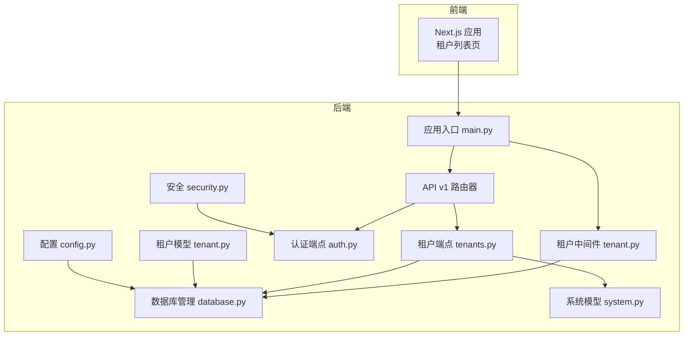
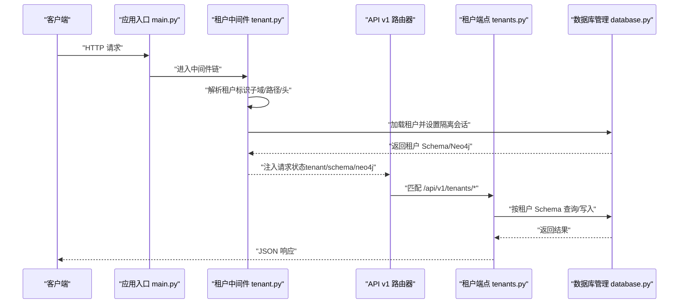
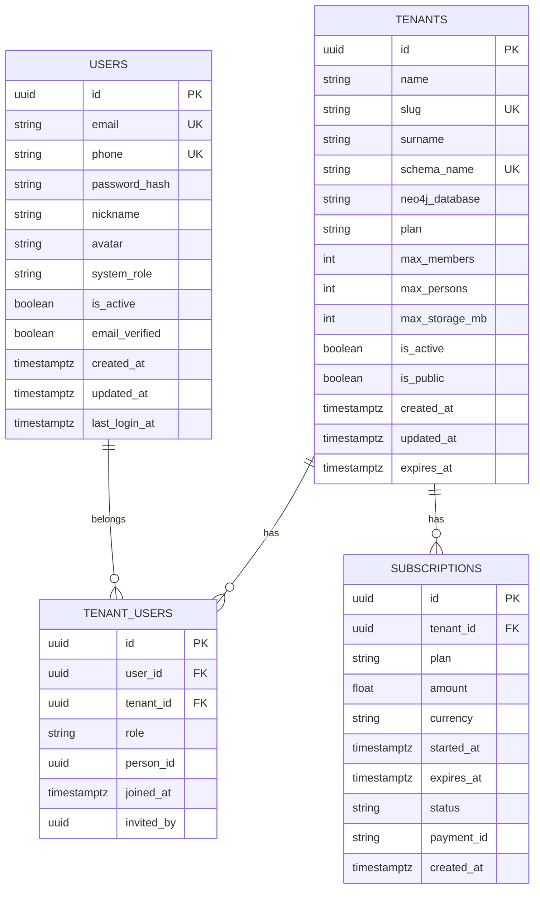
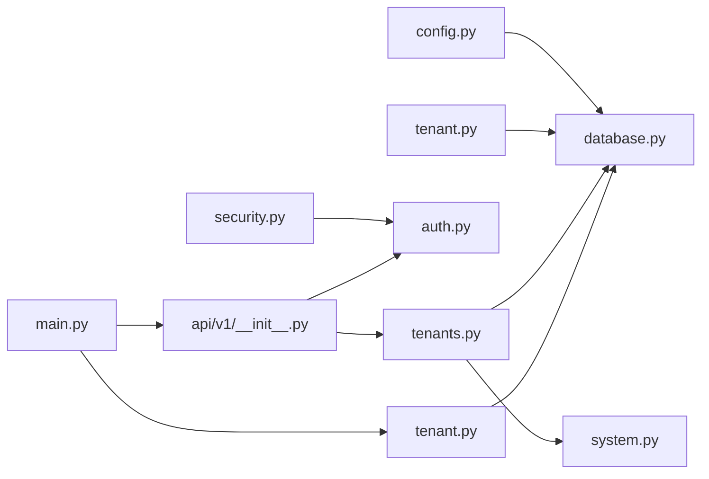

# 多租户管理

<cite>
**本文引用的文件**
- [backend/app/main.py](file://backend/app/main.py)
- [backend/app/middleware/tenant.py](file://backend/app/middleware/tenant.py)
- [backend/app/api/v1/endpoints/tenants.py](file://backend/app/api/v1/endpoints/tenants.py)
- [backend/app/api/v1/__init__.py](file://backend/app/api/v1/__init__.py)
- [backend/app/models/system.py](file://backend/app/models/system.py)
- [backend/app/models/tenant.py](file://backend/app/models/tenant.py)
- [backend/app/core/database.py](file://backend/app/core/database.py)
- [backend/app/core/config.py](file://backend/app/core/config.py)
- [backend/app/core/security.py](file://backend/app/core/security.py)
- [backend/app/api/v1/endpoints/auth.py](file://backend/app/api/v1/endpoints/auth.py)
- [backend/migrations/versions/001_initial.py](file://backend/migrations/versions/001_initial.py)
- [scripts/create_tenant.py](file://scripts/create_tenant.py)
- [backend/tests/test_tenants.py](file://backend/tests/test_tenants.py)
- [frontend/app/tenants/page.tsx](file://frontend/app/tenants/page.tsx)
- [frontend/components/tenants/TenantsList.tsx](file://frontend/components/tenants/TenantsList.tsx)
- [README.md](file://README.md)
</cite>

## 目录
1. [简介](#简介)
2. [项目结构](#项目结构)
3. [核心组件](#核心组件)
4. [架构总览](#架构总览)
5. [详细组件分析](#详细组件分析)
6. [依赖分析](#依赖分析)
7. [性能考虑](#性能考虑)
8. [故障排查指南](#故障排查指南)
9. [结论](#结论)
10. [附录](#附录)

## 简介
本文件面向“多租户族谱管理”系统的多租户管理功能，提供从租户创建、配置与管理，到数据隔离、访问控制、成员与权限、配置与配额、订阅状态、数据库设计与表结构、API 接口定义，以及迁移、备份与故障恢复策略的完整说明。文档以仓库现有实现为基础，结合前端展示与测试用例，帮助开发者与运维人员快速理解并正确使用多租户能力。

## 项目结构
后端采用 FastAPI + SQLAlchemy 异步 ORM，数据库默认使用 SQLite（便于本地开发），生产环境可切换至 PostgreSQL；同时预留了与 Neo4j、Redis、Meilisearch 的集成点。前端使用 Next.js，提供租户列表页与跳转逻辑。

图表来源
- [backend/app/main.py:1-103](file://backend/app/main.py#L1-L103)
- [backend/app/middleware/tenant.py:1-142](file://backend/app/middleware/tenant.py#L1-L142)
- [backend/app/api/v1/__init__.py:1-20](file://backend/app/api/v1/__init__.py#L1-L20)
- [backend/app/api/v1/endpoints/tenants.py:1-164](file://backend/app/api/v1/endpoints/tenants.py#L1-L164)
- [backend/app/api/v1/endpoints/auth.py:1-179](file://backend/app/api/v1/endpoints/auth.py#L1-L179)
- [backend/app/core/database.py:1-171](file://backend/app/core/database.py#L1-L171)
- [backend/app/core/config.py:1-89](file://backend/app/core/config.py#L1-L89)
- [backend/app/core/security.py:1-103](file://backend/app/core/security.py#L1-L103)
- [backend/app/models/system.py:1-223](file://backend/app/models/system.py#L1-L223)
- [backend/app/models/tenant.py:1-244](file://backend/app/models/tenant.py#L1-L244)

章节来源
- [README.md:1-133](file://README.md#L1-L133)
- [backend/app/main.py:1-103](file://backend/app/main.py#L1-L103)

## 核心组件
- 应用入口与生命周期：负责初始化数据库引擎、连接可选服务、挂载中间件与路由。
- 租户中间件：解析请求中的租户上下文（子域、路径前缀、自定义头），校验租户状态并注入请求状态。
- 租户端点：提供租户查询、详情与创建等接口。
- 系统与租户模型：定义租户、用户、租户-用户关系、订阅等系统级实体。
- 数据库管理：按租户隔离创建会话，支持 PostgreSQL Schema 与 SQLite 文件两种隔离方式。
- 配置与安全：统一配置项、JWT 令牌签发与验证。
- 前端租户列表：展示公开租户并跳转至对应租户空间。

章节来源
- [backend/app/main.py:17-88](file://backend/app/main.py#L17-L88)
- [backend/app/middleware/tenant.py:15-142](file://backend/app/middleware/tenant.py#L15-L142)
- [backend/app/api/v1/endpoints/tenants.py:17-164](file://backend/app/api/v1/endpoints/tenants.py#L17-L164)
- [backend/app/models/system.py:23-223](file://backend/app/models/system.py#L23-L223)
- [backend/app/models/tenant.py:23-244](file://backend/app/models/tenant.py#L23-L244)
- [backend/app/core/database.py:24-171](file://backend/app/core/database.py#L24-L171)
- [backend/app/core/config.py:11-89](file://backend/app/core/config.py#L11-L89)
- [backend/app/core/security.py:16-103](file://backend/app/core/security.py#L16-L103)
- [frontend/components/tenants/TenantsList.tsx:22-118](file://frontend/components/tenants/TenantsList.tsx#L22-L118)

## 架构总览
多租户架构围绕“租户上下文识别—数据库会话隔离—业务路由分发”展开。系统通过中间件在请求进入时确定当前租户，随后所有租户相关数据访问均基于该租户的隔离会话执行。

图表来源
- [backend/app/main.py:66-70](file://backend/app/main.py#L66-L70)
- [backend/app/middleware/tenant.py:39-84](file://backend/app/middleware/tenant.py#L39-L84)
- [backend/app/api/v1/endpoints/tenants.py:45-164](file://backend/app/api/v1/endpoints/tenants.py#L45-L164)
- [backend/app/core/database.py:136-171](file://backend/app/core/database.py#L136-L171)

## 详细组件分析

### 租户标识与命名规范
- 租户标识来源优先级：URL 路径前缀 /t/{slug}/... > 子域 tenant.domain.com > 自定义头 X-Tenant-ID。
- 租户 slug 规范：小写字母、数字、连字符组合，长度限制，唯一性约束。
- 租户 schema 名称：由 slug 转换而来（连字符替换为下划线），用于 PostgreSQL Schema 或 SQLite 文件名前缀。
- 租户 Neo4j 数据库名称：由 slug 直接派生，用于图数据库隔离。

章节来源
- [backend/app/middleware/tenant.py:19-34](file://backend/app/middleware/tenant.py#L19-L34)
- [backend/app/middleware/tenant.py:93-114](file://backend/app/middleware/tenant.py#L93-L114)
- [backend/app/api/v1/endpoints/tenants.py:18-23](file://backend/app/api/v1/endpoints/tenants.py#L18-L23)
- [backend/app/api/v1/endpoints/tenants.py:134-144](file://backend/app/api/v1/endpoints/tenants.py#L134-L144)

### 数据隔离与访问控制
- 数据库隔离：
  - PostgreSQL：通过 SET search_path 切换到租户 Schema，实现表级隔离。
  - SQLite：为每个租户创建独立数据库文件，避免 Schema 限制。
- Neo4j：当前实现保留了多数据库支持的思路，但社区版不支持多数据库，实际通过节点前缀或应用层隔离实现。
- 访问控制：
  - 中间件对公共路径放行，其余请求必须能解析出有效租户且租户处于激活状态。
  - 租户端点在创建时预留了超级用户鉴权占位，当前未强制启用。

章节来源
- [backend/app/core/database.py:58-106](file://backend/app/core/database.py#L58-L106)
- [backend/app/core/database.py:136-171](file://backend/app/core/database.py#L136-L171)
- [backend/app/middleware/tenant.py:25-34](file://backend/app/middleware/tenant.py#L25-L34)
- [backend/app/middleware/tenant.py:48-74](file://backend/app/middleware/tenant.py#L48-L74)

### 成员管理、权限分配与角色控制
- 用户-租户关系：通过 tenant_users 表建立用户与租户的多对多关系，并记录角色与加入时间。
- 角色与权限：
  - 角色字段 role 支持 member、tenant_admin、editor、reviewer 等（属性方法提供便捷判断）。
  - 权限判定：管理员、编辑者、审核者具备不同编辑与审核能力。
- 关联人物：可在关系记录中绑定家族中的具体人物，便于身份关联。

章节来源
- [backend/app/models/system.py:123-181](file://backend/app/models/system.py#L123-L181)

### 租户配置、存储配额与订阅状态
- 配置项：
  - 默认套餐、免费配额上限（成员数、人物数、存储 MB）。
- 订阅模型：
  - plan、amount、currency、起止时间、状态、支付单号等。
  - 与租户一对一关联，支持到期时间与状态控制。
- 存储配额：在系统模型中定义了 max_storage_mb 字段，可用于后续配额检查与告警。

章节来源
- [backend/app/core/config.py:69-73](file://backend/app/core/config.py#L69-L73)
- [backend/app/models/system.py:183-223](file://backend/app/models/system.py#L183-L223)
- [backend/app/models/system.py:42-46](file://backend/app/models/system.py#L42-L46)

### 数据库设计与表结构组织
- 系统级（public 模式）：
  - tenants：租户元信息、隔离标识、套餐与配额、公开/激活状态、设置。
  - users：系统用户、角色、状态与时间戳。
  - tenant_users：用户-租户关系、角色、关联人物、邀请人与加入时间。
  - subscriptions：订阅记录、计划与有效期、状态与支付信息。
- 租户级（tenant_{slug} 模式）：
  - generations、branches、persons、spouse_relations、person_images、person_videos、change_logs 等族谱相关表。
- 迁移脚本：
  - 初始迁移创建系统级表与索引，租户级表结构与初始迁移脚本保持一致。

图表来源
- [backend/migrations/versions/001_initial.py:25-104](file://backend/migrations/versions/001_initial.py#L25-L104)
- [backend/app/models/system.py:23-223](file://backend/app/models/system.py#L23-L223)

章节来源
- [backend/migrations/versions/001_initial.py:21-104](file://backend/migrations/versions/001_initial.py#L21-L104)
- [backend/app/models/tenant.py:23-244](file://backend/app/models/tenant.py#L23-L244)

### API 接口文档（租户相关）

- 获取租户列表
  - 方法与路径：GET /api/v1/tenants
  - 查询参数：page、page_size、surname（模糊搜索）
  - 返回：分页响应，包含租户基本信息与元数据
  - 访问控制：无需租户上下文
  - 实现参考：[backend/app/api/v1/endpoints/tenants.py:45-88](file://backend/app/api/v1/endpoints/tenants.py#L45-L88)

- 获取租户详情
  - 方法与路径：GET /api/v1/tenants/{slug}
  - 参数：slug（租户标识）
  - 返回：租户详情
  - 访问控制：无需租户上下文
  - 实现参考：[backend/app/api/v1/endpoints/tenants.py:91-116](file://backend/app/api/v1/endpoints/tenants.py#L91-L116)

- 创建租户
  - 方法与路径：POST /api/v1/tenants
  - 请求体：name、slug、surname、is_public
  - 返回：新创建租户详情
  - 访问控制：预留超级用户鉴权（当前未强制）
  - 实现参考：[backend/app/api/v1/endpoints/tenants.py:118-164](file://backend/app/api/v1/endpoints/tenants.py#L118-L164)
  - 注意：创建后需要执行数据库 Schema 初始化与图数据库准备，当前接口预留了相关注释。

- 认证相关（与租户成员管理配合）
  - 注册：POST /api/v1/auth/register
  - 登录：POST /api/v1/auth/login
  - 刷新：POST /api/v1/auth/refresh
  - 当前认证接口位于公共模式，租户成员可通过租户-用户关系绑定到具体租户。
  - 实现参考：[backend/app/api/v1/endpoints/auth.py:55-179](file://backend/app/api/v1/endpoints/auth.py#L55-L179)

章节来源
- [backend/app/api/v1/endpoints/tenants.py:45-164](file://backend/app/api/v1/endpoints/tenants.py#L45-L164)
- [backend/app/api/v1/endpoints/auth.py:55-179](file://backend/app/api/v1/endpoints/auth.py#L55-L179)

### 前端集成与用户体验
- 租户列表页：展示公开租户卡片，支持按姓氏搜索，点击进入对应租户空间。
- 路由约定：前端通过 /t/{slug}/family-tree 访问租户族谱树页面。
- 实现参考：
  - [frontend/app/tenants/page.tsx:1-39](file://frontend/app/tenants/page.tsx#L1-L39)
  - [frontend/components/tenants/TenantsList.tsx:22-118](file://frontend/components/tenants/TenantsList.tsx#L22-L118)

章节来源
- [frontend/app/tenants/page.tsx:1-39](file://frontend/app/tenants/page.tsx#L1-L39)
- [frontend/components/tenants/TenantsList.tsx:22-118](file://frontend/components/tenants/TenantsList.tsx#L22-L118)

### 租户管理 CLI 与初始化流程
- CLI 功能：创建租户、初始化 PostgreSQL Schema、创建租户级表、准备 Neo4j 数据库。
- 流程要点：先在系统表创建租户记录，再创建 Schema 与表，最后准备图数据库。
- 实现参考：[scripts/create_tenant.py:231-282](file://scripts/create_tenant.py#L231-L282)

章节来源
- [scripts/create_tenant.py:18-206](file://scripts/create_tenant.py#L18-L206)
- [scripts/create_tenant.py:231-282](file://scripts/create_tenant.py#L231-L282)

## 依赖分析
- 组件耦合与职责：
  - main.py 作为入口，集中挂载中间件与路由，耦合度低，扩展性强。
  - 租户中间件仅负责上下文注入，不直接参与业务逻辑，内聚性高。
  - 数据库管理器按租户隔离提供会话，避免跨租户数据污染。
  - 系统模型与租户模型分离，系统级实体与租户级实体边界清晰。
- 外部依赖：
  - 数据库：PostgreSQL/SQLite（异步驱动）、Neo4j（可选）、Redis/Meilisearch（可选）。
  - 安全：JWT、密码哈希。
- 可能的循环依赖：未发现直接循环导入；中间件与路由解耦良好。

图表来源
- [backend/app/main.py:66-70](file://backend/app/main.py#L66-L70)
- [backend/app/api/v1/__init__.py:10-19](file://backend/app/api/v1/__init__.py#L10-L19)
- [backend/app/middleware/tenant.py:11-12](file://backend/app/middleware/tenant.py#L11-L12)
- [backend/app/core/database.py:120-121](file://backend/app/core/database.py#L120-L121)

章节来源
- [backend/app/main.py:66-70](file://backend/app/main.py#L66-L70)
- [backend/app/api/v1/__init__.py:10-19](file://backend/app/api/v1/__init__.py#L10-L19)
- [backend/app/core/database.py:120-121](file://backend/app/core/database.py#L120-L121)

## 性能考虑
- 连接池与引擎复用：数据库管理器按租户缓存引擎与会话工厂，减少重复创建开销。
- SQLite 与 PostgreSQL 的差异化处理：SQLite 为每租户单独文件，避免 Schema 切换；PostgreSQL 使用 search_path 切换，减少跨库查询成本。
- 异步 I/O：使用 SQLAlchemy 异步引擎与 FastAPI 异步会话，提升并发吞吐。
- 建议：
  - 在生产环境使用 PostgreSQL 并开启连接池参数优化。
  - 对高频查询添加索引（如 tenants.slug、tenant_users.user_id/tenant_id）。
  - 对租户级表进行分区或归档策略，控制单租户数据规模增长。

## 故障排查指南
- 租户未找到或未激活：
  - 现象：返回 404 或 403 错误。
  - 排查：确认 slug 是否正确、租户是否激活、中间件是否正确注入上下文。
  - 参考：[backend/app/middleware/tenant.py:48-74](file://backend/app/middleware/tenant.py#L48-L74)
- 数据库连接异常：
  - 现象：SQLAlchemy 异常或连接失败。
  - 排查：确认数据库 URL、连接池参数、SQLite 文件路径是否存在。
  - 参考：[backend/app/core/database.py:33-56](file://backend/app/core/database.py#L33-L56)
- 认证失败：
  - 现象：登录/刷新失败或 401。
  - 排查：核对 JWT 密钥、算法、过期时间与前端存储。
  - 参考：[backend/app/core/security.py:26-103](file://backend/app/core/security.py#L26-L103)
- 租户创建后无法访问：
  - 现象：创建成功但数据不可见。
  - 排查：确认是否完成 PostgreSQL Schema 与表初始化、Neo4j 准备步骤。
  - 参考：[scripts/create_tenant.py:267-274](file://scripts/create_tenant.py#L267-L274)

章节来源
- [backend/app/middleware/tenant.py:48-74](file://backend/app/middleware/tenant.py#L48-L74)
- [backend/app/core/database.py:33-56](file://backend/app/core/database.py#L33-L56)
- [backend/app/core/security.py:26-103](file://backend/app/core/security.py#L26-L103)
- [scripts/create_tenant.py:267-274](file://scripts/create_tenant.py#L267-L274)

## 结论
本系统在架构层面实现了租户上下文识别与数据库隔离，提供了基础的租户 CRUD、成员与权限模型、订阅与配额字段，并通过 CLI 提供了租户初始化能力。建议在后续版本中完善：
- 完成租户创建的自动化初始化（Schema/表/图数据库）。
- 引入租户级鉴权中间件，确保所有租户相关接口均受租户上下文保护。
- 实现配额检查与告警、订阅到期处理、成员邀请与角色变更接口。
- 增强前端在租户空间内的成员管理与权限配置界面。

## 附录

### API 接口清单（租户相关）
- GET /api/v1/tenants
  - 查询参数：page、page_size、surname
  - 返回：分页列表
  - 参考：[backend/app/api/v1/endpoints/tenants.py:45-88](file://backend/app/api/v1/endpoints/tenants.py#L45-L88)
- GET /api/v1/tenants/{slug}
  - 路径参数：slug
  - 返回：租户详情
  - 参考：[backend/app/api/v1/endpoints/tenants.py:91-116](file://backend/app/api/v1/endpoints/tenants.py#L91-L116)
- POST /api/v1/tenants
  - 请求体：name、slug、surname、is_public
  - 返回：新建租户详情
  - 参考：[backend/app/api/v1/endpoints/tenants.py:118-164](file://backend/app/api/v1/endpoints/tenants.py#L118-L164)

### 测试用例参考
- 租户列表、详情、按姓氏搜索、创建租户（鉴权占位）。
- 参考：[backend/tests/test_tenants.py:11-112](file://backend/tests/test_tenants.py#L11-L112)