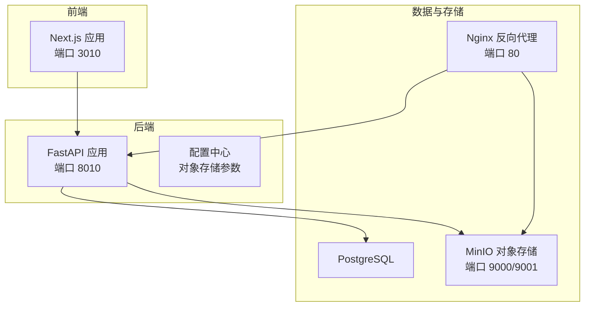
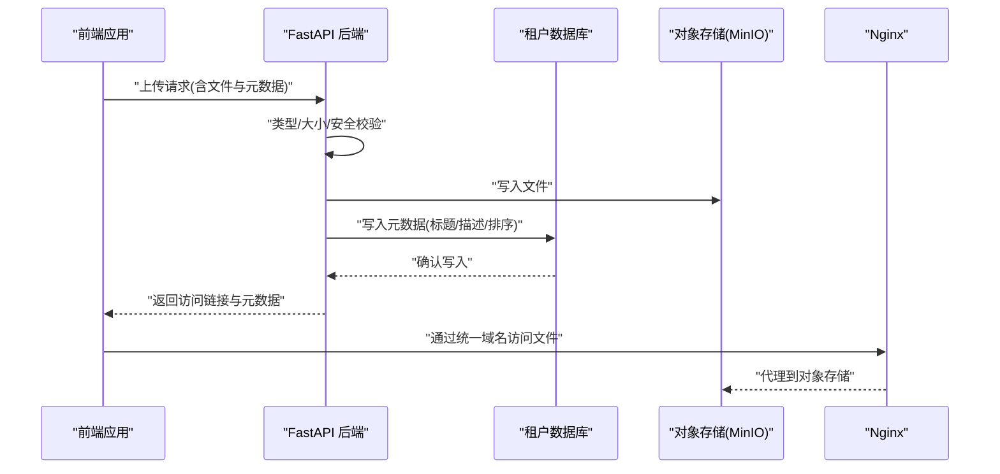
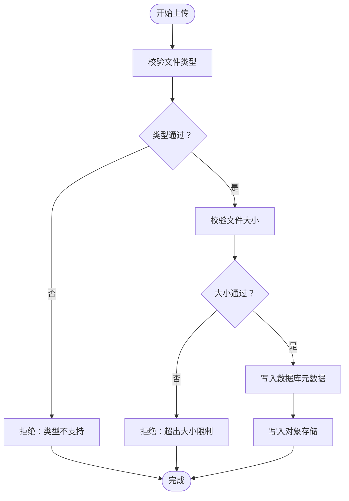
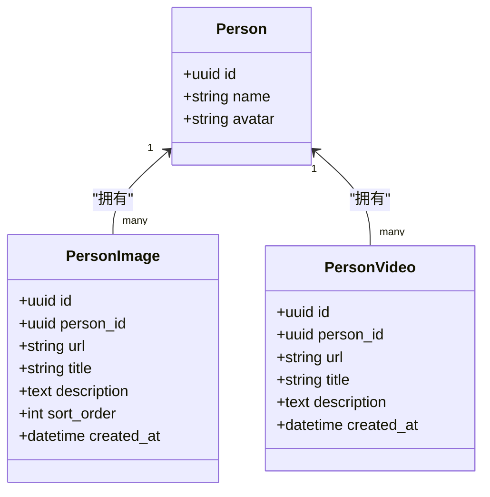
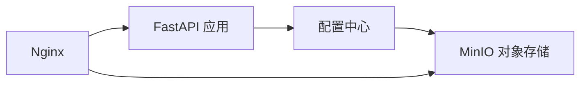
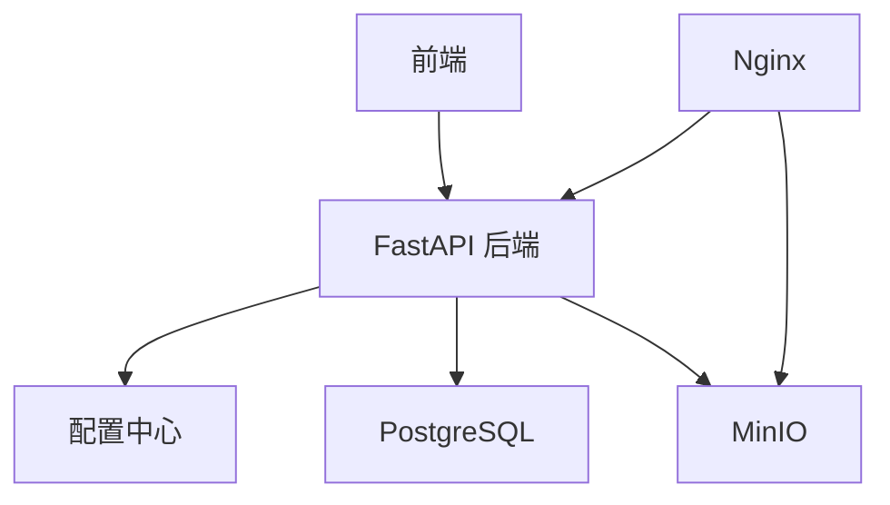
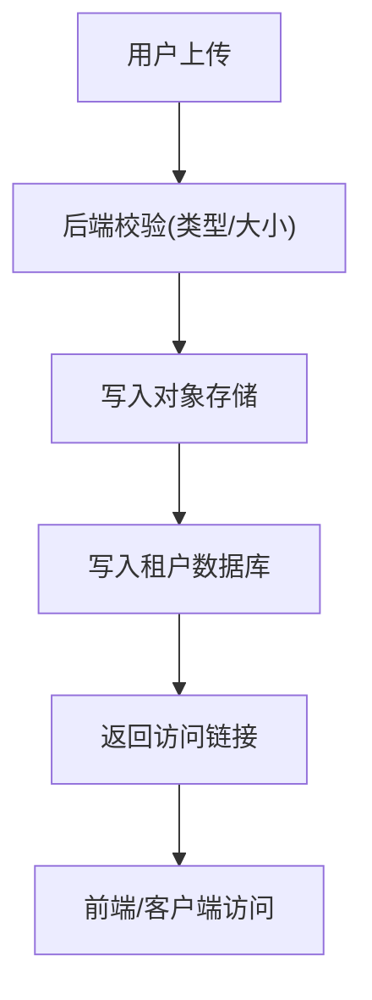

# 文件管理

<cite>
**本文引用的文件**
- [backend/app/main.py](file://backend/app/main.py)
- [backend/app/core/config.py](file://backend/app/core/config.py)
- [backend/app/models/tenant.py](file://backend/app/models/tenant.py)
- [backend/app/api/v1/endpoints/persons.py](file://backend/app/api/v1/endpoints/persons.py)
- [backend/app/api/v1/endpoints/family_tree.py](file://backend/app/api/v1/endpoints/family_tree.py)
- [django_backup/genealogy/models.py](file://django_backup/genealogy/models.py)
- [django_backup/genealogy/views.py](file://django_backup/genealogy/views.py)
- [django_backup/genealogy/admin.py](file://django_backup/genealogy/admin.py)
- [django_backup/templates/genealogy/upload_media.html](file://django_backup/templates/genealogy/upload_media.html)
- [django_backup/templates/genealogy/person_detail.html](file://django_backup/templates/genealogy/person_detail.html)
- [django_backup/nginx.conf](file://django_backup/nginx.conf)
- [docker-compose.yml](file://docker-compose.yml)
- [docker-compose.prod.yml](file://docker-compose.prod.yml)
- [docs/ARCHITECTURE.md](file://docs/ARCHITECTURE.md)
</cite>

## 目录
1. [引言](#引言)
2. [项目结构](#项目结构)
3. [核心组件](#核心组件)
4. [架构总览](#架构总览)
5. [详细组件分析](#详细组件分析)
6. [依赖分析](#依赖分析)
7. [性能考虑](#性能考虑)
8. [故障排查指南](#故障排查指南)
9. [结论](#结论)
10. [附录](#附录)

## 引言
本文件面向多租户族谱管理系统中的“文件管理”能力，系统性梳理图片、视频与文档类文件的上传、存储、管理与访问机制。文档覆盖以下主题：
- 文件类型与大小限制、安全校验
- 对象存储服务集成（MinIO/本地S3兼容）
- 元数据管理（描述、标签、访问权限）
- 版本与历史记录机制
- 预览能力（图片缩略图、视频播放器）
- 同步与备份策略
- 访问控制与权限验证
- 存储优化、CDN集成与性能监控
- 文件迁移工具与数据转换流程

## 项目结构
系统采用前后端分离与多服务编排架构：
- 前端：Next.js（开发环境通过Docker Compose运行）
- 后端：FastAPI（API网关、业务逻辑、多租户中间件）
- 数据库：PostgreSQL（主数据）、Neo4j（图谱数据，可选）
- 缓存与搜索：Redis、Meilisearch（可选）
- 对象存储：MinIO（S3兼容），提供统一文件访问入口
- 反向代理：Nginx（静态资源与媒体文件代理）

图表来源
- [docker-compose.yml:1-145](file://docker-compose.yml#L1-L145)
- [docs/ARCHITECTURE.md:829-913](file://docs/ARCHITECTURE.md#L829-L913)

章节来源
- [docker-compose.yml:1-145](file://docker-compose.yml#L1-L145)
- [docs/ARCHITECTURE.md:829-913](file://docs/ARCHITECTURE.md#L829-L913)

## 核心组件
- 文件上传与管理（Django 旧版）：提供图片与视频上传、校验、存储与展示，包含媒体模型与视图。
- 多租户文件模型（FastAPI 新版）：在租户级数据库中维护人物图片、视频等元数据，支持排序、标题、描述等字段。
- 对象存储集成：通过配置项对接 MinIO（S3兼容），统一文件访问与持久化。
- 预览与播放：模板中直接使用浏览器原生媒体元素进行播放。

章节来源
- [django_backup/genealogy/models.py:438-486](file://django_backup/genealogy/models.py#L438-L486)
- [backend/app/models/tenant.py:167-212](file://backend/app/models/tenant.py#L167-L212)
- [backend/app/core/config.py:62-68](file://backend/app/core/config.py#L62-L68)
- [django_backup/templates/genealogy/upload_media.html:46-90](file://django_backup/templates/genealogy/upload_media.html#L46-L90)

## 架构总览
文件管理在系统中的流转路径如下：
- 前端提交文件至后端API或直接上传到对象存储（取决于实现策略）
- 后端进行类型、大小与安全校验
- 文件写入对象存储，元数据写入租户数据库
- 前端通过统一访问域名获取文件

图表来源
- [backend/app/core/config.py:62-68](file://backend/app/core/config.py#L62-L68)
- [backend/app/models/tenant.py:167-212](file://backend/app/models/tenant.py#L167-L212)
- [django_backup/nginx.conf:11-34](file://django_backup/nginx.conf#L11-L34)

## 详细组件分析

### 组件A：文件上传与校验（Django 旧版）
- 图片与视频上传表单与校验规则：
  - 图片：支持格式JPG、JPEG、PNG、GIF、WebP；大小限制为5MB
  - 视频：支持格式MP4、AVI、MOV、WMV、FLV；大小限制为100MB
- 上传视图：
  - 支持按人物上传图片与视频，分别写入 PersonImage 与 PersonVideo 模型
  - 表单包含标题、描述与文件选择
- 媒体展示：
  - 人物详情页内嵌视频播放器，使用浏览器原生 video 控件

图表来源
- [django_backup/genealogy/models.py:11-35](file://django_backup/genealogy/models.py#L11-L35)
- [django_backup/genealogy/views.py:513-600](file://django_backup/genealogy/views.py#L513-L600)
- [django_backup/templates/genealogy/upload_media.html:46-90](file://django_backup/templates/genealogy/upload_media.html#L46-L90)

章节来源
- [django_backup/genealogy/models.py:11-35](file://django_backup/genealogy/models.py#L11-L35)
- [django_backup/genealogy/views.py:513-600](file://django_backup/genealogy/views.py#L513-L600)
- [django_backup/templates/genealogy/upload_media.html:46-90](file://django_backup/templates/genealogy/upload_media.html#L46-L90)
- [django_backup/templates/genealogy/person_detail.html:620-633](file://django_backup/templates/genealogy/person_detail.html#L620-L633)

### 组件B：多租户文件模型与API（FastAPI 新版）
- 租户级文件模型：
  - PersonImage：人物图片，包含标题、描述、排序、创建时间
  - PersonVideo：人物视频，包含标题、描述、创建时间
- API端点：
  - 人物相关接口支持查询与展示，可扩展为上传、删除等操作
- 中间件与租户隔离：
  - 多租户中间件确保每个租户的数据与文件访问相互隔离

图表来源
- [backend/app/models/tenant.py:167-212](file://backend/app/models/tenant.py#L167-L212)

章节来源
- [backend/app/models/tenant.py:167-212](file://backend/app/models/tenant.py#L167-L212)
- [backend/app/api/v1/endpoints/persons.py:296-321](file://backend/app/api/v1/endpoints/persons.py#L296-L321)

### 组件C：对象存储集成（MinIO/S3兼容）
- 配置项：
  - storage_endpoint、storage_access_key、storage_secret_key、storage_bucket、storage_region
- 集成方式：
  - 后端通过配置连接 MinIO，统一对外提供文件访问
  - Nginx 代理静态与媒体资源，限制上传大小

图表来源
- [backend/app/core/config.py:62-68](file://backend/app/core/config.py#L62-L68)
- [docker-compose.yml:70-87](file://docker-compose.yml#L70-L87)
- [django_backup/nginx.conf:11-34](file://django_backup/nginx.conf#L11-L34)

章节来源
- [backend/app/core/config.py:62-68](file://backend/app/core/config.py#L62-L68)
- [docker-compose.yml:70-87](file://docker-compose.yml#L70-L87)
- [django_backup/nginx.conf:11-34](file://django_backup/nginx.conf#L11-L34)

### 组件D：文件预览与播放
- 图片：通过模板渲染展示，支持缩略图与列表展示
- 视频：使用浏览器原生 video 控件进行播放，支持 mp4 等常见格式
- 上传页面：提供图片与视频上传表单，包含标题与描述

章节来源
- [django_backup/templates/genealogy/upload_media.html:46-90](file://django_backup/templates/genealogy/upload_media.html#L46-L90)
- [django_backup/templates/genealogy/person_detail.html:620-633](file://django_backup/templates/genealogy/person_detail.html#L620-L633)

### 组件E：元数据管理与权限控制
- 元数据字段：
  - 标题、描述、排序、创建时间等
- 访问权限：
  - 人物隐私级别（公开/成员/私有）可影响文件可见性
  - 多租户隔离确保不同租户间文件不可见
- 后台管理：
  - Django 后台支持查看与管理人物的图片与视频

章节来源
- [backend/app/models/tenant.py:167-212](file://backend/app/models/tenant.py#L167-L212)
- [backend/app/api/v1/endpoints/persons.py:52](file://backend/app/api/v1/endpoints/persons.py#L52)
- [django_backup/genealogy/admin.py:204-216](file://django_backup/genealogy/admin.py#L204-L216)

### 组件F：版本与历史记录
- 当前代码未发现显式的文件版本与历史记录模型
- 建议在 PersonImage/PersonVideo 增加版本号与变更日志字段，结合 ChangeLog 模型实现审计追踪

章节来源
- [backend/app/models/tenant.py:214-244](file://backend/app/models/tenant.py#L214-L244)

## 依赖分析
- 组件耦合：
  - 后端 API 依赖配置中心与对象存储
  - 前端依赖统一的文件访问域名
- 外部依赖：
  - MinIO（S3兼容对象存储）
  - Nginx（反向代理与缓存）
  - PostgreSQL（租户数据存储）

图表来源
- [backend/app/core/config.py:62-68](file://backend/app/core/config.py#L62-L68)
- [docker-compose.yml:70-87](file://docker-compose.yml#L70-L87)
- [django_backup/nginx.conf:11-34](file://django_backup/nginx.conf#L11-L34)

章节来源
- [backend/app/core/config.py:62-68](file://backend/app/core/config.py#L62-L68)
- [docker-compose.yml:70-87](file://docker-compose.yml#L70-L87)
- [django_backup/nginx.conf:11-34](file://django_backup/nginx.conf#L11-L34)

## 性能考虑
- CDN集成：建议在 Nginx 层面引入 CDN 缓存策略，提升静态与媒体资源访问速度
- 存储优化：对图片进行压缩与 WebP 转换，视频进行分段与自适应码率
- 并发与限流：在 Nginx 与 API 层设置并发与速率限制，防止资源滥用
- 缓存策略：合理设置缓存头与过期时间，降低对象存储压力

## 故障排查指南
- 上传失败
  - 检查文件类型与大小是否符合限制
  - 确认对象存储服务健康状态与桶权限
- 访问异常
  - 检查 Nginx 的 client_max_body_size 设置
  - 确认 MinIO 控制台与 API 端口可用
- 多租户隔离问题
  - 确保多租户中间件正确生效
  - 核对租户标识与数据库连接

章节来源
- [django_backup/genealogy/models.py:11-35](file://django_backup/genealogy/models.py#L11-L35)
- [django_backup/nginx.conf:11-12](file://django_backup/nginx.conf#L11-L12)
- [docker-compose.yml:83-87](file://docker-compose.yml#L83-L87)

## 结论
本系统在文件管理方面具备完善的上传校验、对象存储集成与多租户隔离能力。建议后续增强版本与历史记录、CDN与缓存策略、以及更细粒度的访问控制与权限验证，以满足生产环境对可靠性与性能的要求。

## 附录

### A. 文件类型与大小限制对照
- 图片：JPG、JPEG、PNG、GIF、WebP；最大 5MB
- 视频：MP4、AVI、MOV、WMV、FLV；最大 100MB

章节来源
- [django_backup/genealogy/models.py:11-35](file://django_backup/genealogy/models.py#L11-L35)

### B. 对象存储配置要点
- storage_endpoint：对象存储服务地址
- storage_access_key / storage_secret_key：访问凭据
- storage_bucket：目标桶
- storage_region：区域

章节来源
- [backend/app/core/config.py:62-68](file://backend/app/core/config.py#L62-L68)

### C. 文件上传与访问流程（概念示意）

[此图为概念示意，无需图表来源]