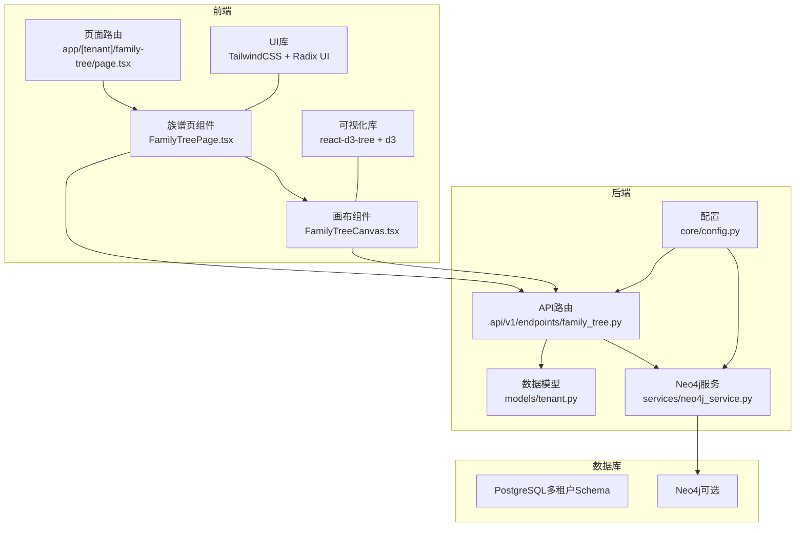
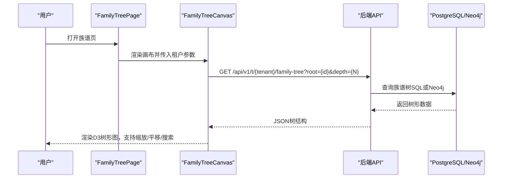
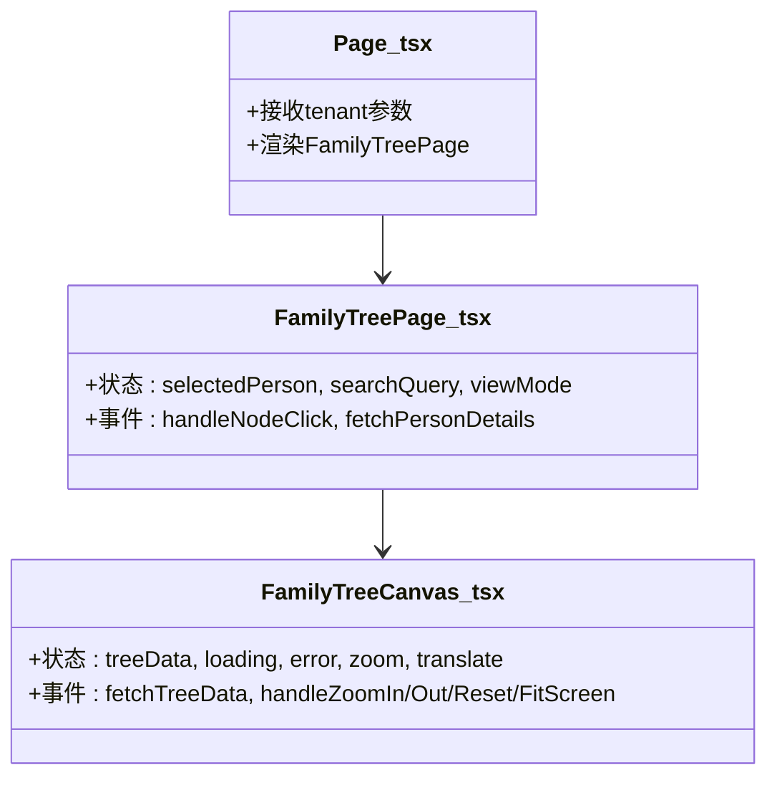
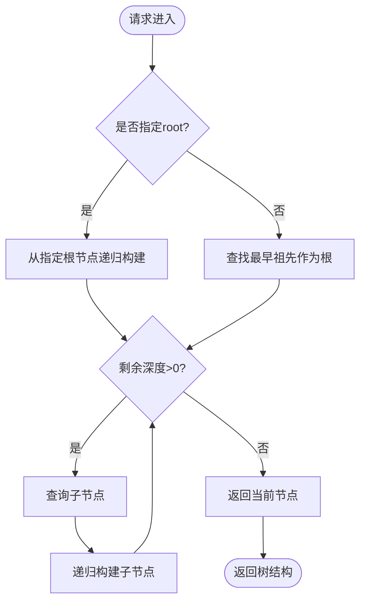
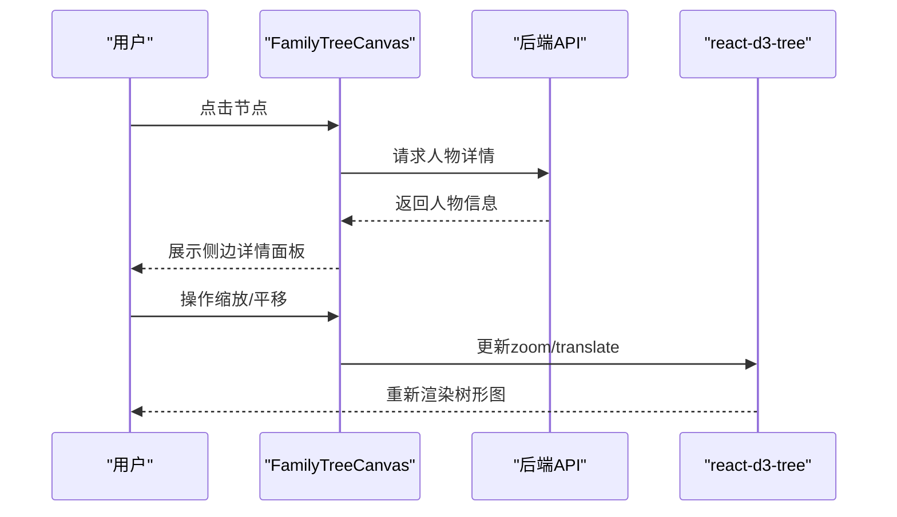
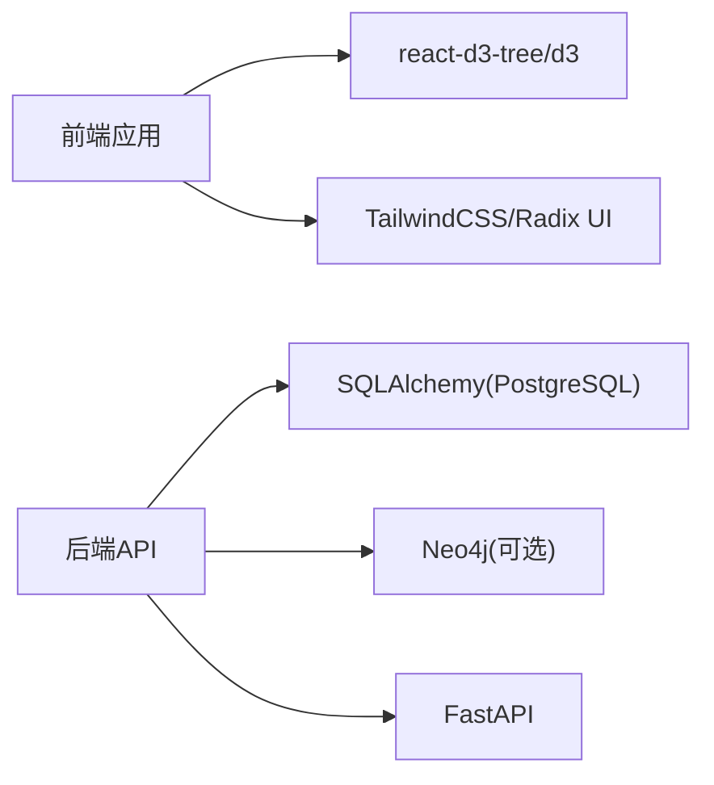

# 族谱树可视化

<cite>
**本文引用的文件**
- [FamilyTreeCanvas.tsx](file://frontend/components/family-tree/FamilyTreeCanvas.tsx)
- [FamilyTreePage.tsx](file://frontend/components/family-tree/FamilyTreePage.tsx)
- [page.tsx](file://frontend/app/[tenant]/family-tree/page.tsx)
- [family_tree.py](file://backend/app/api/v1/endpoints/family_tree.py)
- [neo4j_service.py](file://backend/app/services/neo4j_service.py)
- [tenant.py](file://backend/app/models/tenant.py)
- [package.json](file://frontend/package.json)
- [next.config.js](file://frontend/next.config.js)
- [tailwind.config.ts](file://frontend/tailwind.config.ts)
- [docker-compose.yml](file://docker-compose.yml)
- [docker-compose.prod.yml](file://docker-compose.prod.yml)
- [config.py](file://backend/app/core/config.py)
- [layout.tsx](file://frontend/app/layout.tsx)
- [services.py](file://backend/app/core/services.py)
- [graph_sync.py](file://backend/app/services/graph_sync.py)
- [create_tenant.py](file://scripts/create_tenant.py)
</cite>

## 目录
1. [引言](#引言)
2. [项目结构](#项目结构)
3. [核心组件](#核心组件)
4. [架构总览](#架构总览)
5. [详细组件分析](#详细组件分析)
6. [依赖分析](#依赖分析)
7. [性能考虑](#性能考虑)
8. [故障排查指南](#故障排查指南)
9. [结论](#结论)
10. [附录](#附录)

## 引言
本文件面向多租户族谱管理系统的“族谱树可视化”功能，系统性阐述从Neo4j图数据库获取族谱数据、在前端以D3.js为基础的树形可视化渲染、以及用户交互（缩放、平移、搜索、高亮）与视图切换（树形图、列表视图）的完整实现方案。同时覆盖导出能力（图片/PDF）、前端组件架构、状态管理与性能优化、响应式与移动端适配、以及用户体验与视觉效果最佳实践。

## 项目结构
系统采用前后端分离架构：前端基于Next.js + React + TailwindCSS，使用D3家族库react-d3-tree进行可视化；后端基于FastAPI + SQLAlchemy（PostgreSQL）+ Neo4j（可选）。多租户通过PostgreSQL Schema与Neo4j数据库隔离，确保数据安全与独立。

**图表来源**
- [page.tsx:1-22](file://frontend/app/[tenant]/family-tree/page.tsx#L1-L22)
- [FamilyTreePage.tsx:1-226](file://frontend/components/family-tree/FamilyTreePage.tsx#L1-L226)
- [FamilyTreeCanvas.tsx:1-236](file://frontend/components/family-tree/FamilyTreeCanvas.tsx#L1-L236)
- [family_tree.py:1-274](file://backend/app/api/v1/endpoints/family_tree.py#L1-L274)
- [neo4j_service.py:1-373](file://backend/app/services/neo4j_service.py#L1-L373)
- [tenant.py:1-244](file://backend/app/models/tenant.py#L1-L244)
- [config.py:1-89](file://backend/app/core/config.py#L1-L89)

**章节来源**
- [page.tsx:1-22](file://frontend/app/[tenant]/family-tree/page.tsx#L1-L22)
- [FamilyTreePage.tsx:1-226](file://frontend/components/family-tree/FamilyTreePage.tsx#L1-L226)
- [FamilyTreeCanvas.tsx:1-236](file://frontend/components/family-tree/FamilyTreeCanvas.tsx#L1-L236)
- [family_tree.py:1-274](file://backend/app/api/v1/endpoints/family_tree.py#L1-L274)
- [neo4j_service.py:1-373](file://backend/app/services/neo4j_service.py#L1-L373)
- [tenant.py:1-244](file://backend/app/models/tenant.py#L1-L244)
- [config.py:1-89](file://backend/app/core/config.py#L1-L89)

## 核心组件
- 页面入口与租户参数解析：负责接收租户slug并传递给族谱页组件。
- 族谱页组件：提供头部搜索、视图切换、主内容区与侧边详情面板。
- 族谱画布组件：封装D3树形可视化、缩放/平移控制、图例与骨架屏。
- 后端API：提供族谱树数据接口，支持根节点与深度参数。
- Neo4j服务：提供图查询与结构构建，作为可选加速路径。

**章节来源**
- [page.tsx:1-22](file://frontend/app/[tenant]/family-tree/page.tsx#L1-L22)
- [FamilyTreePage.tsx:1-226](file://frontend/components/family-tree/FamilyTreePage.tsx#L1-L226)
- [FamilyTreeCanvas.tsx:1-236](file://frontend/components/family-tree/FamilyTreeCanvas.tsx#L1-L236)
- [family_tree.py:1-274](file://backend/app/api/v1/endpoints/family_tree.py#L1-L274)
- [neo4j_service.py:1-373](file://backend/app/services/neo4j_service.py#L1-L373)

## 架构总览
族谱树数据流从后端API到前端可视化组件，Neo4j作为可选加速层，PostgreSQL作为主存储。系统通过租户隔离保障数据独立性。

**图表来源**
- [FamilyTreeCanvas.tsx:35-59](file://frontend/components/family-tree/FamilyTreeCanvas.tsx#L35-L59)
- [family_tree.py:43-68](file://backend/app/api/v1/endpoints/family_tree.py#L43-L68)
- [neo4j_service.py:292-344](file://backend/app/services/neo4j_service.py#L292-L344)

**章节来源**
- [FamilyTreeCanvas.tsx:35-59](file://frontend/components/family-tree/FamilyTreeCanvas.tsx#L35-L59)
- [family_tree.py:43-68](file://backend/app/api/v1/endpoints/family_tree.py#L43-L68)
- [neo4j_service.py:292-344](file://backend/app/services/neo4j_service.py#L292-L344)

## 详细组件分析

### 前端组件架构与状态管理
- 组件层次
  - 页面路由：接收租户slug，注入到族谱页组件。
  - 族谱页：管理搜索、视图模式（树形/列表），承载画布与详情面板。
  - 画布：封装D3树形渲染、缩放/平移、图例、骨架屏与错误处理。
- 状态管理
  - 使用React本地状态管理树数据、加载状态、错误状态、缩放与平移参数。
  - 动态导入避免SSR期间的DOM依赖问题。
- 性能优化
  - 动态导入组件，减少首屏体积。
  - 使用骨架屏提升感知性能。
  - 限制树深与分页式加载（建议扩展）。

**图表来源**
- [page.tsx:1-22](file://frontend/app/[tenant]/family-tree/page.tsx#L1-L22)
- [FamilyTreePage.tsx:41-129](file://frontend/components/family-tree/FamilyTreePage.tsx#L41-L129)
- [FamilyTreeCanvas.tsx:27-170](file://frontend/components/family-tree/FamilyTreeCanvas.tsx#L27-L170)

**章节来源**
- [page.tsx:1-22](file://frontend/app/[tenant]/family-tree/page.tsx#L1-L22)
- [FamilyTreePage.tsx:1-226](file://frontend/components/family-tree/FamilyTreePage.tsx#L1-L226)
- [FamilyTreeCanvas.tsx:1-236](file://frontend/components/family-tree/FamilyTreeCanvas.tsx#L1-L236)

### 数据查询与构建（后端）
- 接口定义
  - 支持指定根节点与最大深度，返回树形JSON。
  - 提供祖先链、后代树、统计等辅助接口。
- 数据源
  - 默认使用PostgreSQL（SQL递归构建树）。
  - 可选Neo4j（图查询与结构构建），用于大规模关系查询。
- 结构转换
  - 将数据库记录转换为适合D3的嵌套对象结构。

**图表来源**
- [family_tree.py:71-149](file://backend/app/api/v1/endpoints/family_tree.py#L71-L149)
- [neo4j_service.py:292-344](file://backend/app/services/neo4j_service.py#L292-L344)

**章节来源**
- [family_tree.py:43-150](file://backend/app/api/v1/endpoints/family_tree.py#L43-L150)
- [neo4j_service.py:292-344](file://backend/app/services/neo4j_service.py#L292-L344)

### D3.js可视化与交互实现
- 节点布局与连线
  - 使用react-d3-tree的垂直布局与step连线风格。
  - 自定义节点渲染（头像、性别色带、生卒年份、辈分标签）。
- 缩放与平移
  - 通过组件内部状态维护zoom与translate，提供放大、缩小、适应屏幕、重置。
- 交互
  - 节点点击回调，触发详情面板加载与展示。
  - 图例显示性别与关系类型含义。
- 骨架屏与错误处理
  - 加载时显示骨架屏，错误时提示并允许重试。

**图表来源**
- [FamilyTreeCanvas.tsx:146-167](file://frontend/components/family-tree/FamilyTreeCanvas.tsx#L146-L167)
- [FamilyTreePage.tsx:46-61](file://frontend/components/family-tree/FamilyTreePage.tsx#L46-L61)

**章节来源**
- [FamilyTreeCanvas.tsx:146-167](file://frontend/components/family-tree/FamilyTreeCanvas.tsx#L146-L167)
- [FamilyTreePage.tsx:46-61](file://frontend/components/family-tree/FamilyTreePage.tsx#L46-L61)

### 视图模式与列表视图
- 当前实现：树形图为主，列表视图通过状态切换按钮预留。
- 实现差异
  - 树形图：D3树形布局，适合观察层级与关系。
  - 列表视图：建议以表格或卡片列表展示人物信息，便于排序与筛选。
- 扩展建议：在状态viewMode为"list"时，渲染列表组件并复用人物详情逻辑。

**章节来源**
- [FamilyTreePage.tsx:44-101](file://frontend/components/family-tree/FamilyTreePage.tsx#L44-L101)

### 搜索与高亮
- 搜索
  - 顶部输入框绑定searchQuery，可扩展调用后端模糊搜索接口。
- 高亮
  - 建议在D3渲染中根据匹配结果对节点样式进行高亮（颜色/边框加粗）。
  - 列表视图中可通过高亮关键词或背景色突出显示。

**章节来源**
- [FamilyTreePage.tsx:74-83](file://frontend/components/family-tree/FamilyTreePage.tsx#L74-L83)

### 导出功能（图片/PDF）
- 图片导出
  - 方案一：利用浏览器截图（如html2canvas + jsPDF）。
  - 方案二：在D3渲染完成后导出SVG再转图片。
- PDF导出
  - 建议使用jsPDF或pdfmake，将SVG或截图插入PDF。
- 注意事项
  - 导出前需确保树完全渲染完成，必要时增加等待时机。
  - 处理深色主题与背景色一致性。

[本节为通用实现建议，不直接分析具体文件，故无“章节来源”]

### 响应式设计与移动端适配
- 布局
  - 使用Flex布局，右侧详情面板在小屏时可折叠或改为底部抽屉。
- 字体与间距
  - TailwindCSS提供基础断点，建议针对小屏调整字体大小与内边距。
- 交互
  - 移动端优化缩放手势与触摸点击区域。

**章节来源**
- [tailwind.config.ts:1-36](file://frontend/tailwind.config.ts#L1-L36)
- [layout.tsx:1-25](file://frontend/app/layout.tsx#L1-L25)

## 依赖分析
- 前端依赖
  - Next.js、React、TailwindCSS、Radix UI、Lucide图标、D3家族库react-d3-tree。
- 后端依赖
  - FastAPI、SQLAlchemy、Pydantic、Neo4j驱动、异步数据库连接池。
- 运行时依赖
  - PostgreSQL、Neo4j、Redis（可选缓存）、Nginx（生产部署）。

**图表来源**
- [package.json:12-31](file://frontend/package.json#L12-L31)
- [docker-compose.yml:1-56](file://docker-compose.yml#L1-L56)
- [docker-compose.prod.yml:1-46](file://docker-compose.prod.yml#L1-L46)

**章节来源**
- [package.json:12-31](file://frontend/package.json#L12-L31)
- [docker-compose.yml:1-56](file://docker-compose.yml#L1-L56)
- [docker-compose.prod.yml:1-46](file://docker-compose.prod.yml#L1-L46)

## 性能考虑
- 数据加载
  - 控制树深与节点数量，必要时分页或懒加载子节点。
  - 对热点数据进行缓存（Redis，可选）。
- 渲染优化
  - 使用虚拟滚动（如react-window）处理长列表。
  - 避免不必要的重渲染，合理拆分组件与使用memo。
- 网络与并发
  - 合并请求，去抖搜索输入，限制并发请求数量。
- 可靠性
  - 添加超时与重试机制，降级到简化视图。

[本节提供通用指导，不直接分析具体文件，故无“章节来源”]

## 故障排查指南
- Neo4j不可用
  - 现象：图查询失败或回退到SQL。
  - 处理：检查连接字符串、认证信息与容器健康状态。
- 数据不一致
  - 现象：族谱树与列表数据不一致。
  - 处理：确认同步任务执行成功，必要时重建图。
- 前端报错
  - 现象：D3渲染异常或空白。
  - 处理：检查树数据格式、节点属性完整性与动态导入配置。

**章节来源**
- [services.py:21-39](file://backend/app/core/services.py#L21-L39)
- [graph_sync.py:94-103](file://backend/app/services/graph_sync.py#L94-L103)
- [FamilyTreeCanvas.tsx:79-90](file://frontend/components/family-tree/FamilyTreeCanvas.tsx#L79-L90)

## 结论
本系统以“SQL为主、Neo4j为辅”的双轨数据路径，结合D3.js的树形可视化与React组件化架构，实现了多租户族谱树的高效展示与交互。通过合理的状态管理、性能优化与响应式设计，可在桌面与移动端提供一致的体验。后续可在列表视图、搜索高亮、导出能力等方面进一步完善。

## 附录
- 租户初始化与数据库隔离
  - 创建租户Schema与Neo4j数据库，初始化表结构。
- 开发与生产环境
  - Docker Compose提供PostgreSQL、Neo4j、Redis等服务编排。

**章节来源**
- [create_tenant.py:18-44](file://scripts/create_tenant.py#L18-L44)
- [docker-compose.yml:1-56](file://docker-compose.yml#L1-L56)
- [docker-compose.prod.yml:1-46](file://docker-compose.prod.yml#L1-L46)