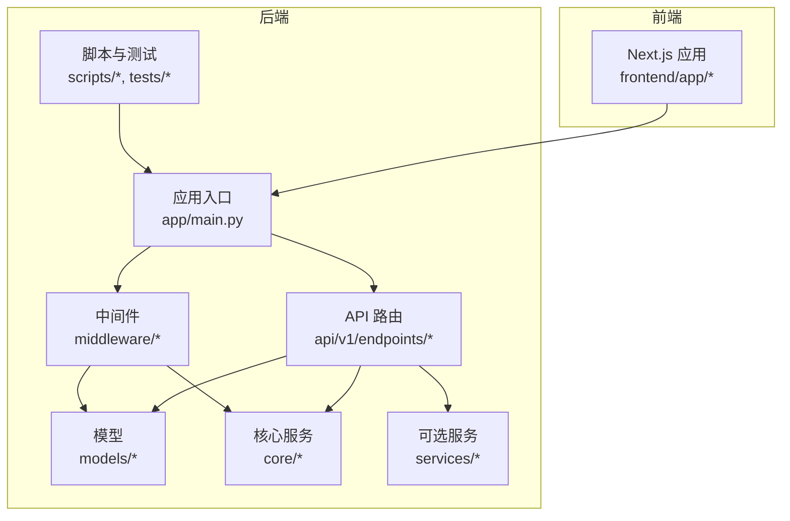
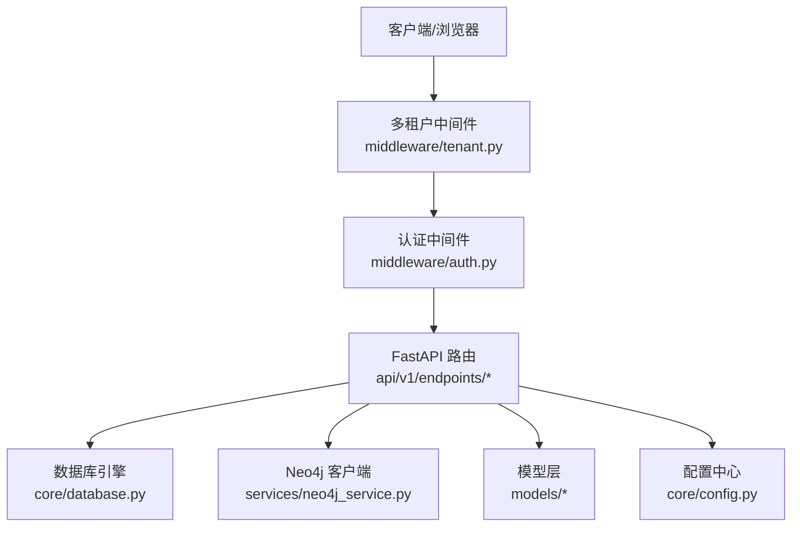
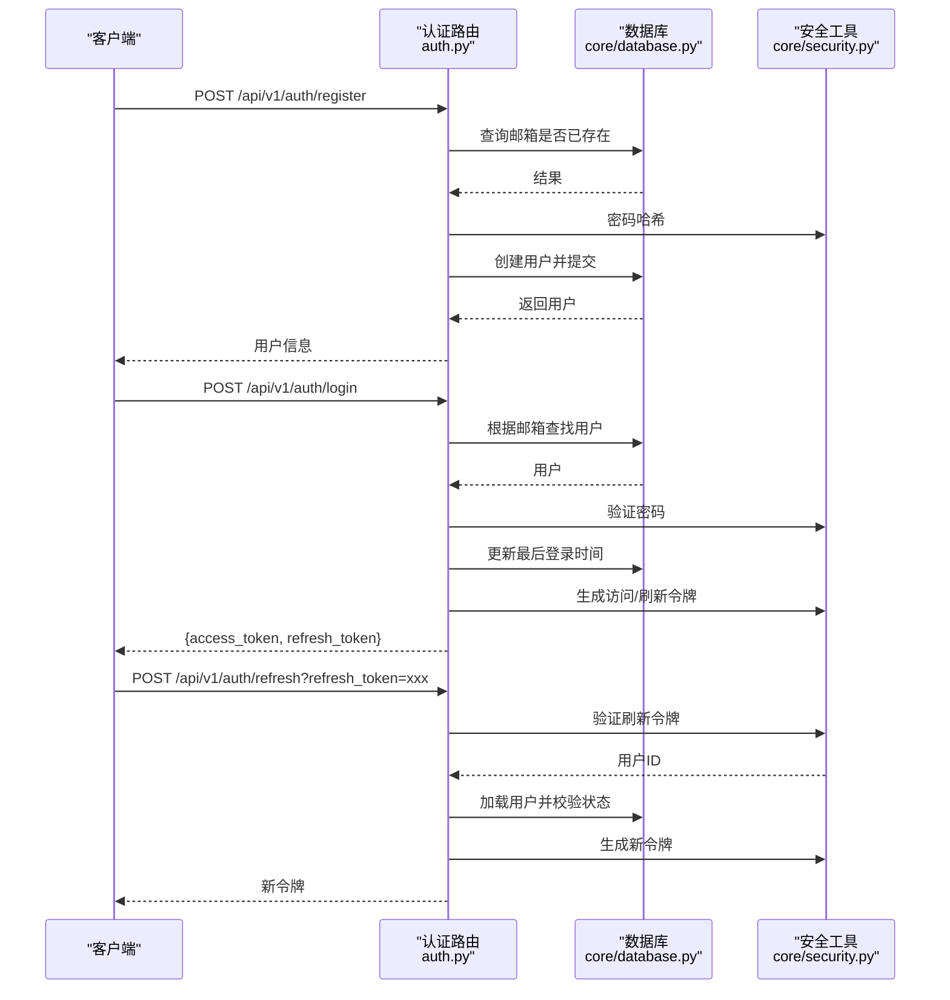
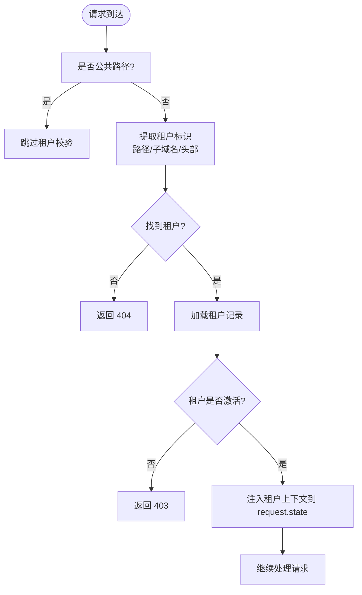
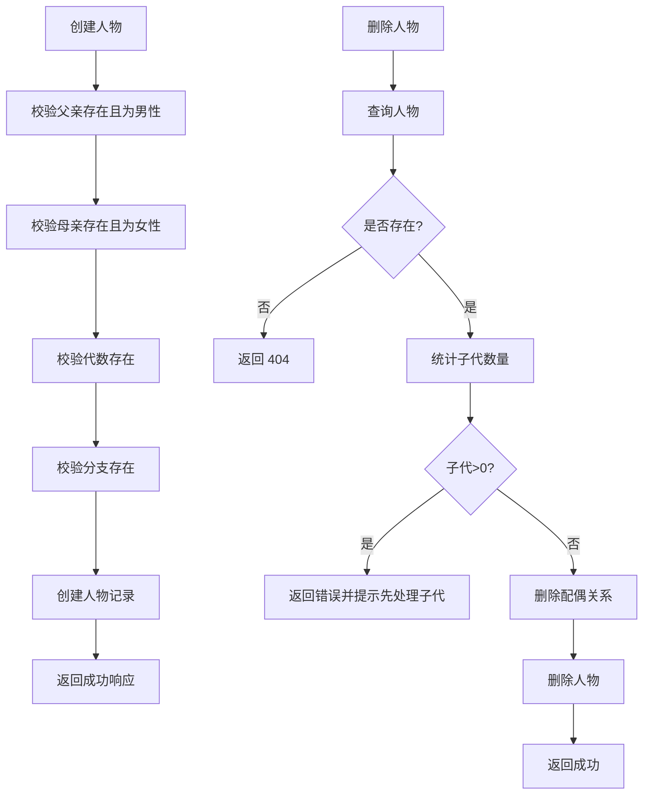
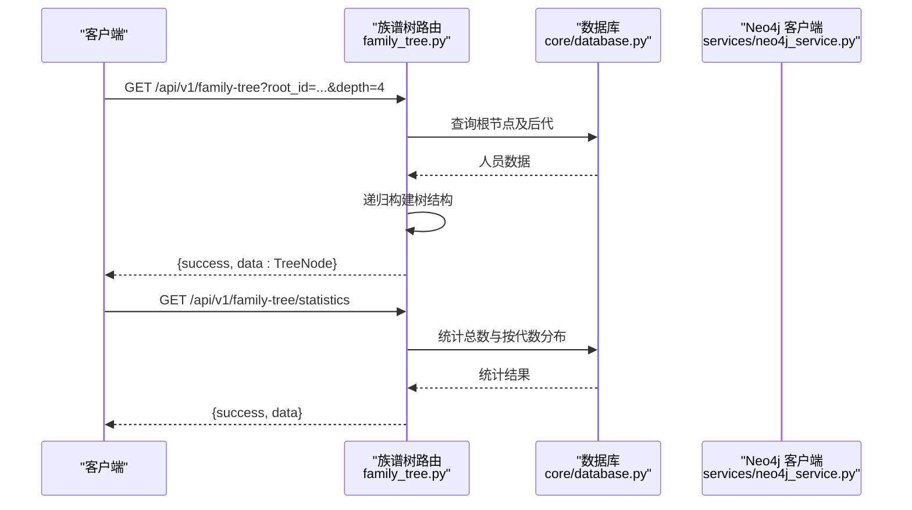
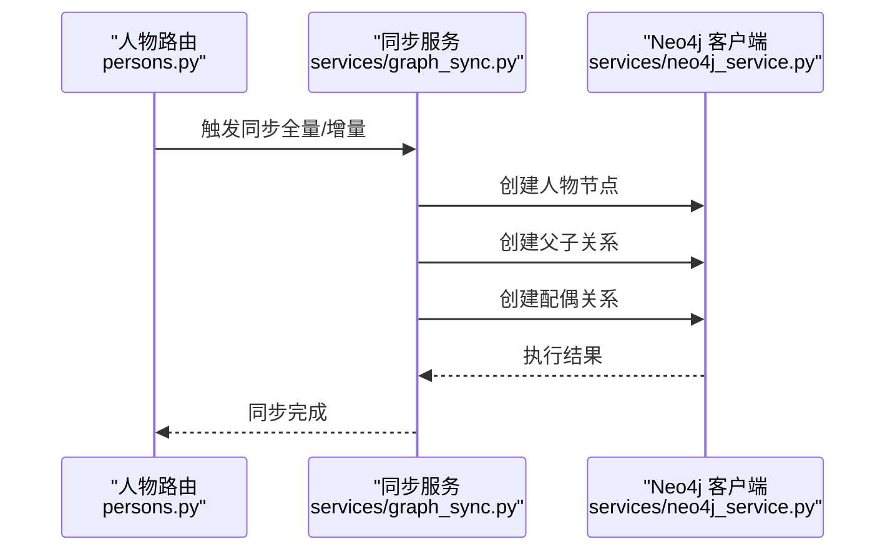
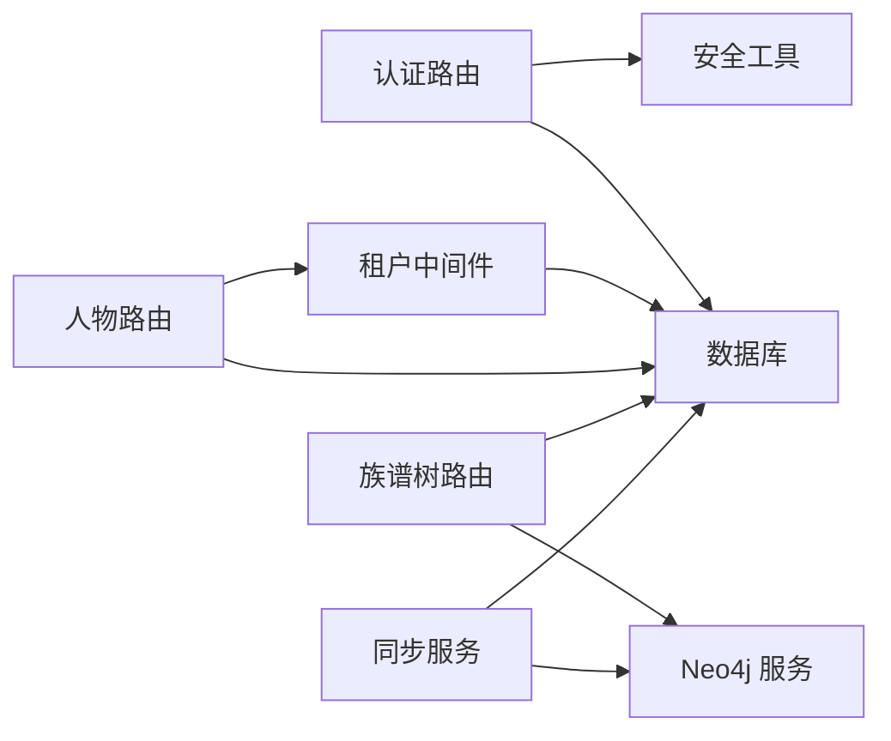
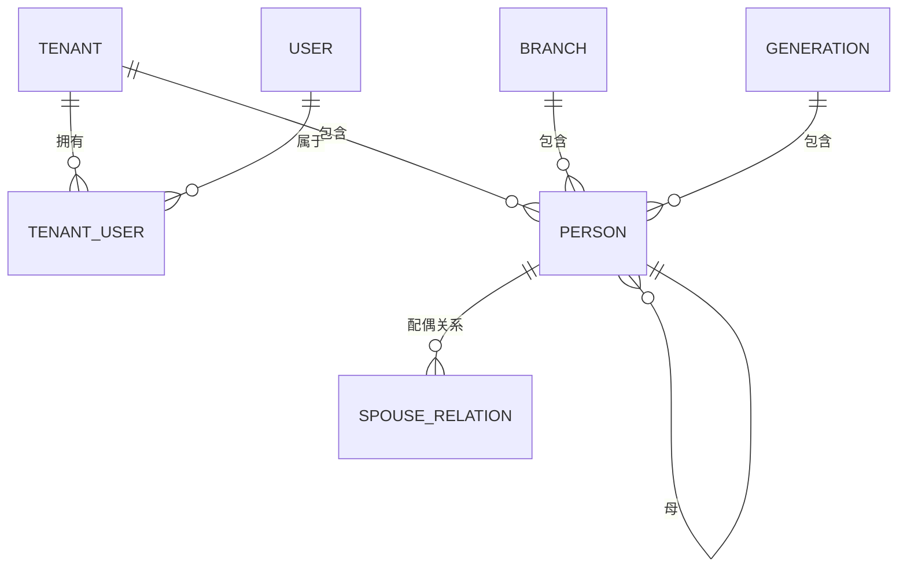

# 核心功能模块

<cite>
**本文引用的文件**
- [backend/app/main.py](file://backend/app/main.py)
- [backend/app/api/v1/endpoints/auth.py](file://backend/app/api/v1/endpoints/auth.py)
- [backend/app/api/v1/endpoints/tenants.py](file://backend/app/api/v1/endpoints/tenants.py)
- [backend/app/api/v1/endpoints/persons.py](file://backend/app/api/v1/endpoints/persons.py)
- [backend/app/api/v1/endpoints/family_tree.py](file://backend/app/api/v1/endpoints/family_tree.py)
- [backend/app/middleware/auth.py](file://backend/app/middleware/auth.py)
- [backend/app/middleware/tenant.py](file://backend/app/middleware/tenant.py)
- [backend/app/models/system.py](file://backend/app/models/system.py)
- [backend/app/models/tenant.py](file://backend/app/models/tenant.py)
- [backend/app/core/security.py](file://backend/app/core/security.py)
- [backend/app/core/database.py](file://backend/app/core/database.py)
- [backend/app/core/config.py](file://backend/app/core/config.py)
- [backend/app/services/neo4j_service.py](file://backend/app/services/neo4j_service.py)
- [backend/app/services/graph_sync.py](file://backend/app/services/graph_sync.py)
- [backend/tests/test_auth.py](file://backend/tests/test_auth.py)
- [frontend/app/layout.tsx](file://frontend/app/layout.tsx)
- [scripts/create_tenant.py](file://scripts/create_tenant.py)
</cite>

## 目录
1. [简介](#简介)
2. [项目结构](#项目结构)
3. [核心组件](#核心组件)
4. [架构总览](#架构总览)
5. [详细组件分析](#详细组件分析)
6. [依赖分析](#依赖分析)
7. [性能考虑](#性能考虑)
8. [故障排查指南](#故障排查指南)
9. [结论](#结论)
10. [附录](#附录)

## 简介
本文件面向多租户族谱管理系统的核心功能模块，系统采用前后端分离架构：后端基于 FastAPI 提供多租户隔离与认证授权、人物与族谱树管理、可选的图数据库（Neo4j）同步；前端基于 Next.js 提供租户维度的页面路由与可视化展示。本文档从系统架构、数据流、业务逻辑、API 接口、权限控制、错误处理到性能优化进行全面阐述，并给出最佳实践与排障建议。

## 项目结构
后端采用分层与按功能域划分的组织方式：
- 应用入口与生命周期：应用启动、中间件注册、健康检查
- API 层：v1 版本的认证、租户、人物、族谱树四个领域接口
- 中间件：认证与多租户上下文注入
- 模型层：系统级（公共）与租户级（私有）模型
- 核心服务：安全（JWT）、数据库（多租户引擎与会话）、配置
- 可选服务：Neo4j 图数据库客户端与同步服务
- 脚本与测试：租户初始化脚本、单元测试

**图表来源**
- [backend/app/main.py:45-88](file://backend/app/main.py#L45-L88)
- [backend/app/api/v1/endpoints/auth.py:22](file://backend/app/api/v1/endpoints/auth.py#L22)
- [backend/app/middleware/tenant.py:15](file://backend/app/middleware/tenant.py#L15)
- [backend/app/models/system.py:23](file://backend/app/models/system.py#L23)
- [backend/app/models/tenant.py:23](file://backend/app/models/tenant.py#L23)
- [backend/app/core/database.py:24](file://backend/app/core/database.py#L24)
- [backend/app/services/neo4j_service.py:12](file://backend/app/services/neo4j_service.py#L12)
- [frontend/app/layout.tsx:12](file://frontend/app/layout.tsx#L12)

**章节来源**
- [backend/app/main.py:45-88](file://backend/app/main.py#L45-L88)
- [backend/app/api/v1/endpoints/auth.py:22](file://backend/app/api/v1/endpoints/auth.py#L22)
- [backend/app/middleware/tenant.py:15](file://backend/app/middleware/tenant.py#L15)
- [backend/app/models/system.py:23](file://backend/app/models/system.py#L23)
- [backend/app/models/tenant.py:23](file://backend/app/models/tenant.py#L23)
- [backend/app/core/database.py:24](file://backend/app/core/database.py#L24)
- [backend/app/services/neo4j_service.py:12](file://backend/app/services/neo4j_service.py#L12)
- [frontend/app/layout.tsx:12](file://frontend/app/layout.tsx#L12)

## 核心组件
- 应用入口与生命周期：负责初始化数据库引擎、连接可选服务（Neo4j/Redis/Meilisearch）、注册中间件与路由、健康检查端点
- 认证系统：用户注册、登录、令牌刷新、当前用户信息查询；基于 JWT 的访问与刷新令牌
- 多租户管理：租户识别（子域名/路径/请求头）、租户上下文注入、租户级数据库会话切换
- 人物管理：人物增删改查、家谱关系（父子、配偶）、分页与过滤、响应体扩展字段
- 族谱树可视化：祖先链、后代树、统计信息、树形结构导出
- 文件管理：图片/视频附件（模型定义），结合存储配置进行上传与访问（在本节不展开具体实现细节）
- 可选图数据库：Neo4j 客户端、节点与关系创建、查询封装、从 PostgreSQL 同步到 Neo4j

**章节来源**
- [backend/app/main.py:17-42](file://backend/app/main.py#L17-L42)
- [backend/app/api/v1/endpoints/auth.py:55-179](file://backend/app/api/v1/endpoints/auth.py#L55-L179)
- [backend/app/api/v1/endpoints/tenants.py:45-164](file://backend/app/api/v1/endpoints/tenants.py#L45-L164)
- [backend/app/api/v1/endpoints/persons.py:172-717](file://backend/app/api/v1/endpoints/persons.py#L172-L717)
- [backend/app/api/v1/endpoints/family_tree.py:43-274](file://backend/app/api/v1/endpoints/family_tree.py#L43-L274)
- [backend/app/models/tenant.py:167-244](file://backend/app/models/tenant.py#L167-L244)
- [backend/app/services/neo4j_service.py:12-373](file://backend/app/services/neo4j_service.py#L12-L373)

## 架构总览
系统通过中间件在请求进入时解析租户上下文，随后 API 路由根据租户上下文选择对应的租户数据库会话。认证中间件负责从请求头提取 JWT 并加载用户信息，用于后续权限校验或审计。可选的 Neo4j 服务用于族谱关系的高性能查询与可视化。

**图表来源**
- [backend/app/middleware/tenant.py:39-84](file://backend/app/middleware/tenant.py#L39-L84)
- [backend/app/middleware/auth.py:15-57](file://backend/app/middleware/auth.py#L15-L57)
- [backend/app/api/v1/endpoints/persons.py:17](file://backend/app/api/v1/endpoints/persons.py#L17)
- [backend/app/core/database.py:124-171](file://backend/app/core/database.py#L124-L171)
- [backend/app/services/neo4j_service.py:52-61](file://backend/app/services/neo4j_service.py#L52-L61)
- [backend/app/models/system.py:23](file://backend/app/models/system.py#L23)
- [backend/app/models/tenant.py:23](file://backend/app/models/tenant.py#L23)
- [backend/app/core/config.py:11-89](file://backend/app/core/config.py#L11-L89)

**章节来源**
- [backend/app/middleware/tenant.py:39-84](file://backend/app/middleware/tenant.py#L39-L84)
- [backend/app/middleware/auth.py:15-57](file://backend/app/middleware/auth.py#L15-L57)
- [backend/app/api/v1/endpoints/persons.py:17](file://backend/app/api/v1/endpoints/persons.py#L17)
- [backend/app/core/database.py:124-171](file://backend/app/core/database.py#L124-L171)
- [backend/app/services/neo4j_service.py:52-61](file://backend/app/services/neo4j_service.py#L52-L61)
- [backend/app/models/system.py:23](file://backend/app/models/system.py#L23)
- [backend/app/models/tenant.py:23](file://backend/app/models/tenant.py#L23)
- [backend/app/core/config.py:11-89](file://backend/app/core/config.py#L11-L89)

## 详细组件分析

### 认证系统
- 功能要点
  - 用户注册：邮箱唯一性校验、密码哈希存储、返回用户基本信息
  - 用户登录：邮箱密码校验、账户启用状态检查、更新最近登录时间、签发访问与刷新令牌
  - 刷新令牌：校验刷新令牌有效性、重新签发新的访问与刷新令牌
  - 当前用户：从 JWT 解析用户标识，加载用户信息
- 数据模型与安全
  - 使用 bcrypt 哈希密码，JWT 使用 HS256 算法，密钥与算法在配置中定义
- 错误处理
  - 邮箱重复、无效凭据、账户禁用、令牌无效、未认证等均返回相应 HTTP 状态码与错误信息
- 权限控制
  - 当前依赖 JWT 标识用户身份，权限检查占位（PermissionChecker），未来可扩展角色与资源级权限

**图表来源**
- [backend/app/api/v1/endpoints/auth.py:55-179](file://backend/app/api/v1/endpoints/auth.py#L55-L179)
- [backend/app/core/security.py:16-103](file://backend/app/core/security.py#L16-L103)
- [backend/app/core/database.py:124-134](file://backend/app/core/database.py#L124-L134)

**章节来源**
- [backend/app/api/v1/endpoints/auth.py:55-179](file://backend/app/api/v1/endpoints/auth.py#L55-L179)
- [backend/app/core/security.py:16-103](file://backend/app/core/security.py#L16-L103)
- [backend/app/core/database.py:124-134](file://backend/app/core/database.py#L124-L134)
- [backend/tests/test_auth.py:12-149](file://backend/tests/test_auth.py#L12-L149)

### 多租户管理
- 租户识别策略
  - 路径前缀 /t/{slug}/...、子域名 {slug}.domain、请求头 X-Tenant-ID
  - 公共路径（如 /api/v1/auth、/api/v1/tenants、/health）无需租户上下文
- 租户上下文注入
  - 将租户对象、租户 schema 名称、Neo4j 数据库名写入 request.state
  - 未识别租户时返回 404，租户非激活返回 403
- 租户创建
  - 通过接口创建租户记录，预留创建 PostgreSQL schema、Neo4j 数据库与迁移步骤
  - CLI 脚本可直接创建 schema 与表结构，便于本地开发与演示

**图表来源**
- [backend/app/middleware/tenant.py:39-84](file://backend/app/middleware/tenant.py#L39-L84)
- [backend/app/middleware/tenant.py:93-126](file://backend/app/middleware/tenant.py#L93-L126)
- [backend/app/api/v1/endpoints/tenants.py:118-164](file://backend/app/api/v1/endpoints/tenants.py#L118-L164)
- [scripts/create_tenant.py:231-283](file://scripts/create_tenant.py#L231-L283)

**章节来源**
- [backend/app/middleware/tenant.py:39-84](file://backend/app/middleware/tenant.py#L39-L84)
- [backend/app/middleware/tenant.py:93-126](file://backend/app/middleware/tenant.py#L93-L126)
- [backend/app/api/v1/endpoints/tenants.py:45-164](file://backend/app/api/v1/endpoints/tenants.py#L45-L164)
- [scripts/create_tenant.py:231-283](file://scripts/create_tenant.py#L231-L283)

### 人物管理
- 主要能力
  - 分页列表：支持按代数、分支、性别、可见性、关键词搜索过滤
  - 单条查询：按 UUID 获取人物详情，包含父名、母名、分支名、代数名等扩展字段
  - 创建/更新/删除：父子与配偶关系校验、删除前检查是否有子代
  - 配偶关系：新增/移除配偶，支持多种关系类型与排序
- 数据模型
  - 人物、分支、代数、配偶关系、人物图片/视频、变更日志等
- 响应设计
  - 统一 success/data/meta 结构，列表接口包含分页元信息

**图表来源**
- [backend/app/api/v1/endpoints/persons.py:323-493](file://backend/app/api/v1/endpoints/persons.py#L323-L493)
- [backend/app/models/tenant.py:61-164](file://backend/app/models/tenant.py#L61-L164)

**章节来源**
- [backend/app/api/v1/endpoints/persons.py:172-717](file://backend/app/api/v1/endpoints/persons.py#L172-L717)
- [backend/app/models/tenant.py:61-164](file://backend/app/models/tenant.py#L61-L164)

### 族谱树可视化
- 树构建
  - 支持从指定根节点或首个祖先开始构建，按深度递归收集后代
  - 支持祖先链查询与后代树查询
- 统计信息
  - 总人数、按代数分布、最大代数
- 可视化输出
  - 返回树形结构，前端可直接用于可视化渲染

**图表来源**
- [backend/app/api/v1/endpoints/family_tree.py:43-274](file://backend/app/api/v1/endpoints/family_tree.py#L43-L274)
- [backend/app/core/database.py:136-171](file://backend/app/core/database.py#L136-L171)
- [backend/app/services/neo4j_service.py:146-373](file://backend/app/services/neo4j_service.py#L146-L373)

**章节来源**
- [backend/app/api/v1/endpoints/family_tree.py:43-274](file://backend/app/api/v1/endpoints/family_tree.py#L43-L274)
- [backend/app/core/database.py:136-171](file://backend/app/core/database.py#L136-L171)
- [backend/app/services/neo4j_service.py:146-373](file://backend/app/services/neo4j_service.py#L146-L373)

### 文件管理（附件模型）
- 模型定义
  - 人物图片、人物视频、变更日志等，支持标题、描述、排序、创建时间等字段
- 存储集成
  - 配置项包含存储端点、访问密钥、桶名、区域等，用于对接 MinIO/S3
- 使用场景
  - 人物档案配图、生平视频、操作审计追踪

**章节来源**
- [backend/app/models/tenant.py:167-244](file://backend/app/models/tenant.py#L167-L244)
- [backend/app/core/config.py:62-68](file://backend/app/core/config.py#L62-L68)

### 图数据库同步（Neo4j）
- 能力概览
  - 节点创建：人物节点属性（含代数、性别、别名等）
  - 关系创建：父子双向关系、配偶关系（含类型与顺序）
  - 查询封装：祖先链、后代、兄弟姐妹、按代检索、名称模糊搜索、树结构导出、统计
  - 同步服务：从 PostgreSQL 全量同步至 Neo4j，支持重建与单人快速同步
- 集成模式
  - 在创建/更新人物与关系时，可触发同步，或定期批量同步

**图表来源**
- [backend/app/api/v1/endpoints/persons.py:323-493](file://backend/app/api/v1/endpoints/persons.py#L323-L493)
- [backend/app/services/graph_sync.py:20-104](file://backend/app/services/graph_sync.py#L20-L104)
- [backend/app/services/neo4j_service.py:65-144](file://backend/app/services/neo4j_service.py#L65-L144)

**章节来源**
- [backend/app/services/graph_sync.py:20-104](file://backend/app/services/graph_sync.py#L20-L104)
- [backend/app/services/neo4j_service.py:65-144](file://backend/app/services/neo4j_service.py#L65-L144)

## 依赖分析
- 组件耦合
  - API 路由依赖中间件（认证/多租户）、数据库会话、安全工具
  - 租户上下文贯穿所有租户相关路由
  - Neo4j 服务与同步服务为可选依赖，不影响核心数据读写
- 外部依赖
  - 数据库：PostgreSQL/SQLite（租户级 schema 或独立文件）
  - 可选：Neo4j、Redis、Meilisearch
- 循环依赖
  - 未发现直接循环导入；模型与服务通过模块边界解耦

**图表来源**
- [backend/app/api/v1/endpoints/auth.py:55-179](file://backend/app/api/v1/endpoints/auth.py#L55-L179)
- [backend/app/core/security.py:16-103](file://backend/app/core/security.py#L16-L103)
- [backend/app/core/database.py:124-171](file://backend/app/core/database.py#L124-L171)
- [backend/app/middleware/tenant.py:39-84](file://backend/app/middleware/tenant.py#L39-L84)
- [backend/app/api/v1/endpoints/persons.py:172-717](file://backend/app/api/v1/endpoints/persons.py#L172-L717)
- [backend/app/api/v1/endpoints/family_tree.py:43-274](file://backend/app/api/v1/endpoints/family_tree.py#L43-L274)
- [backend/app/services/neo4j_service.py:12-373](file://backend/app/services/neo4j_service.py#L12-L373)
- [backend/app/services/graph_sync.py:20-104](file://backend/app/services/graph_sync.py#L20-L104)

**章节来源**
- [backend/app/api/v1/endpoints/auth.py:55-179](file://backend/app/api/v1/endpoints/auth.py#L55-L179)
- [backend/app/core/security.py:16-103](file://backend/app/core/security.py#L16-L103)
- [backend/app/core/database.py:124-171](file://backend/app/core/database.py#L124-L171)
- [backend/app/middleware/tenant.py:39-84](file://backend/app/middleware/tenant.py#L39-L84)
- [backend/app/api/v1/endpoints/persons.py:172-717](file://backend/app/api/v1/endpoints/persons.py#L172-L717)
- [backend/app/api/v1/endpoints/family_tree.py:43-274](file://backend/app/api/v1/endpoints/family_tree.py#L43-L274)
- [backend/app/services/neo4j_service.py:12-373](file://backend/app/services/neo4j_service.py#L12-L373)
- [backend/app/services/graph_sync.py:20-104](file://backend/app/services/graph_sync.py#L20-L104)

## 性能考虑
- 数据库连接池
  - 默认引擎针对 SQLite 不启用池，其他数据库按配置参数设置池大小与溢出
- 查询优化
  - 列表接口使用分页与计数查询，避免一次性加载全部数据
  - 过滤条件尽量命中索引（如邮箱、分支 UUID、代数编号）
- 缓存与搜索引擎
  - 可选 Redis 与 Meilisearch，可用于热点数据缓存与全文检索
- 图数据库
  - Neo4j 适合复杂关系查询，建议在创建/更新人物与关系时触发增量同步，减少全量同步频率

[本节为通用指导，不直接分析具体文件]

## 故障排查指南
- 认证相关
  - 注册邮箱重复：检查邮箱唯一约束与错误响应
  - 登录失败：确认密码哈希与用户状态
  - 刷新令牌无效：确认令牌类型与有效期
- 多租户相关
  - 租户不存在：检查路径/子域名/头部是否正确传递
  - 租户未激活：检查租户状态
- 人物相关
  - 删除失败：检查是否存在子代未清理
  - 关系冲突：检查父子性别与关系唯一性
- 图数据库
  - 连接失败：确认 Neo4j 地址、账号与数据库存在
  - 同步异常：检查同步服务日志与节点/关系创建语句

**章节来源**
- [backend/tests/test_auth.py:12-149](file://backend/tests/test_auth.py#L12-L149)
- [backend/app/middleware/tenant.py:52-82](file://backend/app/middleware/tenant.py#L52-L82)
- [backend/app/api/v1/endpoints/persons.py:444-493](file://backend/app/api/v1/endpoints/persons.py#L444-L493)
- [backend/app/services/neo4j_service.py:21-49](file://backend/app/services/neo4j_service.py#L21-L49)

## 结论
本系统以多租户为核心，围绕认证、人物与族谱树两大业务域构建，辅以可选的图数据库与文件附件模型，形成完整的族谱管理能力。通过中间件注入租户上下文与 JWT 认证，确保了数据隔离与访问控制。建议在生产环境中完善权限体系、引入缓存与搜索、优化同步策略，并持续监控服务可用性与性能指标。

[本节为总结性内容，不直接分析具体文件]

## 附录

### API 接口一览（按模块）

- 认证模块
  - POST /api/v1/auth/register：注册用户
  - POST /api/v1/auth/login：用户登录
  - POST /api/v1/auth/refresh：刷新令牌
  - GET /api/v1/auth/me：获取当前用户信息

- 租户模块
  - GET /api/v1/tenants：列出公开租户（分页、可按姓氏筛选）
  - GET /api/v1/tenants/{slug}：按 slug 获取租户
  - POST /api/v1/tenants：创建租户（预留超级用户权限）

- 人物模块
  - GET /api/v1/persons：人物列表（支持代数、分支、性别、可见性、关键词、分页）
  - GET /api/v1/persons/generations：按代统计
  - GET /api/v1/persons/branches：按分支统计
  - GET /api/v1/persons/{person_id}：获取人物详情
  - POST /api/v1/persons：创建人物
  - PUT /api/v1/persons/{person_id}：更新人物
  - DELETE /api/v1/persons/{person_id}：删除人物
  - GET /api/v1/persons/{person_id}/spouses：获取配偶列表
  - POST /api/v1/persons/{person_id}/spouses：添加配偶关系
  - DELETE /api/v1/persons/{person_id}/spouses/{spouse_id}：移除配偶关系

- 族谱树模块
  - GET /api/v1/family-tree：获取族谱树（可指定根节点与深度）
  - GET /api/v1/family-tree/ancestors/{person_id}：祖先链
  - GET /api/v1/family-tree/descendants/{person_id}：后代树
  - GET /api/v1/family-tree/statistics：统计信息

**章节来源**
- [backend/app/api/v1/endpoints/auth.py:55-179](file://backend/app/api/v1/endpoints/auth.py#L55-L179)
- [backend/app/api/v1/endpoints/tenants.py:45-164](file://backend/app/api/v1/endpoints/tenants.py#L45-L164)
- [backend/app/api/v1/endpoints/persons.py:172-717](file://backend/app/api/v1/endpoints/persons.py#L172-L717)
- [backend/app/api/v1/endpoints/family_tree.py:43-274](file://backend/app/api/v1/endpoints/family_tree.py#L43-L274)

### 数据模型关系（ER）

**图表来源**
- [backend/app/models/system.py:23-223](file://backend/app/models/system.py#L23-L223)
- [backend/app/models/tenant.py:23-244](file://backend/app/models/tenant.py#L23-L244)