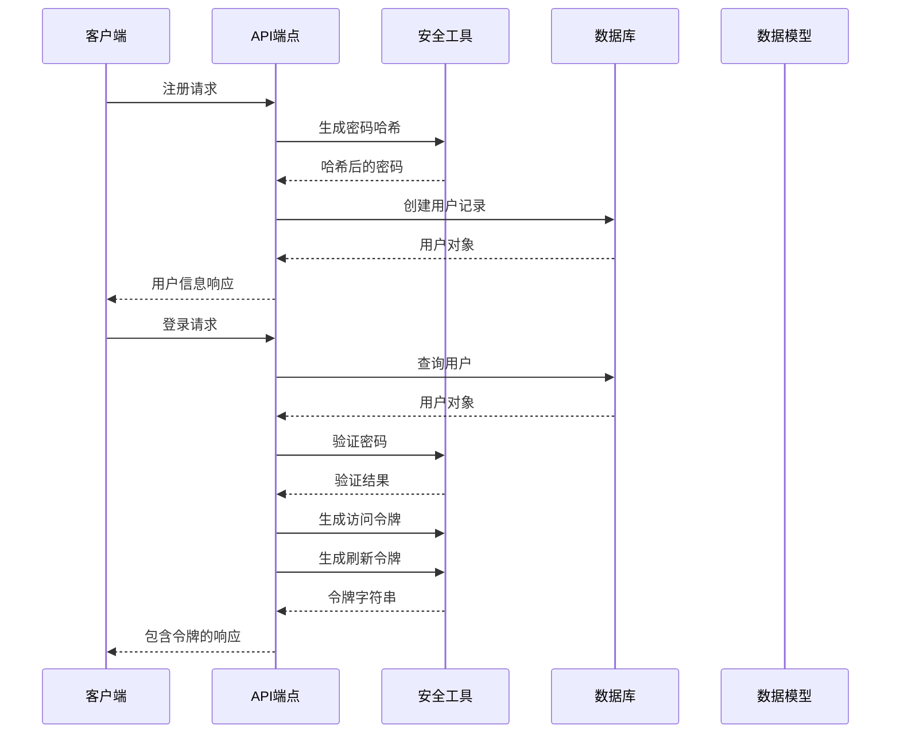
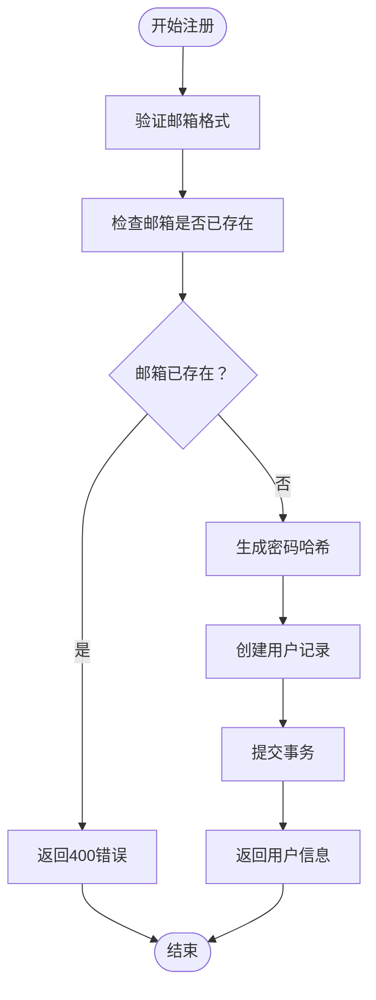
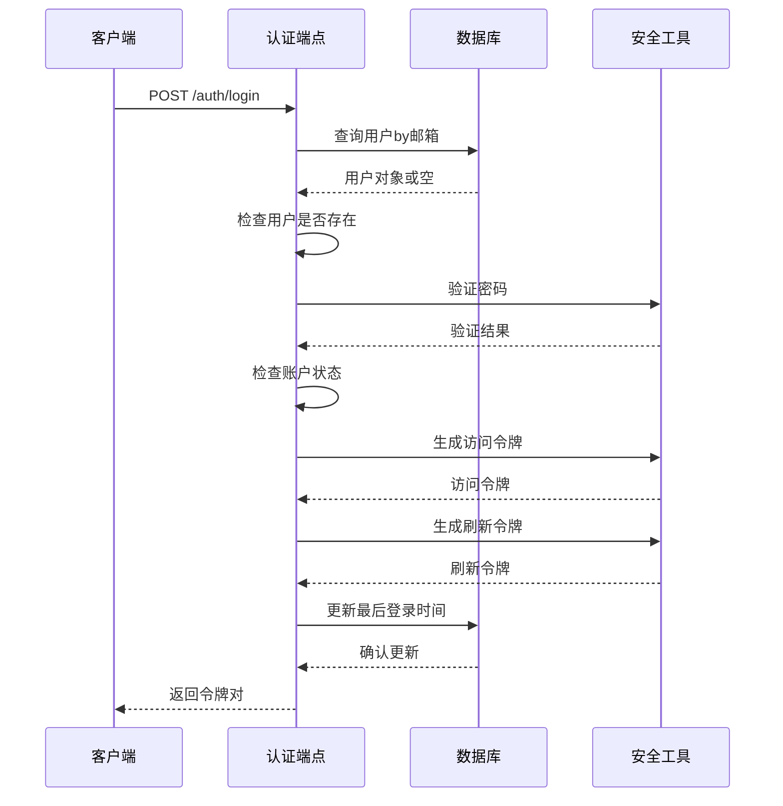
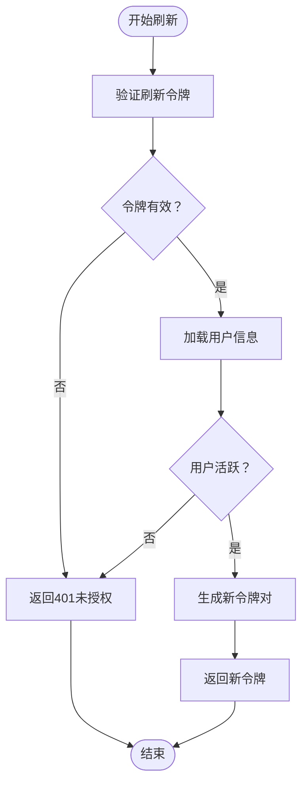
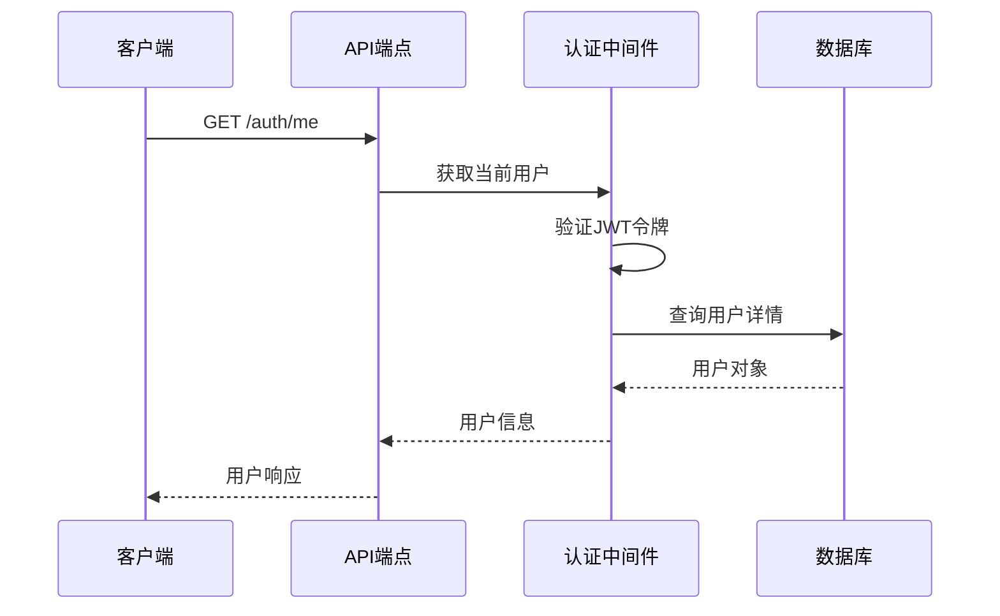
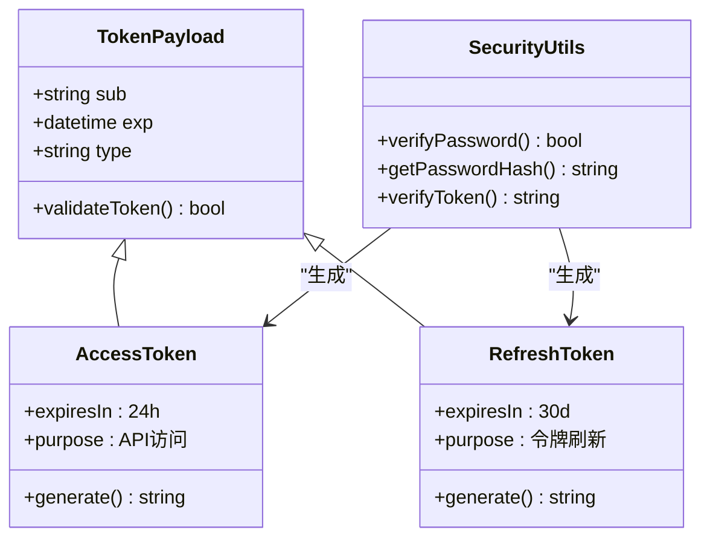
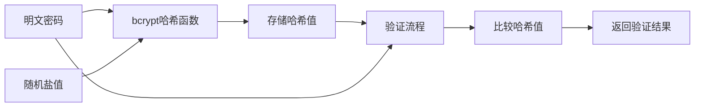
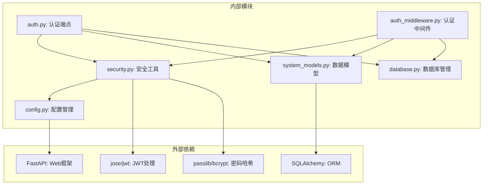
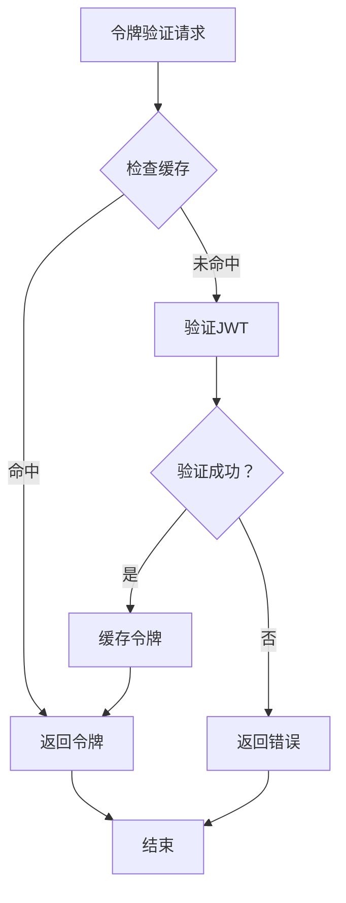

# 用户认证系统

<cite>
**本文档引用的文件**
- [auth.py](file://backend/app/api/v1/endpoints/auth.py)
- [auth_middleware.py](file://backend/app/middleware/auth.py)
- [security.py](file://backend/app/core/security.py)
- [system_models.py](file://backend/app/models/system.py)
- [config.py](file://backend/app/core/config.py)
- [database.py](file://backend/app/core/database.py)
- [tenant_middleware.py](file://backend/app/middleware/tenant.py)
- [main.py](file://backend/app/main.py)
- [auth_tests.py](file://backend/tests/test_auth.py)
</cite>

## 目录
1. [简介](#简介)
2. [项目结构](#项目结构)
3. [核心组件](#核心组件)
4. [架构概览](#架构概览)
5. [详细组件分析](#详细组件分析)
6. [依赖关系分析](#依赖关系分析)
7. [性能考虑](#性能考虑)
8. [故障排除指南](#故障排除指南)
9. [结论](#结论)

## 简介

多租户族谱管理系统采用基于JWT（JSON Web Token）的认证机制，为用户提供安全的注册、登录、令牌刷新和用户信息获取功能。该系统支持多租户架构，每个家族（租户）拥有独立的数据隔离和权限控制。

系统的核心认证功能包括：
- 用户注册：邮箱唯一性验证和密码安全哈希
- 用户登录：凭据验证和令牌发放
- 令牌刷新：安全的访问令牌续期机制
- 用户信息获取：当前登录用户信息查询
- 权限验证：基于角色的访问控制

## 项目结构

后端认证系统主要分布在以下模块中：

```mermaid
graph TB
subgraph "认证相关模块"
A[API端点层<br/>/api/v1/endpoints/auth.py]
B[中间件层<br/>/middleware/auth.py]
C[安全工具层<br/>/core/security.py]
D[配置层<br/>/core/config.py]
end
subgraph "数据模型层"
E[系统模型<br/>/models/system.py]
F[数据库管理<br/>/core/database.py]
end
subgraph "应用入口"
G[主应用<br/>/main.py]
H[租户中间件<br/>/middleware/tenant.py]
end
A --> C
A --> E
A --> F
B --> C
B --> E
B --> F
C --> D
G --> A
G --> B
G --> H
```



**图表来源**
- [auth.py:1-179](file://backend/app/api/v1/endpoints/auth.py#L1-L179)
- [auth_middleware.py:1-88](file://backend/app/middleware/auth.py#L1-L88)
- [security.py:1-103](file://backend/app/core/security.py#L1-L103)
- [config.py:1-89](file://backend/app/core/config.py#L1-L89)

**章节来源**
- [auth.py:1-179](file://backend/app/api/v1/endpoints/auth.py#L1-L179)
- [auth_middleware.py:1-88](file://backend/app/middleware/auth.py#L1-L88)
- [security.py:1-103](file://backend/app/core/security.py#L1-L103)
- [config.py:1-89](file://backend/app/core/config.py#L1-L89)

## 核心组件

### 认证端点层

认证端点层负责处理所有用户认证相关的HTTP请求，包括注册、登录、令牌刷新和用户信息查询。

主要端点包括：
- `POST /api/v1/auth/register` - 用户注册
- `POST /api/v1/auth/login` - 用户登录
- `POST /api/v1/auth/refresh` - 刷新访问令牌
- `GET /api/v1/auth/me` - 获取当前用户信息

### 认证中间件层

认证中间件层提供请求级别的身份验证和授权功能：

- `get_current_user` - 从JWT令牌提取用户信息
- `get_current_user_required` - 强制要求认证的依赖注入
- `get_superuser` - 超级用户权限检查
- `PermissionChecker` - 可扩展的权限检查器

### 安全工具层

安全工具层包含JWT令牌生成、验证和密码哈希的核心功能：

- 密码哈希：使用bcrypt算法的安全密码存储
- JWT令牌：访问令牌和刷新令牌的生成与验证
- 令牌类型区分：通过"type"声明区分访问和刷新令牌

**章节来源**
- [auth.py:55-179](file://backend/app/api/v1/endpoints/auth.py#L55-L179)
- [auth_middleware.py:15-88](file://backend/app/middleware/auth.py#L15-L88)
- [security.py:16-103](file://backend/app/core/security.py#L16-L103)

## 架构概览

系统采用分层架构设计，确保认证逻辑的清晰分离和可维护性：



**图表来源**
- [auth.py:55-124](file://backend/app/api/v1/endpoints/auth.py#L55-L124)
- [security.py:26-77](file://backend/app/core/security.py#L26-L77)

系统架构的关键特点：
- **分层设计**：明确的职责分离，便于测试和维护
- **多租户支持**：租户中间件确保数据隔离
- **安全优先**：密码哈希和JWT令牌机制
- **可扩展性**：中间件模式支持灵活的权限控制

## 详细组件分析

### 用户注册流程

用户注册是认证系统的第一步，负责创建新用户账户：



**图表来源**
- [auth.py:55-87](file://backend/app/api/v1/endpoints/auth.py#L55-L87)
- [security.py:21-23](file://backend/app/core/security.py#L21-L23)

注册流程的关键安全措施：
- 邮箱唯一性约束防止重复账户
- 密码哈希存储保护用户凭据
- 数据库事务确保操作原子性

**章节来源**
- [auth.py:55-87](file://backend/app/api/v1/endpoints/auth.py#L55-L87)
- [auth_tests.py:12-29](file://backend/tests/test_auth.py#L12-L29)

### 用户登录流程

用户登录验证凭据并发放JWT令牌：



**图表来源**
- [auth.py:89-124](file://backend/app/api/v1/endpoints/auth.py#L89-L124)
- [security.py:26-77](file://backend/app/core/security.py#L26-L77)

登录流程的安全特性：
- 凭据验证失败时使用统一错误消息
- 账户禁用状态检查
- 最终登录时间自动更新
- 访问令牌和刷新令牌的差异化处理

**章节来源**
- [auth.py:89-124](file://backend/app/api/v1/endpoints/auth.py#L89-L124)
- [auth_tests.py:55-81](file://backend/tests/test_auth.py#L55-L81)

### 令牌刷新机制

令牌刷新提供安全的访问令牌续期功能：



**图表来源**
- [auth.py:126-158](file://backend/app/api/v1/endpoints/auth.py#L126-L158)
- [auth_middleware.py:32](file://backend/app/middleware/auth.py#L32)

刷新机制的设计优势：
- 刷新令牌有效期长，支持长期会话
- 访问令牌短有效期，降低泄露风险
- 统一的令牌类型验证
- 用户状态实时检查

**章节来源**
- [auth.py:126-158](file://backend/app/api/v1/endpoints/auth.py#L126-L158)
- [auth_tests.py:108-138](file://backend/tests/test_auth.py#L108-L138)

### 用户信息获取

当前用户信息查询提供用户资料读取功能：



**图表来源**
- [auth.py:161-179](file://backend/app/api/v1/endpoints/auth.py#L161-L179)
- [auth_middleware.py:15-57](file://backend/app/middleware/auth.py#L15-L57)

信息获取的安全考虑：
- 使用认证中间件确保用户已登录
- 仅返回必要的用户信息字段
- 支持可选认证模式用于公共端点

**章节来源**
- [auth.py:161-179](file://backend/app/api/v1/endpoints/auth.py#L161-L179)
- [auth_middleware.py:15-57](file://backend/app/middleware/auth.py#L15-L57)

### JWT令牌机制详解

系统采用双令牌策略，区分访问令牌和刷新令牌：

#### 访问令牌（Access Token）
- **有效期**：24小时（可通过配置调整）
- **用途**：API请求的身份验证
- **安全性**：短期有效，降低泄露影响

#### 刷新令牌（Refresh Token）
- **有效期**：30天
- **用途**：获取新的访问令牌
- **安全性**：长期有效但需要额外安全措施



**图表来源**
- [security.py:26-103](file://backend/app/core/security.py#L26-L103)
- [config.py:53-58](file://backend/app/core/config.py#L53-L58)

**章节来源**
- [security.py:26-103](file://backend/app/core/security.py#L26-L103)
- [config.py:53-58](file://backend/app/core/config.py#L53-L58)

### 密码哈希与安全

系统使用bcrypt算法进行密码安全存储：

#### 密码哈希流程


**图表来源**
- [security.py:16-23](file://backend/app/core/security.py#L16-L23)

安全特性：
- 自动盐值生成，防止彩虹表攻击
- 渐进式计算成本，适应硬件升级
- 单向哈希，无法还原原始密码

**章节来源**
- [security.py:16-23](file://backend/app/core/security.py#L16-L23)
- [auth_tests.py:141-149](file://backend/tests/test_auth.py#L141-L149)

## 依赖关系分析

认证系统的依赖关系体现了清晰的分层架构：



**图表来源**
- [auth.py:13-19](file://backend/app/api/v1/endpoints/auth.py#L13-L19)
- [auth_middleware.py:10-12](file://backend/app/middleware/auth.py#L10-L12)
- [security.py:7-8](file://backend/app/core/security.py#L7-L8)

**章节来源**
- [auth.py:13-19](file://backend/app/api/v1/endpoints/auth.py#L13-L19)
- [auth_middleware.py:10-12](file://backend/app/middleware/auth.py#L10-L12)
- [security.py:7-8](file://backend/app/core/security.py#L7-L8)

## 性能考虑

### 令牌缓存策略

系统可以通过Redis实现令牌缓存以提升性能：



### 数据库优化

- **连接池管理**：配置适当的连接池大小
- **索引优化**：为邮箱字段建立唯一索引
- **查询优化**：使用异步查询避免阻塞

### 缓存策略

- **用户信息缓存**：短期缓存用户基本信息
- **权限缓存**：缓存用户权限以减少数据库查询
- **令牌黑名单**：实现刷新令牌的即时失效

## 故障排除指南

### 常见认证问题

#### 注册失败
**症状**：返回400错误，提示邮箱已注册
**解决方案**：
1. 检查邮箱格式是否正确
2. 确认用户不存在于数据库
3. 验证数据库连接状态

#### 登录失败
**症状**：返回401未授权错误
**可能原因**：
- 错误的邮箱或密码
- 账户被禁用
- 令牌过期

**排查步骤**：
1. 验证用户凭据
2. 检查用户激活状态
3. 确认JWT密钥配置正确

#### 令牌验证失败
**症状**：API调用返回401错误
**解决方案**：
1. 检查Authorization头格式
2. 验证令牌签名完整性
3. 确认令牌类型匹配

**章节来源**
- [auth.py:64-110](file://backend/app/api/v1/endpoints/auth.py#L64-L110)
- [auth_middleware.py:20-34](file://backend/app/middleware/auth.py#L20-L34)

### 调试技巧

#### 启用调试模式
```python
# 在配置中设置
DEBUG: bool = True
```

#### 日志记录
- 记录认证事件和异常
- 监控令牌使用情况
- 追踪用户行为轨迹

#### 性能监控
- 监控数据库查询时间
- 跟踪API响应延迟
- 分析内存使用情况

## 结论

多租户族谱管理系统的用户认证系统采用了现代Web应用的最佳实践，提供了完整且安全的认证解决方案。系统的主要优势包括：

**安全性方面**：
- 基于JWT的无状态认证
- bcrypt密码哈希保护
- 多层权限控制
- 数据库层面的租户隔离

**可用性方面**：
- 清晰的API设计和错误处理
- 支持多种认证方式
- 灵活的权限模型
- 完善的测试覆盖

**可扩展性方面**：
- 模块化架构设计
- 中间件模式支持扩展
- 配置驱动的安全策略
- 多租户架构支持

建议的后续改进方向：
1. 实现令牌黑名单机制
2. 添加多因素认证支持
3. 增强日志审计功能
4. 优化性能监控指标
5. 实现密码强度验证

该认证系统为多租户族谱管理平台提供了坚实的安全基础，能够满足现代Web应用对安全性和可用性的双重需求。