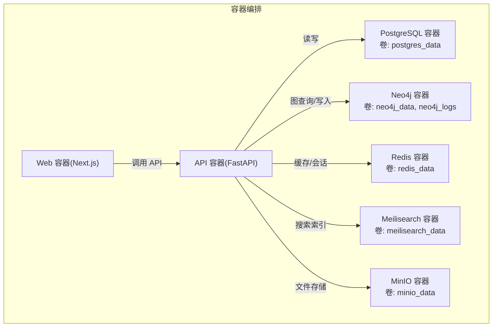
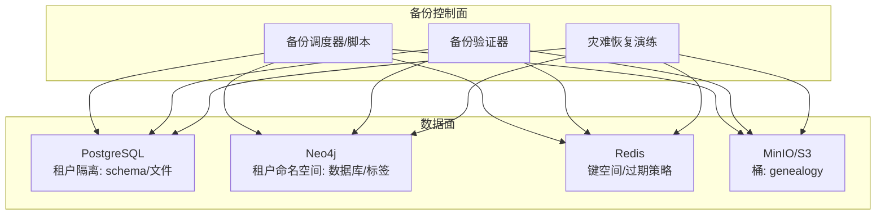
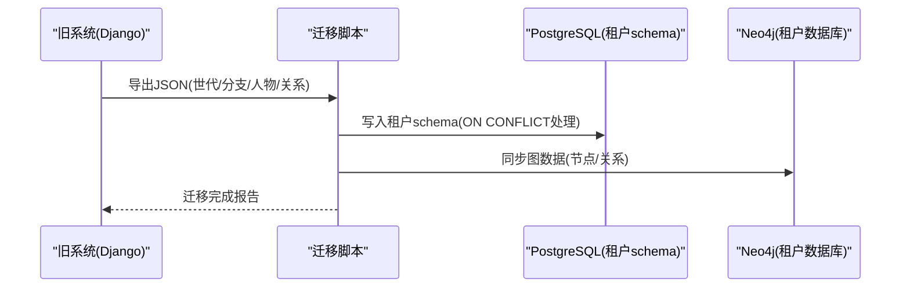
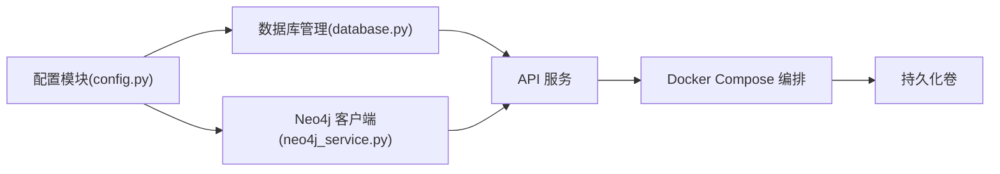

# 备份与恢复

<cite>
**本文引用的文件**
- [backend/app/core/config.py](file://backend/app/core/config.py)
- [backend/app/core/database.py](file://backend/app/core/database.py)
- [backend/app/services/neo4j_service.py](file://backend/app/services/neo4j_service.py)
- [docker-compose.yml](file://docker-compose.yml)
- [docker-compose.prod.yml](file://docker-compose.prod.yml)
- [docker/postgres/init.sql](file://docker/postgres/init.sql)
- [backend/alembic.ini](file://backend/alembic.ini)
- [backend/pyproject.toml](file://backend/pyproject.toml)
- [scripts/sync_neo4j.py](file://scripts/sync_neo4j.py)
- [scripts/migrate_data.py](file://scripts/migrate_data.py)
- [deploy.sh](file://deploy.sh)
- [django_backup/liu_genealogy/settings.py](file://django_backup/liu_genealogy/settings.py)
</cite>

## 目录
1. [引言](#引言)
2. [项目结构](#项目结构)
3. [核心组件](#核心组件)
4. [架构总览](#架构总览)
5. [详细组件分析](#详细组件分析)
6. [依赖分析](#依赖分析)
7. [性能考虑](#性能考虑)
8. [故障排查指南](#故障排查指南)
9. [结论](#结论)
10. [附录](#附录)

## 引言
本文件面向多租户族谱管理系统，提供一套可落地的备份与恢复策略，覆盖数据库（PostgreSQL、Neo4j、Redis）、文件存储（MinIO/S3）以及跨环境迁移与灾难恢复测试。内容涵盖定期备份计划、全量/增量备份配置思路、数据恢复流程、RTO/RPO目标设定、备份验证与恢复演练方法，并给出生产部署与开发环境的差异化建议。

## 项目结构
系统采用容器化编排，后端服务通过 FastAPI 提供 API，前端为 Next.js 应用，数据库与缓存由 Docker Compose 编排。关键数据持久化位置如下：
- PostgreSQL：容器卷映射至宿主机目录，便于本地备份与归档
- Neo4j：图数据库，使用容器卷保存数据与日志
- Redis：启用 AOF 持久化，使用容器卷保存 RDB/AOF 文件
- Meilisearch：全文检索索引，使用容器卷保存索引数据
- MinIO：对象存储，使用容器卷保存桶内数据

图表来源
- [docker-compose.yml:1-145](file://docker-compose.yml#L1-L145)
- [docker-compose.prod.yml:1-217](file://docker-compose.prod.yml#L1-L217)

章节来源
- [docker-compose.yml:1-145](file://docker-compose.yml#L1-L145)
- [docker-compose.prod.yml:1-217](file://docker-compose.prod.yml#L1-L217)

## 核心组件
- 应用配置与连接参数
  - 数据库连接字符串、池大小、超量连接数等在配置中集中管理，便于统一备份策略制定与切换
  - Neo4j 连接参数、Redis 连接参数、Meilisearch 地址与密钥、MinIO 存储端点与桶名均在配置中定义
- 数据库引擎与会话管理
  - 支持多租户模式：SQLite 使用独立文件；PostgreSQL 使用 schema 隔离
  - 提供默认引擎与按租户 schema 获取引擎的方法，便于按租户维度进行备份与恢复
- Neo4j 客户端
  - 提供异步驱动连接、会话管理、基础图查询封装，便于构建图数据备份与校验脚本
- 部署与迁移工具
  - 生产部署脚本负责拉取代码、构建镜像、启动服务、健康检查、执行迁移与清理缓存
  - 数据迁移脚本提供从旧 Django 系统导出/导入 JSON 并写入新系统 PostgreSQL 的流程

章节来源
- [backend/app/core/config.py:11-89](file://backend/app/core/config.py#L11-L89)
- [backend/app/core/database.py:24-171](file://backend/app/core/database.py#L24-L171)
- [backend/app/services/neo4j_service.py:12-60](file://backend/app/services/neo4j_service.py#L12-L60)
- [deploy.sh:1-64](file://deploy.sh#L1-L64)
- [scripts/migrate_data.py:14-136](file://scripts/migrate_data.py#L14-L136)

## 架构总览
下图展示备份与恢复涉及的核心数据面与控制面交互：

图表来源
- [backend/app/core/database.py:58-96](file://backend/app/core/database.py#L58-L96)
- [backend/app/services/neo4j_service.py:12-60](file://backend/app/services/neo4j_service.py#L12-L60)
- [docker-compose.yml:134-141](file://docker-compose.yml#L134-L141)

## 详细组件分析

### PostgreSQL 备份与恢复策略
- 备份介质与位置
  - 使用容器卷映射到宿主机路径，便于外部备份工具（如物理备份或逻辑备份）直接访问
- 备份类型与频率
  - 全量备份：每日一次（例如凌晨 2:00），保留最近 7 天
  - 增量备份：每 5 分钟一次 WAL 归档（需开启归档与恢复环境配置）
  - 周末全量备份保留 4 周，月度全量备份保留 6 个月
- 备份命令与流程
  - 逻辑备份（推荐）：使用逻辑导出工具生成可移植的 SQL 或自定义格式，便于跨版本/跨平台恢复
  - 物理备份：基于容器卷快照或宿主机层面的块级备份，适合快速恢复
- 恢复流程
  - 停止应用写入 → 选择合适时间点的备份 → 还原到临时实例验证 → 切换流量 → 清理临时实例
- 多租户注意事项
  - PostgreSQL 使用 schema 隔离租户，可按 schema 粒度进行选择性备份与恢复
  - SQLite 模式下每个租户独立文件，按租户文件分别备份
- RTO/RPO 建议
  - RPO：分钟级（WAL 归档 + 增量备份）
  - RTO：小时级（逻辑/物理备份结合）

章节来源
- [docker-compose.yml:5-21](file://docker-compose.yml#L5-L21)
- [docker-compose.prod.yml:7-24](file://docker-compose.prod.yml#L7-L24)
- [backend/app/core/database.py:58-96](file://backend/app/core/database.py#L58-L96)
- [docker/postgres/init.sql:1-8](file://docker/postgres/init.sql#L1-L8)

### Neo4j 备份与恢复策略
- 备份介质与位置
  - 数据与日志卷分离，便于按需备份数据卷或全量备份
- 备份类型与频率
  - 全量备份：每日一次（例如凌晨 2:30），保留最近 7 天
  - 增量备份：基于图数据变更的周期性导出（Cypher 导出或快照）
- 备份命令与流程
  - 使用图数据库内置快照或导出功能，生成可移植的图数据包
  - 可结合租户命名空间（数据库/标签）进行选择性备份
- 恢复流程
  - 停止写入 → 选择备份 → 在目标实例导入 → 校验图完整性与查询性能
- RTO/RPO 建议
  - RPO：分钟级（快照/导出）
  - RTO：小时级（导入与重建索引）

章节来源
- [docker-compose.yml:22-42](file://docker-compose.yml#L22-L42)
- [docker-compose.prod.yml:26-46](file://docker-compose.prod.yml#L26-L46)
- [backend/app/services/neo4j_service.py:12-60](file://backend/app/services/neo4j_service.py#L12-L60)

### Redis 备份与恢复策略
- 备份介质与位置
  - 启用 AOF 持久化，数据卷保存 RDB/AOF 文件
- 备份类型与频率
  - 全量备份：每日一次（例如凌晨 2:15），保留最近 7 天
  - 增量备份：基于 AOF 日志的周期性归档
- 备份命令与流程
  - 使用 AOF/RDB 文件作为备份介质；可结合 BGREWRITEAOF 触发重写
- 恢复流程
  - 停止写入 → 选择备份 → 将 AOF/RDB 文件复制回数据卷 → 启动服务验证
- RTO/RPO 建议
  - RPO：秒级（AOF）
  - RTO：分钟级（重启与数据加载）

章节来源
- [docker-compose.yml:43-57](file://docker-compose.yml#L43-L57)
- [docker-compose.prod.yml:48-62](file://docker-compose.prod.yml#L48-L62)

### 文件存储（MinIO/S3）备份与版本管理
- 备份介质与位置
  - MinIO 数据卷映射到宿主机，桶名为固定值
- 备份类型与频率
  - 全量备份：每日一次（例如凌晨 3:00），保留最近 7 天
  - 增量备份：基于对象版本的差异同步
- 备份命令与流程
  - 使用对象存储客户端工具进行批量导出；启用版本控制以支持回滚
- 恢复流程
  - 停止写入 → 选择备份 → 恢复对象与版本元数据 → 校验一致性
- RTO/RPO 建议
  - RPO：分钟级（版本控制）
  - RTO：小时级（对象导入与校验）

章节来源
- [docker-compose.yml:70-88](file://docker-compose.yml#L70-L88)
- [docker-compose.prod.yml:77-94](file://docker-compose.prod.yml#L77-L94)
- [backend/app/core/config.py:62-67](file://backend/app/core/config.py#L62-L67)

### 跨环境数据迁移与系统迁移
- 从旧 Django 系统迁移
  - 导出 JSON：在旧系统中序列化模型数据为 JSON 文件
  - 导入 JSON：在新系统中使用迁移脚本将 JSON 写入 PostgreSQL（按租户 schema）
- 租户维度迁移
  - 通过脚本参数指定租户 slug，转换为租户 schema 与 Neo4j 数据库名，实现按租户迁移
- 生产部署与迁移
  - 部署脚本负责拉取代码、构建镜像、启动服务、健康检查、执行迁移与清理缓存
- 迁移验证
  - 对比关键指标（人数、分支、代际统计）与抽样记录，确保一致性

图表来源
- [scripts/migrate_data.py:14-136](file://scripts/migrate_data.py#L14-L136)
- [scripts/sync_neo4j.py:14-38](file://scripts/sync_neo4j.py#L14-L38)
- [backend/app/services/neo4j_service.py:65-144](file://backend/app/services/neo4j_service.py#L65-L144)

章节来源
- [scripts/migrate_data.py:14-136](file://scripts/migrate_data.py#L14-L136)
- [scripts/sync_neo4j.py:14-38](file://scripts/sync_neo4j.py#L14-L38)
- [deploy.sh:26-51](file://deploy.sh#L26-L51)

### 备份验证、恢复测试与故障演练
- 备份验证
  - 校验备份文件完整性与可读性；对关键表/集合抽取样本进行一致性核对
- 恢复测试
  - 在隔离环境中还原备份 → 执行读写压力测试 → 验证业务功能
- 故障演练
  - 定期模拟数据库/缓存/存储故障场景，评估 RTO/RPO 达成情况与团队响应效率
- 文档与审计
  - 记录每次演练结果、问题与改进项，形成持续优化闭环

## 依赖分析
- 组件耦合
  - 应用配置集中于配置模块，数据库引擎与会话管理封装在数据库模块，Neo4j 客户端独立
- 外部依赖
  - PostgreSQL、Neo4j、Redis、Meilisearch、MinIO 均通过容器卷持久化，便于统一备份
- 部署脚本
  - 生产部署脚本串联构建、启动、健康检查、迁移与缓存清理流程

图表来源
- [backend/app/core/config.py:11-89](file://backend/app/core/config.py#L11-L89)
- [backend/app/core/database.py:24-171](file://backend/app/core/database.py#L24-L171)
- [backend/app/services/neo4j_service.py:12-60](file://backend/app/services/neo4j_service.py#L12-L60)
- [docker-compose.yml:1-145](file://docker-compose.yml#L1-L145)

章节来源
- [backend/app/core/config.py:11-89](file://backend/app/core/config.py#L11-L89)
- [backend/app/core/database.py:24-171](file://backend/app/core/database.py#L24-L171)
- [backend/app/services/neo4j_service.py:12-60](file://backend/app/services/neo4j_service.py#L12-L60)
- [docker-compose.yml:1-145](file://docker-compose.yml#L1-L145)

## 性能考虑
- 备份窗口与业务影响
  - 选择低峰时段执行全量备份；增量备份与 WAL/AOF 归档尽量减少对在线服务的影响
- 并行与压缩
  - 逻辑备份可启用压缩；物理备份可分卷并行处理
- 恢复路径优化
  - 预热缓存与索引重建；分阶段切换流量，降低恢复时延

## 故障排查指南
- 健康检查失败
  - 查看 API 健康端点与容器日志；确认数据库/缓存/存储服务可用
- 数据不一致
  - 校验备份时间点与 WAL/AOF 截止点；对比关键表/集合样本
- 迁移异常
  - 检查 JSON 导入字段映射与冲突处理；核对租户 schema 与 Neo4j 数据库名

章节来源
- [deploy.sh:33-43](file://deploy.sh#L33-L43)
- [scripts/migrate_data.py:114-130](file://scripts/migrate_data.py#L114-L130)

## 结论
通过容器卷持久化与统一配置管理，本系统具备良好的备份与恢复基础。建议在现有基础上完善 WAL/AOF 归档、图数据快照与对象版本控制，并建立标准化的备份验证、恢复测试与故障演练流程，以达成既定的 RTO/RPO 目标。

## 附录
- 开发与生产差异
  - 开发环境使用本地卷映射与默认凭据；生产环境使用环境变量注入与健康检查
- 关键配置参考
  - 数据库连接、Neo4j 连接、Redis 连接、Meilisearch 与存储端点均在配置模块中集中定义
- 迁移与部署
  - 迁移脚本与部署脚本提供从旧系统到新系统的自动化路径

章节来源
- [docker-compose.yml:95-114](file://docker-compose.yml#L95-L114)
- [docker-compose.prod.yml:107-133](file://docker-compose.prod.yml#L107-L133)
- [backend/app/core/config.py:34-67](file://backend/app/core/config.py#L34-L67)
- [backend/pyproject.toml:7-25](file://backend/pyproject.toml#L7-L25)
- [backend/alembic.ini](file://backend/alembic.ini#L8)