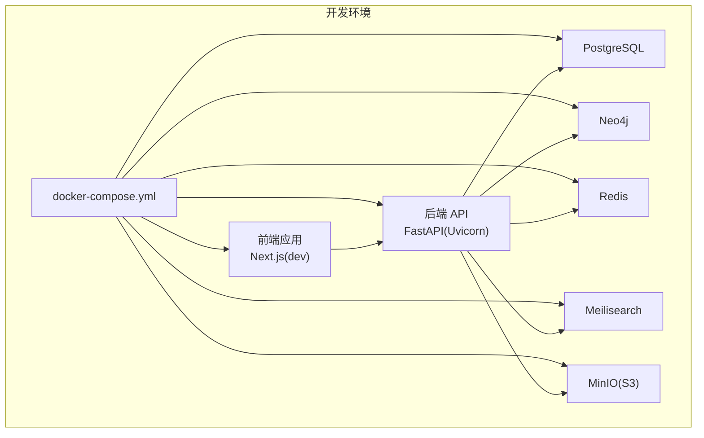
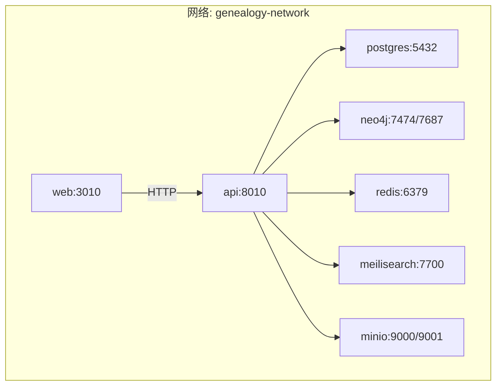
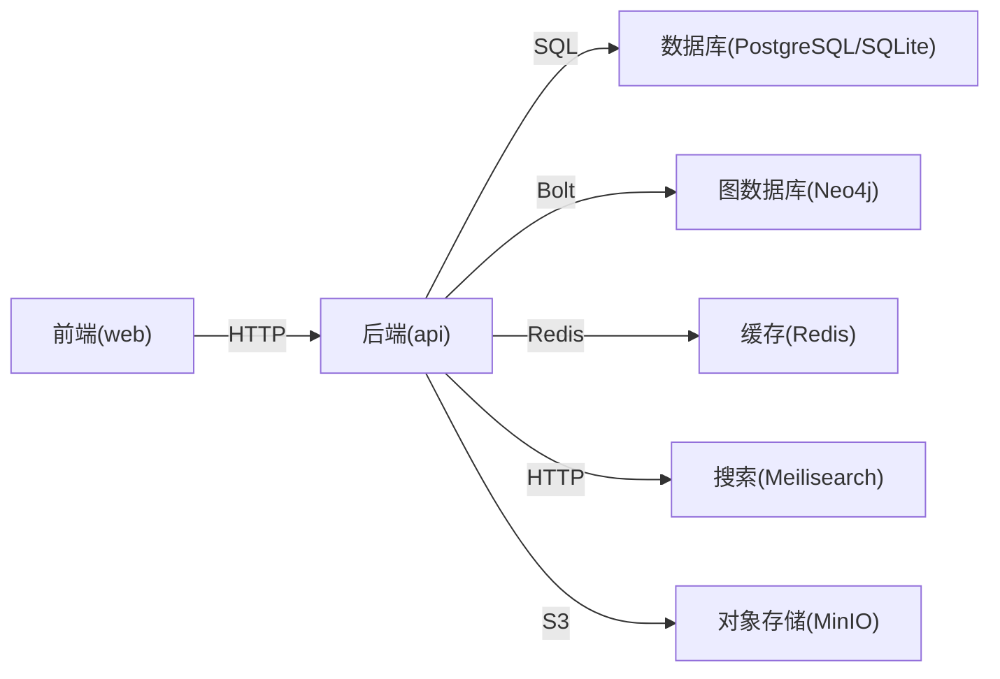

# 开发环境部署

<cite>
**本文引用的文件**
- [docker-compose.yml](file://docker-compose.yml)
- [backend/Dockerfile](file://backend/Dockerfile)
- [frontend/Dockerfile](file://frontend/Dockerfile)
- [docs/LOCAL_DEVELOPMENT.md](file://docs/LOCAL_DEVELOPMENT.md)
- [backend/app/core/config.py](file://backend/app/core/config.py)
- [backend/pyproject.toml](file://backend/pyproject.toml)
- [frontend/package.json](file://frontend/package.json)
- [start-dev.ps1](file://start-dev.ps1)
- [setup.ps1](file://setup.ps1)
- [backend/app/main.py](file://backend/app/main.py)
- [frontend/next.config.js](file://frontend/next.config.js)
- [backend/app/core/database.py](file://backend/app/core/database.py)
- [backend/app/core/services.py](file://backend/app/core/services.py)
- [docker-compose.prod.yml](file://docker-compose.prod.yml)
</cite>

## 目录
1. [简介](#简介)
2. [项目结构](#项目结构)
3. [核心组件](#核心组件)
4. [架构总览](#架构总览)
5. [详细组件分析](#详细组件分析)
6. [依赖关系分析](#依赖关系分析)
7. [性能考虑](#性能考虑)
8. [故障排除指南](#故障排除指南)
9. [结论](#结论)
10. [附录](#附录)

## 简介
本文件面向多租户族谱管理系统，提供完整的开发环境部署指南。内容涵盖本地开发环境搭建（含Docker与非Docker两种方式）、服务依赖关系与端口映射、环境变量与数据卷配置、健康检查设置、前后端热重载配置，以及常见问题排查与优化建议。目标是帮助开发者快速、稳定地启动并调试系统。

## 项目结构
该仓库采用多模块组织方式：
- 后端：基于 FastAPI 的 Python 应用，负责 API、数据库与外部服务集成
- 前端：基于 Next.js 的 TypeScript 应用，负责多租户界面与交互
- 数据库与外部服务：通过 docker-compose 统一编排，包含 PostgreSQL、Neo4j、Redis、Meilisearch、MinIO
- 文档与脚本：提供本地开发指南、安装与启动脚本

图表来源
- [docker-compose.yml:1-145](file://docker-compose.yml#L1-L145)

章节来源
- [docker-compose.yml:1-145](file://docker-compose.yml#L1-L145)
- [backend/Dockerfile:1-24](file://backend/Dockerfile#L1-L24)
- [frontend/Dockerfile:1-51](file://frontend/Dockerfile#L1-L51)

## 核心组件
- 后端服务（FastAPI）
  - 使用 Uvicorn 作为 ASGI 服务器，默认监听 8010 端口
  - 支持热重载（开发模式），通过命令行参数启用
  - 通过 Pydantic Settings 加载环境变量，支持 SQLite/PostgreSQL
- 前端服务（Next.js）
  - 开发模式监听 3010 端口，支持热重载
  - 通过环境变量 NEXT_PUBLIC_API_URL 指向后端 API
- 外部服务
  - PostgreSQL：系统与租户数据库（SQLite 文件或 PostgreSQL Schema）
  - Neo4j：图查询（祖先链、后代链、关系路径）
  - Redis：缓存与会话存储
  - Meilisearch：全文检索
  - MinIO：对象存储（兼容 S3）

章节来源
- [backend/app/main.py:1-103](file://backend/app/main.py#L1-L103)
- [backend/app/core/config.py:1-89](file://backend/app/core/config.py#L1-L89)
- [frontend/next.config.js:1-23](file://frontend/next.config.js#L1-L23)
- [backend/app/core/database.py:1-171](file://backend/app/core/database.py#L1-L171)
- [backend/app/core/services.py:1-285](file://backend/app/core/services.py#L1-L285)

## 架构总览
开发环境采用 Docker Compose 编排，服务间通过自定义网络通信；后端以“可选服务”模式连接 Neo4j、Redis、Meilisearch，即使这些服务不可用，系统仍可运行（降级为 SQL/文件存储）。

图表来源
- [docker-compose.yml:3-145](file://docker-compose.yml#L3-L145)

## 详细组件分析

### Docker 编排与启动顺序
- 服务启动顺序
  1) 关系型数据库：PostgreSQL
  2) 图数据库：Neo4j
  3) 缓存：Redis
  4) 搜索：Meilisearch
  5) 对象存储：MinIO
  6) 后端 API：等待上述服务健康后再启动
  7) 前端：等待后端健康后再启动
- 依赖健康检查
  - PostgreSQL：使用 pg_isready
  - Neo4j：HTTP 探针
  - Redis：redis-cli ping
  - Meilisearch：容器内可用性检测
  - MinIO：Live 健康端点
  - API：/health 端点
- 数据卷
  - postgres_data、neo4j_data、neo4j_logs、redis_data、meilisearch_data、minio_data
- 网络
  - 默认网络名称为 genealogy-network，便于服务间解析

章节来源
- [docker-compose.yml:1-145](file://docker-compose.yml#L1-L145)

### 环境变量与配置
- 后端（FastAPI）
  - 数据库：DATABASE_URL（默认 SQLite，开发可覆盖为 PostgreSQL）
  - Neo4j：NEO4J_URI、NEO4J_USER、NEO4J_PASSWORD
  - Redis：REDIS_URL
  - Meilisearch：MEILISEARCH_URL、MEILISEARCH_API_KEY
  - 存储：STORAGE_ENDPOINT、STORAGE_ACCESS_KEY、STORAGE_SECRET_KEY、STORAGE_BUCKET
  - JWT：JWT_SECRET_KEY、JWT_ALGORITHM、过期时间
  - CORS：CORS_ORIGINS（允许的前端域名）
  - 服务器：HOST、PORT、DEBUG
- 前端（Next.js）
  - NEXT_PUBLIC_API_URL：指向后端 API 前缀
- 生产环境（可选）
  - docker-compose.prod.yml 提供更严格的重启策略、健康检查与资源限制

章节来源
- [backend/app/core/config.py:1-89](file://backend/app/core/config.py#L1-L89)
- [backend/pyproject.toml:1-61](file://backend/pyproject.toml#L1-L61)
- [frontend/package.json:1-45](file://frontend/package.json#L1-L45)
- [frontend/next.config.js:1-23](file://frontend/next.config.js#L1-L23)
- [docker-compose.prod.yml:1-217](file://docker-compose.prod.yml#L1-L217)

### 数据库与多租户
- SQLite（默认）
  - 系统数据库：genealogy.db
  - 租户数据库：tenants/{tenant_slug}.db（每个租户独立文件）
- PostgreSQL（生产推荐）
  - 使用 Schema 实现多租户隔离（SET search_path）
  - 连接池参数：pool_size、max_overflow
- 初始化与迁移
  - Alembic 迁移脚本位于 backend/migrations

章节来源
- [backend/app/core/database.py:1-171](file://backend/app/core/database.py#L1-L171)
- [docs/LOCAL_DEVELOPMENT.md:92-218](file://docs/LOCAL_DEVELOPMENT.md#L92-L218)

### 外部服务集成（可选）
- Neo4j
  - 可选连接，失败不阻断应用
  - 提供祖先链、后代链、关系路径等图查询能力
- Redis
  - 可选连接，失败不阻断应用
  - 提供缓存与会话存储能力
- Meilisearch
  - 可选连接，失败不阻断应用
  - 提供全文检索能力

章节来源
- [backend/app/core/services.py:1-285](file://backend/app/core/services.py#L1-L285)
- [backend/app/main.py:17-42](file://backend/app/main.py#L17-L42)

### 健康检查与可观测性
- 各服务健康检查策略已在 docker-compose.yml 中定义
- API 提供 /health 端点，返回数据库与可选服务状态
- 生产环境 compose 提供 Prometheus/Grafana 监控（可选）

章节来源
- [docker-compose.yml:16-87](file://docker-compose.yml#L16-L87)
- [backend/app/main.py:72-86](file://backend/app/main.py#L72-L86)
- [docker-compose.prod.yml:176-201](file://docker-compose.prod.yml#L176-L201)

### 前后端热重载配置
- 后端（FastAPI）
  - 开发模式通过 Uvicorn --reload 启动
  - 代码变更自动重启
- 前端（Next.js）
  - 开发模式通过 npm run dev 启动
  - 页面与组件变更自动刷新

章节来源
- [docker-compose.yml:114-132](file://docker-compose.yml#L114-L132)
- [frontend/package.json:5-11](file://frontend/package.json#L5-L11)

### 开发服务器启动命令与调试
- Docker 方式
  - docker-compose up -d
  - 访问：前端 http://localhost:3010，后端 http://localhost:8010，API 文档 http://localhost:8010/api/v1/docs
- 非 Docker 方式（Windows）
  - 安装脚本：setup.ps1
  - 启动脚本：start-dev.ps1
  - 手动启动：后端进入 backend 并激活虚拟环境后 uvicorn app.main:app --reload；前端进入 frontend 后 npm run dev
- 生产镜像构建
  - 后端：backend/Dockerfile
  - 前端：frontend/Dockerfile（生产镜像）

章节来源
- [docker-compose.yml:89-132](file://docker-compose.yml#L89-L132)
- [docs/LOCAL_DEVELOPMENT.md:45-88](file://docs/LOCAL_DEVELOPMENT.md#L45-L88)
- [start-dev.ps1:1-94](file://start-dev.ps1#L1-L94)
- [setup.ps1:1-88](file://setup.ps1#L1-L88)
- [backend/Dockerfile:1-24](file://backend/Dockerfile#L1-L24)
- [frontend/Dockerfile:1-51](file://frontend/Dockerfile#L1-L51)

## 依赖关系分析
- 后端对数据库的依赖
  - SQLite：无需外部服务，零配置
  - PostgreSQL：需要数据库服务可用
- 后端对可选服务的依赖
  - Neo4j/Redis/Meilisearch：连接失败不影响核心功能，系统自动降级
- 前端对后端的依赖
  - 通过 NEXT_PUBLIC_API_URL 指向后端 API 前缀
- 服务间通信
  - 通过 Docker 内部网络 genealogy-network 解析服务名

图表来源
- [docker-compose.yml:3-145](file://docker-compose.yml#L3-L145)

章节来源
- [docker-compose.yml:1-145](file://docker-compose.yml#L1-L145)
- [backend/app/core/database.py:1-171](file://backend/app/core/database.py#L1-L171)
- [backend/app/core/services.py:1-285](file://backend/app/core/services.py#L1-L285)

## 性能考虑
- 数据库连接池
  - PostgreSQL：可通过配置 pool_size 与 max_overflow 控制连接数
  - SQLite：单文件模型，适合开发，不适合高并发写入
- 缓存与搜索
  - Redis 可显著降低重复查询压力
  - Meilisearch 提升全文检索性能
- 健康检查与重启策略
  - 生产环境 compose 提供 restart/unless-stopped 与健康检查，提升稳定性

章节来源
- [backend/app/core/config.py:34-51](file://backend/app/core/config.py#L34-L51)
- [backend/app/core/database.py:43-49](file://backend/app/core/database.py#L43-L49)
- [docker-compose.prod.yml:10-62](file://docker-compose.prod.yml#L10-L62)

## 故障排除指南
- 启动后端/前端报错
  - 确认虚拟环境与依赖安装正确
  - 检查 .env/.env.local 配置是否完整
- 数据库无法连接
  - 确认 PostgreSQL 已启动且端口 5432 可达
  - 若使用 SQLite，确认数据库文件路径与权限
- 可选服务不可用
  - Neo4j/Redis/Meilisearch 不可用属于预期行为，系统会降级
  - 检查对应服务健康检查与日志
- 前端无法访问后端
  - 确认 NEXT_PUBLIC_API_URL 指向正确的 API 前缀
  - 检查 CORS 配置是否包含前端地址
- 热重载无效
  - 确认开发模式命令已执行（--reload / dev）
  - 检查文件挂载与权限

章节来源
- [docs/LOCAL_DEVELOPMENT.md:237-298](file://docs/LOCAL_DEVELOPMENT.md#L237-L298)
- [backend/app/main.py:72-86](file://backend/app/main.py#L72-L86)
- [frontend/next.config.js:16-19](file://frontend/next.config.js#L16-L19)

## 结论
本开发环境通过 Docker Compose 实现一键启动，服务间解耦并通过健康检查确保启动顺序与可用性。后端以可选服务模式集成 Neo4j、Redis、Meilisearch，既满足功能扩展，又保证基础能力不受影响。配合热重载与清晰的环境变量配置，开发者可高效进行本地开发与调试。

## 附录

### 端口与服务映射速查
- 后端 API：8010 → 8010
- 前端：3010 → 3010
- PostgreSQL：5432 → 5432
- Neo4j HTTP：7474 → 7474
- Neo4j Bolt：7687 → 7687
- Redis：6379 → 6379
- Meilisearch：7700 → 7700
- MinIO API：9000 → 9000
- MinIO Console：9001 → 9001

章节来源
- [docker-compose.yml:12-87](file://docker-compose.yml#L12-L87)

### 环境变量清单（后端）
- DATABASE_URL：数据库连接串（默认 SQLite）
- NEO4J_URI/NEO4J_USER/NEO4J_PASSWORD：Neo4j 连接
- REDIS_URL：Redis 连接
- MEILISEARCH_URL/MEILISEARCH_API_KEY：Meilisearch 连接
- STORAGE_ENDPOINT/ACCESS_KEY/SECRET_KEY/BUCKET：MinIO/S3
- JWT_SECRET_KEY/JWT_ALGORITHM/过期时间：认证
- CORS_ORIGINS：允许的前端源
- HOST/PORT/DEBUG：服务器配置

章节来源
- [backend/app/core/config.py:11-89](file://backend/app/core/config.py#L11-L89)

### 环境变量清单（前端）
- NEXT_PUBLIC_API_URL：后端 API 前缀

章节来源
- [frontend/next.config.js:16-19](file://frontend/next.config.js#L16-L19)