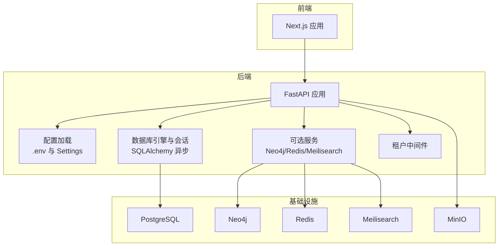
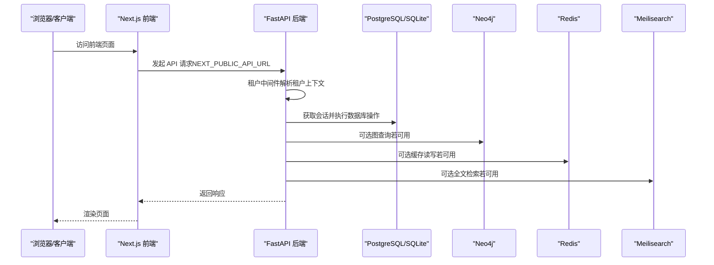
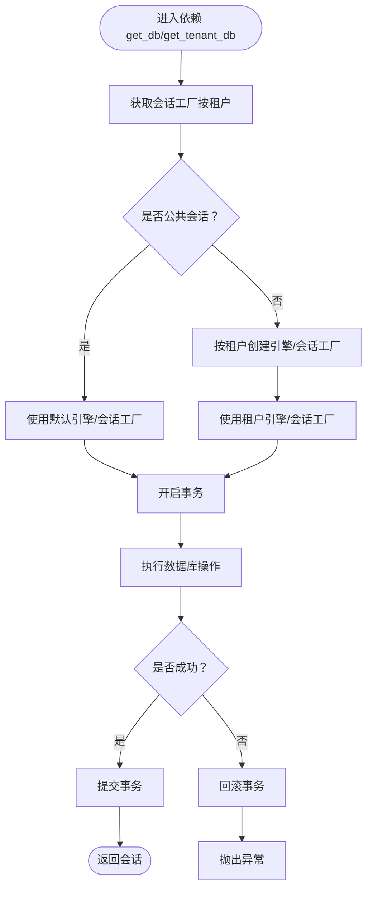
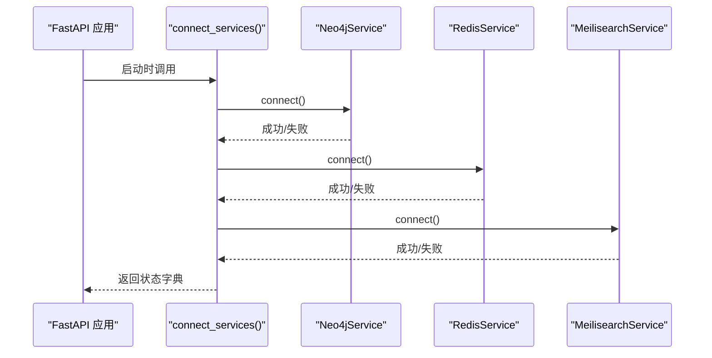
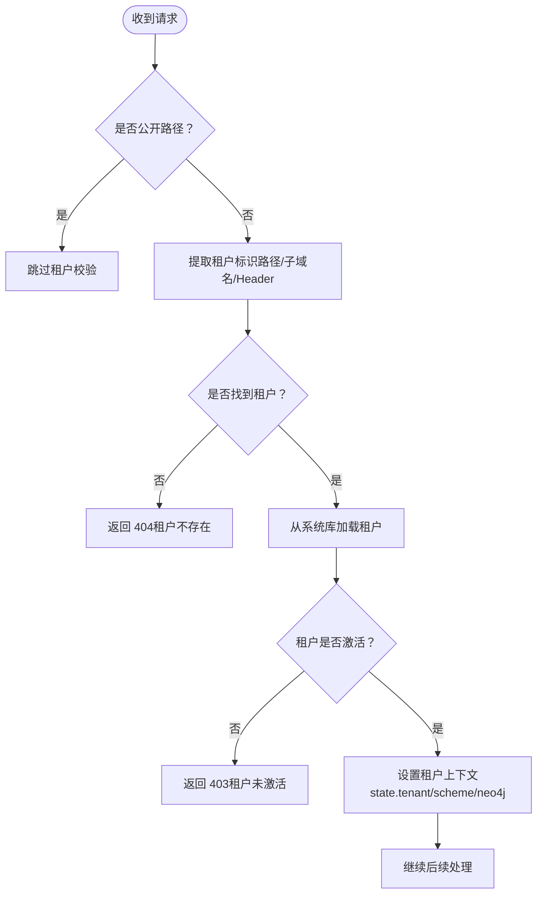
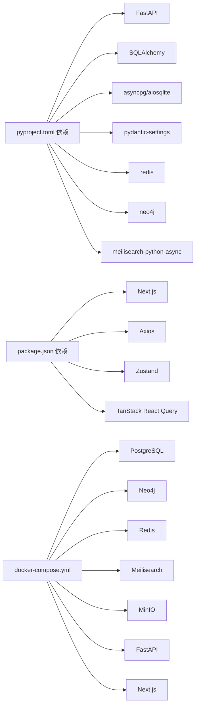

# 常见问题诊断

<cite>
**本文引用的文件**
- [backend/pyproject.toml](file://backend/pyproject.toml)
- [frontend/package.json](file://frontend/package.json)
- [docker-compose.yml](file://docker-compose.yml)
- [backend/app/core/config.py](file://backend/app/core/config.py)
- [backend/app/main.py](file://backend/app/main.py)
- [backend/app/core/database.py](file://backend/app/core/database.py)
- [backend/app/core/services.py](file://backend/app/core/services.py)
- [backend/app/middleware/tenant.py](file://backend/app/middleware/tenant.py)
- [backend/Dockerfile](file://backend/Dockerfile)
- [frontend/Dockerfile](file://frontend/Dockerfile)
- [backend/alembic.ini](file://backend/alembic.ini)
- [docs/LOCAL_DEVELOPMENT.md](file://docs/LOCAL_DEVELOPMENT.md)
- [README.md](file://README.md)
- [frontend/next.config.js](file://frontend/next.config.js)
</cite>

## 目录
1. [简介](#简介)
2. [项目结构](#项目结构)
3. [核心组件](#核心组件)
4. [架构总览](#架构总览)
5. [详细组件分析](#详细组件分析)
6. [依赖分析](#依赖分析)
7. [性能考虑](#性能考虑)
8. [故障排查指南](#故障排查指南)
9. [结论](#结论)
10. [附录](#附录)

## 简介
本文件面向多租户族谱管理系统（后端基于 FastAPI，前端基于 Next.js，配套数据库与图数据库、缓存与搜索引擎等可选服务）的运维与开发人员，提供系统启动失败、数据库连接异常、API 调用错误等常见问题的诊断步骤与解决方法。内容涵盖服务依赖检查、端口占用排查、环境变量验证、错误代码对照、日志定位根因、容器启动失败排查清单与修复步骤，并给出针对后端 FastAPI 错误、前端 Next.js 构建错误、数据库连接池问题的具体处置建议。

## 项目结构
系统采用前后端分离与多服务编排架构：
- 后端：FastAPI 应用，负责认证、租户识别、API 路由与业务逻辑；数据库连接与会话管理；可选外部服务（Neo4j、Redis、Meilisearch）连接。
- 前端：Next.js 应用，负责用户界面与 API 调用；开发时通过 Dockerfile.dev 提供开发容器镜像。
- 服务编排：docker-compose.yml 定义数据库（PostgreSQL）、图数据库（Neo4j）、缓存（Redis）、搜索引擎（Meilisearch）、对象存储（MinIO）、后端 API、前端 Web 的服务与依赖关系。
- 配置：后端通过 pydantic-settings 读取 .env 环境变量；前端通过 next.config.js 暴露运行时环境变量；数据库连接池参数在后端配置中定义。

图表来源
- [docker-compose.yml:1-145](file://docker-compose.yml#L1-L145)
- [backend/app/main.py:1-103](file://backend/app/main.py#L1-L103)
- [backend/app/core/config.py:1-89](file://backend/app/core/config.py#L1-L89)
- [backend/app/core/database.py:1-171](file://backend/app/core/database.py#L1-L171)
- [backend/app/core/services.py:1-285](file://backend/app/core/services.py#L1-L285)
- [backend/app/middleware/tenant.py:1-142](file://backend/app/middleware/tenant.py#L1-L142)

章节来源
- [README.md:1-133](file://README.md#L1-L133)
- [docker-compose.yml:1-145](file://docker-compose.yml#L1-L145)
- [backend/app/main.py:1-103](file://backend/app/main.py#L1-L103)
- [backend/app/core/config.py:1-89](file://backend/app/core/config.py#L1-L89)
- [backend/app/core/database.py:1-171](file://backend/app/core/database.py#L1-L171)
- [backend/app/core/services.py:1-285](file://backend/app/core/services.py#L1-L285)
- [backend/app/middleware/tenant.py:1-142](file://backend/app/middleware/tenant.py#L1-L142)

## 核心组件
- 配置系统：集中于 Settings 类，负责应用名称、版本、调试开关、服务器地址与端口、数据库连接串、连接池大小、Neo4j/Redis/Meilisearch 地址、CORS 来源、文件存储端点与密钥、租户默认策略等。
- 数据库管理：DatabaseManager 支持 SQLite 与 PostgreSQL，提供默认引擎与按租户 schema 的引擎/会话工厂；对 SQLite 实施“每租户一个文件”的多租户策略；对 PostgreSQL 使用 schema 隔离。
- 可选服务：Neo4jService、RedisService、MeilisearchService 以单例模式连接，失败时优雅降级（不阻塞主流程），并在启动时打印可用性状态。
- 租户中间件：支持子域名、路径前缀与请求头三种方式提取租户标识，校验租户存在性与激活状态，设置请求上下文中的租户信息。
- 应用生命周期：FastAPI lifespan 在启动时初始化数据库引擎、连接可选服务并打印服务状态，在关闭时断开连接与关闭引擎。

章节来源
- [backend/app/core/config.py:1-89](file://backend/app/core/config.py#L1-L89)
- [backend/app/core/database.py:1-171](file://backend/app/core/database.py#L1-L171)
- [backend/app/core/services.py:1-285](file://backend/app/core/services.py#L1-L285)
- [backend/app/middleware/tenant.py:1-142](file://backend/app/middleware/tenant.py#L1-L142)
- [backend/app/main.py:1-103](file://backend/app/main.py#L1-L103)

## 架构总览
系统通过 docker-compose 启动多个服务，后端 API 作为中心服务，前端通过 NEXT_PUBLIC_API_URL 指向后端 API。后端根据配置加载数据库与可选服务，租户中间件在请求进入时解析租户上下文。

图表来源
- [docker-compose.yml:116-132](file://docker-compose.yml#L116-L132)
- [frontend/next.config.js:16-19](file://frontend/next.config.js#L16-L19)
- [backend/app/main.py:66-86](file://backend/app/main.py#L66-L86)
- [backend/app/core/database.py:124-171](file://backend/app/core/database.py#L124-L171)
- [backend/app/core/services.py:268-285](file://backend/app/core/services.py#L268-L285)
- [backend/app/middleware/tenant.py:39-84](file://backend/app/middleware/tenant.py#L39-L84)

## 详细组件分析

### 组件A：数据库连接与多租户隔离
- 设计要点
  - 默认引擎与会话工厂在启动时初始化；SQLite 与 PostgreSQL 分支处理不同连接参数。
  - 多租户策略：SQLite 每租户独立文件；PostgreSQL 使用 schema 隔离，通过 SET search_path 切换。
  - 事务控制：统一在依赖中 commit/rollback，异常时回滚并上抛。
- 关键复杂度
  - 引擎与会话工厂字典缓存，按租户名查找 O(1)；首次访问触发创建。
- 优化建议
  - PostgreSQL 连接池参数可在 Settings 中调整；SQLite 仅支持文件锁，避免高并发写入。
- 错误处理
  - 初始化失败或连接失败会在启动阶段暴露；运行期异常统一回滚并抛出。

图表来源
- [backend/app/core/database.py:124-171](file://backend/app/core/database.py#L124-L171)

章节来源
- [backend/app/core/database.py:1-171](file://backend/app/core/database.py#L1-L171)
- [backend/app/core/config.py:34-50](file://backend/app/core/config.py#L34-L50)

### 组件B：可选服务连接与降级
- 设计要点
  - Neo4j/Redis/Meilisearch 以单例连接，失败不阻塞应用启动；启动时打印可用性状态。
  - 提供健康检查端点 /health，报告数据库与可选服务状态。
- 错误处理
  - 连接异常捕获并降级，不影响核心功能；查询/索引/缓存调用前检查可用性。

图表来源
- [backend/app/main.py:25-35](file://backend/app/main.py#L25-L35)
- [backend/app/core/services.py:268-285](file://backend/app/core/services.py#L268-L285)

章节来源
- [backend/app/core/services.py:1-285](file://backend/app/core/services.py#L1-L285)
- [backend/app/main.py:72-86](file://backend/app/main.py#L72-L86)

### 组件C：租户中间件与请求上下文
- 设计要点
  - 支持子域名、路径前缀 /t/{slug}/...、请求头 X-Tenant-ID 三种租户识别方式。
  - 对公开路径（认证、租户注册、管理、健康检查等）跳过租户校验。
  - 加载租户后校验存在性与激活状态，设置 request.state.tenant、schema 与图数据库名。
- 错误处理
  - 未找到租户返回 404，租户未激活返回 403，并携带结构化错误码与消息。

图表来源
- [backend/app/middleware/tenant.py:39-84](file://backend/app/middleware/tenant.py#L39-L84)

章节来源
- [backend/app/middleware/tenant.py:1-142](file://backend/app/middleware/tenant.py#L1-L142)

## 依赖分析
- 后端依赖：FastAPI、SQLAlchemy 2.0、asyncpg/aiosqlite、pydantic-settings、httpx、redis、neo4j、meilisearch-python-async、python-dotenv、email-validator 等。
- 前端依赖：Next.js、React、Axios、Zustand、TanStack React Query、TailwindCSS 等。
- 编排依赖：docker-compose 定义各服务端口映射、健康检查、依赖顺序与环境变量。

图表来源
- [backend/pyproject.toml:7-25](file://backend/pyproject.toml#L7-L25)
- [frontend/package.json:12-31](file://frontend/package.json#L12-L31)
- [docker-compose.yml:1-145](file://docker-compose.yml#L1-L145)

章节来源
- [backend/pyproject.toml:1-61](file://backend/pyproject.toml#L1-L61)
- [frontend/package.json:1-45](file://frontend/package.json#L1-L45)
- [docker-compose.yml:1-145](file://docker-compose.yml#L1-L145)

## 性能考虑
- 数据库连接池
  - PostgreSQL：pool_size 与 max_overflow 在 Settings 中配置；高并发场景建议评估连接池上限与超量。
  - SQLite：无连接池概念，注意避免高并发写冲突；多租户场景建议拆分文件并合理规划磁盘 I/O。
- 可选服务
  - Neo4j/Redis/Meilisearch 可选且失败不阻塞；在生产环境建议启用并监控其性能与可用性。
- 前端构建与运行
  - Next.js 生产构建产物体积与缓存策略影响首屏性能；确保 NEXT_PUBLIC_API_URL 正确指向后端 API。

[本节为通用指导，不直接分析具体文件]

## 故障排查指南

### 一、系统启动失败

#### 1. 后端 FastAPI 启动失败
- 检查项
  - 端口占用：确认 8010 未被占用；docker-compose 映射为 8010:8010。
  - 依赖安装：确保后端依赖已安装（pyproject.toml）。
  - 环境变量：确认 .env 存在且包含 DATABASE_URL、NEO4J_*、REDIS_URL、MEILISEARCH_*、STORAGE_* 等。
  - 数据库连接：检查 DATABASE_URL 是否正确（SQLite 文件路径或 PostgreSQL 连接串）。
  - 可选服务：Neo4j/Redis/Meilisearch 若不可达不会阻止启动，但会影响相关功能。
- 排查步骤
  - 查看启动日志输出（启动时会打印服务状态）。
  - 访问 /health 端点，确认数据库与可选服务状态。
  - 在 docker-compose 中查看 API 容器日志，定位异常堆栈。
- 常见原因
  - 环境变量缺失或拼写错误。
  - 数据库不可达（网络、凭据、防火墙）。
  - PostgreSQL 需要先创建数据库并运行迁移。

章节来源
- [backend/app/main.py:17-42](file://backend/app/main.py#L17-L42)
- [backend/app/main.py:72-86](file://backend/app/main.py#L72-L86)
- [docker-compose.yml:95-114](file://docker-compose.yml#L95-L114)
- [backend/Dockerfile:1-24](file://backend/Dockerfile#L1-L24)
- [backend/alembic.ini](file://backend/alembic.ini#L8)

#### 2. 前端 Next.js 启动失败
- 检查项
  - 端口占用：确认 3010 未被占用；docker-compose 映射为 3010:3010。
  - NEXT_PUBLIC_API_URL 是否指向正确的后端 API 地址。
  - 依赖安装：确保前端依赖已安装（package.json）。
- 排查步骤
  - 查看前端容器日志，关注构建阶段与运行阶段错误。
  - 在本地开发时，确认后端 API 已启动且可访问。
- 常见原因
  - NEXT_PUBLIC_API_URL 指向错误或后端未就绪。
  - 依赖安装不完整导致构建失败。

章节来源
- [frontend/Dockerfile:1-51](file://frontend/Dockerfile#L1-L51)
- [frontend/next.config.js:16-19](file://frontend/next.config.js#L16-L19)
- [docker-compose.yml:116-132](file://docker-compose.yml#L116-L132)

#### 3. 容器启动失败排查清单
- 网络与端口
  - 检查 docker-compose.yml 中端口映射与宿主机端口占用情况。
  - 确认自定义网络 genealogy-network 是否创建成功。
- 健康检查
  - PostgreSQL/Neo4j/Redis/Meilisearch/MinIO 均有健康检查，查看对应容器健康状态。
- 依赖顺序
  - API 服务设置了 depends_on 的健康检查条件，确保前置服务健康后再启动 API。
- 环境变量
  - 确认 API 服务环境变量 DATABASE_URL、NEO4J_URI、REDIS_URL、MEILISEARCH_URL、STORAGE_ENDPOINT 等正确。
- 日志定位
  - 使用 docker compose logs <service> 查看具体服务日志，定位异常。

章节来源
- [docker-compose.yml:1-145](file://docker-compose.yml#L1-L145)

### 二、数据库连接异常

#### 1. SQLite 模式
- 多租户文件位置
  - 系统库：genealogy.db；租户库：tenants/{slug}.db。
- 常见问题
  - 权限不足：确保进程对 tenants 目录具有读写权限。
  - 文件锁冲突：避免多进程同时写入同一租户库。
- 解决方案
  - 为每个租户单独文件，减少锁竞争。
  - 在开发环境可使用 SQLite，生产环境建议 PostgreSQL。

章节来源
- [docs/LOCAL_DEVELOPMENT.md:98-106](file://docs/LOCAL_DEVELOPMENT.md#L98-L106)
- [backend/app/core/database.py:63-78](file://backend/app/core/database.py#L63-L78)

#### 2. PostgreSQL 模式
- 连接参数
  - DATABASE_URL 使用 asyncpg；连接池大小与超量在 Settings 中配置。
- 常见问题
  - 数据库未创建或迁移未执行。
  - 用户名/密码/主机/端口错误。
- 解决方案
  - 先创建数据库并运行迁移（alembic upgrade head）。
  - 校验连接串格式与可达性。

章节来源
- [backend/app/core/config.py:34-39](file://backend/app/core/config.py#L34-L39)
- [backend/alembic.ini](file://backend/alembic.ini#L8)
- [docs/LOCAL_DEVELOPMENT.md:210-218](file://docs/LOCAL_DEVELOPMENT.md#L210-L218)

#### 3. 连接池问题
- 现象
  - 请求堆积、超时或连接耗尽。
- 诊断
  - 观察 /health 端点与后端日志中的服务状态。
  - 检查 pool_size 与 max_overflow 设置是否合理。
- 优化
  - 根据并发与数据库承载能力调整连接池参数。

章节来源
- [backend/app/core/config.py:38-39](file://backend/app/core/config.py#L38-L39)
- [backend/app/core/database.py:44-49](file://backend/app/core/database.py#L44-L49)

### 三、API 调用错误

#### 1. 租户上下文缺失或无效
- 现象
  - 返回 404（租户不存在）或 403（租户未激活）。
- 诊断
  - 检查请求路径是否符合 /t/{slug}/... 或子域名规则。
  - 检查请求头 X-Tenant-ID 是否正确传递。
  - 确认租户在系统库中存在且 is_active 为真。
- 解决方案
  - 确保租户 slug 正确，且租户处于激活状态。
  - 对公开路径（如 /api/v1/auth、/api/v1/tenants）无需租户上下文。

章节来源
- [backend/app/middleware/tenant.py:39-84](file://backend/app/middleware/tenant.py#L39-L84)
- [backend/app/middleware/tenant.py:116-125](file://backend/app/middleware/tenant.py#L116-L125)

#### 2. 可选服务不可用导致功能受限
- 现象
  - 图查询、缓存、全文检索功能降级或不可用。
- 诊断
  - 查看启动日志中 Neo4j/Redis/Meilisearch 的连接状态。
  - 访问 /health 端点确认服务可用性。
- 解决方案
  - 启动对应服务（Neo4j/Redis/Meilisearch），或在配置中禁用相关功能。

章节来源
- [backend/app/main.py:25-35](file://backend/app/main.py#L25-L35)
- [backend/app/main.py:72-86](file://backend/app/main.py#L72-L86)
- [backend/app/core/services.py:268-285](file://backend/app/core/services.py#L268-L285)

#### 3. CORS 与代理问题
- 现象
  - 前端跨域请求失败。
- 诊断
  - 检查 Settings.cors_origins 与前端 NEXT_PUBLIC_API_URL。
  - 确认前端与后端端口一致（3010/8010）。
- 解决方案
  - 在 Settings 中添加允许的前端源，或在开发时允许 localhost:3010。

章节来源
- [backend/app/core/config.py](file://backend/app/core/config.py#L60)
- [frontend/next.config.js:16-19](file://frontend/next.config.js#L16-L19)

### 四、日志定位根因

- 后端 FastAPI
  - 启动阶段会打印服务状态（数据库、Neo4j、Redis、Search）。
  - /health 端点返回服务可用性摘要。
  - 使用 docker compose logs genealogy-api 查看详细日志。
- 前端 Next.js
  - 使用 docker compose logs genealogy-web 查看构建与运行日志。
  - 检查 NEXT_PUBLIC_API_URL 是否正确。
- 数据库
  - PostgreSQL/Neo4j/Redis/Meilisearch 健康检查失败时，查看对应容器日志。
  - Alembic 迁移日志可在后端容器中查看。

章节来源
- [backend/app/main.py:25-35](file://backend/app/main.py#L25-L35)
- [backend/app/main.py:72-86](file://backend/app/main.py#L72-L86)
- [docker-compose.yml:16-20](file://docker-compose.yml#L16-L20)
- [docker-compose.yml:37-41](file://docker-compose.yml#L37-L41)
- [docker-compose.yml:52-56](file://docker-compose.yml#L52-L56)
- [docker-compose.yml:83-87](file://docker-compose.yml#L83-L87)

### 五、错误代码对照表

- 租户相关
  - TENANT_NOT_FOUND：租户不存在（404）
  - TENANT_INACTIVE：租户未激活（403）
- 通用
  - 404：资源未找到（租户、路由等）
  - 403：权限不足（租户未激活）
  - 500：服务器内部错误（数据库异常、可选服务异常）

章节来源
- [backend/app/middleware/tenant.py:53-74](file://backend/app/middleware/tenant.py#L53-L74)

## 结论
本诊断文档围绕系统启动、数据库连接、API 调用三大类问题，结合配置、中间件、数据库与可选服务的实现细节，提供了可操作的排查步骤与解决方案。建议在开发与生产环境中：
- 明确环境变量与连接串配置；
- 启动时关注 /health 与启动日志；
- 对可选服务进行健康检查与降级策略；
- 在生产环境优先使用 PostgreSQL，并合理配置连接池与并发。

[本节为总结性内容，不直接分析具体文件]

## 附录

### A. 端口与服务对照
- 后端 API：8010（容器内 8010）
- 前端：3010（容器内 3010）
- PostgreSQL：5432（容器内 5432）
- Neo4j HTTP：7474（容器内 7474）
- Neo4j Bolt：7687（容器内 7687）
- Redis：6379（容器内 6379）
- Meilisearch：7700（容器内 7700）
- MinIO API：9000（容器内 9000）
- MinIO 控制台：9001（容器内 9001）

章节来源
- [docker-compose.yml:12-87](file://docker-compose.yml#L12-L87)
- [docs/LOCAL_DEVELOPMENT.md:222-234](file://docs/LOCAL_DEVELOPMENT.md#L222-L234)

### B. 环境变量清单（关键）
- 后端（示例）
  - DATABASE_URL：数据库连接串（SQLite 或 PostgreSQL）
  - NEO4J_URI/NEO4J_USER/NEO4J_PASSWORD：Neo4j 连接
  - REDIS_URL：Redis 连接
  - MEILISEARCH_URL/MEILISEARCH_API_KEY：Meilisearch 连接
  - STORAGE_ENDPOINT/STORAGE_ACCESS_KEY/STORAGE_SECRET_KEY/STORAGE_BUCKET：对象存储
  - NEXT_PUBLIC_API_URL：前端访问后端 API 的地址
- 前端
  - NEXT_PUBLIC_API_URL：默认 http://localhost:8010/api/v1

章节来源
- [backend/app/core/config.py:34-67](file://backend/app/core/config.py#L34-L67)
- [frontend/next.config.js:16-19](file://frontend/next.config.js#L16-L19)
- [docker-compose.yml:95-103](file://docker-compose.yml#L95-L103)
- [docker-compose.yml](file://docker-compose.yml#L122)