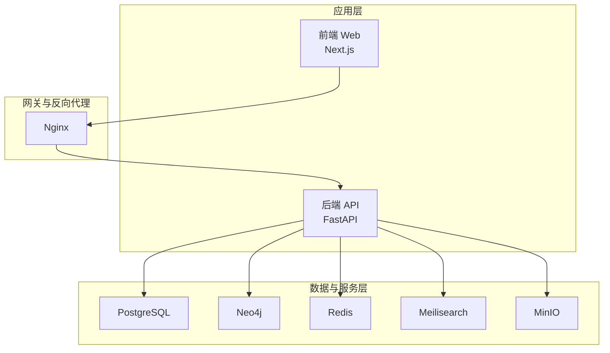
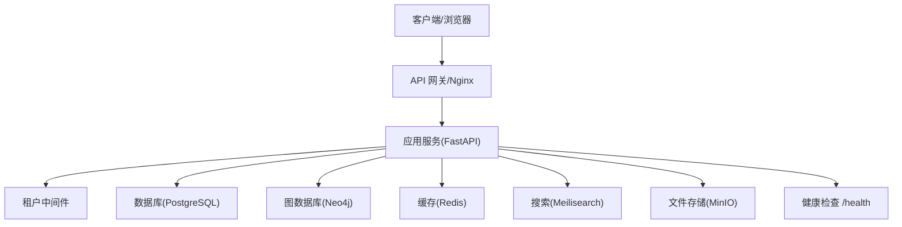
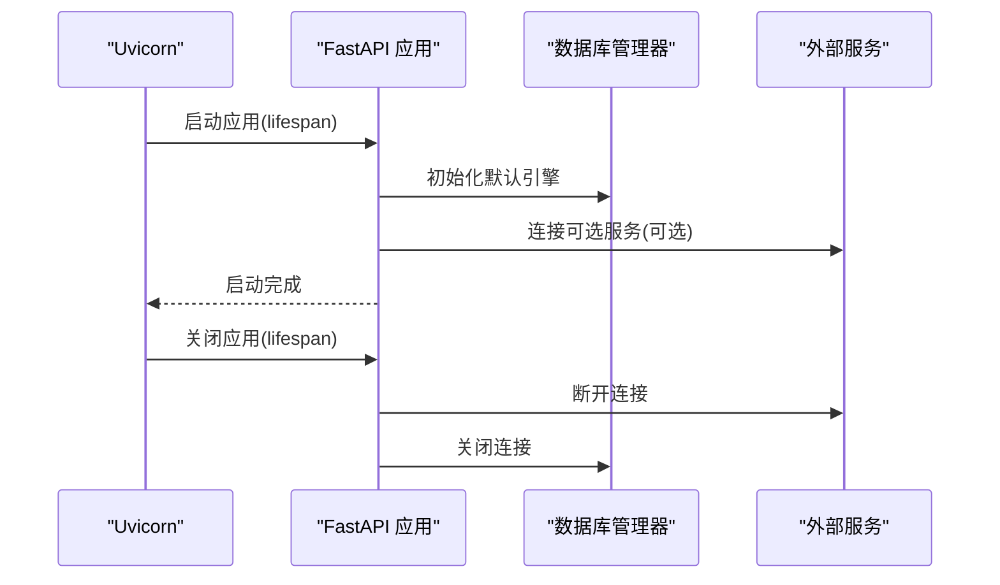
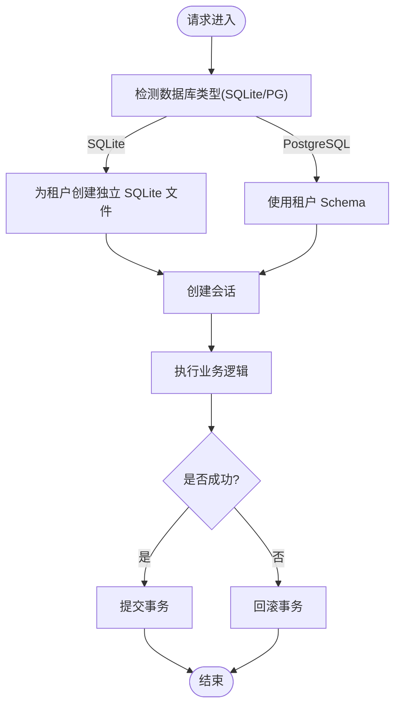
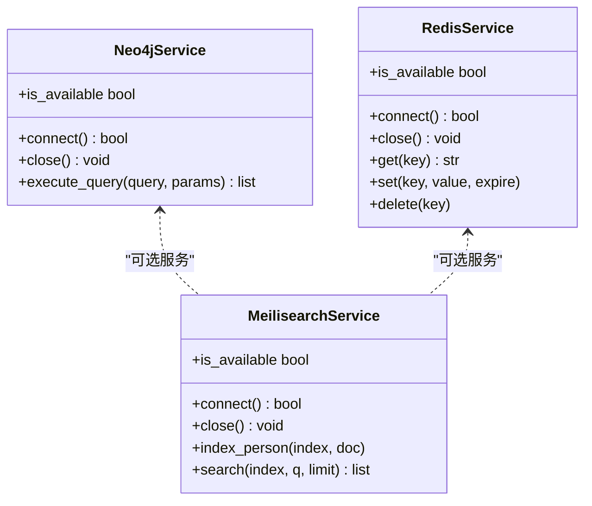
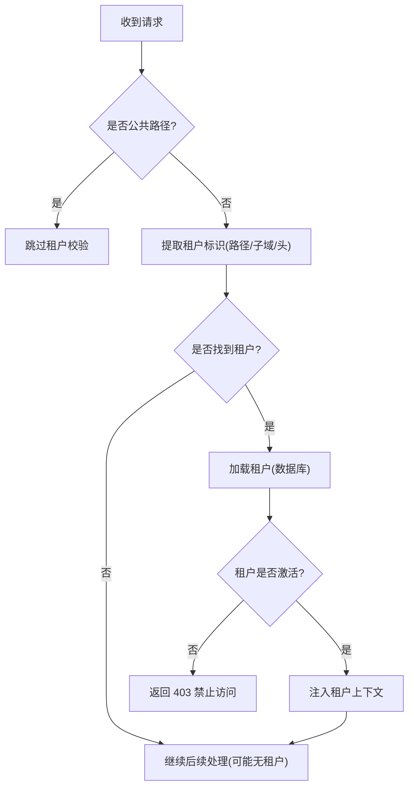
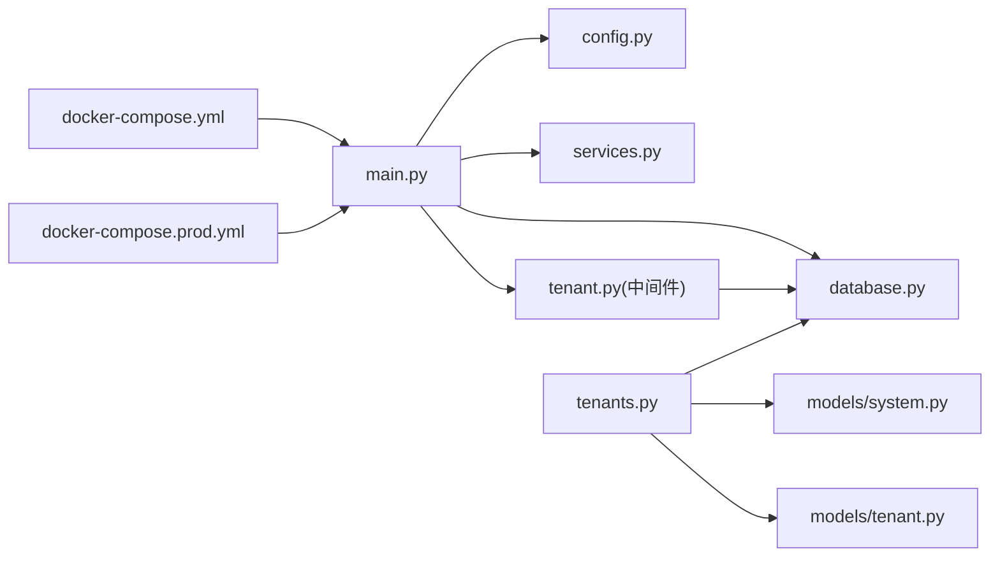
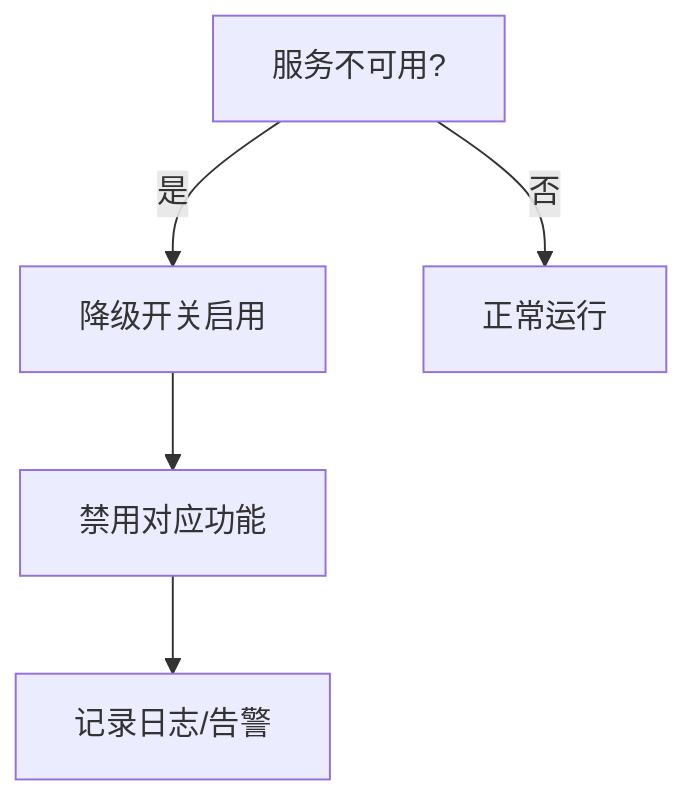

# 应急响应与故障升级

<cite>
**本文引用的文件**
- [backend/app/main.py](file://backend/app/main.py)
- [backend/app/core/config.py](file://backend/app/core/config.py)
- [backend/app/core/database.py](file://backend/app/core/database.py)
- [backend/app/core/services.py](file://backend/app/core/services.py)
- [backend/app/middleware/tenant.py](file://backend/app/middleware/tenant.py)
- [backend/app/api/v1/endpoints/tenants.py](file://backend/app/api/v1/endpoints/tenants.py)
- [backend/app/models/system.py](file://backend/app/models/system.py)
- [backend/app/models/tenant.py](file://backend/app/models/tenant.py)
- [docker-compose.yml](file://docker-compose.yml)
- [docker-compose.prod.yml](file://docker-compose.prod.yml)
- [deploy.sh](file://deploy.sh)
- [scripts/create_tenant.py](file://scripts/create_tenant.py)
- [backend/Dockerfile](file://backend/Dockerfile)
- [README.md](file://README.md)
- [docs/ARCHITECTURE.md](file://docs/ARCHITECTURE.md)
</cite>

## 目录
1. [简介](#简介)
2. [项目结构](#项目结构)
3. [核心组件](#核心组件)
4. [架构总览](#架构总览)
5. [详细组件分析](#详细组件分析)
6. [依赖分析](#依赖分析)
7. [性能考虑](#性能考虑)
8. [故障分级与响应流程](#故障分级与响应流程)
9. [故障升级机制与沟通协调](#故障升级机制与沟通协调)
10. [系统降级策略与灾难恢复](#系统降级策略与灾难恢复)
11. [故障复盘与改进跟踪](#故障复盘与改进跟踪)
12. [紧急联系人与更新机制](#紧急联系人与更新机制)
13. [结论](#结论)

## 简介
本文件面向多租户族谱管理系统，提供完整的应急响应与故障升级方案。内容涵盖故障分级、响应时限、责任人、升级机制、沟通协调、系统降级与灾备、恢复流程、复盘与改进跟踪，以及紧急联系人与更新机制。文档以系统实际代码与配置为依据，结合架构设计文档，形成可落地的运维保障体系。

## 项目结构
系统采用前后端分离与容器化部署，后端基于 FastAPI，数据库与外部服务通过 Docker Compose 编排，提供健康检查与可观察性基础能力。

图表来源
- [docker-compose.yml:1-145](file://docker-compose.yml#L1-L145)
- [docker-compose.prod.yml:1-217](file://docker-compose.prod.yml#L1-L217)

章节来源
- [README.md:1-133](file://README.md#L1-L133)
- [docker-compose.yml:1-145](file://docker-compose.yml#L1-L145)
- [docker-compose.prod.yml:1-217](file://docker-compose.prod.yml#L1-L217)

## 核心组件
- 应用入口与生命周期：负责启动数据库引擎、连接可选外部服务、注册健康检查端点。
- 配置中心：集中管理数据库、缓存、搜索、存储、租户默认参数等。
- 数据库管理：支持 SQLite/PostgreSQL，按租户隔离（Schema 或文件），提供会话管理与回滚。
- 外部服务管理：Neo4j、Redis、Meilisearch 的可选连接与可用性检测，失败时优雅降级。
- 租户中间件：解析子域/路径/头信息识别租户，加载租户状态并注入请求上下文。
- 租户 API：提供租户列表、详情、创建等接口，支撑租户生命周期管理。
- 模型层：系统级与租户级数据模型，支撑多租户隔离与权限控制。

章节来源
- [backend/app/main.py:17-88](file://backend/app/main.py#L17-L88)
- [backend/app/core/config.py:11-89](file://backend/app/core/config.py#L11-L89)
- [backend/app/core/database.py:24-171](file://backend/app/core/database.py#L24-L171)
- [backend/app/core/services.py:9-285](file://backend/app/core/services.py#L9-L285)
- [backend/app/middleware/tenant.py:15-142](file://backend/app/middleware/tenant.py#L15-L142)
- [backend/app/api/v1/endpoints/tenants.py:17-164](file://backend/app/api/v1/endpoints/tenants.py#L17-L164)
- [backend/app/models/system.py:23-223](file://backend/app/models/system.py#L23-L223)
- [backend/app/models/tenant.py:23-244](file://backend/app/models/tenant.py#L23-L244)

## 架构总览
系统采用“客户端层 → API 网关层 → 应用服务层 → 数据存储层”的分层架构。租户识别通过中间件完成，数据库与外部服务均为可选依赖，具备健康检查与降级能力。

图表来源
- [docs/ARCHITECTURE.md:30-78](file://docs/ARCHITECTURE.md#L30-L78)
- [backend/app/main.py:72-86](file://backend/app/main.py#L72-L86)
- [backend/app/middleware/tenant.py:15-84](file://backend/app/middleware/tenant.py#L15-L84)

章节来源
- [docs/ARCHITECTURE.md:1-1020](file://docs/ARCHITECTURE.md#L1-L1020)

## 详细组件分析

### 应用生命周期与健康检查
- 生命周期钩子在启动时初始化默认引擎、连接可选服务；关闭时断开服务与数据库连接。
- 健康检查端点返回服务可用性状态，便于编排与监控系统探测。

图表来源
- [backend/app/main.py:17-42](file://backend/app/main.py#L17-L42)
- [backend/app/core/services.py:268-285](file://backend/app/core/services.py#L268-L285)
- [backend/app/core/database.py:108-118](file://backend/app/core/database.py#L108-L118)

章节来源
- [backend/app/main.py:17-88](file://backend/app/main.py#L17-L88)

### 数据库与租户隔离
- 默认使用配置中的数据库 URL，SQLite 不支持连接池；PostgreSQL 使用连接池参数。
- 多租户隔离：SQLite 每租户独立文件；PostgreSQL 使用 Schema 隔离。
- 会话管理：统一事务提交/回滚，异常时回滚并抛出。

图表来源
- [backend/app/core/database.py:33-106](file://backend/app/core/database.py#L33-L106)
- [backend/app/core/database.py:124-171](file://backend/app/core/database.py#L124-L171)

章节来源
- [backend/app/core/database.py:24-171](file://backend/app/core/database.py#L24-L171)

### 外部服务可选连接与降级
- Neo4j/Redis/Meilisearch 作为可选服务，连接失败不影响主流程，系统打印可用性状态。
- 服务可用性用于健康检查与功能降级提示。

图表来源
- [backend/app/core/services.py:9-285](file://backend/app/core/services.py#L9-L285)

章节来源
- [backend/app/core/services.py:9-285](file://backend/app/core/services.py#L9-L285)

### 租户中间件与请求上下文
- 识别顺序：URL 路径 → 子域 → 请求头；加载租户后注入请求状态，校验激活状态。
- 公共路径不强制租户上下文，如认证、租户管理、健康检查等。

图表来源
- [backend/app/middleware/tenant.py:39-84](file://backend/app/middleware/tenant.py#L39-L84)

章节来源
- [backend/app/middleware/tenant.py:15-142](file://backend/app/middleware/tenant.py#L15-L142)

### 租户 API 与模型
- 租户列表/详情/创建接口，支持分页与筛选。
- 系统级模型包含租户、用户、租户用户、订阅等；租户级模型包含人物、支系、配偶关系、变更日志等。

章节来源
- [backend/app/api/v1/endpoints/tenants.py:17-164](file://backend/app/api/v1/endpoints/tenants.py#L17-L164)
- [backend/app/models/system.py:23-223](file://backend/app/models/system.py#L23-L223)
- [backend/app/models/tenant.py:23-244](file://backend/app/models/tenant.py#L23-L244)

## 依赖分析
- 应用依赖数据库与可选外部服务；外部服务失败不会阻塞应用启动。
- 租户中间件依赖数据库加载租户信息；健康检查端点聚合服务可用性。
- 部署通过 Docker Compose 编排，提供健康检查与持久化卷。

图表来源
- [backend/app/main.py:10-14](file://backend/app/main.py#L10-L14)
- [backend/app/core/database.py:16-21](file://backend/app/core/database.py#L16-L21)
- [backend/app/core/services.py:6-7](file://backend/app/core/services.py#L6-L7)
- [backend/app/middleware/tenant.py:11-12](file://backend/app/middleware/tenant.py#L11-L12)
- [backend/app/api/v1/endpoints/tenants.py:11-12](file://backend/app/api/v1/endpoints/tenants.py#L11-L12)
- [docker-compose.yml:89-114](file://docker-compose.yml#L89-L114)
- [docker-compose.prod.yml:98-135](file://docker-compose.prod.yml#L98-L135)

章节来源
- [backend/app/main.py:1-103](file://backend/app/main.py#L1-L103)
- [docker-compose.yml:1-145](file://docker-compose.yml#L1-L145)
- [docker-compose.prod.yml:1-217](file://docker-compose.prod.yml#L1-L217)

## 性能考虑
- 数据库连接池：PostgreSQL 使用连接池参数，SQLite 不支持连接池。
- 可选服务降级：当外部服务不可用时，系统仍可运行，仅部分功能受限。
- 健康检查：提供统一健康端点，便于编排与监控系统进行探活。

章节来源
- [backend/app/core/config.py:34-51](file://backend/app/core/config.py#L34-L51)
- [backend/app/core/database.py:33-56](file://backend/app/core/database.py#L33-L56)
- [backend/app/core/services.py:268-277](file://backend/app/core/services.py#L268-L277)
- [backend/app/main.py:72-86](file://backend/app/main.py#L72-L86)

## 故障分级与响应流程

### 故障分级标准
- 紧急故障（P0）
  - 影响范围：影响全部或绝大多数租户，导致核心功能不可用（如数据库不可用、API 无法访问）。
  - 响应时限：10 分钟内响应，30 分钟内定位，2 小时内恢复。
- 严重故障（P1）
  - 影响范围：影响特定租户或关键功能模块，部分用户受影响。
  - 响应时限：30 分钟内响应，2 小时内定位，6 小时内恢复。
- 一般故障（P2）
  - 影响范围：局部功能异常或性能下降，用户体验受影响但可绕过。
  - 响应时限：2 小时内响应，12 小时内定位，1 天内恢复。

### 响应流程
- 发现与上报：监控告警/用户反馈 → 运维值班人员确认 → 在故障升级群组中发起事件。
- 初步评估：根据影响范围与 SLA 判定级别，确定响应优先级与处置策略。
- 快速处置：隔离问题、回滚变更、重启服务、切换到备用资源。
- 恢复验证：验证服务健康检查、关键路径回归测试。
- 通知与复盘：发布故障公告，组织复盘会议，输出改进措施。

章节来源
- [backend/app/main.py:72-86](file://backend/app/main.py#L72-L86)
- [docker-compose.yml:16-20](file://docker-compose.yml#L16-L20)
- [docker-compose.prod.yml:129-133](file://docker-compose.prod.yml#L129-L133)

## 故障升级机制与沟通协调

### 升级机制
- P0：值班负责人 → 技术负责人 → 产品/运营负责人 → 高层管理者。
- P1：值班负责人 → 技术负责人 → 产品/运营负责人。
- P2：值班负责人 → 技术负责人。
- 明确升级触发条件：SLA 达成率、用户投诉量、错误率阈值。

### 沟通协调
- 建立故障沟通群组：包含值班负责人、技术负责人、产品/运营代表、安全与法务。
- 事件板：记录时间线、影响面、处置步骤、责任人、状态与结果。
- 透明通告：通过站内公告、邮件/IM 通知用户与合作伙伴。

章节来源
- [docs/ARCHITECTURE.md:174-220](file://docs/ARCHITECTURE.md#L174-L220)

## 系统降级策略与灾难恢复

### 降级策略
- 数据库降级：若外部服务不可用，系统仍可运行，仅禁用对应功能（如图谱查询、缓存、搜索）。
- 缓存降级：Redis 不可用时，禁用缓存与会话缓存，走直连数据库。
- 搜索降级：Meilisearch 不可用时，使用 SQL LIKE 查询替代。
- 图数据库降级：Neo4j 不可用时，图相关功能退化为 SQL 查询。

图表来源
- [backend/app/core/services.py:21-40](file://backend/app/core/services.py#L21-L40)
- [backend/app/core/services.py:154-169](file://backend/app/core/services.py#L154-L169)
- [backend/app/core/services.py:213-231](file://backend/app/core/services.py#L213-L231)

### 灾难恢复（RTO/RPO）
- RTO：P0 场景下 2 小时内恢复；P1 场景 6 小时；P2 场景 1 天。
- RPO：基于卷快照与增量备份，目标 RPO ≤ 15 分钟。
- 恢复步骤：
  - 快速评估：确认故障类型与影响范围。
  - 数据恢复：从最近备份恢复数据库与对象存储。
  - 服务重启：重启 API、Web、外部服务容器。
  - 健康检查：调用 /health 确认各服务可用。
  - 迁移回切：逐步切回主路径，监控指标与用户反馈。

章节来源
- [deploy.sh:38-43](file://deploy.sh#L38-L43)
- [docker-compose.prod.yml:1-217](file://docker-compose.prod.yml#L1-L217)

## 故障复盘与改进跟踪

### 复盘流程
- 事件记录：时间线、影响面、根因、处置过程、资源消耗。
- 根因分析：技术、流程、监控、文档、培训等维度。
- 改进措施：修复缺陷、完善预案、优化监控、加强演练。
- 跟踪闭环：明确责任人、完成时限、验证方法。

### 改进跟踪
- 建立改进清单与看板，定期回顾。
- 将改进纳入变更流程与发布节奏。
- 对重复性问题制定专项治理计划。

章节来源
- [docs/ARCHITECTURE.md:174-220](file://docs/ARCHITECTURE.md#L174-L220)

## 紧急联系人与更新机制

### 紧急联系人
- 值班负责人：负责接收与初步评估，协调处置。
- 技术负责人：负责技术决策与跨团队协调。
- 产品/运营负责人：负责对外通告与用户沟通。
- 安全与法务：负责合规与风险控制。

### 更新机制
- 联系人信息变更需经授权人审批，并同步至事件板与通讯录。
- 定期更新应急预案与演练计划，确保人员变动后职责清晰。

章节来源
- [docs/ARCHITECTURE.md:174-220](file://docs/ARCHITECTURE.md#L174-L220)

## 结论
本应急响应与故障升级方案以系统实际架构与代码为依据，明确了故障分级、响应时限、升级机制、沟通协调、降级与灾备、复盘与改进、联系人管理等关键环节。建议结合生产环境持续优化监控与演练，确保在真实故障场景下高效、有序地恢复服务，保障多租户族谱系统的稳定性与可靠性。