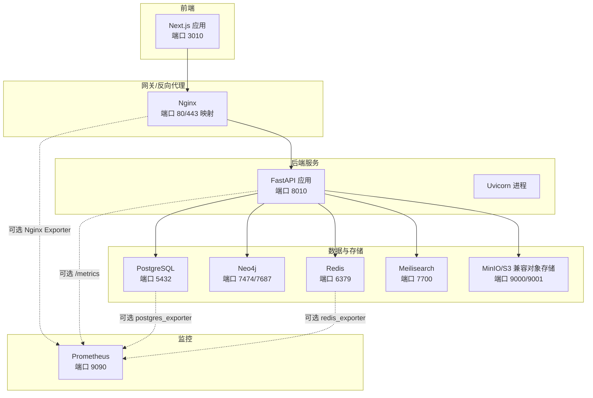
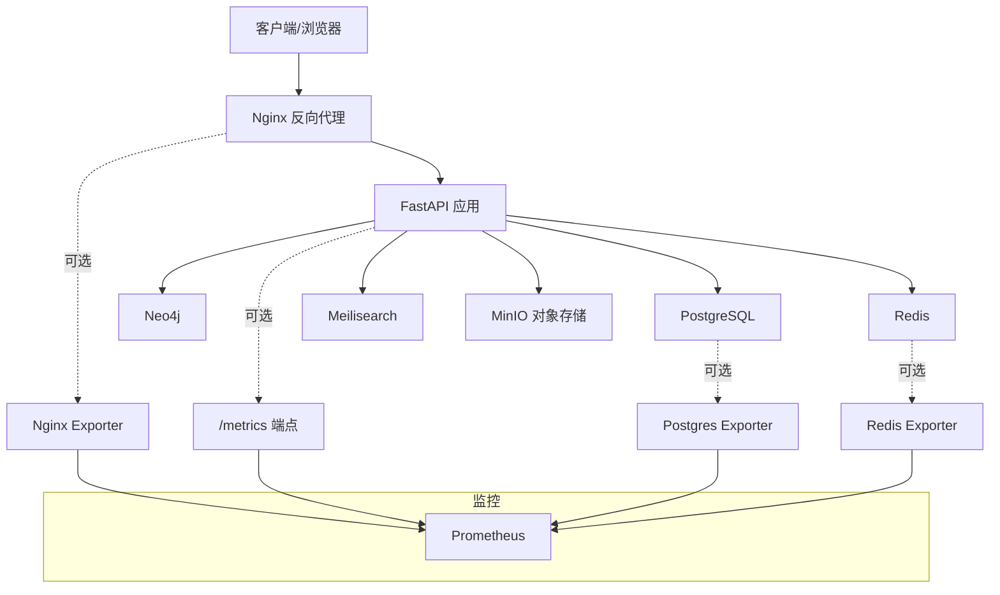
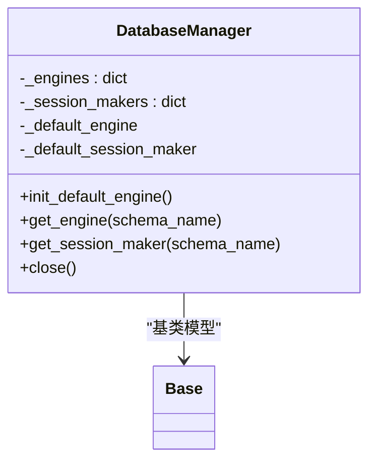
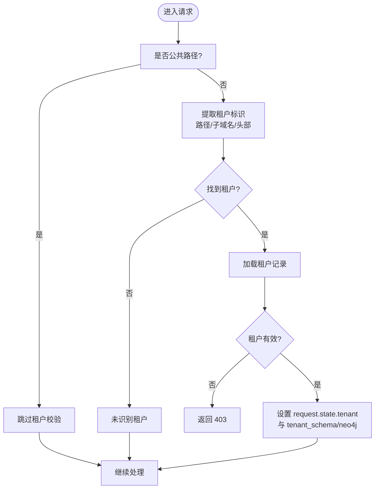
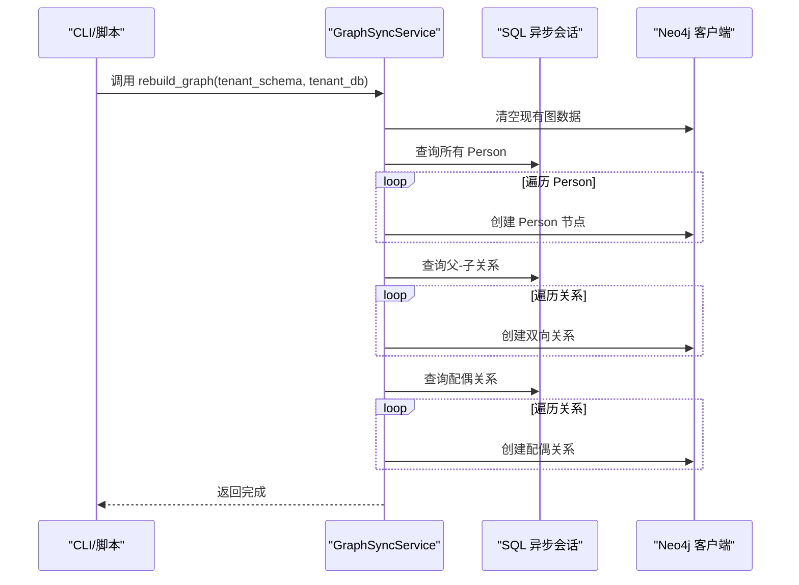
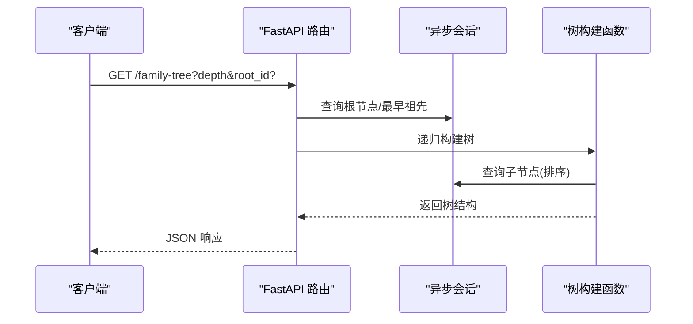
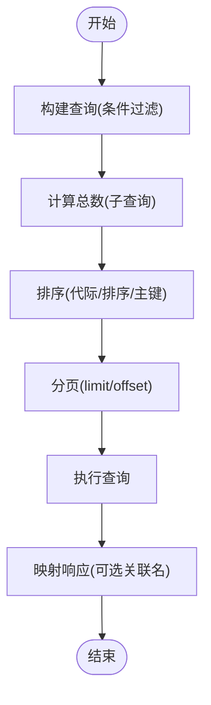
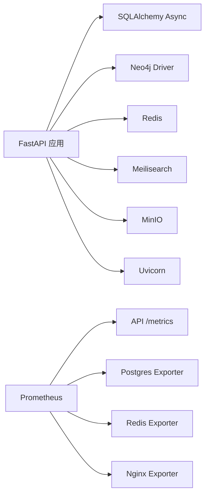

# 性能监控与优化

<cite>
**本文引用的文件**
- [backend/app/main.py](file://backend/app/main.py)
- [backend/app/core/config.py](file://backend/app/core/config.py)
- [backend/app/core/database.py](file://backend/app/core/database.py)
- [backend/app/middleware/tenant.py](file://backend/app/middleware/tenant.py)
- [backend/app/services/neo4j_service.py](file://backend/app/services/neo4j_service.py)
- [backend/app/services/graph_sync.py](file://backend/app/services/graph_sync.py)
- [backend/app/api/v1/endpoints/family_tree.py](file://backend/app/api/v1/endpoints/family_tree.py)
- [backend/app/api/v1/endpoints/persons.py](file://backend/app/api/v1/endpoints/persons.py)
- [docker/prometheus/prometheus.yml](file://docker/prometheus/prometheus.yml)
- [docker/nginx/nginx.conf](file://docker/nginx/nginx.conf)
- [docker-compose.yml](file://docker-compose.yml)
- [docker/postgres/init.sql](file://docker/postgres/init.sql)
- [backend/pyproject.toml](file://backend/pyproject.toml)
- [scripts/sync_neo4j.py](file://scripts/sync_neo4j.py)
</cite>

## 目录
1. [简介](#简介)
2. [项目结构](#项目结构)
3. [核心组件](#核心组件)
4. [架构总览](#架构总览)
5. [详细组件分析](#详细组件分析)
6. [依赖分析](#依赖分析)
7. [性能考虑](#性能考虑)
8. [故障排查指南](#故障排查指南)
9. [结论](#结论)
10. [附录](#附录)

## 简介
本文件面向多租户族谱管理系统，提供系统级性能监控与优化方案。内容覆盖数据库查询性能、API 响应时间、内存使用、并发连接数等关键指标的采集与分析；给出 Prometheus 监控配置与 Grafana 仪表板设置指引；总结识别与解决性能瓶颈的方法（数据库索引与查询优化、缓存策略调整）；并提供 Neo4j 图数据库与 PostgreSQL 的调优最佳实践及性能测试与基准分析建议。

## 项目结构
系统采用前后端分离与容器化部署，后端基于 FastAPI 提供多租户 API，数据库层支持 SQLite/PostgreSQL，图数据库使用 Neo4j，辅以 Redis 缓存与 Meilisearch 搜索。Prometheus 用于服务指标采集，Nginx 作为反向代理与负载均衡入口。

图表来源
- [docker-compose.yml:1-145](file://docker-compose.yml#L1-L145)
- [docker/nginx/nginx.conf:1-57](file://docker/nginx/nginx.conf#L1-L57)
- [backend/app/main.py:45-91](file://backend/app/main.py#L45-L91)

章节来源
- [docker-compose.yml:1-145](file://docker-compose.yml#L1-L145)
- [docker/nginx/nginx.conf:1-57](file://docker/nginx/nginx.conf#L1-L57)
- [backend/app/main.py:45-91](file://backend/app/main.py#L45-L91)

## 核心组件
- 应用入口与生命周期：负责应用启动、数据库引擎初始化、可选外部服务连接、健康检查端点与关闭清理。
- 配置中心：集中管理数据库、缓存、搜索引擎、存储等外部服务地址与参数。
- 数据库管理器：支持 SQLite/PostgreSQL 异步连接池，按租户 schema 切换或 SQLite 多文件隔离。
- 租户中间件：解析子域名/路径/Header 识别租户上下文，注入请求状态。
- Neo4j 客户端与同步服务：封装图查询、构建树结构、统计信息，并提供从 PostgreSQL 同步到 Neo4j 的批量重建与增量同步能力。
- API 层：提供族谱树构建、祖先/后代查询、人员列表与详情等接口，涉及递归查询与多表联结。
- 监控与网关：Prometheus 抓取配置、Nginx 反向代理与限流、上游 keepalive。

章节来源
- [backend/app/main.py:17-42](file://backend/app/main.py#L17-L42)
- [backend/app/core/config.py:11-89](file://backend/app/core/config.py#L11-L89)
- [backend/app/core/database.py:24-118](file://backend/app/core/database.py#L24-L118)
- [backend/app/middleware/tenant.py:15-84](file://backend/app/middleware/tenant.py#L15-L84)
- [backend/app/services/neo4j_service.py:12-53](file://backend/app/services/neo4j_service.py#L12-L53)
- [backend/app/services/graph_sync.py:20-104](file://backend/app/services/graph_sync.py#L20-L104)
- [backend/app/api/v1/endpoints/family_tree.py:43-150](file://backend/app/api/v1/endpoints/family_tree.py#L43-L150)
- [docker/prometheus/prometheus.yml:12-32](file://docker/prometheus/prometheus.yml#L12-L32)
- [docker/nginx/nginx.conf:46-54](file://docker/nginx/nginx.conf#L46-L54)

## 架构总览
系统通过 Nginx 接入流量，后端 API 负责业务逻辑与数据访问；数据库层根据配置选择 SQLite 或 PostgreSQL；图数据库 Neo4j 用于族谱关系查询与可视化；Redis 与 Meilisearch 提供缓存与搜索加速；Prometheus 统一采集各组件指标。

图表来源
- [docker-compose.yml:1-145](file://docker-compose.yml#L1-L145)
- [docker/prometheus/prometheus.yml:12-32](file://docker/prometheus/prometheus.yml#L12-L32)
- [backend/app/main.py:72-86](file://backend/app/main.py#L72-L86)

## 详细组件分析

### 数据库连接与会话管理
- 支持 SQLite 与 PostgreSQL 异步驱动，SQLite 不支持连接池参数，PostgreSQL 使用 pool_size 与 max_overflow 控制连接池。
- 多租户场景下，PostgreSQL 使用 schema 隔离，SQLite 使用独立数据库文件；通过 get_tenant_db 注入 search_path 或切换文件。
- 事务控制在会话依赖中统一提交/回滚，异常时自动回滚并抛出。

图表来源
- [backend/app/core/database.py:24-118](file://backend/app/core/database.py#L24-L118)

章节来源
- [backend/app/core/database.py:33-96](file://backend/app/core/database.py#L33-L96)
- [backend/app/core/database.py:124-171](file://backend/app/core/database.py#L124-L171)
- [backend/app/core/config.py:34-50](file://backend/app/core/config.py#L34-L50)

### 租户中间件与上下文注入
- 优先级：URL 路径 /t/{slug} > 子域名 {slug}.domain > 请求头 X-Tenant-ID。
- 对公共路径（认证、租户注册、文档等）跳过租户校验。
- 将租户对象与 schema 名称写入 request.state，后续路由依赖 get_tenant_db 自动切换数据库上下文。

图表来源
- [backend/app/middleware/tenant.py:39-84](file://backend/app/middleware/tenant.py#L39-L84)
- [backend/app/middleware/tenant.py:116-125](file://backend/app/middleware/tenant.py#L116-L125)

章节来源
- [backend/app/middleware/tenant.py:15-142](file://backend/app/middleware/tenant.py#L15-L142)

### Neo4j 图查询与同步
- 提供节点创建、父子关系、配偶关系、祖先/后代/兄弟/配偶查询、代际成员检索、名称模糊搜索、树结构构建与统计等操作。
- 同步服务支持全量重建与单人快速同步，先清空再重放，保证图数据一致性。

图表来源
- [backend/app/services/graph_sync.py:94-104](file://backend/app/services/graph_sync.py#L94-L104)
- [backend/app/services/neo4j_service.py:65-144](file://backend/app/services/neo4j_service.py#L65-L144)

章节来源
- [backend/app/services/neo4j_service.py:63-373](file://backend/app/services/neo4j_service.py#L63-L373)
- [backend/app/services/graph_sync.py:20-157](file://backend/app/services/graph_sync.py#L20-L157)

### API 查询流程（族谱树）
- 获取族谱树：支持指定根节点或自动定位最早祖先；深度限制防止过度递归。
- 递归构建树节点：按 generation/sort_order 排序，避免无序遍历导致的性能抖动。
- 统计接口：聚合统计总人数与按代际分布。

图表来源
- [backend/app/api/v1/endpoints/family_tree.py:43-150](file://backend/app/api/v1/endpoints/family_tree.py#L43-L150)

章节来源
- [backend/app/api/v1/endpoints/family_tree.py:43-274](file://backend/app/api/v1/endpoints/family_tree.py#L43-L274)

### API 查询流程（人员列表）
- 支持代际、分支、性别、可见性过滤与全文模糊搜索（基于 ilike 与多字段匹配）。
- 分页与总数统计：先 count 再分页查询，避免一次性拉取大结果集。
- 关系字段延迟加载：仅在需要时查询父/母/分支/代际名称。

图表来源
- [backend/app/api/v1/endpoints/persons.py:187-235](file://backend/app/api/v1/endpoints/persons.py#L187-L235)

章节来源
- [backend/app/api/v1/endpoints/persons.py:172-717](file://backend/app/api/v1/endpoints/persons.py#L172-L717)

## 依赖分析
- 外部依赖：FastAPI、SQLAlchemy Async、asyncpg/aiosqlite、Neo4j Python Driver、Redis、Meilisearch、Uvicorn。
- 容器编排：PostgreSQL、Neo4j、Redis、Meilisearch、MinIO、Nginx、Prometheus。
- 监控抓取：Prometheus 配置抓取 API、Postgres Exporter、Redis Exporter、Nginx Exporter。

图表来源
- [backend/pyproject.toml:7-25](file://backend/pyproject.toml#L7-L25)
- [docker/prometheus/prometheus.yml:12-32](file://docker/prometheus/prometheus.yml#L12-L32)

章节来源
- [backend/pyproject.toml:1-61](file://backend/pyproject.toml#L1-L61)
- [docker/prometheus/prometheus.yml:12-32](file://docker/prometheus/prometheus.yml#L12-L32)

## 性能考虑

### 数据库查询性能
- PostgreSQL
  - 连接池：根据并发峰值合理设置 pool_size 与 max_overflow，避免连接饥饿。
  - 索引：为常用过滤字段（如 generation_id、branch_id、visibility、搜索字段）建立复合索引；启用 pg_trgm 扩展支持模糊搜索。
  - 查询：避免 N+1 查询，使用 join 或预先加载；对大数据量表进行分区或物化视图。
  - 统计：定期更新表统计信息，确保查询计划最优。
- SQLite
  - 多租户使用独立文件，避免跨租户竞争；注意 WAL 模式与并发写入限制。

章节来源
- [backend/app/core/config.py:34-50](file://backend/app/core/config.py#L34-L50)
- [backend/app/core/database.py:33-96](file://backend/app/core/database.py#L33-L96)
- [docker/postgres/init.sql:1-8](file://docker/postgres/init.sql#L1-L8)

### API 响应时间
- 路由层：减少不必要的 ORM 查询与字符串拼接；对可选字段延迟加载。
- 递归查询：限制最大深度，避免深链路导致的高时延；必要时引入缓存。
- 分页与排序：固定排序字段，避免随机排序带来的额外开销。

章节来源
- [backend/app/api/v1/endpoints/family_tree.py:71-150](file://backend/app/api/v1/endpoints/family_tree.py#L71-L150)
- [backend/app/api/v1/endpoints/persons.py:187-235](file://backend/app/api/v1/endpoints/persons.py#L187-L235)

### 内存使用
- 连接池：避免创建过多连接；及时释放会话与游标。
- 图查询：限制返回节点数量与深度；对大规模树结构采用分页/分段渲染。
- 缓存：热点数据放入 Redis，设置合理 TTL 与淘汰策略。

章节来源
- [backend/app/core/database.py:24-118](file://backend/app/core/database.py#L24-L118)
- [backend/app/services/neo4j_service.py:146-318](file://backend/app/services/neo4j_service.py#L146-L318)

### 并发连接数
- Nginx：启用 keepalive 与合理的 worker_connections；上游 keepalive 减少后端握手开销。
- PostgreSQL：根据硬件资源与负载设定 pool_size；开启 server_side_cursors 降低内存占用。
- Neo4j：控制并发会话数，避免大量长事务；使用批处理写入。

章节来源
- [docker/nginx/nginx.conf:6-10](file://docker/nginx/nginx.conf#L6-L10)
- [docker/nginx/nginx.conf:46-54](file://docker/nginx/nginx.conf#L46-L54)
- [backend/app/core/database.py:80-86](file://backend/app/core/database.py#L80-L86)

### 缓存策略
- Redis：缓存高频查询结果（如人员列表、树统计、热门分支/代际），设置短 TTL；对写操作采用失效策略。
- 前端缓存：利用浏览器缓存与 CDN；对静态资源启用长期缓存。

章节来源
- [backend/app/core/config.py:46-51](file://backend/app/core/config.py#L46-L51)

### Neo4j 图数据库调优
- 索引与约束：为 Person 节点的标识属性建立唯一索引；为常用查询属性建立索引。
- 查询模式：避免使用 CONTAINS 进行大规模扫描，必要时结合标签/范围查询；使用 LIMIT 控制输出。
- 批量写入：使用事务批量提交，减少网络往返；拆分大型任务为多个小任务。
- 统计与监控：定期运行 schema 分析与查询计划分析，识别慢查询。

章节来源
- [backend/app/services/neo4j_service.py:268-289](file://backend/app/services/neo4j_service.py#L268-L289)
- [backend/app/services/neo4j_service.py:347-373](file://backend/app/services/neo4j_service.py#L347-L373)

### PostgreSQL 数据库优化
- 扩展：启用 uuid-ossp 与 pg_trgm；为模糊搜索创建相似度函数。
- 索引：generation_id、branch_id、visibility、多字段搜索列；组合索引覆盖常见过滤与排序。
- 统计：定期 ANALYZE/VACUUM；使用 EXPLAIN/EXPLAIN ANALYZE 分析慢查询。
- 连接池：合理设置 pool_size 与超时；避免长事务与锁争用。

章节来源
- [docker/postgres/init.sql:1-8](file://docker/postgres/init.sql#L1-L8)
- [backend/app/core/database.py:44-49](file://backend/app/core/database.py#L44-L49)

### 性能测试与基准分析
- 工具：wrk、ab、k6、JMeter 等压测工具；结合 Prometheus/Grafana 观察 CPU、内存、连接数、QPS、P95/P99 延迟。
- 场景：并发用户数从 10→100→500 逐步提升；重点测试族谱树构建、人员列表、搜索、同步等关键路径。
- 指标：每条路径的吞吐、延迟分布、错误率、数据库连接池利用率、图查询耗时。

章节来源
- [docker/prometheus/prometheus.yml:12-32](file://docker/prometheus/prometheus.yml#L12-L32)

## 故障排查指南
- 健康检查：/health 端点返回数据库、Neo4j、Redis、搜索服务可用性，便于快速定位依赖问题。
- 日志与告警：Nginx 访问/错误日志、后端应用日志、数据库与图数据库日志；Prometheus Alertmanager 告警规则（连接数过高、查询超时、缓存命中率低）。
- 常见问题
  - 查询缓慢：检查索引、EXPLAIN 计划、是否存在全表扫描；优化过滤条件与排序字段。
  - 连接池耗尽：增大 pool_size 或优化事务时长；检查长事务与未释放连接。
  - 图查询超时：限制深度与返回数量；拆分查询；使用索引与约束。
  - 缓存不命中：检查键空间设计、TTL 设置、写入策略。

章节来源
- [backend/app/main.py:72-86](file://backend/app/main.py#L72-L86)
- [docker-compose.yml:16-41](file://docker-compose.yml#L16-L41)

## 结论
通过合理的数据库与图数据库设计、连接池与缓存策略、以及完善的监控体系，多租户族谱系统可在高并发场景下保持稳定与高性能。建议持续进行性能回归测试与容量规划，配合 Prometheus/Grafana 实时观测关键指标，及时发现并解决问题。

## 附录

### Prometheus 监控配置与 Grafana 仪表板
- 抓取目标
  - Prometheus 自身、API 应用（/metrics）、Postgres Exporter、Redis Exporter、Nginx Exporter。
- 建议指标
  - API：请求速率、成功率、P95/P99 延迟、活动连接数。
  - PostgreSQL：连接数、查询执行时间、缓冲区命中率、锁等待。
  - Redis：连接数、内存使用、命令耗时、键空间大小。
  - Neo4j：事务数、查询耗时、缓存命中率、堆内存使用。
  - Nginx：请求速率、连接状态分布、响应码分布、上游延迟。

章节来源
- [docker/prometheus/prometheus.yml:12-32](file://docker/prometheus/prometheus.yml#L12-L32)

### Nginx 优化要点
- 启用 epoll、multi_accept、keepalive；
- 合理设置 worker_connections；
- 上游 keepalive 减少后端握手；
- 限流策略保护后端（如登录/注册接口）。

章节来源
- [docker/nginx/nginx.conf:6-10](file://docker/nginx/nginx.conf#L6-L10)
- [docker/nginx/nginx.conf:42-43](file://docker/nginx/nginx.conf#L42-L43)
- [docker/nginx/nginx.conf:46-54](file://docker/nginx/nginx.conf#L46-L54)

### Neo4j 同步与重建
- 全量重建：先清空再重放，适合首次迁移或修复数据。
- 单人快速同步：仅同步指定人员及其直系关系，适合增量更新。
- CLI 脚本：提供便捷入口，便于运维自动化。

章节来源
- [backend/app/services/graph_sync.py:94-104](file://backend/app/services/graph_sync.py#L94-L104)
- [scripts/sync_neo4j.py:14-38](file://scripts/sync_neo4j.py#L14-L38)