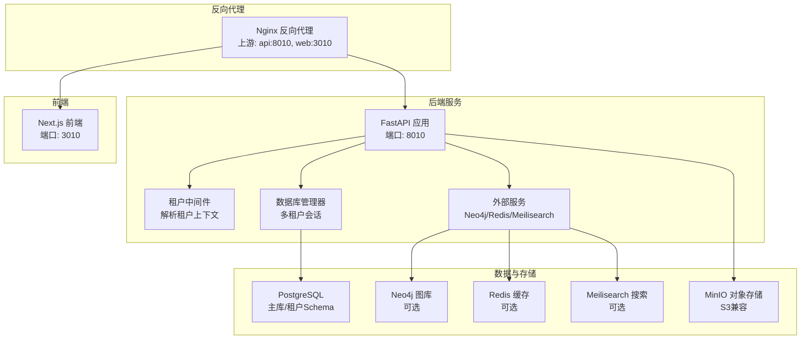
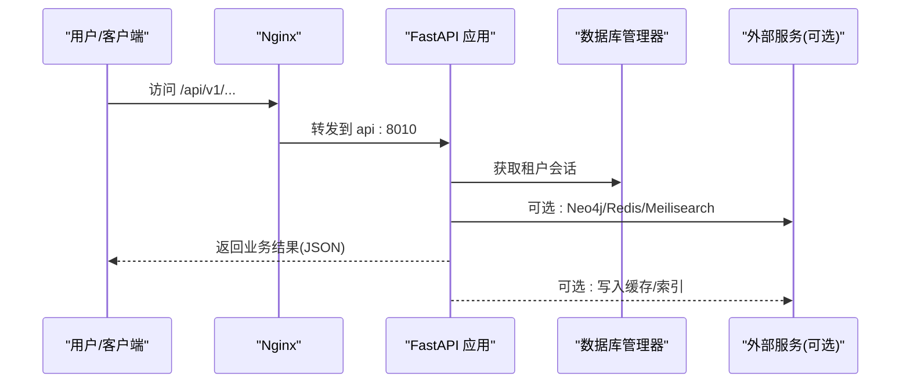
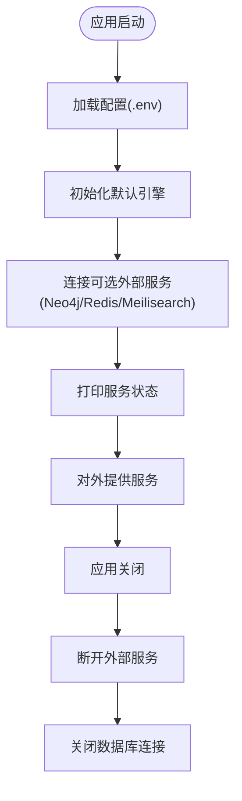
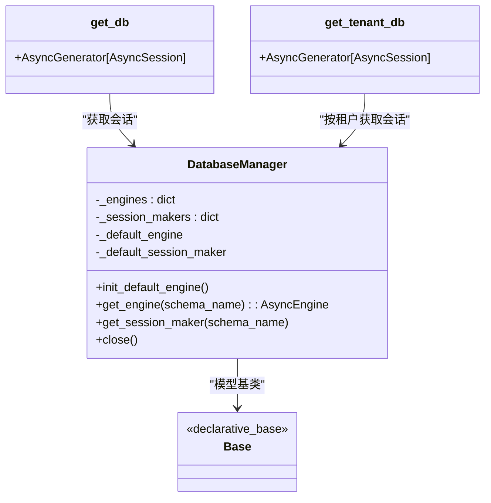
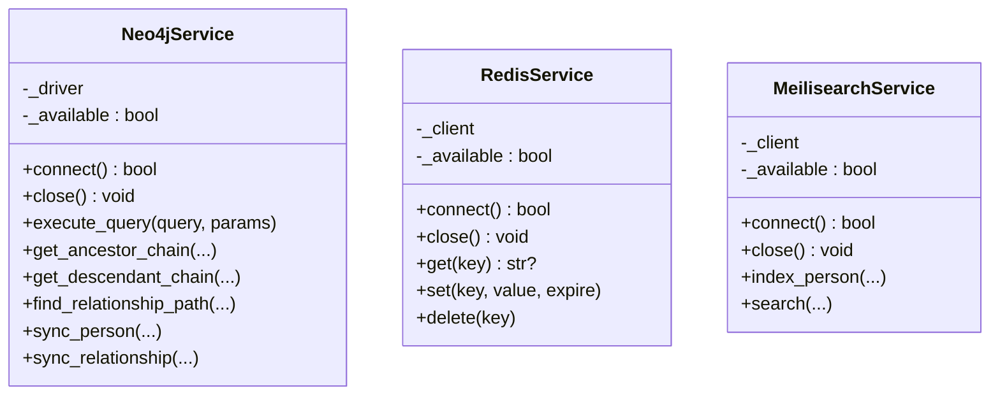
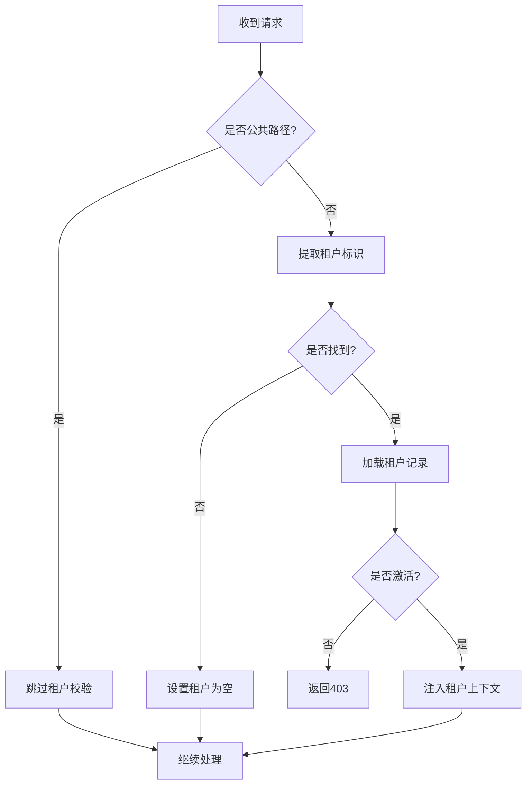
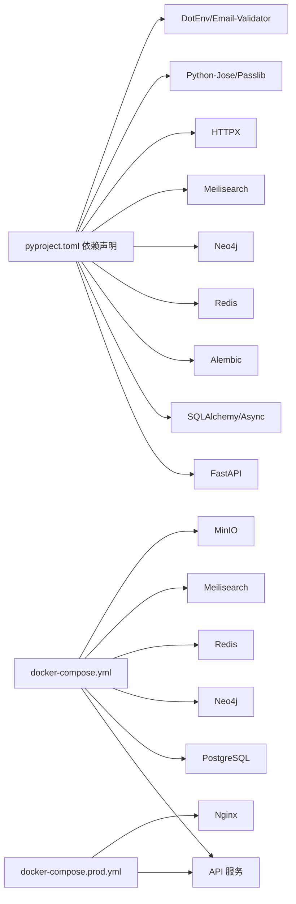

# 故障排除与运维

<cite>
**本文引用的文件**
- [backend/pyproject.toml](file://backend/pyproject.toml)
- [backend/Dockerfile](file://backend/Dockerfile)
- [backend/Dockerfile.prod](file://backend/Dockerfile.prod)
- [docker-compose.yml](file://docker-compose.yml)
- [docker-compose.prod.yml](file://docker-compose.prod.yml)
- [backend/app/core/config.py](file://backend/app/core/config.py)
- [backend/app/core/database.py](file://backend/app/core/database.py)
- [backend/app/main.py](file://backend/app/main.py)
- [backend/app/core/services.py](file://backend/app/core/services.py)
- [backend/app/middleware/tenant.py](file://backend/app/middleware/tenant.py)
- [backend/app/api/v1/endpoints/tenants.py](file://backend/app/api/v1/endpoints/tenants.py)
- [backend/app/api/v1/endpoints/family_tree.py](file://backend/app/api/v1/endpoints/family_tree.py)
- [scripts/create_tenant.py](file://scripts/create_tenant.py)
- [scripts/sync_neo4j.py](file://scripts/sync_neo4j.py)
- [deploy.sh](file://deploy.sh)
- [docker/nginx/nginx.conf](file://docker/nginx/nginx.conf)
</cite>

## 目录
1. [简介](#简介)
2. [项目结构](#项目结构)
3. [核心组件](#核心组件)
4. [架构总览](#架构总览)
5. [详细组件分析](#详细组件分析)
6. [依赖关系分析](#依赖关系分析)
7. [性能考虑](#性能考虑)
8. [故障排除指南](#故障排除指南)
9. [结论](#结论)
10. [附录](#附录)

## 简介
本文件面向多租户族谱管理系统的运维与排障，覆盖服务启动失败、数据库连接问题、API 调用异常、日志分析、性能定位、内存泄漏检测、容器健康检查、服务依赖与网络连通性排查、紧急响应流程与升级机制、维护窗口与滚动更新策略、以及运维自动化与监控告警配置建议。内容基于仓库中的实际代码与配置进行梳理，并提供可操作的排障步骤与最佳实践。

## 项目结构
系统采用前后端分离与多容器编排架构：后端使用 FastAPI 提供 API，前端使用 Next.js，数据库层包含 PostgreSQL（主库）、Neo4j（图数据库）、Redis（缓存）、Meilisearch（搜索）与 MinIO（对象存储）。开发与生产环境通过 docker-compose 进行编排，支持健康检查与反向代理。

图表来源
- [docker-compose.prod.yml:98-172](file://docker-compose.prod.yml#L98-L172)
- [docker-compose.yml:89-132](file://docker-compose.yml#L89-L132)
- [backend/app/main.py:45-91](file://backend/app/main.py#L45-L91)
- [backend/app/core/database.py:24-121](file://backend/app/core/database.py#L24-L121)
- [backend/app/core/services.py:262-284](file://backend/app/core/services.py#L262-L284)
- [docker/nginx/nginx.conf:46-54](file://docker/nginx/nginx.conf#L46-L54)

章节来源
- [docker-compose.prod.yml:1-217](file://docker-compose.prod.yml#L1-L217)
- [docker-compose.yml:1-145](file://docker-compose.yml#L1-L145)
- [backend/app/main.py:1-103](file://backend/app/main.py#L1-L103)
- [docker/nginx/nginx.conf:1-57](file://docker/nginx/nginx.conf#L1-L57)

## 核心组件
- 配置中心：集中管理应用名称、版本、调试模式、环境、端口、数据库、Neo4j、Redis、Meilisearch、JWT、CORS、存储与租户默认策略等。
- 数据库管理器：支持 SQLite（开发）与 PostgreSQL（生产）；在 PostgreSQL 下按租户 schema 隔离；提供会话获取、事务提交/回滚、关闭连接等。
- 外部服务：Neo4j（可选）、Redis（可选）、Meilisearch（可选），均以连接可用性为“可降级”设计，不影响核心 API 启动。
- 租户中间件：从子域名、路径或请求头提取租户标识，校验激活状态，注入租户上下文。
- API 路由：包含租户管理、族谱树查询、祖先/后代查询、统计等接口。
- 容器与健康检查：后端容器内置 /health 探针；Compose 中对各服务定义健康检查；Nginx 作为统一入口与限流。

章节来源
- [backend/app/core/config.py:11-89](file://backend/app/core/config.py#L11-L89)
- [backend/app/core/database.py:24-171](file://backend/app/core/database.py#L24-L171)
- [backend/app/core/services.py:9-284](file://backend/app/core/services.py#L9-L284)
- [backend/app/middleware/tenant.py:15-142](file://backend/app/middleware/tenant.py#L15-L142)
- [backend/app/api/v1/endpoints/tenants.py:1-164](file://backend/app/api/v1/endpoints/tenants.py#L1-L164)
- [backend/app/api/v1/endpoints/family_tree.py:1-274](file://backend/app/api/v1/endpoints/family_tree.py#L1-L274)
- [backend/Dockerfile.prod:42-47](file://backend/Dockerfile.prod#L42-L47)
- [docker-compose.yml:16-20](file://docker-compose.yml#L16-L20)
- [docker-compose.yml:37-41](file://docker-compose.yml#L37-L41)
- [docker-compose.yml:52-56](file://docker-compose.yml#L52-L56)
- [docker-compose.yml:83-87](file://docker-compose.yml#L83-L87)
- [docker/nginx/nginx.conf:41-44](file://docker/nginx/nginx.conf#L41-L44)

## 架构总览
系统通过 Nginx 统一接入，后端 API 提供多租户隔离与可选外部服务能力。生产环境通过 Compose 的健康检查与重启策略保障稳定性；开发环境强调快速迭代与热重载。

图表来源
- [docker/nginx/nginx.conf:46-54](file://docker/nginx/nginx.conf#L46-L54)
- [backend/app/main.py:72-86](file://backend/app/main.py#L72-L86)
- [backend/app/core/database.py:124-171](file://backend/app/core/database.py#L124-L171)
- [backend/app/core/services.py:268-284](file://backend/app/core/services.py#L268-L284)

## 详细组件分析

### 配置与启动生命周期
- 配置加载：从 .env 文件读取键值，支持大小写不敏感与额外字段忽略；提供缓存实例避免重复解析。
- 应用生命周期：启动时初始化默认引擎、连接可选外部服务并打印状态；关闭时断开外部服务与数据库连接。
- 健康检查：/health 返回服务状态（数据库固定为已连接，其他可选服务根据可用性返回）。

图表来源
- [backend/app/core/config.py:82-89](file://backend/app/core/config.py#L82-L89)
- [backend/app/main.py:17-42](file://backend/app/main.py#L17-L42)
- [backend/app/core/services.py:268-284](file://backend/app/core/services.py#L268-L284)

章节来源
- [backend/app/core/config.py:11-89](file://backend/app/core/config.py#L11-L89)
- [backend/app/main.py:17-42](file://backend/app/main.py#L17-L42)
- [backend/app/core/services.py:268-284](file://backend/app/core/services.py#L268-L284)

### 数据库与多租户会话
- 默认引擎：SQLite 不支持连接池参数；PostgreSQL 使用配置的 pool_size 与 max_overflow。
- 多租户：SQLite 按租户生成独立数据库文件；PostgreSQL 使用 schema 隔离；通过 SET search_path 切换租户 schema。
- 事务：会话在 yield 前后自动 commit 或 rollback，确保一致性。

图表来源
- [backend/app/core/database.py:24-121](file://backend/app/core/database.py#L24-L121)
- [backend/app/core/database.py:124-171](file://backend/app/core/database.py#L124-L171)

章节来源
- [backend/app/core/database.py:24-171](file://backend/app/core/database.py#L24-L171)

### 外部服务与可降级设计
- Neo4j：连接成功则启用图查询；失败则回退到 SQL 查询。
- Redis：连接成功则启用缓存；失败则禁用缓存。
- Meilisearch：连接成功则启用全文检索；失败则回退到 SQL LIKE。

图表来源
- [backend/app/core/services.py:9-284](file://backend/app/core/services.py#L9-L284)

章节来源
- [backend/app/core/services.py:9-284](file://backend/app/core/services.py#L9-L284)

### 租户中间件与路由
- 识别顺序：URL 路径(/t/{slug}) > 子域名(subdomain) > 请求头(X-Tenant-ID)。
- 公共路径：认证、租户注册、管理后台、OpenAPI 文档、健康检查等无需租户上下文。
- 激活校验：租户不存在返回 404，未激活返回 403。

图表来源
- [backend/app/middleware/tenant.py:39-84](file://backend/app/middleware/tenant.py#L39-L84)

章节来源
- [backend/app/middleware/tenant.py:15-142](file://backend/app/middleware/tenant.py#L15-L142)

### API 端点与数据访问
- 租户管理：列出公开租户、按 slug 获取租户、创建租户（预留 schema/图库/迁移扩展位）。
- 族谱树：从根节点构建树、查找祖先链、查找后代树、统计信息。
- 会话依赖：租户相关接口通过 get_tenant_db 注入租户会话，非租户接口通过 get_db。

章节来源
- [backend/app/api/v1/endpoints/tenants.py:44-164](file://backend/app/api/v1/endpoints/tenants.py#L44-L164)
- [backend/app/api/v1/endpoints/family_tree.py:42-274](file://backend/app/api/v1/endpoints/family_tree.py#L42-L274)

### 容器与编排
- 开发：后端镜像暴露 8010，Compose 将其映射到宿主机；依赖服务健康后再启动 API。
- 生产：后端镜像内置健康检查；Nginx 作为反向代理；Prometheus/Grafana 可选监控；各服务定义健康检查与重启策略。

章节来源
- [backend/Dockerfile:19-23](file://backend/Dockerfile#L19-L23)
- [backend/Dockerfile.prod:42-47](file://backend/Dockerfile.prod#L42-L47)
- [docker-compose.yml:107-114](file://docker-compose.yml#L107-L114)
- [docker-compose.prod.yml:129-135](file://docker-compose.prod.yml#L129-L135)
- [docker-compose.prod.yml:176-201](file://docker-compose.prod.yml#L176-L201)
- [docker/nginx/nginx.conf:41-44](file://docker/nginx/nginx.conf#L41-L44)

## 依赖关系分析
- 应用依赖：FastAPI、SQLAlchemy 异步、asyncpg/aiosqlite、Alembic、Redis、Neo4j、Meilisearch、Python-Jose、Passlib、HTTPX、DotEnv、Email-Validator。
- 运行时依赖：Python 3.12（生产镜像），运行时仅安装必要系统库。
- 服务依赖：API 依赖 PostgreSQL、Neo4j、Redis、Meilisearch、MinIO；Nginx 依赖 API/Web。

图表来源
- [backend/pyproject.toml:7-25](file://backend/pyproject.toml#L7-L25)
- [docker-compose.yml:5-145](file://docker-compose.yml#L5-L145)
- [docker-compose.prod.yml:1-217](file://docker-compose.prod.yml#L1-L217)

章节来源
- [backend/pyproject.toml:1-61](file://backend/pyproject.toml#L1-L61)
- [docker-compose.yml:1-145](file://docker-compose.yml#L1-L145)
- [docker-compose.prod.yml:1-217](file://docker-compose.prod.yml#L1-L217)

## 性能考虑
- 数据库连接池：PostgreSQL 使用 pool_size 与 max_overflow 控制并发；SQLite 不支持池参数。
- 多租户隔离：PostgreSQL 使用 schema 隔离；SQLite 按租户文件隔离，减少跨租户干扰。
- 可选服务降级：外部服务不可用时，系统仍可工作，但功能受限（图查询、缓存、搜索）。
- 缓存与搜索：Redis 与 Meilisearch 可显著降低查询延迟；未连接时回退到 SQL。
- 反向代理：Nginx 提供压缩、安全头与限流，减轻后端压力。

章节来源
- [backend/app/core/config.py:38-48](file://backend/app/core/config.py#L38-L48)
- [backend/app/core/database.py:33-49](file://backend/app/core/database.py#L33-L49)
- [backend/app/core/database.py:78-94](file://backend/app/core/database.py#L78-L94)
- [backend/app/core/services.py:268-284](file://backend/app/core/services.py#L268-L284)
- [docker/nginx/nginx.conf:28-44](file://docker/nginx/nginx.conf#L28-L44)

## 故障排除指南

### 服务启动失败
- 症状：容器启动即退出或健康检查失败。
- 排查步骤：
  - 查看容器日志：docker-compose logs -f api
  - 检查环境变量与 .env 文件是否正确加载（生产环境需 .env.production）
  - 确认端口占用：8010（API）、80/443（Nginx）、5432（PostgreSQL）、7474/7687（Neo4j）、6379（Redis）、7700（Meilisearch）、9000/9001（MinIO）
  - 健康检查失败：执行 curl -f http://localhost:8010/health 并查看返回状态
- 常见原因：
  - 数据库连接字符串错误或网络不通
  - 外部服务不可用导致连接超时
  - 依赖包安装失败（pip 安装失败）

章节来源
- [deploy.sh:38-43](file://deploy.sh#L38-L43)
- [backend/Dockerfile.prod:42-47](file://backend/Dockerfile.prod#L42-L47)
- [docker-compose.yml:16-20](file://docker-compose.yml#L16-L20)
- [docker-compose.yml:37-41](file://docker-compose.yml#L37-L41)
- [docker-compose.yml:52-56](file://docker-compose.yml#L52-L56)
- [docker-compose.yml:83-87](file://docker-compose.yml#L83-L87)

### 数据库连接问题
- 症状：应用启动时报数据库连接错误或 /health 显示数据库不可用。
- 排查步骤：
  - 确认 DATABASE_URL 是否正确（开发使用 SQLite，生产使用 PostgreSQL）
  - 检查 PostgreSQL 健康状态：docker-compose prod 健康检查
  - 在 API 容器内测试连接：psql -h postgres -U postgres -d genealogy
  - 查看连接池参数：pool_size 与 max_overflow
- 多租户隔离：
  - PostgreSQL：确认 schema 是否存在且可访问
  - SQLite：确认租户数据库文件是否存在且权限正确

章节来源
- [backend/app/core/config.py:34-38](file://backend/app/core/config.py#L34-L38)
- [backend/app/core/database.py:33-49](file://backend/app/core/database.py#L33-L49)
- [backend/app/core/database.py:78-94](file://backend/app/core/database.py#L78-L94)
- [docker-compose.yml:16-20](file://docker-compose.yml#L16-L20)
- [docker-compose.prod.yml:18-22](file://docker-compose.prod.yml#L18-L22)

### API 调用异常
- 症状：404（租户不存在）、403（租户未激活）、400（参数非法）、500（内部错误）。
- 排查步骤：
  - 检查租户中间件：确认请求头/子域名/路径是否正确传递租户标识
  - 校验租户状态：数据库中租户是否 is_active
  - 参数校验：UUID 格式、深度限制、分页参数范围
  - 外部服务可用性：/health 中 Neo4j/Redis/Meilisearch 状态
- 常见场景：
  - 未设置 X-Tenant-ID 或子域名不匹配
  - 传入无效 person_id 导致 400
  - 租户未初始化 schema 导致查询空结果

章节来源
- [backend/app/middleware/tenant.py:40-84](file://backend/app/middleware/tenant.py#L40-L84)
- [backend/app/api/v1/endpoints/family_tree.py:56-58](file://backend/app/api/v1/endpoints/family_tree.py#L56-L58)
- [backend/app/api/v1/endpoints/family_tree.py:163-165](file://backend/app/api/v1/endpoints/family_tree.py#L163-L165)
- [backend/app/main.py:72-86](file://backend/app/main.py#L72-L86)

### 日志分析技巧
- 容器日志：docker-compose logs -f api/web/postgres/neo4j/redis/meilisearch/minio
- API 启动日志：关注数据库与外部服务连接状态打印
- Nginx 日志：access.log 与 error.log，结合限流规则定位异常流量
- 建议：将日志输出到 stdout/stderr，配合 Docker 日志驱动收集

章节来源
- [docker-compose.prod.yml:176-201](file://docker-compose.prod.yml#L176-L201)
- [docker/nginx/nginx.conf:16-20](file://docker/nginx/nginx.conf#L16-L20)

### 性能问题定位
- CPU/内存：使用 docker stats 或 Prometheus/Grafana 监控
- 数据库慢查询：检查连接池饱和度与查询计划
- 外部服务瓶颈：Redis/Meilisearch 响应时间与队列长度
- 反向代理：Nginx 的 keepalive 与限流配置是否合理

章节来源
- [docker-compose.prod.yml:176-201](file://docker-compose.prod.yml#L176-L201)
- [docker/nginx/nginx.conf:46-54](file://docker/nginx/nginx.conf#L46-L54)

### 内存泄漏检测
- 方法：定期对比进程 RSS/堆内存指标；观察长时间运行后内存持续增长
- 建议：限制容器内存上限；使用异步资源及时释放；避免大对象常驻

[本节为通用指导，无需特定文件来源]

### 容器健康检查
- API 健康检查：curl -f http://localhost:8010/health
- 各服务健康检查：PostgreSQL、Neo4j、Redis、Meilisearch、MinIO
- 生产环境：restart: unless-stopped 自动重启

章节来源
- [backend/Dockerfile.prod:42-47](file://backend/Dockerfile.prod#L42-L47)
- [docker-compose.yml:16-20](file://docker-compose.yml#L16-L20)
- [docker-compose.yml:37-41](file://docker-compose.yml#L37-L41)
- [docker-compose.yml:52-56](file://docker-compose.yml#L52-L56)
- [docker-compose.yml:83-87](file://docker-compose.yml#L83-L87)
- [docker-compose.prod.yml:129-135](file://docker-compose.prod.yml#L129-L135)

### 服务依赖关系与网络连通性
- 依赖顺序：postgres/neo4j/redis 健康后启动 api；web 依赖 api
- 网络：所有服务位于同一自定义网络，容器间通过服务名通信
- 连通性验证：在 api 容器内 ping postgres/neo4j/redis/meilisearch/minio

章节来源
- [docker-compose.yml:107-114](file://docker-compose.yml#L107-L114)
- [docker-compose.prod.yml:122-135](file://docker-compose.prod.yml#L122-L135)

### 紧急响应流程、故障升级与沟通
- 流程建议：
  - 发现告警 → 快速核验 /health 与关键日志 → 评估影响范围（单租户/全站）
  - 临时措施：降级外部服务、回滚最近变更、扩容资源
  - 升级：若影响用户登录/核心功能，升级至值班负责人
  - 沟通：通知相关租户与产品团队，同步修复进展
- 依据：外部服务可降级设计，API 仍可提供基础能力

章节来源
- [backend/app/core/services.py:268-284](file://backend/app/core/services.py#L268-L284)
- [backend/app/main.py:25-35](file://backend/app/main.py#L25-L35)

### 维护窗口、滚动更新与零停机部署
- 维护窗口：选择低峰时段执行数据库迁移与缓存清理
- 滚动更新：Compose up -d 后等待健康检查；必要时手动重启
- 零停机策略：
  - 使用 Nginx 上游保持 keepalive
  - 先更新静态资源（web），再更新 API
  - 预热新实例，逐步切换流量
- 自动化：deploy.sh 已包含构建、启动、健康检查、迁移与缓存清理

章节来源
- [deploy.sh:26-53](file://deploy.sh#L26-L53)
- [docker-compose.prod.yml:129-135](file://docker-compose.prod.yml#L129-L135)
- [docker/nginx/nginx.conf:46-54](file://docker/nginx/nginx.conf#L46-L54)

### 运维自动化与监控告警
- 自动化脚本：
  - 创建租户：scripts/create_tenant.py（创建 schema、初始化表、Neo4j 连通性验证）
  - 同步图数据：scripts/sync_neo4j.py（将租户数据同步到 Neo4j）
- 监控告警（建议）：
  - Prometheus 抓取 API/Nginx/数据库指标
  - Grafana 展示面板：QPS、P95/P99 延迟、错误率、连接池使用率、外部服务可用性
  - 告警规则：健康检查失败、CPU/内存/磁盘阈值、慢查询、外部服务不可用

章节来源
- [scripts/create_tenant.py:18-44](file://scripts/create_tenant.py#L18-L44)
- [scripts/create_tenant.py:69-205](file://scripts/create_tenant.py#L69-L205)
- [scripts/sync_neo4j.py:14-38](file://scripts/sync_neo4j.py#L14-L38)
- [docker-compose.prod.yml:176-201](file://docker-compose.prod.yml#L176-L201)

## 结论
本系统通过可选外部服务与多租户隔离设计，在保证核心功能可用的同时提供了良好的扩展性与可维护性。运维侧应重点关注容器健康检查、数据库连接与多租户 schema 管理、外部服务可用性与 Nginx 限流配置，并建立完善的自动化脚本与监控告警体系，以实现稳定、可观测、可恢复的生产运行。

## 附录

### 常用命令速查
- 启动/停止：docker-compose -f docker-compose.prod.yml up -d / down
- 查看日志：logs -f api/web/postgres/neo4j/redis/meilisearch/minio
- 健康检查：curl -f http://localhost:8010/health
- 数据库迁移：exec api alembic upgrade head
- 清理缓存：exec redis redis-cli FLUSHALL

章节来源
- [deploy.sh:38-63](file://deploy.sh#L38-L63)
- [docker-compose.prod.yml:129-135](file://docker-compose.prod.yml#L129-L135)