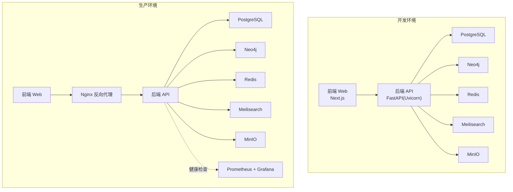
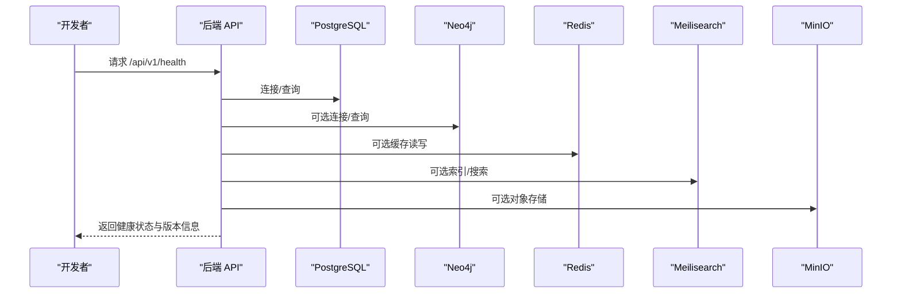
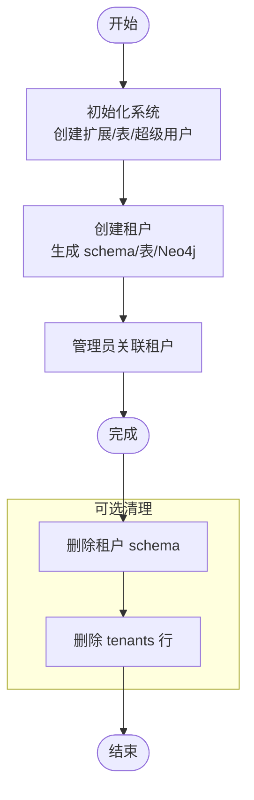
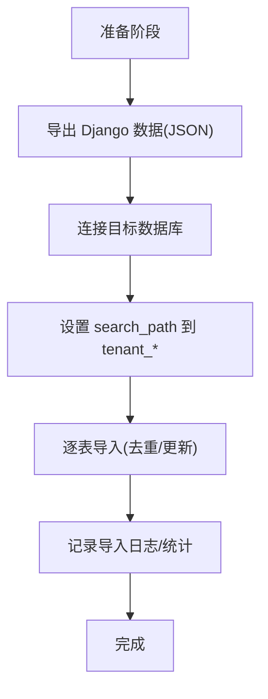
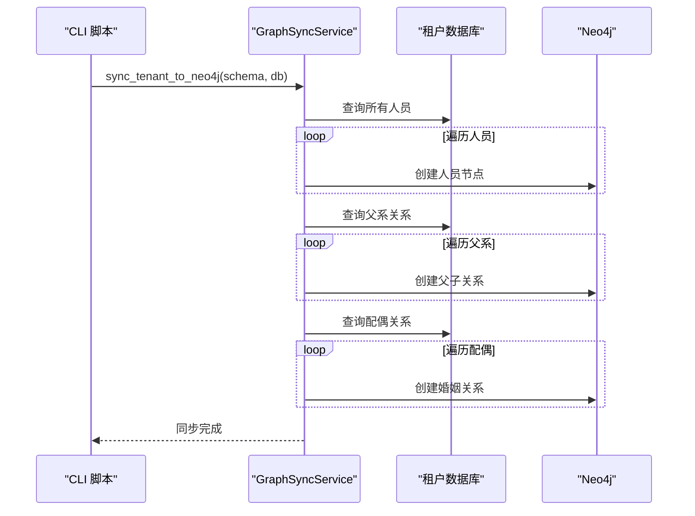
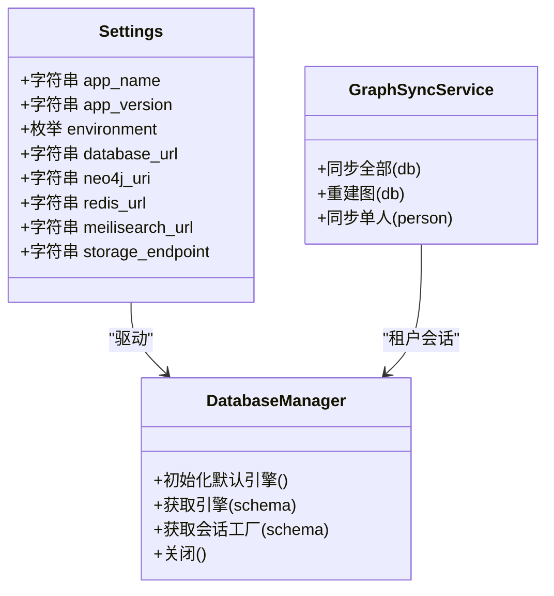
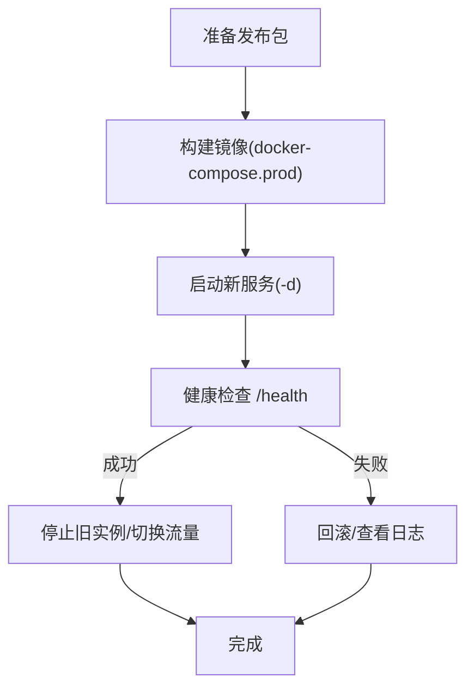
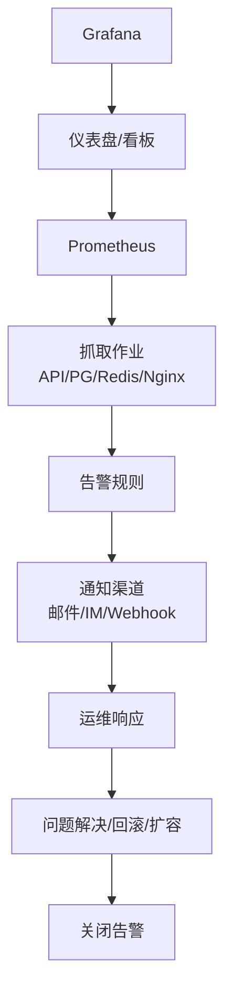
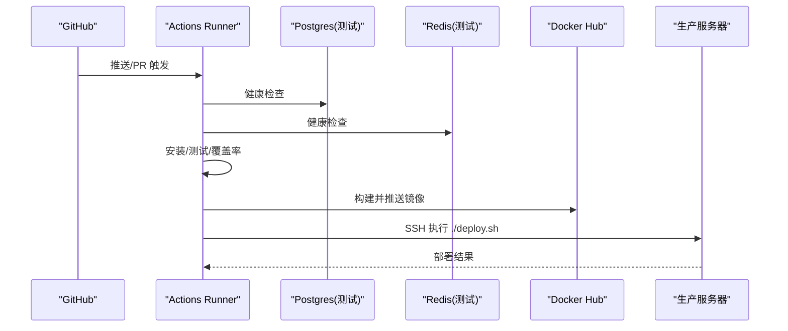
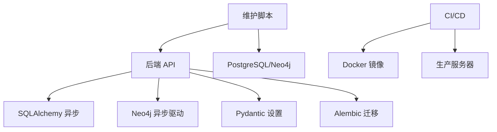

# 维护与自动化

<cite>
**本文引用的文件**
- [scripts/create_tenant.py](file://scripts/create_tenant.py)
- [scripts/init_system.py](file://scripts/init_system.py)
- [scripts/migrate_data.py](file://scripts/migrate_data.py)
- [scripts/sync_neo4j.py](file://scripts/sync_neo4j.py)
- [backend/app/services/graph_sync.py](file://backend/app/services/graph_sync.py)
- [backend/app/services/neo4j_service.py](file://backend/app/services/neo4j_service.py)
- [backend/app/main.py](file://backend/app/main.py)
- [backend/app/core/config.py](file://backend/app/core/config.py)
- [backend/app/core/database.py](file://backend/app/core/database.py)
- [backend/alembic.ini](file://backend/alembic.ini)
- [.github/workflows/ci-cd.yml](file://.github/workflows/ci-cd.yml)
- [docker-compose.yml](file://docker-compose.yml)
- [docker-compose.prod.yml](file://docker-compose.prod.yml)
- [deploy.sh](file://deploy.sh)
- [docker/prometheus/prometheus.yml](file://docker/prometheus/prometheus.yml)
</cite>

## 目录
1. [简介](#简介)
2. [项目结构](#项目结构)
3. [核心组件](#核心组件)
4. [架构总览](#架构总览)
5. [详细组件分析](#详细组件分析)
6. [依赖分析](#依赖分析)
7. [性能考虑](#性能考虑)
8. [故障排查指南](#故障排查指南)
9. [结论](#结论)
10. [附录](#附录)

## 简介
本文件面向多租户族谱管理系统，提供系统日常维护与自动化运维的完整指南。内容覆盖：
- 数据备份与恢复（基于现有脚本与容器卷）
- 租户初始化与清理（脚本化流程）
- 数据迁移（从旧系统到新系统的迁移脚本）
- 图数据库同步（PostgreSQL 到 Neo4j 的增量/全量同步）
- 维护窗口规划与滚动更新策略（零停机部署）
- 监控告警配置与响应流程（Prometheus/Grafana）
- 运维自动化最佳实践（Docker 容器编排、CI/CD 流水线）

## 项目结构
系统采用前后端分离与多服务容器化架构，后端使用 FastAPI + SQLAlchemy 异步 ORM，前端使用 Next.js，数据库为 PostgreSQL，图数据库为 Neo4j，缓存与搜索分别使用 Redis 和 Meilisearch，对象存储使用 MinIO。

图表来源
- [docker-compose.yml:1-145](file://docker-compose.yml#L1-L145)
- [docker-compose.prod.yml:1-217](file://docker-compose.prod.yml#L1-L217)

章节来源
- [docker-compose.yml:1-145](file://docker-compose.yml#L1-L145)
- [docker-compose.prod.yml:1-217](file://docker-compose.prod.yml#L1-L217)

## 核心组件
- 后端应用入口与生命周期管理：负责启动时连接可选服务（Neo4j/Redis/Meilisearch），健康检查端点与中间件注册。
- 配置中心：集中管理数据库、缓存、搜索引擎、存储、JWT 等配置项。
- 数据库管理：支持多租户模式（PostgreSQL 使用 schema，SQLite 使用独立文件），提供会话管理与上下文封装。
- 图同步服务：将 PostgreSQL 中的人口数据同步到 Neo4j，支持全量重建与单人快速同步。
- Neo4j 客户端：封装节点创建、关系建立、查询与统计等操作。
- 维护脚本：租户初始化、系统初始化、数据迁移、Neo4j 同步等。
- 编排与部署：docker-compose 开发与生产环境；部署脚本；CI/CD 流水线。

章节来源
- [backend/app/main.py:17-43](file://backend/app/main.py#L17-L43)
- [backend/app/core/config.py:11-89](file://backend/app/core/config.py#L11-L89)
- [backend/app/core/database.py:24-171](file://backend/app/core/database.py#L24-L171)
- [backend/app/services/graph_sync.py:20-157](file://backend/app/services/graph_sync.py#L20-L157)
- [backend/app/services/neo4j_service.py:12-373](file://backend/app/services/neo4j_service.py#L12-L373)
- [scripts/init_system.py:18-77](file://scripts/init_system.py#L18-L77)
- [scripts/create_tenant.py:231-282](file://scripts/create_tenant.py#L231-L282)
- [scripts/migrate_data.py:14-136](file://scripts/migrate_data.py#L14-L136)
- [scripts/sync_neo4j.py:14-38](file://scripts/sync_neo4j.py#L14-L38)

## 架构总览
系统通过 FastAPI 提供统一 API，按租户隔离数据（PostgreSQL schema 或 SQLite 文件），Neo4j 用于图计算与关系查询。容器编排通过 docker-compose 实现，生产环境增加 Nginx 反向代理与监控。

图表来源
- [backend/app/main.py:72-86](file://backend/app/main.py#L72-L86)
- [backend/app/core/config.py:34-67](file://backend/app/core/config.py#L34-L67)

## 详细组件分析

### 租户初始化与清理
- 初始化系统：创建系统表、扩展、超级用户、首个租户、租户 schema，并将管理员关联到租户。
- 创建租户：生成租户 schema 与基础表，初始化 Neo4j 连通性（社区版以命名空间方式隔离）。
- 清理与重置：可复用初始化逻辑或在脚本中添加删除 schema/数据的步骤。

图表来源
- [scripts/init_system.py:18-77](file://scripts/init_system.py#L18-L77)
- [scripts/create_tenant.py:18-44](file://scripts/create_tenant.py#L18-L44)
- [scripts/create_tenant.py:69-206](file://scripts/create_tenant.py#L69-L206)

章节来源
- [scripts/init_system.py:18-220](file://scripts/init_system.py#L18-L220)
- [scripts/create_tenant.py:18-306](file://scripts/create_tenant.py#L18-L306)

### 数据迁移
- 从 Django 备份导出 JSON，再由迁移脚本导入到目标租户 schema。
- 支持 generations、branches、persons、spouse_relations 的导入与冲突处理。
- 建议在迁移前设置只读或维护模式，迁移后校验数量与关键字段。

图表来源
- [scripts/migrate_data.py:14-136](file://scripts/migrate_data.py#L14-L136)

章节来源
- [scripts/migrate_data.py:14-173](file://scripts/migrate_data.py#L14-L173)

### 图数据库同步
- 全量同步：遍历人员与配偶关系，创建节点与关系，支持重建图。
- 单人快速同步：仅同步指定人员及其父系关系。
- CLI 脚本：根据租户 slug 触发同步。

图表来源
- [backend/app/services/graph_sync.py:64-92](file://backend/app/services/graph_sync.py#L64-L92)
- [backend/app/services/graph_sync.py:106-115](file://backend/app/services/graph_sync.py#L106-L115)
- [scripts/sync_neo4j.py:14-38](file://scripts/sync_neo4j.py#L14-L38)

章节来源
- [backend/app/services/graph_sync.py:20-157](file://backend/app/services/graph_sync.py#L20-L157)
- [backend/app/services/neo4j_service.py:65-144](file://backend/app/services/neo4j_service.py#L65-L144)
- [scripts/sync_neo4j.py:14-41](file://scripts/sync_neo4j.py#L14-L41)

### 数据库与配置
- 配置项：数据库连接、Neo4j、Redis、Meilisearch、JWT、CORS、存储等。
- 数据库管理：多租户引擎与会话工厂，支持 PostgreSQL schema 与 SQLite 文件两种模式。
- 生命周期：应用启动时连接可选服务，关闭时释放资源。

图表来源
- [backend/app/core/config.py:11-89](file://backend/app/core/config.py#L11-L89)
- [backend/app/core/database.py:24-171](file://backend/app/core/database.py#L24-L171)
- [backend/app/services/graph_sync.py:20-104](file://backend/app/services/graph_sync.py#L20-L104)

章节来源
- [backend/app/core/config.py:11-89](file://backend/app/core/config.py#L11-L89)
- [backend/app/core/database.py:24-171](file://backend/app/core/database.py#L24-L171)
- [backend/app/main.py:17-43](file://backend/app/main.py#L17-L43)

### 部署与滚动更新策略
- 开发环境：docker-compose 启动各服务，便于本地联调。
- 生产环境：docker-compose.prod.yml 启动 API/Web/Nginx/数据库/缓存/搜索/存储/监控。
- 滚动更新建议：使用多实例与健康检查，先拉起新实例，等待健康检查通过后再停止旧实例；或通过反向代理切换流量。
- 零停机要点：数据库迁移在维护窗口执行；缓存清空在迁移后进行；健康检查失败回滚。

图表来源
- [deploy.sh:26-53](file://deploy.sh#L26-L53)
- [docker-compose.prod.yml:129-133](file://docker-compose.prod.yml#L129-L133)

章节来源
- [docker-compose.yml:1-145](file://docker-compose.yml#L1-L145)
- [docker-compose.prod.yml:1-217](file://docker-compose.prod.yml#L1-L217)
- [deploy.sh:1-64](file://deploy.sh#L1-L64)

### 监控告警与响应流程
- Prometheus 抓取目标：Prometheus 自身、API、PostgreSQL Exporter、Redis Exporter、Nginx Exporter。
- Grafana：可视化指标与告警面板。
- 建议规则：CPU/内存/连接数/请求延迟/错误率/健康检查失败次数。
- 响应流程：告警触发 → 自动通知 → 运维介入 → 回滚/扩容/修复 → 关闭告警。

图表来源
- [docker/prometheus/prometheus.yml:12-32](file://docker/prometheus/prometheus.yml#L12-L32)
- [docker-compose.prod.yml:176-201](file://docker-compose.prod.yml#L176-L201)

章节来源
- [docker/prometheus/prometheus.yml:1-32](file://docker/prometheus/prometheus.yml#L1-L32)
- [docker-compose.prod.yml:174-201](file://docker-compose.prod.yml#L174-L201)

### CI/CD 流水线
- 触发条件：推送到 main/develop 分支或打开 PR。
- 步骤：安装依赖 → 运行测试（后端/前端）→ 上传覆盖率 → 构建并推送 Docker 镜像 → SSH 登录服务器执行部署脚本。

图表来源
- [.github/workflows/ci-cd.yml:14-160](file://.github/workflows/ci-cd.yml#L14-L160)

章节来源
- [.github/workflows/ci-cd.yml:1-160](file://.github/workflows/ci-cd.yml#L1-L160)

## 依赖分析
- 应用层依赖：FastAPI、SQLAlchemy 异步、Neo4j 异步驱动、Pydantic 设置。
- 运维层依赖：Docker Compose、Prometheus、Grafana、Nginx、PostgreSQL/Neo4j/Redis/Meilisearch/MinIO。
- 脚本依赖：asyncpg、psycopg、passlib、neo4j、alembic。

图表来源
- [backend/app/core/config.py:11-89](file://backend/app/core/config.py#L11-L89)
- [backend/app/core/database.py:8-16](file://backend/app/core/database.py#L8-L16)
- [backend/alembic.ini:8-8](file://backend/alembic.ini#L8-L8)
- [.github/workflows/ci-cd.yml:104-141](file://.github/workflows/ci-cd.yml#L104-L141)

章节来源
- [backend/app/core/config.py:11-89](file://backend/app/core/config.py#L11-L89)
- [backend/app/core/database.py:8-16](file://backend/app/core/database.py#L8-L16)
- [backend/alembic.ini:8-8](file://backend/alembic.ini#L8-L8)
- [.github/workflows/ci-cd.yml:104-141](file://.github/workflows/ci-cd.yml#L104-L141)

## 性能考虑
- 数据库连接池：合理设置 pool_size 与 max_overflow，避免连接争用。
- 图同步批处理：分页/批量写入 Neo4j，减少事务开销。
- 缓存策略：热点数据缓存，失效时间与一致性权衡。
- 搜索优化：索引策略与查询过滤，避免全表扫描。
- 监控指标：关注慢查询、连接数峰值、GC/内存使用、磁盘 IO。

## 故障排查指南
- 健康检查失败：查看 API 健康端点返回与容器日志，确认数据库/图数据库/缓存/搜索连通性。
- Neo4j 连接异常：检查认证、网络、版本兼容性与插件是否启用。
- 数据迁移中断：定位 JSON 文件完整性与字段映射，必要时回滚并重试。
- 部署失败：查看部署脚本输出与容器日志，确认健康检查与迁移是否成功。
- 监控告警：根据规则阈值与通知渠道定位问题根因，执行预案。

章节来源
- [backend/app/main.py:72-86](file://backend/app/main.py#L72-L86)
- [deploy.sh:38-43](file://deploy.sh#L38-L43)
- [docker-compose.prod.yml:129-133](file://docker-compose.prod.yml#L129-L133)

## 结论
通过脚本化初始化、迁移与同步，结合容器化编排与 CI/CD 流水线，系统实现了可重复、可审计的运维流程。配合 Prometheus/Grafana 监控与滚动更新策略，可在保证业务连续性的前提下实现高效迭代与稳定运行。

## 附录
- 维护窗口规划建议
  - 将数据库迁移安排在低峰时段，提前通知用户。
  - 同步图数据在业务低谷执行，避免影响实时查询。
- 滚动更新最佳实践
  - 多实例部署，健康检查通过后再停止旧实例。
  - 使用蓝绿或金丝雀发布，逐步切换流量。
- 自动化脚本编写指南
  - 参数化配置，支持环境变量与配置文件。
  - 增加幂等性与回滚能力，记录日志与状态。
  - 在 CI/CD 中集成健康检查与自动化部署。