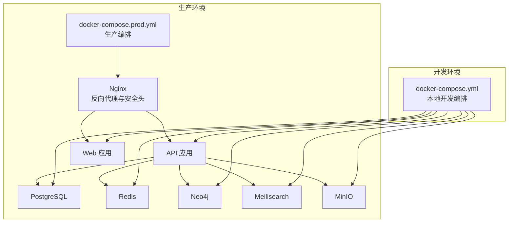
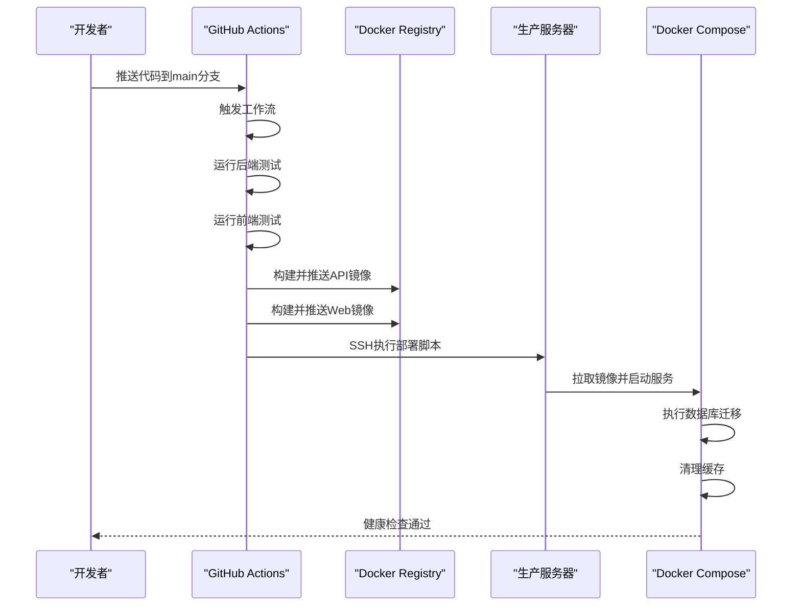
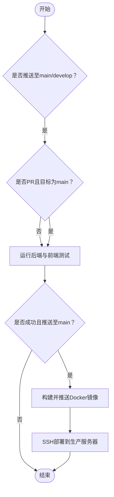
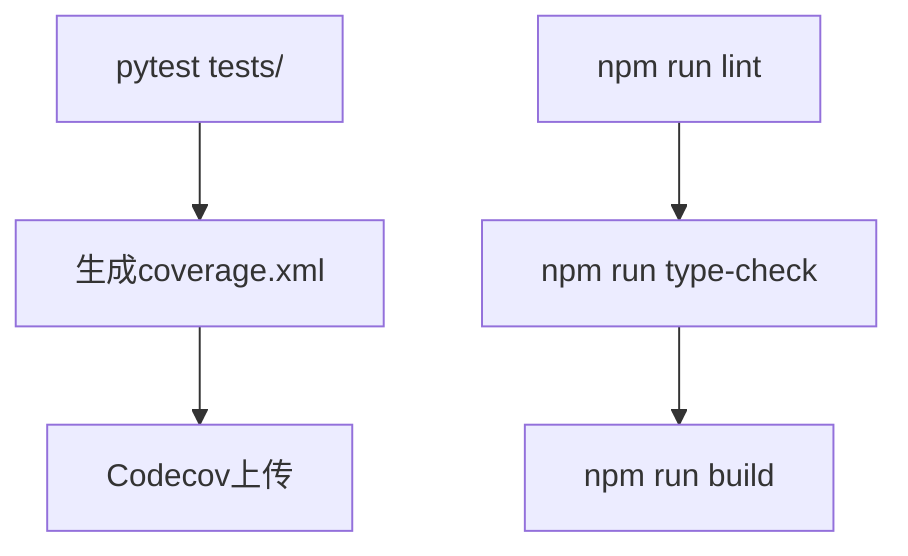
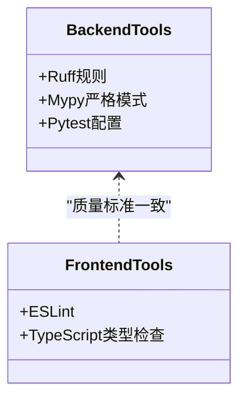
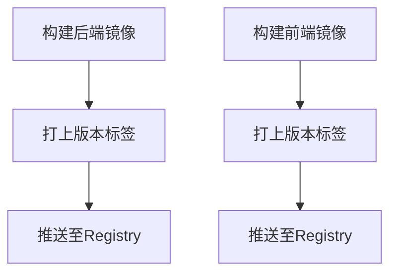
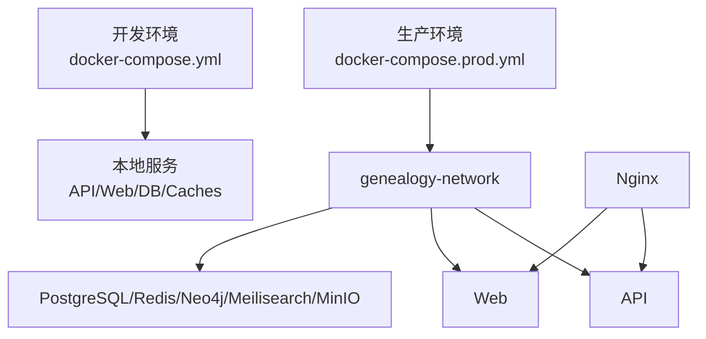
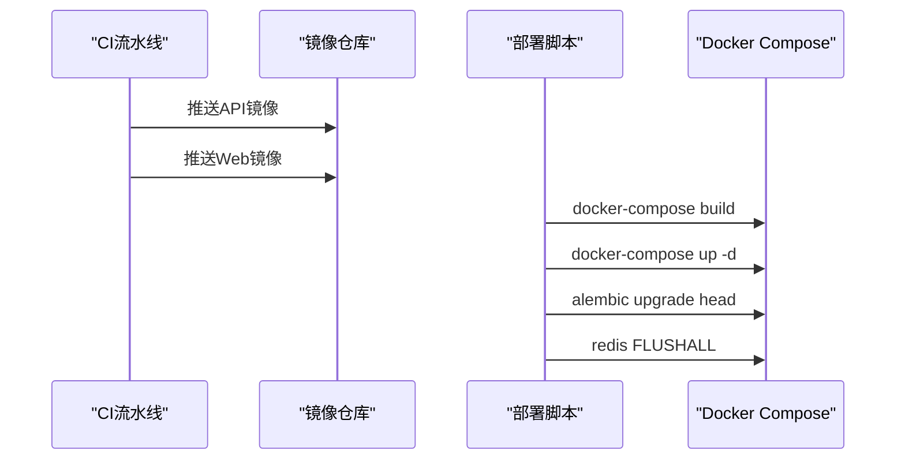
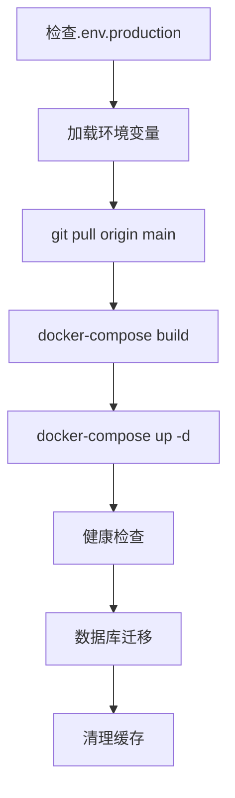
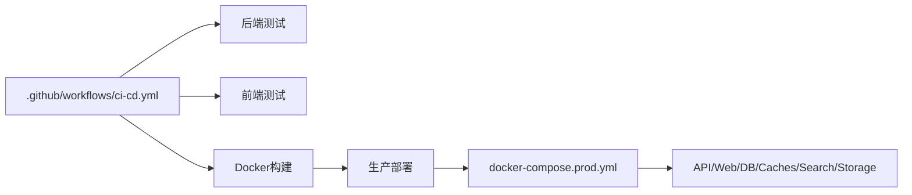

# CI/CD流水线

<cite>
**本文档引用的文件**
- [.github/workflows/ci-cd.yml](file://.github/workflows/ci-cd.yml)
- [backend/Dockerfile](file://backend/Dockerfile)
- [backend/Dockerfile.prod](file://backend/Dockerfile.prod)
- [frontend/Dockerfile](file://frontend/Dockerfile)
- [docker-compose.yml](file://docker-compose.yml)
- [docker-compose.prod.yml](file://docker-compose.prod.yml)
- [deploy.sh](file://deploy.sh)
- [backend/pyproject.toml](file://backend/pyproject.toml)
- [backend/alembic.ini](file://backend/alembic.ini)
- [docker/nginx/nginx.conf](file://docker/nginx/nginx.conf)
- [backend/tests/conftest.py](file://backend/tests/conftest.py)
- [backend/tests/test_tenants.py](file://backend/tests/test_tenants.py)
- [scripts/create_tenant.py](file://scripts/create_tenant.py)
- [scripts/init_system.py](file://scripts/init_system.py)
- [frontend/package.json](file://frontend/package.json)
</cite>

## 目录
1. [简介](#简介)
2. [项目结构](#项目结构)
3. [核心组件](#核心组件)
4. [架构总览](#架构总览)
5. [详细组件分析](#详细组件分析)
6. [依赖关系分析](#依赖关系分析)
7. [性能考虑](#性能考虑)
8. [故障排除指南](#故障排除指南)
9. [结论](#结论)
10. [附录](#附录)

## 简介
本文件为多租户族谱管理系统提供完整的CI/CD流水线配置文档，涵盖GitHub Actions工作流、构建触发条件、自动化测试与代码质量检查、安全扫描集成、多环境部署（开发/测试/生产）、容器镜像构建与版本标签管理、发布流程、部署回滚策略、蓝绿与金丝雀发布配置，以及部署脚本、环境变量与配置文件注入方法。

## 项目结构
系统采用前后端分离与多服务编排架构，核心组件包括：
- 后端：FastAPI应用，使用异步数据库连接与多租户架构
- 前端：Next.js应用，支持多租户路由
- 数据与中间件：PostgreSQL（多租户Schema）、Redis缓存、Neo4j图数据库、Meilisearch搜索引擎、MinIO对象存储
- 反向代理：Nginx统一入口与安全头配置
- 部署：Docker Compose生产编排与SSH远程部署脚本

图表来源
- [docker-compose.yml:1-145](file://docker-compose.yml#L1-L145)
- [docker-compose.prod.yml:1-217](file://docker-compose.prod.yml#L1-L217)
- [docker/nginx/nginx.conf:1-57](file://docker/nginx/nginx.conf#L1-L57)

章节来源
- [docker-compose.yml:1-145](file://docker-compose.yml#L1-L145)
- [docker-compose.prod.yml:1-217](file://docker-compose.prod.yml#L1-L217)
- [docker/nginx/nginx.conf:1-57](file://docker/nginx/nginx.conf#L1-L57)

## 核心组件
- GitHub Actions流水线：定义在工作流文件中，包含后端测试、前端测试、Docker镜像构建与推送、生产部署等阶段
- 容器镜像：后端使用生产级多阶段Dockerfile，前端使用Next.js标准生产镜像
- 测试与质量：后端pytest + 覆盖率；前端类型检查与Linter；Ruff/Mypy工具配置
- 生产部署：Docker Compose + SSH脚本，支持健康检查与数据库迁移
- 多环境：通过环境变量与不同compose文件实现差异化配置

章节来源
- [.github/workflows/ci-cd.yml:1-160](file://.github/workflows/ci-cd.yml#L1-L160)
- [backend/Dockerfile.prod:1-48](file://backend/Dockerfile.prod#L1-L48)
- [frontend/Dockerfile:1-51](file://frontend/Dockerfile#L1-L51)
- [backend/pyproject.toml:1-61](file://backend/pyproject.toml#L1-L61)
- [deploy.sh:1-64](file://deploy.sh#L1-L64)

## 架构总览
CI/CD流水线从代码提交触发，自动执行测试与质量检查，通过后构建并推送容器镜像，最终在生产环境进行部署与健康检查。生产部署通过SSH执行脚本，拉取最新代码并编排服务，运行数据库迁移与清理缓存。

图表来源
- [.github/workflows/ci-cd.yml:103-160](file://.github/workflows/ci-cd.yml#L103-L160)
- [deploy.sh:22-52](file://deploy.sh#L22-L52)

章节来源
- [.github/workflows/ci-cd.yml:1-160](file://.github/workflows/ci-cd.yml#L1-L160)
- [deploy.sh:1-64](file://deploy.sh#L1-L64)

## 详细组件分析

### GitHub Actions工作流
- 触发条件：推送到main或develop分支触发测试；PR仅在main分支触发
- 环境变量：Python 3.12、Node 20
- 作业拆分：
  - 后端测试：启动Postgres与Redis服务，安装依赖，运行pytest并上传覆盖率
  - 前端测试：安装依赖，执行Linter、类型检查与构建
  - Docker构建：仅在main分支推送时执行，构建并推送API与Web镜像
  - 生产部署：仅在main分支推送时执行，通过SSH登录服务器并调用部署脚本

图表来源
- [.github/workflows/ci-cd.yml:3-160](file://.github/workflows/ci-cd.yml#L3-L160)

章节来源
- [.github/workflows/ci-cd.yml:1-160](file://.github/workflows/ci-cd.yml#L1-L160)

### 自动化测试流程
- 后端测试：使用pytest，内存SQLite作为测试数据库，依赖注入覆盖真实数据库，提供会话与用户fixture
- 前端测试：Linter与类型检查，构建验证
- 覆盖率：后端生成XML覆盖率报告并上传Codecov

图表来源
- [.github/workflows/ci-cd.yml:58-101](file://.github/workflows/ci-cd.yml#L58-L101)
- [backend/tests/conftest.py:1-105](file://backend/tests/conftest.py#L1-L105)
- [backend/pyproject.toml:58-61](file://backend/pyproject.toml#L58-L61)
- [frontend/package.json:5-11](file://frontend/package.json#L5-L11)

章节来源
- [.github/workflows/ci-cd.yml:58-101](file://.github/workflows/ci-cd.yml#L58-L101)
- [backend/tests/conftest.py:1-105](file://backend/tests/conftest.py#L1-L105)
- [backend/tests/test_tenants.py:1-112](file://backend/tests/test_tenants.py#L1-L112)
- [backend/pyproject.toml:27-36](file://backend/pyproject.toml#L27-L36)
- [frontend/package.json:1-45](file://frontend/package.json#L1-L45)

### 代码质量检查与安全扫描
- 后端：Ruff规则配置与Mypy严格模式，Pytest配置
- 前端：ESLint配置与类型检查
- 安全扫描：建议在工作流中增加SAST与依赖漏洞扫描步骤（如CodeQL、npm audit）

图表来源
- [backend/pyproject.toml:45-61](file://backend/pyproject.toml#L45-L61)
- [frontend/package.json:41-43](file://frontend/package.json#L41-L43)

章节来源
- [backend/pyproject.toml:1-61](file://backend/pyproject.toml#L1-L61)
- [frontend/package.json:1-45](file://frontend/package.json#L1-L45)

### 容器镜像构建与版本标签管理
- 后端：生产多阶段Dockerfile，健康检查，非root用户运行
- 前端：Next.js标准生产镜像，健康检查
- 标签策略：当前使用latest标签；建议改为语义化版本标签（vX.Y.Z）并在工作流中动态生成

图表来源
- [.github/workflows/ci-cd.yml:122-140](file://.github/workflows/ci-cd.yml#L122-L140)
- [backend/Dockerfile.prod:17-48](file://backend/Dockerfile.prod#L17-L48)
- [frontend/Dockerfile:18-51](file://frontend/Dockerfile#L18-L51)

章节来源
- [.github/workflows/ci-cd.yml:103-140](file://.github/workflows/ci-cd.yml#L103-L140)
- [backend/Dockerfile.prod:1-48](file://backend/Dockerfile.prod#L1-48)
- [frontend/Dockerfile:1-51](file://frontend/Dockerfile#L1-51)

### 多环境部署配置
- 开发环境：docker-compose.yml，本地开发服务编排，端口映射便于调试
- 生产环境：docker-compose.prod.yml，独立网络、健康检查、持久化卷、反向代理与监控可选
- 环境变量：通过.env文件注入，部署脚本加载对应环境配置

图表来源
- [docker-compose.yml:1-145](file://docker-compose.yml#L1-L145)
- [docker-compose.prod.yml:1-217](file://docker-compose.prod.yml#L1-L217)
- [docker/nginx/nginx.conf:46-57](file://docker/nginx/nginx.conf#L46-L57)

章节来源
- [docker-compose.yml:1-145](file://docker-compose.yml#L1-L145)
- [docker-compose.prod.yml:1-217](file://docker-compose.prod.yml#L1-L217)
- [deploy.sh:13-21](file://deploy.sh#L13-L21)

### 发布流程
- 版本控制：pyproject.toml定义版本号
- 构建与推送：工作流在main分支推送时构建镜像并推送
- 部署：SSH执行部署脚本，编排服务，执行数据库迁移，清理缓存

图表来源
- [.github/workflows/ci-cd.yml:122-140](file://.github/workflows/ci-cd.yml#L122-L140)
- [deploy.sh:27-52](file://deploy.sh#L27-L52)
- [backend/alembic.ini:8](file://backend/alembic.ini#L8)

章节来源
- [backend/pyproject.toml:1-61](file://backend/pyproject.toml#L1-L61)
- [.github/workflows/ci-cd.yml:103-160](file://.github/workflows/ci-cd.yml#L103-L160)
- [deploy.sh:1-64](file://deploy.sh#L1-64)
- [backend/alembic.ini:1-45](file://backend/alembic.ini#L1-L45)

### 部署回滚策略
- 当前脚本未内置回滚逻辑。建议在生产环境中采用以下策略：
  - 镜像标签固定化，便于快速回滚到上一个稳定版本
  - 使用滚动更新与健康检查失败自动回滚
  - 在Nginx层进行流量切换，结合服务实例数量实现平滑回滚

章节来源
- [docker-compose.prod.yml:98-135](file://docker-compose.prod.yml#L98-L135)
- [docker/nginx/nginx.conf:46-57](file://docker/nginx/nginx.conf#L46-L57)

### 蓝绿部署与金丝雀发布
- 蓝绿部署：维护两套完全相同的生产环境，通过反向代理切换流量；可在Nginx中配置多个upstream并按需切换
- 金丝雀发布：逐步将部分流量导入新版本，观察指标后再扩大比例；可通过服务副本数与负载均衡策略实现

章节来源
- [docker/nginx/nginx.conf:46-57](file://docker/nginx/nginx.conf#L46-L57)
- [docker-compose.prod.yml:155-173](file://docker-compose.prod.yml#L155-L173)

### 部署脚本编写与环境变量管理
- 部署脚本：校验环境文件、拉取代码、构建并启动服务、健康检查、执行数据库迁移、清理缓存
- 环境变量：通过.env.production文件注入，脚本加载后导出为进程变量
- 配置文件注入：Compose文件中的环境变量与挂载路径用于注入配置与证书

图表来源
- [deploy.sh:13-52](file://deploy.sh#L13-L52)
- [docker-compose.prod.yml:107-121](file://docker-compose.prod.yml#L107-L121)

章节来源
- [deploy.sh:1-64](file://deploy.sh#L1-64)
- [docker-compose.prod.yml:1-217](file://docker-compose.prod.yml#L1-L217)

## 依赖关系分析
- 工作流对后端/前端测试与Docker构建有明确的依赖顺序
- 生产部署依赖Docker镜像构建完成
- 生产编排依赖数据库、缓存、搜索引擎与对象存储服务健康

图表来源
- [.github/workflows/ci-cd.yml:13-160](file://.github/workflows/ci-cd.yml#L13-L160)
- [docker-compose.prod.yml:1-217](file://docker-compose.prod.yml#L1-L217)

章节来源
- [.github/workflows/ci-cd.yml:1-160](file://.github/workflows/ci-cd.yml#L1-L160)
- [docker-compose.prod.yml:1-217](file://docker-compose.prod.yml#L1-L217)

## 性能考虑
- Docker镜像：后端使用多阶段构建减少体积，前端使用精简基础镜像
- 健康检查：API与Web均配置健康检查，提升部署稳定性
- 缓存：Redis缓存在部署后清理，避免陈旧数据影响
- 反向代理：Nginx启用压缩与安全头，提升访问性能与安全性

章节来源
- [backend/Dockerfile.prod:17-48](file://backend/Dockerfile.prod#L17-L48)
- [frontend/Dockerfile:18-51](file://frontend/Dockerfile#L18-L51)
- [docker/nginx/nginx.conf:28-40](file://docker/nginx/nginx.conf#L28-L40)
- [deploy.sh:49-52](file://deploy.sh#L49-L52)

## 故障排除指南
- 测试失败：检查测试夹具与数据库连接，确认测试环境变量正确
- 镜像构建失败：检查Dockerfile依赖与权限，确保构建上下文完整
- 部署失败：查看部署脚本日志与服务健康状态，确认数据库迁移与缓存清理步骤
- 生产异常：通过Compose日志定位问题，必要时回滚至上一稳定版本

章节来源
- [.github/workflows/ci-cd.yml:58-71](file://.github/workflows/ci-cd.yml#L58-L71)
- [deploy.sh:38-43](file://deploy.sh#L38-L43)
- [docker-compose.prod.yml:129-135](file://docker-compose.prod.yml#L129-L135)

## 结论
该CI/CD流水线已具备完善的测试、构建与部署能力，能够支撑多租户族谱管理系统的持续交付。建议进一步增强安全扫描、版本标签策略与蓝绿/金丝雀发布能力，以提升发布质量与风险控制水平。

## 附录
- 租户初始化与管理脚本：提供租户Schema创建、表初始化与Neo4j数据库准备功能，便于系统初始化与演示
- 系统初始化脚本：一键创建扩展、系统表、超级管理员、默认租户与Schema链接

章节来源
- [scripts/create_tenant.py:1-306](file://scripts/create_tenant.py#L1-L306)
- [scripts/init_system.py:1-220](file://scripts/init_system.py#L1-L220)