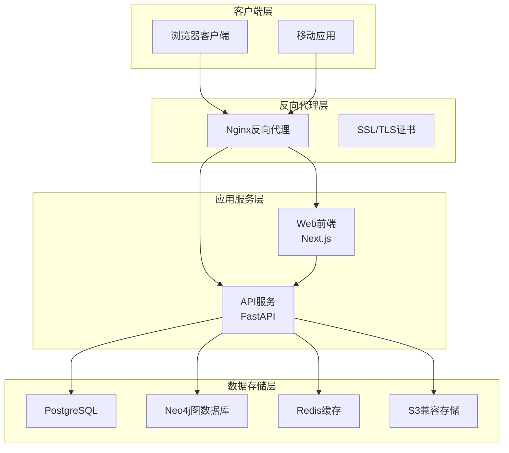
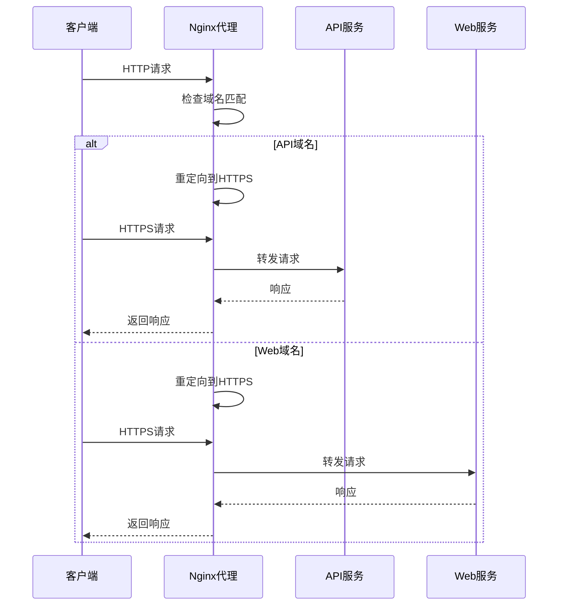
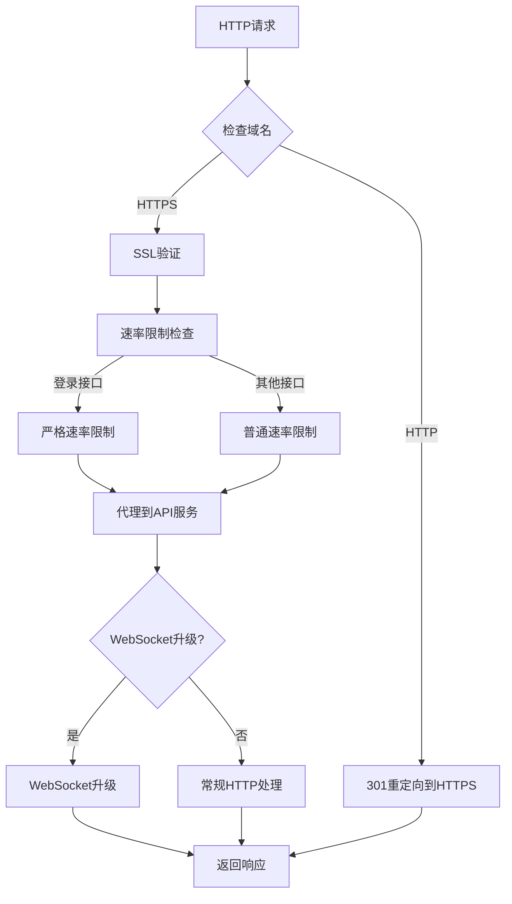
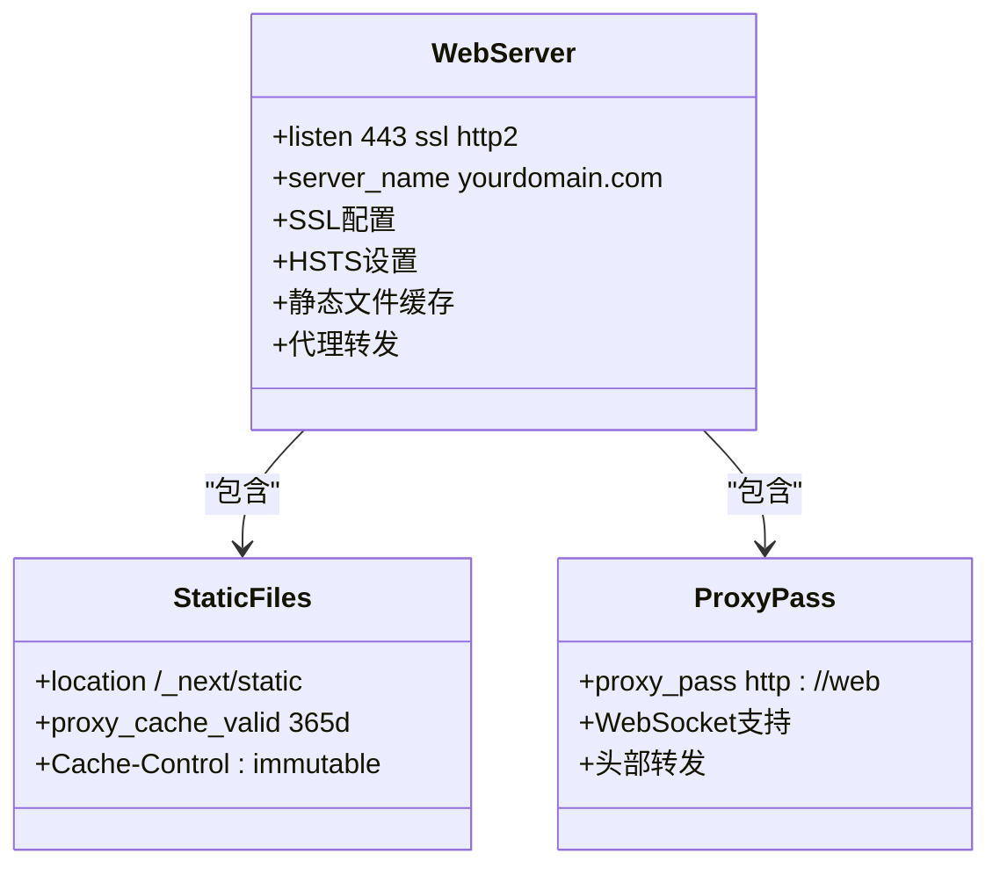
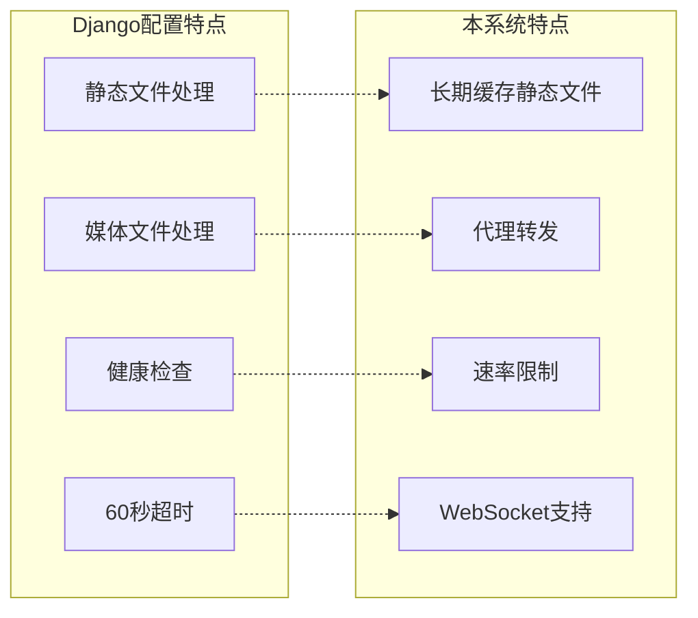
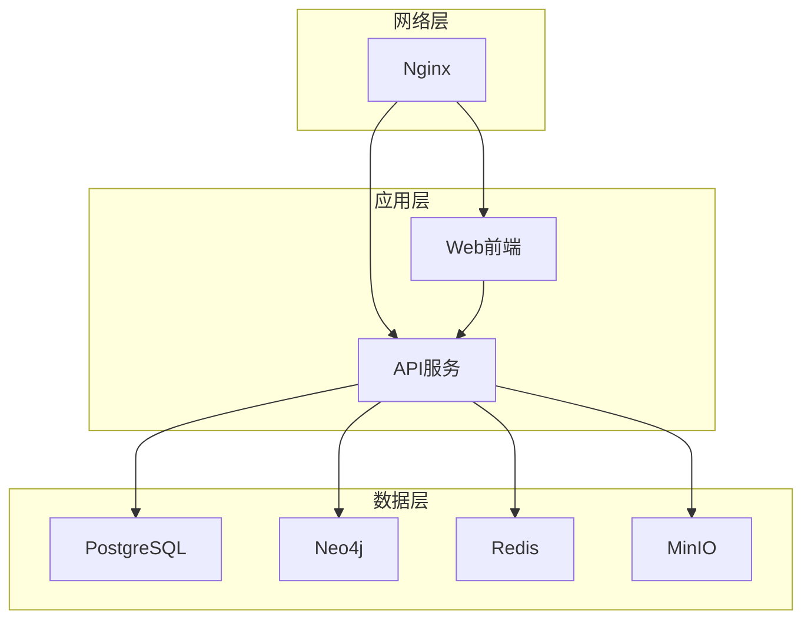
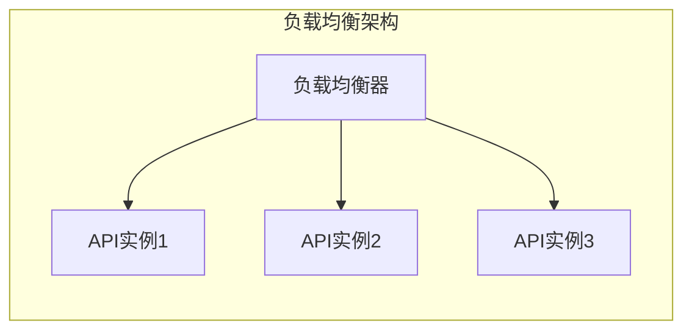

# 反向代理配置

<cite>
**本文档引用的文件**
- [nginx.conf](file://docker/nginx/nginx.conf)
- [default.conf](file://docker/nginx/conf.d/default.conf)
- [nginx.conf（Django备份）](file://django_backup/nginx.conf)
- [docker-compose.prod.yml](file://docker-compose.prod.yml)
- [docker-compose.yml](file://docker-compose.yml)
- [main.py](file://backend/app/main.py)
- [Dockerfile（前端）](file://frontend/Dockerfile)
- [Dockerfile（后端）](file://backend/Dockerfile)
- [next.config.js](file://frontend/next.config.js)
- [config.py](file://backend/app/core/config.py)
</cite>

## 目录
1. [简介](#简介)
2. [项目结构](#项目结构)
3. [核心组件](#核心组件)
4. [架构概览](#架构概览)
5. [详细组件分析](#详细组件分析)
6. [依赖关系分析](#依赖关系分析)
7. [性能考虑](#性能考虑)
8. [故障排除指南](#故障排除指南)
9. [结论](#结论)

## 简介

本文件为多租户族谱管理系统提供全面的Nginx反向代理配置文档。该系统采用微服务架构，包含API服务、Web前端、数据库和辅助服务。Nginx作为反向代理服务器，在生产环境中承担着HTTP到HTTPS重定向、SSL证书配置、安全头设置、静态资源服务、API代理转发、WebSocket支持等关键职责。

系统支持多租户架构，每个租户拥有独立的数据隔离和资源配置。通过反向代理实现统一入口管理和负载均衡，确保高可用性和可扩展性。

## 项目结构

系统采用Docker容器化部署，包含以下主要组件：

**图表来源**
- [docker-compose.prod.yml:156-172](file://docker-compose.prod.yml#L156-L172)
- [docker-compose.prod.yml:98-152](file://docker-compose.prod.yml#L98-L152)

**章节来源**
- [docker-compose.prod.yml:1-217](file://docker-compose.prod.yml#L1-L217)
- [docker-compose.yml:1-145](file://docker-compose.yml#L1-L145)

## 核心组件

### Nginx主配置文件

Nginx主配置文件定义了全局设置和上游服务器配置：

- **工作进程配置**：自动适配CPU核心数，使用epoll事件模型
- **日志格式**：自定义访问日志格式，包含详细的请求信息
- **性能优化**：启用sendfile、tcp_nopush、keepalive等优化选项
- **压缩配置**：启用Gzip压缩，支持多种内容类型
- **安全头**：设置X-Frame-Options、X-Content-Type-Options、X-XSS-Protection等安全头
- **限流配置**：定义API和登录接口的速率限制区域

### 上游服务器配置

系统配置了两个上游服务器组：

- **API上游组**：指向后端API服务，端口8010
- **Web上游组**：指向前端Web服务，端口3010
- **连接保持**：每个上游服务器配置32个keepalive连接

**章节来源**
- [nginx.conf:1-57](file://docker/nginx/nginx.conf#L1-L57)

## 架构概览

系统采用双域名架构，分别处理API和Web流量：

**图表来源**
- [default.conf:2-8](file://docker/nginx/conf.d/default.conf#L2-L8)
- [default.conf:66-72](file://docker/nginx/conf.d/default.conf#L66-L72)

### SSL/TLS配置

系统实现了现代SSL/TLS配置：

- **证书路径**：使用Let's Encrypt标准证书路径
- **协议版本**：支持TLSv1.2和TLSv1.3
- **加密套件**：使用ECDHE加密套件，支持AES-GCM
- **会话缓存**：启用SSL会话缓存，提高性能
- **HSTS**：设置严格传输安全头，强制HTTPS连接

**章节来源**
- [default.conf:14-27](file://docker/nginx/conf.d/default.conf#L14-L27)
- [default.conf:78-91](file://docker/nginx/conf.d/default.conf#L78-L91)

## 详细组件分析

### API服务器配置

API服务器专门处理后端服务请求：

**图表来源**
- [default.conf:29-62](file://docker/nginx/conf.d/default.conf#L29-L62)

#### 速率限制策略

系统实施分层速率限制：

- **API通用速率限制**：每秒10个请求
- **登录接口严格限制**：每分钟5个请求
- **登录接口特殊配置**：独立的速率限制区域
- **健康检查无限制**：对监控和健康检查开放

#### WebSocket支持

完整支持WebSocket协议升级：

- **升级头处理**：正确设置Upgrade和Connection头部
- **缓存绕过**：WebSocket连接不使用缓存
- **超时配置**：300秒读取超时，75秒连接超时

**章节来源**
- [default.conf:30-44](file://docker/nginx/conf.d/default.conf#L30-L44)
- [default.conf:47-56](file://docker/nginx/conf.d/default.conf#L47-L56)

### Web服务器配置

Web服务器处理前端应用请求：

**图表来源**
- [default.conf:94-112](file://docker/nginx/conf.d/default.conf#L94-L112)

#### 静态资源优化

前端静态资源采用长期缓存策略：

- **静态文件路径**：/_next/static
- **缓存有效期**：365天
- **缓存控制**：immutable属性，避免重新验证
- **CDN友好**：适合CDN分发和浏览器缓存

**章节来源**
- [default.conf:106-112](file://docker/nginx/conf.d/default.conf#L106-L112)

### Django备份配置对比

与Django项目的Nginx配置相比，本系统有以下特点：

**图表来源**
- [nginx.conf（Django备份）:14-34](file://django_backup/nginx.conf#L14-L34)
- [default.conf:106-112](file://docker/nginx/conf.d/default.conf#L106-L112)

**章节来源**
- [nginx.conf（Django备份）:1-53](file://django_backup/nginx.conf#L1-L53)

## 依赖关系分析

### 服务依赖关系

系统各组件之间的依赖关系如下：

**图表来源**
- [docker-compose.prod.yml:98-152](file://docker-compose.prod.yml#L98-L152)
- [docker-compose.prod.yml:156-172](file://docker-compose.prod.yml#L156-L172)

### 端口和服务映射

| 服务 | 内部端口 | 外部端口 | 协议 |
|------|----------|----------|------|
| Nginx | 80 | 80 | HTTP |
| Nginx | 443 | 443 | HTTPS |
| API | 8010 | 8010 | HTTP |
| Web | 3010 | 3010 | HTTP |
| PostgreSQL | 5432 | 5432 | TCP |
| Neo4j | 7474 | 7474 | HTTP |
| Neo4j | 7687 | 7687 | Bolt |
| Redis | 6379 | 6379 | TCP |
| MinIO | 9000 | 9000 | HTTP |
| MinIO | 9001 | 9001 | HTTP |

**章节来源**
- [docker-compose.prod.yml:160-172](file://docker-compose.prod.yml#L160-L172)
- [docker-compose.yml:12-87](file://docker-compose.yml#L12-L87)

## 性能考虑

### 缓存策略

系统实现了多层次的缓存策略：

- **静态资源缓存**：前端静态文件长期缓存365天
- **Gzip压缩**：启用压缩减少带宽使用
- **Keep-Alive连接**：上游服务器保持32个持久连接
- **会话缓存**：SSL会话缓存提高重连性能

### 超时配置

合理的超时设置确保系统稳定性：

- **连接超时**：75秒
- **读取超时**：300秒
- **健康检查间隔**：30秒
- **重启策略**：unless-stopped

### 负载均衡配置

虽然当前配置使用单实例，但已为未来扩展做好准备：

**章节来源**
- [nginx.conf:45-54](file://docker/nginx/nginx.conf#L45-L54)
- [docker-compose.prod.yml:129-133](file://docker-compose.prod.yml#L129-L133)

## 故障排除指南

### 常见问题诊断

#### SSL证书问题
- **检查证书路径**：确认fullchain.pem和privkey.pem存在
- **权限检查**：确保Nginx用户有读取权限
- **证书有效性**：验证证书未过期

#### 代理转发问题
- **上游服务器状态**：检查API和Web服务是否运行
- **端口连通性**：验证8010和3010端口可达
- **健康检查**：查看健康检查端点响应

#### 速率限制问题
- **日志分析**：检查限流触发记录
- **配置验证**：确认限流区域配置正确
- **客户端行为**：检查客户端请求频率

### 性能监控

建议监控以下关键指标：

- **连接数**：当前活跃连接数
- **请求率**：每秒请求数
- **错误率**：HTTP 5xx错误比例
- **响应时间**：平均响应延迟
- **缓存命中率**：静态资源缓存效率

**章节来源**
- [main.py:72-86](file://backend/app/main.py#L72-L86)
- [docker-compose.prod.yml:18-22](file://docker-compose.prod.yml#L18-L22)

## 结论

本Nginx反向代理配置为多租户族谱管理系统提供了完整的生产级解决方案。配置特点包括：

**安全性方面**：
- 完整的SSL/TLS配置和HSTS支持
- 多层安全头设置
- 速率限制防止滥用
- HTTPS强制重定向

**性能方面**：
- 长期静态资源缓存
- Gzip压缩优化
- Keep-Alive连接复用
- WebSocket原生支持

**可维护性方面**：
- 清晰的配置分离
- 完善的健康检查
- 详细的日志记录
- 易于扩展的架构

该配置为系统的高可用性和可扩展性奠定了坚实基础，能够满足多租户场景下的各种需求。建议在生产环境中定期审查和更新配置，以适应不断变化的安全威胁和性能要求。