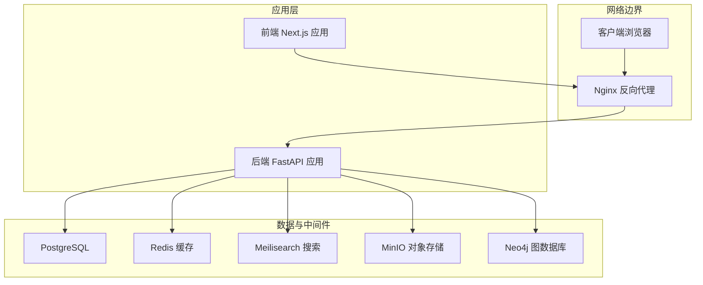
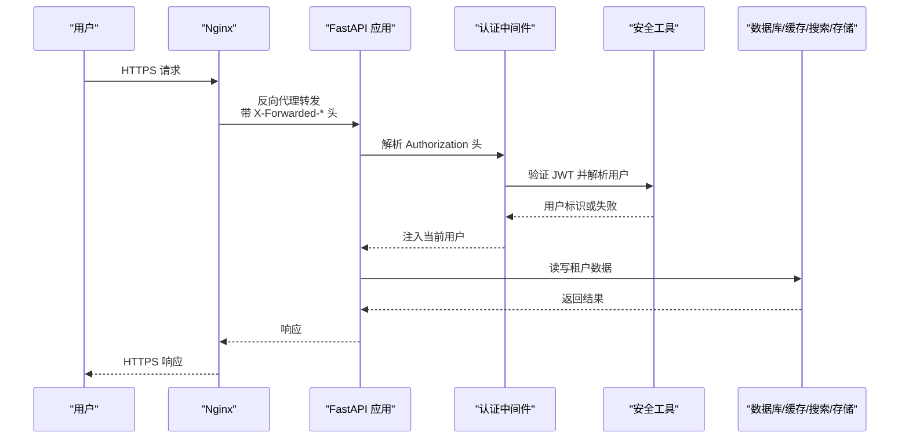
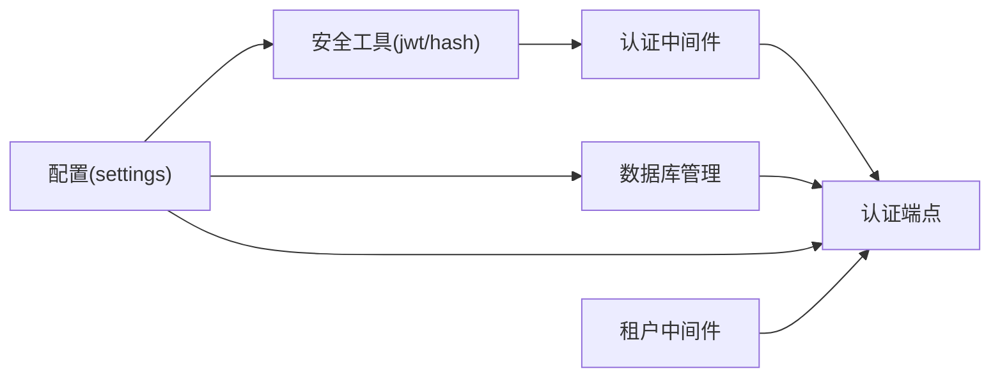

# 安全加固措施

<cite>
**本文引用的文件**
- [backend/app/core/security.py](file://backend/app/core/security.py)
- [backend/app/middleware/auth.py](file://backend/app/middleware/auth.py)
- [backend/app/middleware/tenant.py](file://backend/app/middleware/tenant.py)
- [backend/app/core/config.py](file://backend/app/core/config.py)
- [backend/app/api/v1/endpoints/auth.py](file://backend/app/api/v1/endpoints/auth.py)
- [backend/app/models/system.py](file://backend/app/models/system.py)
- [backend/app/models/tenant.py](file://backend/app/models/tenant.py)
- [backend/app/core/database.py](file://backend/app/core/database.py)
- [docker-compose.prod.yml](file://docker-compose.prod.yml)
- [docker/nginx/conf.d/default.conf](file://docker/nginx/conf.d/default.conf)
- [backend/tests/test_auth.py](file://backend/tests/test_auth.py)
- [backend/pyproject.toml](file://backend/pyproject.toml)
</cite>

## 目录
1. [简介](#简介)
2. [项目结构与安全边界](#项目结构与安全边界)
3. [核心安全组件](#核心安全组件)
4. [架构总览](#架构总览)
5. [详细组件安全分析](#详细组件安全分析)
6. [依赖关系与耦合分析](#依赖关系与耦合分析)
7. [性能与安全权衡](#性能与安全权衡)
8. [故障排查与应急响应](#故障排查与应急响应)
9. [结论](#结论)
10. [附录：生产环境配置清单](#附录生产环境配置清单)

## 简介
本文件面向多租户族谱管理系统在生产环境中的安全加固，聚焦以下方面：
- 密码策略与密钥管理
- 敏感信息保护（含数据库连接、第三方服务凭据）
- API 访问控制与跨域资源共享（CORS）配置
- SSL/TLS 证书管理、防火墙与网络安全
- 用户认证、会话与权限控制最佳实践
- 安全审计、日志监控与入侵检测
- 常见威胁防护与应急响应流程

目标是在不改变现有功能的前提下，补齐安全配置缺口，提升整体抗风险能力。

## 项目结构与安全边界
系统采用前后端分离与容器化部署，后端为 FastAPI 应用，通过 Nginx 反向代理对外提供 API 与静态资源；数据库层包含 PostgreSQL、Redis、Meilisearch、MinIO 与 Neo4j；前端为 Next.js 应用。生产环境通过 docker-compose.prod.yml 统一编排。

图表来源
- [docker-compose.prod.yml:1-217](file://docker-compose.prod.yml#L1-L217)
- [docker/nginx/conf.d/default.conf:1-113](file://docker/nginx/conf.d/default.conf#L1-L113)

章节来源
- [docker-compose.prod.yml:1-217](file://docker-compose.prod.yml#L1-L217)
- [docker/nginx/conf.d/default.conf:1-113](file://docker/nginx/conf.d/default.conf#L1-L113)

## 核心安全组件
- 密码与令牌
  - 使用 bcrypt 进行密码哈希与校验，JWT 用于短期访问令牌与长期刷新令牌，支持过期时间与算法配置。
- 身份认证与授权
  - 基于 Bearer Token 的 JWT 验证，中间件解析请求头并加载用户对象；超级管理员角色校验；权限检查占位待实现。
- 多租户隔离
  - 租户识别优先级：子域名 > 路径前缀 > 请求头；公共路径无需租户上下文；租户状态与激活状态检查。
- 数据库与连接池
  - 支持 SQLite 与 PostgreSQL；异步引擎与连接池参数可配置；租户模式下按 schema 或独立数据库文件隔离。
- 配置与敏感信息
  - 通过 pydantic-settings 从 .env 加载配置，包含数据库、JWT、CORS、存储等；生产需确保 .env 不被版本控制。

章节来源
- [backend/app/core/security.py:1-103](file://backend/app/core/security.py#L1-L103)
- [backend/app/middleware/auth.py:1-88](file://backend/app/middleware/auth.py#L1-L88)
- [backend/app/middleware/tenant.py:1-142](file://backend/app/middleware/tenant.py#L1-L142)
- [backend/app/core/config.py:1-89](file://backend/app/core/config.py#L1-L89)
- [backend/app/core/database.py:1-171](file://backend/app/core/database.py#L1-L171)

## 架构总览
下图展示生产环境中的安全交互流：Nginx 承担 TLS 终止、限流与 HSTS；后端负责认证与多租户上下文注入；数据库与外部服务通过受控网络访问。

图表来源
- [docker/nginx/conf.d/default.conf:1-113](file://docker/nginx/conf.d/default.conf#L1-L113)
- [backend/app/middleware/auth.py:1-88](file://backend/app/middleware/auth.py#L1-L88)
- [backend/app/core/security.py:1-103](file://backend/app/core/security.py#L1-L103)
- [backend/app/core/database.py:1-171](file://backend/app/core/database.py#L1-L171)

## 详细组件安全分析

### 密码策略与密钥管理
- 密码策略
  - 使用 bcrypt 哈希，避免明文存储；建议在注册/修改密码接口增加复杂度校验（长度、字符集、历史重复限制）。
  - 当前未在代码中强制密码强度规则，建议补充。
- 密钥管理
  - JWT 密钥、数据库、Redis、Meilisearch、MinIO、Neo4j 等均通过环境变量注入；生产必须：
    - 使用强随机密钥，定期轮换；
    - 将密钥纳入密钥管理服务（如 KMS/HashiCorp Vault），禁用明文配置文件；
    - 严格控制 .env 文件权限与访问范围。
- 令牌生命周期
  - 访问令牌默认 24 小时，刷新令牌 30 天；建议根据业务场景缩短访问令牌有效期，并启用刷新令牌黑名单或一次性使用机制。

章节来源
- [backend/app/core/security.py:13-23](file://backend/app/core/security.py#L13-L23)
- [backend/app/core/config.py:53-58](file://backend/app/core/config.py#L53-L58)
- [docker-compose.prod.yml:109-119](file://docker-compose.prod.yml#L109-L119)

### 敏感信息保护
- 配置项与环境变量
  - 数据库连接串、第三方服务凭据、存储端点与密钥均来自环境变量；建议：
    - 在 CI/CD 中以密文方式注入；
    - 启用只读挂载与最小权限原则。
- 日志与审计
  - 现有模型包含变更审计表（change_logs），可用于记录关键操作；建议：
    - 默认屏蔽敏感字段输出；
    - 将审计事件写入集中式日志系统（如 ELK/Splunk）并开启告警。

章节来源
- [backend/app/core/config.py:34-67](file://backend/app/core/config.py#L34-L67)
- [backend/app/models/tenant.py:214-244](file://backend/app/models/tenant.py#L214-L244)
- [docker-compose.prod.yml:109-119](file://docker-compose.prod.yml#L109-L119)

### 数据库连接安全
- 连接与隔离
  - 支持 SQLite 与 PostgreSQL；租户隔离通过 schema 名称或独立数据库文件实现；建议：
    - PostgreSQL 场景启用 search_path 设置；
    - SQLite 场景确保每租户独立文件并设置严格文件权限。
- 连接池与超时
  - 生产环境应合理设置 pool_size 与 max_overflow，避免连接耗尽；启用健康检查与自动重连。

章节来源
- [backend/app/core/database.py:58-106](file://backend/app/core/database.py#L58-L106)
- [backend/app/core/database.py:136-171](file://backend/app/core/database.py#L136-L171)

### API 访问控制与权限
- 认证流程
  - 登录成功返回 access_token 与 refresh_token；访问受保护路由需携带 Bearer Token。
- 授权与角色
  - 提供超级管理员校验与占位权限检查器；建议完善基于租户的细粒度权限模型（编辑/审核/管理员）。
- 公共路径与租户上下文
  - 公共路径（如 /api/v1/auth、/api/v1/tenants、/docs、/health）无需租户上下文；其他路径按优先级提取租户标识并校验状态。

章节来源
- [backend/app/api/v1/endpoints/auth.py:89-124](file://backend/app/api/v1/endpoints/auth.py#L89-L124)
- [backend/app/middleware/auth.py:15-57](file://backend/app/middleware/auth.py#L15-L57)
- [backend/app/middleware/tenant.py:15-84](file://backend/app/middleware/tenant.py#L15-L84)

### 跨域资源共享（CORS）配置
- 当前配置
  - CORS 来源列表可通过环境变量逗号分隔传入；建议：
    - 仅允许必要来源；
    - 生产环境关闭通配符来源，避免 CSRF 风险。
- 建议
  - 结合前端域名精确配置，避免过度放行。

章节来源
- [backend/app/core/config.py:59-80](file://backend/app/core/config.py#L59-L80)

### SSL/TLS 证书管理与反向代理
- TLS 配置
  - Nginx 启用 TLSv1.2/1.3、现代加密套件、HSTS；证书与私钥路径已映射到容器内。
- 建议
  - 使用自动化证书签发（如 ACME）与自动续期；
  - 关闭弱协议与加密套件，启用 OCSP Stapling。

章节来源
- [docker/nginx/conf.d/default.conf:14-28](file://docker/nginx/conf.d/default.conf#L14-L28)
- [docker/nginx/conf.d/default.conf:78-91](file://docker/nginx/conf.d/default.conf#L78-L91)

### 网络安全与防火墙
- 容器网络
  - 所有服务运行在同一 bridge 网络内，应用容器暴露必要端口；建议：
    - 仅开放 80/443 至 Nginx，后端服务仅对内网开放；
    - 使用防火墙/安全组限制入站流量至最小必要端口。
- 速率限制
  - Nginx 已对 API 与登录接口进行限流，建议结合 WAF 与 IP 黑名单进一步强化。

章节来源
- [docker-compose.prod.yml:214-217](file://docker-compose.prod.yml#L214-L217)
- [docker/nginx/conf.d/default.conf:30-56](file://docker/nginx/conf.d/default.conf#L30-L56)

### 用户认证安全与会话管理
- 登录与令牌
  - 登录成功更新最近登录时间；建议：
    - 引入登录失败次数限制与账户锁定；
    - 刷新令牌与访问令牌分别存储于安全的 HttpOnly Cookie（前端配合）或安全存储。
- 会话与状态
  - 当前使用 JWT 无服务端会话状态；建议：
    - 引入刷新令牌黑名单；
    - 对高危操作（修改密码、删除账号）要求二次验证。

章节来源
- [backend/app/api/v1/endpoints/auth.py:112-124](file://backend/app/api/v1/endpoints/auth.py#L112-L124)
- [backend/app/core/security.py:26-77](file://backend/app/core/security.py#L26-L77)

### 权限控制最佳实践
- 角色与权限
  - 系统角色（用户/运营/超级管理员）与租户角色（成员/编辑/审核/管理员）分离；建议：
    - 明确 RBAC 权限矩阵；
    - 对敏感操作（导入导出、批量删除、配置变更）实施审批流程。
- 审计与追踪
  - change_logs 表记录变更主体与时间；建议：
    - 自动化审计报表与异常行为告警。

章节来源
- [backend/app/models/system.py:114-121](file://backend/app/models/system.py#L114-L121)
- [backend/app/models/system.py:170-181](file://backend/app/models/system.py#L170-L181)
- [backend/app/models/tenant.py:214-244](file://backend/app/models/tenant.py#L214-L244)

### 安全审计、日志监控与入侵检测
- 审计
  - 建议：
    - 将认证、授权、数据变更、配置修改等事件写入审计日志；
    - 审计日志与业务日志分离，保留不可篡改。
- 监控与告警
  - 建议：
    - Prometheus/Grafana 监控应用健康、数据库连接数、缓存命中率；
    - Nginx 访问日志聚合，识别异常请求模式。
- 入侵检测
  - 建议：
    - 部署 WAF 与 IDS/IPS；
    - 对异常登录（地域/设备/IP）启用多因子认证。

章节来源
- [docker-compose.prod.yml:176-201](file://docker-compose.prod.yml#L176-L201)
- [docker/nginx/conf.d/default.conf:58-62](file://docker/nginx/conf.d/default.conf#L58-L62)

### 常见威胁防护与应急响应
- 威胁类型与缓解
  - 认证绕过：严格的 Bearer Token 校验、短令牌周期、刷新令牌黑名单；
  - 跨站脚本（XSS）：前端 CSP、HttpOnly Cookie、输入输出转义；
  - 跨站请求伪造（CSRF）：同源策略、CORS 白名单、CSRF Token；
  - 注入攻击：ORM 参数化查询、最小权限数据库用户、输入校验；
  - 暴力破解：登录限速、验证码、账户锁定。
- 应急响应
  - 快速处置流程：
    - 隔离受影响租户/用户；
    - 回滚可疑变更、撤销令牌；
    - 审计日志取证、修复漏洞并发布补丁；
    - 通知用户与监管机构（如适用）。

章节来源
- [backend/app/middleware/auth.py:15-57](file://backend/app/middleware/auth.py#L15-L57)
- [backend/app/middleware/tenant.py:40-84](file://backend/app/middleware/tenant.py#L40-L84)
- [docker/nginx/conf.d/default.conf:30-56](file://docker/nginx/conf.d/default.conf#L30-L56)

## 依赖关系与耦合分析
- 组件耦合
  - 认证中间件依赖安全工具与数据库；租户中间件依赖数据库与配置；配置贯穿各模块。
- 外部依赖
  - FastAPI、SQLAlchemy、Pydantic、Passlib、JWKS、Redis、Neo4j、Meilisearch、MinIO。
- 安全风险点
  - 环境变量泄露、JWT 密钥复用、CORS 过宽、Nginx 弱加密套件。

图表来源
- [backend/app/core/config.py:11-89](file://backend/app/core/config.py#L11-L89)
- [backend/app/core/security.py:1-103](file://backend/app/core/security.py#L1-L103)
- [backend/app/middleware/auth.py:1-88](file://backend/app/middleware/auth.py#L1-L88)
- [backend/app/middleware/tenant.py:1-142](file://backend/app/middleware/tenant.py#L1-L142)
- [backend/app/core/database.py:1-171](file://backend/app/core/database.py#L1-L171)

章节来源
- [backend/pyproject.toml:7-25](file://backend/pyproject.toml#L7-L25)

## 性能与安全权衡
- 令牌与缓存
  - 缩短访问令牌有效期可降低泄露影响面，但增加刷新频率；建议结合 Redis 缓存与限流平衡用户体验与安全。
- 连接池与隔离
  - 合理设置连接池大小，避免租户间资源争用；SQLite 场景建议按租户拆库以减少锁竞争。
- 反向代理
  - 启用 gzip/HTTP/2、合理的超时与缓冲区，兼顾性能与安全（如 HSTS、TLS 版本）。

## 故障排查与应急响应
- 常见问题定位
  - 401/403：检查 Authorization 头格式、令牌签名与过期时间；确认用户状态与租户激活状态。
  - CORS 错误：核对前端与后端 CORS 配置一致性。
  - 数据库连接失败：检查连接串、网络连通性与健康检查。
- 测试参考
  - 认证相关测试覆盖注册、登录、刷新与密码哈希正确性，可作为回归基线。

章节来源
- [backend/tests/test_auth.py:12-149](file://backend/tests/test_auth.py#L12-L149)

## 结论
本加固方案围绕“最小暴露面、强凭证、细粒度权限、可观测”展开，建议优先完成密钥轮换、CORS 收敛、TLS 强化与权限模型完善，并配套完善的审计与监控体系，持续迭代以应对新威胁。

## 附录：生产环境配置清单
- 环境变量（示例）
  - 数据库：DATABASE_URL、POSTGRES_USER、POSTGRES_PASSWORD
  - 缓存：REDIS_URL
  - 搜索：MEILISEARCH_URL、MEILISEARCH_API_KEY
  - 存储：STORAGE_ENDPOINT、STORAGE_ACCESS_KEY、STORAGE_SECRET_KEY
  - 图数据库：NEO4J_URI、NEO4J_USER、NEO4J_PASSWORD
  - 认证：JWT_SECRET_KEY、JWT_ALGORITHM、JWT_ACCESS_TOKEN_EXPIRE_MINUTES、JWT_REFRESH_TOKEN_EXPIRE_DAYS
  - CORS：CORS_ORIGINS（逗号分隔）
- 反向代理
  - 证书路径映射、TLS 协议与加密套件、HSTS、速率限制、健康检查端点
- 安全基线
  - 最小权限、只读挂载、密钥轮换、审计日志、WAF、IDS/IPS、备份与恢复演练

章节来源
- [docker-compose.prod.yml:109-119](file://docker-compose.prod.yml#L109-L119)
- [docker/nginx/conf.d/default.conf:14-28](file://docker/nginx/conf.d/default.conf#L14-L28)
- [backend/app/core/config.py:53-61](file://backend/app/core/config.py#L53-L61)