# 容器编排配置

<cite>
**本文引用的文件**
- [docker-compose.yml](file://docker-compose.yml)
- [docker-compose.prod.yml](file://docker-compose.prod.yml)
- [Dockerfile.prod（后端）](file://backend/Dockerfile.prod)
- [Dockerfile（前端）](file://frontend/Dockerfile)
- [init.sql（PostgreSQL 初始化）](file://docker/postgres/init.sql)
- [nginx.conf（Nginx 生产配置）](file://docker/nginx/nginx.conf)
- [prometheus.yml（Prometheus 监控配置）](file://docker/prometheus/prometheus.yml)
- [pyproject.toml（后端依赖与构建配置）](file://backend/pyproject.toml)
- [package.json（前端依赖与构建配置）](file://frontend/package.json)
- [config.py（后端应用配置）](file://backend/app/core/config.py)
- [main.py（后端应用入口与健康检查）](file://backend/app/main.py)
- [deploy.sh（一键部署脚本）](file://deploy.sh)
- [start-dev.ps1（Windows 开发环境启动脚本）](file://start-dev.ps1)
- [README.md（项目总览与部署说明）](file://README.md)
- [LOCAL_DEVELOPMENT.md（本地开发指南）](file://docs/LOCAL_DEVELOPMENT.md)
</cite>

## 目录
1. [简介](#简介)
2. [项目结构](#项目结构)
3. [核心组件](#核心组件)
4. [架构总览](#架构总览)
5. [详细组件分析](#详细组件分析)
6. [依赖关系分析](#依赖关系分析)
7. [性能考虑](#性能考虑)
8. [故障排除指南](#故障排除指南)
9. [结论](#结论)
10. [附录](#附录)

## 简介
本文件面向多租户族谱管理系统的容器编排配置，聚焦于生产环境的 Docker Compose 配置文件，系统性解析 PostgreSQL、Neo4j、Redis、Meilisearch、MinIO 等数据库与中间件服务的配置参数、环境变量、卷挂载、健康检查与依赖关系；同时说明网络配置、存储卷管理与容器间通信方式，并给出资源优化建议、启动顺序、故障恢复策略与监控配置。

## 项目结构
该仓库采用多模块结构，容器编排主要通过两个 Compose 文件实现：
- 开发环境：基于 docker-compose.yml，包含数据库、缓存、搜索引擎、对象存储与后端/前端服务。
- 生产环境：基于 docker-compose.prod.yml，增加 Nginx 反向代理、持久化日志卷、健康检查与监控组件（可选）。

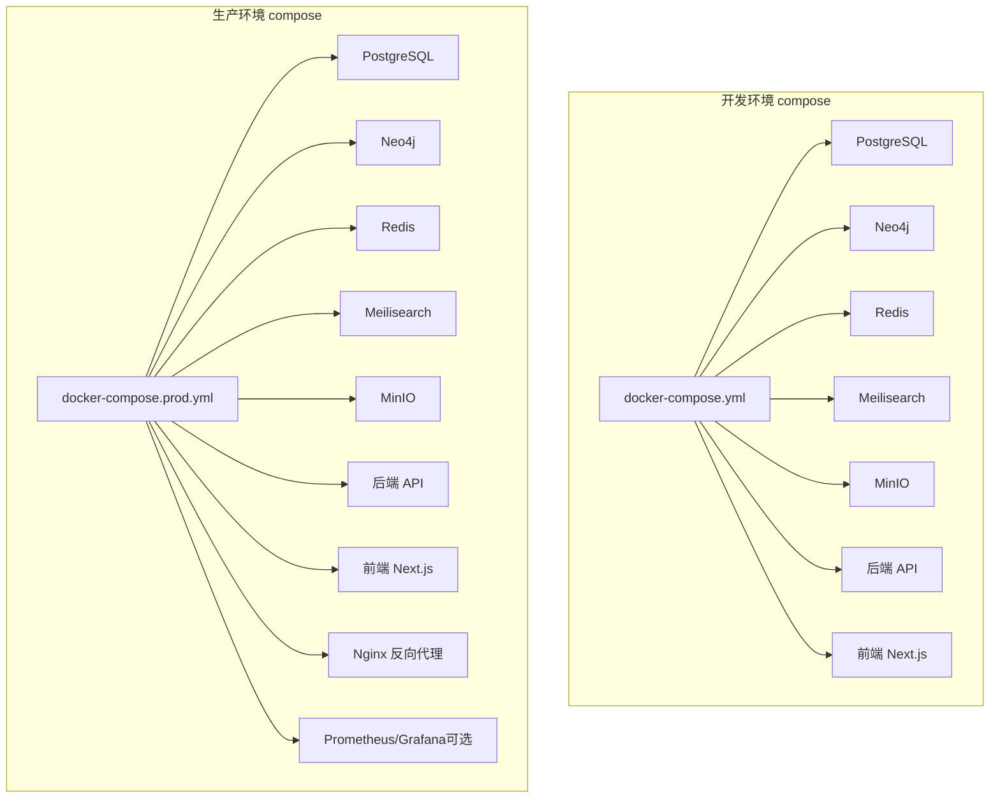

图表来源
- [docker-compose.yml:1-145](file://docker-compose.yml#L1-L145)
- [docker-compose.prod.yml:1-217](file://docker-compose.prod.yml#L1-L217)

章节来源
- [README.md:51-60](file://README.md#L51-L60)
- [docker-compose.yml:1-145](file://docker-compose.yml#L1-L145)
- [docker-compose.prod.yml:1-217](file://docker-compose.prod.yml#L1-L217)

## 核心组件
本节对生产环境中的核心服务进行逐项解析，涵盖镜像版本、环境变量、端口映射、卷挂载、健康检查与网络配置。

- PostgreSQL（数据库）
  - 镜像与版本：postgres:16-alpine
  - 关键环境变量：POSTGRES_DB、POSTGRES_USER、POSTGRES_PASSWORD
  - 卷挂载：postgres_data（数据）、init.sql（初始化扩展与函数）
  - 健康检查：pg_isready 检测
  - 网络：加入自定义桥接网络
  - 端口：5432（容器内映射至宿主）
  - 重启策略：unless-stopped

- Neo4j（图数据库）
  - 镜像与版本：neo4j:5-community
  - 关键环境变量：NEO4J_AUTH、NEO4J_PLUGINS、内存参数（堆大小、pagecache）
  - 卷挂载：neo4j_data（数据）、neo4j_logs（日志）
  - 健康检查：HTTP 探针检测 7474
  - 网络：加入自定义桥接网络
  - 端口：7474（HTTP）、7687（Bolt）
  - 重启策略：unless-stopped

- Redis（缓存）
  - 镜像与版本：redis:7-alpine
  - 关键命令：开启 AOF、设置 maxmemory 与淘汰策略
  - 卷挂载：redis_data（持久化）
  - 健康检查：redis-cli ping
  - 网络：加入自定义桥接网络
  - 端口：6379
  - 重启策略：unless-stopped

- Meilisearch（搜索引擎）
  - 镜像与版本：getmeili/meilisearch:v1.8
  - 关键环境变量：MEILI_MASTER_KEY、MEILI_ENV=production
  - 卷挂载：meilisearch_data（索引数据）
  - 网络：加入自定义桥接网络
  - 端口：7700
  - 重启策略：unless-stopped

- MinIO（S3 兼容对象存储）
  - 镜像与版本：minio/minio:latest
  - 关键环境变量：MINIO_ROOT_USER、MINIO_ROOT_PASSWORD
  - 卷挂载：minio_data（存储桶数据）
  - 健康检查：curl 检测 live 接口
  - 网络：加入自定义桥接网络
  - 端口：9000（API）、9001（控制台）
  - 重启策略：unless-stopped

- 后端 API（FastAPI）
  - 构建：Dockerfile（生产镜像），支持多阶段构建与非 root 用户
  - 关键环境变量：ENVIRONMENT、DATABASE_URL、NEO4J_*、REDIS_URL、MEILISEARCH_*、STORAGE_*、JWT_SECRET_KEY
  - 卷挂载：只读源码映射（生产）
  - 健康检查：/health 探针
  - 网络：加入自定义桥接网络
  - 端口：8010
  - 重启策略：unless-stopped
  - 依赖：postgres、neo4j、redis 健康后启动

- 前端（Next.js）
  - 构建：Dockerfile（生产镜像），多阶段构建，非 root 用户
  - 关键环境变量：NEXT_PUBLIC_API_URL
  - 网络：加入自定义桥接网络
  - 端口：3010
  - 重启策略：unless-stopped
  - 依赖：api 健康后启动

- Nginx（反向代理）
  - 镜像与版本：nginx:alpine
  - 关键配置：上游指向 api:8010 与 web:3010，启用 keepalive、限流、安全头、gzip
  - 卷挂载：nginx.conf、conf.d、ssl 证书目录、日志目录
  - 端口：80/443
  - 重启策略：unless-stopped
  - 依赖：api、web 健康后启动

- Prometheus/Grafana（可选监控）
  - Prometheus：采集自身、api、postgres-exporter、redis-exporter、nginx-exporter
  - Grafana：可视化与仪表盘
  - 仅在指定 profiles 启动

章节来源
- [docker-compose.prod.yml:6-25](file://docker-compose.prod.yml#L6-L25)
- [docker-compose.prod.yml:26-47](file://docker-compose.prod.yml#L26-L47)
- [docker-compose.prod.yml:48-63](file://docker-compose.prod.yml#L48-L63)
- [docker-compose.prod.yml:64-76](file://docker-compose.prod.yml#L64-L76)
- [docker-compose.prod.yml:77-95](file://docker-compose.prod.yml#L77-L95)
- [docker-compose.prod.yml:98-136](file://docker-compose.prod.yml#L98-L136)
- [docker-compose.prod.yml:137-153](file://docker-compose.prod.yml#L137-L153)
- [docker-compose.prod.yml:156-173](file://docker-compose.prod.yml#L156-L173)
- [docker-compose.prod.yml:176-202](file://docker-compose.prod.yml#L176-L202)

## 架构总览
生产环境容器编排采用“单主机多容器”的集中式部署，所有服务位于同一自定义桥接网络中，通过服务名进行内部通信。Nginx 作为统一入口，负责静态资源、请求转发与安全加固；后端 API 提供业务接口与健康检查；数据库、图数据库、缓存、搜索引擎与对象存储分别承担各自职责。

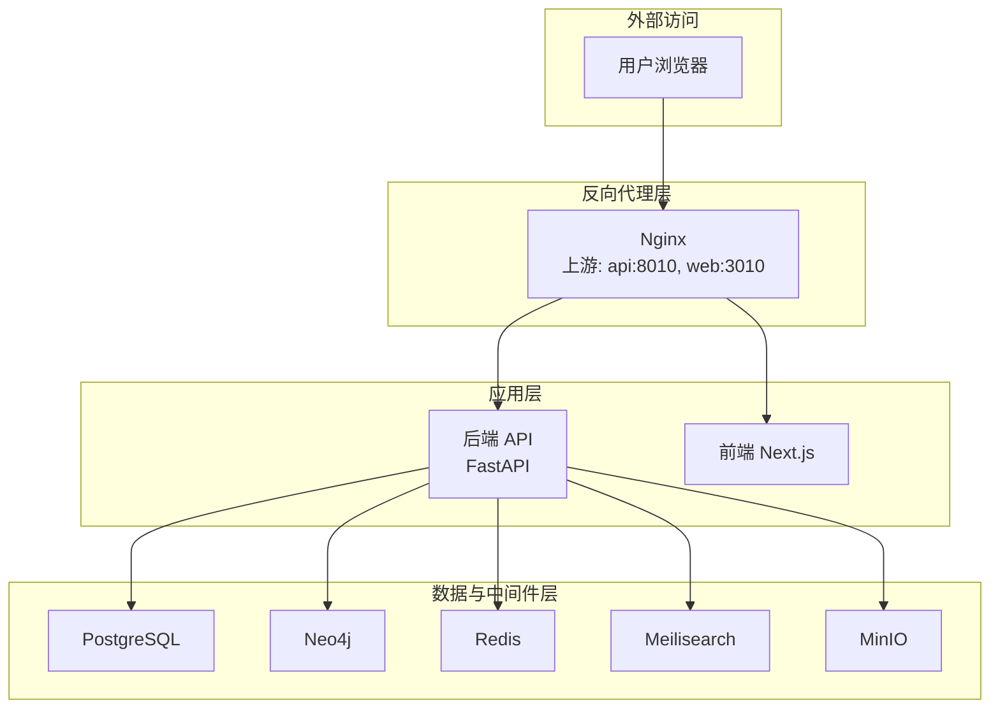

图表来源
- [docker-compose.prod.yml:156-173](file://docker-compose.prod.yml#L156-L173)
- [docker-compose.prod.yml:98-136](file://docker-compose.prod.yml#L98-L136)
- [docker-compose.prod.yml:137-153](file://docker-compose.prod.yml#L137-L153)

## 详细组件分析

### PostgreSQL 分析
- 配置要点
  - 使用 postgres:16-alpine，确保兼容性与体积平衡
  - 通过环境变量设置数据库名、用户名与密码
  - 卷挂载 postgres_data 实现数据持久化
  - 通过 init.sql 初始化扩展与函数，增强模糊搜索能力
  - 健康检查使用 pg_isready，周期短、重试次数适中
- 依赖关系
  - 后端 API 依赖其健康状态再启动
- 性能与可靠性
  - 建议在生产中结合 WAL 归档与备份策略
  - 为高并发场景准备连接池与只读副本

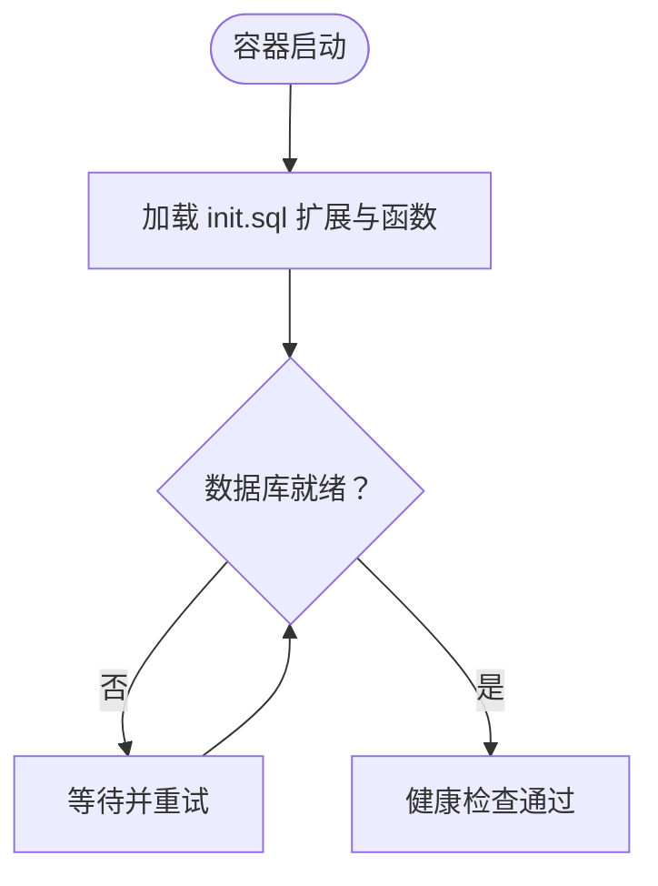

图表来源
- [docker-compose.prod.yml:15-18](file://docker-compose.prod.yml#L15-L18)
- [docker/postgres/init.sql:1-8](file://docker/postgres/init.sql#L1-L8)

章节来源
- [docker-compose.prod.yml:6-25](file://docker-compose.prod.yml#L6-L25)
- [docker/postgres/init.sql:1-8](file://docker/postgres/init.sql#L1-L8)

### Neo4j 分析
- 配置要点
  - 使用 neo4j:5-community，启用 APOC 插件
  - 设置认证、内存参数（初始堆与最大堆、pagecache）
  - 卷挂载数据与日志目录
  - 健康检查通过 HTTP 探针
- 依赖关系
  - 后端 API 依赖其健康状态再启动
- 性能与可靠性
  - 根据数据规模调优内存参数
  - 建议开启备份与快照策略

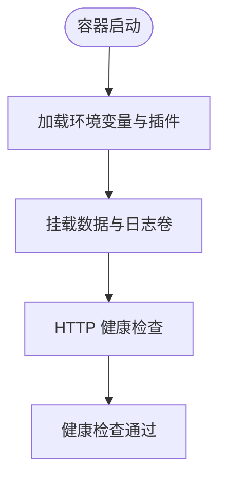

图表来源
- [docker-compose.prod.yml:26-47](file://docker-compose.prod.yml#L26-L47)

章节来源
- [docker-compose.prod.yml:26-47](file://docker-compose.prod.yml#L26-L47)

### Redis 分析
- 配置要点
  - 使用 redis:7-alpine，开启 AOF 持久化
  - 设置 maxmemory 与淘汰策略，控制内存占用
  - 卷挂载 redis_data 实现持久化
  - 健康检查通过 redis-cli ping
- 依赖关系
  - 后端 API 依赖其健康状态再启动
- 性能与可靠性
  - 对高吞吐场景建议开启 RDB 快照与 AOF fsync 策略折中
  - 结合集群或哨兵提升可用性

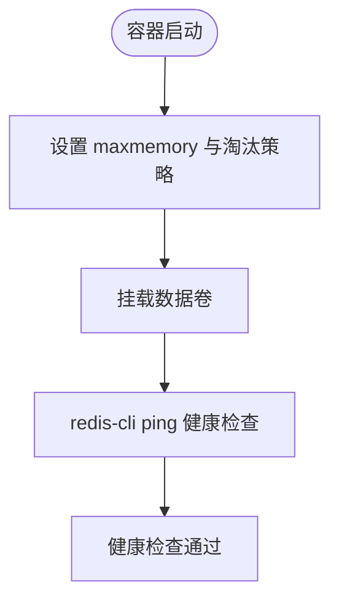

图表来源
- [docker-compose.prod.yml:48-63](file://docker-compose.prod.yml#L48-L63)

章节来源
- [docker-compose.prod.yml:48-63](file://docker-compose.prod.yml#L48-L63)

### Meilisearch 分析
- 配置要点
  - 使用 getmeili/meilisearch:v1.8，设置 master key 与生产环境
  - 卷挂载 meilisearch_data 实现索引持久化
- 依赖关系
  - 后端 API 依赖其健康状态再启动
- 性能与可靠性
  - 建议定期重建索引与监控磁盘空间
  - 配置只读密钥与访问控制

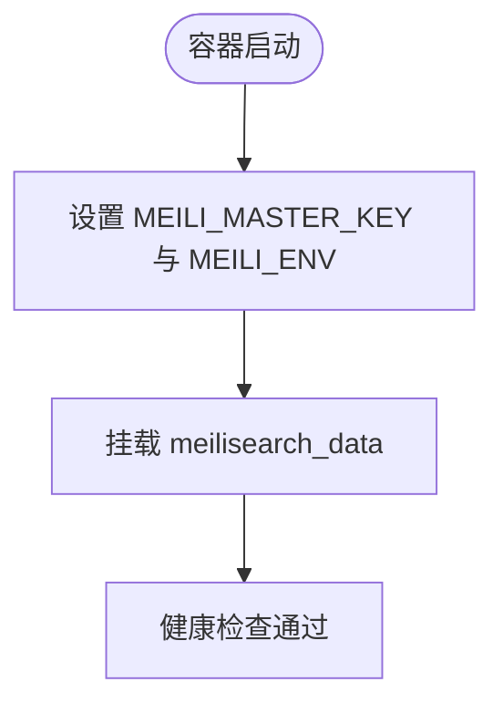

图表来源
- [docker-compose.prod.yml:64-76](file://docker-compose.prod.yml#L64-L76)

章节来源
- [docker-compose.prod.yml:64-76](file://docker-compose.prod.yml#L64-L76)

### MinIO 分析
- 配置要点
  - 使用 minio/minio:latest，设置根用户与密码
  - 卷挂载 minio_data 实现对象存储持久化
  - 健康检查通过 live 接口
- 依赖关系
  - 后端 API 依赖其健康状态再启动
- 性能与可靠性
  - 建议使用纠删码与分片存储
  - 配置 HTTPS 与 IAM 权限

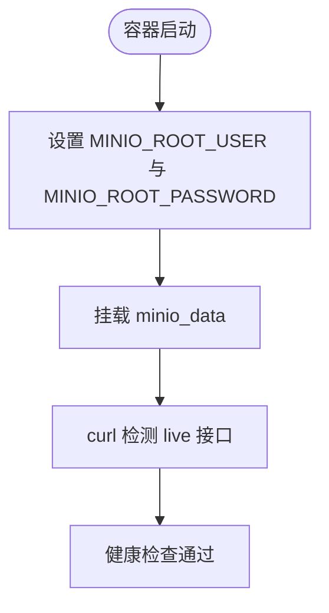

图表来源
- [docker-compose.prod.yml:77-95](file://docker-compose.prod.yml#L77-L95)

章节来源
- [docker-compose.prod.yml:77-95](file://docker-compose.prod.yml#L77-L95)

### 后端 API（FastAPI）分析
- 配置要点
  - 多阶段构建，运行时依赖精简，非 root 用户执行
  - 健康检查端点 /health 返回服务状态
  - 环境变量覆盖数据库、图数据库、缓存、搜索引擎与对象存储连接信息
  - 依赖 postgres、neo4j、redis 健康后启动
- 依赖关系
  - 与数据库、图数据库、缓存、搜索引擎、对象存储形成强耦合
- 性能与可靠性
  - 建议配合连接池与超时配置
  - 健康检查与重启策略保障可用性

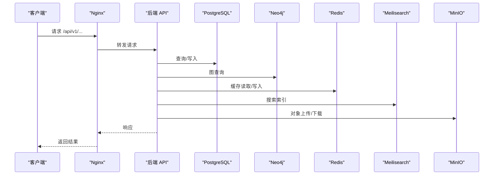

图表来源
- [docker-compose.prod.yml:98-136](file://docker-compose.prod.yml#L98-L136)
- [main.py:72-87](file://backend/app/main.py#L72-L87)

章节来源
- [docker-compose.prod.yml:98-136](file://docker-compose.prod.yml#L98-L136)
- [backend/Dockerfile.prod:1-48](file://backend/Dockerfile.prod#L1-L48)
- [backend/app/main.py:72-87](file://backend/app/main.py#L72-L87)

### 前端（Next.js）分析
- 配置要点
  - 多阶段构建，生产运行时非 root 用户
  - 健康检查通过 HTTP 探针
  - 依赖后端 API 健康后启动
- 依赖关系
  - 通过 NEXT_PUBLIC_API_URL 与后端交互
- 性能与可靠性
  - 建议启用静态资源缓存与 CDN
  - 配置 gzip 与安全头

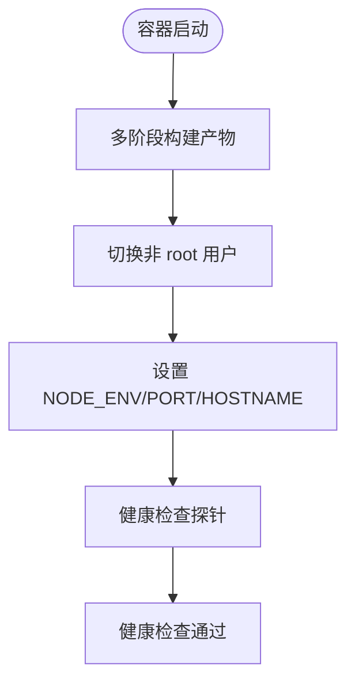

图表来源
- [docker-compose.prod.yml:137-153](file://docker-compose.prod.yml#L137-L153)
- [frontend/Dockerfile:1-51](file://frontend/Dockerfile#L1-L51)

章节来源
- [docker-compose.prod.yml:137-153](file://docker-compose.prod.yml#L137-L153)
- [frontend/Dockerfile:1-51](file://frontend/Dockerfile#L1-L51)

### Nginx 分析
- 配置要点
  - 上游指向 api:8010 与 web:3010，启用 keepalive
  - 限流规则（API、登录）
  - 安全头与 gzip 压缩
  - 卷挂载配置文件、站点配置与 SSL 证书目录
- 依赖关系
  - 依赖后端 API 与前端健康后启动
- 性能与可靠性
  - 建议启用 TLS 与 HSTS
  - 配置访问日志与错误日志轮转

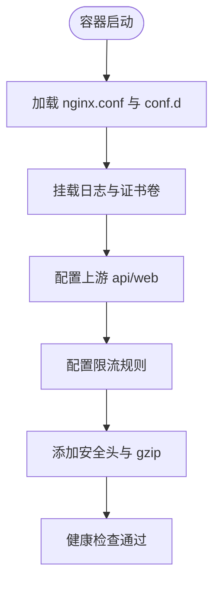

图表来源
- [docker-compose.prod.yml:156-173](file://docker-compose.prod.yml#L156-L173)
- [docker/nginx/nginx.conf:1-57](file://docker/nginx/nginx.conf#L1-L57)

章节来源
- [docker-compose.prod.yml:156-173](file://docker-compose.prod.yml#L156-L173)
- [docker/nginx/nginx.conf:1-57](file://docker/nginx/nginx.conf#L1-L57)

### 监控（可选）分析
- Prometheus
  - 采集目标：自身、api、postgres-exporter、redis-exporter、nginx-exporter
  - 配置文件挂载
- Grafana
  - 管理员密码来自环境变量
  - 数据卷持久化
- 启动条件
  - 通过 profiles: monitoring 控制是否启用

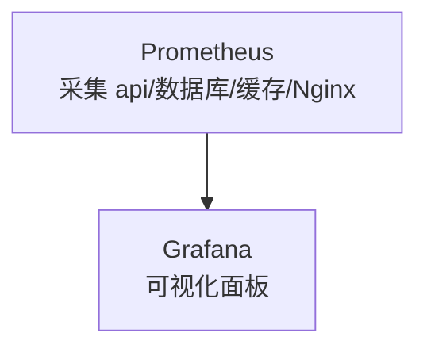

图表来源
- [docker-compose.prod.yml:176-202](file://docker-compose.prod.yml#L176-L202)
- [docker/prometheus/prometheus.yml:1-32](file://docker/prometheus/prometheus.yml#L1-L32)

章节来源
- [docker-compose.prod.yml:176-202](file://docker-compose.prod.yml#L176-L202)
- [docker/prometheus/prometheus.yml:1-32](file://docker/prometheus/prometheus.yml#L1-L32)

## 依赖关系分析
- 服务启动顺序
  - 数据层：postgres → neo4j → redis → meilisearch → minio
  - 应用层：api → web（api 健康后再启动 web）
  - 入口层：nginx（api、web 健康后再启动）
- 健康检查
  - 数据库：pg_isready
  - 图数据库：HTTP 7474
  - 缓存：redis-cli ping
  - 搜索引擎：容器内进程健康
  - 对象存储：live 接口
  - API：/health
  - 前端：HTTP 探针
- 网络
  - 生产环境使用自定义桥接网络，服务间通过服务名通信
- 存储卷
  - 每个服务的数据目录均挂载到独立命名卷，便于备份与迁移

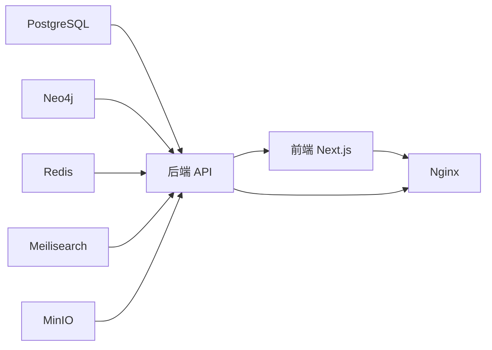

图表来源
- [docker-compose.prod.yml:98-136](file://docker-compose.prod.yml#L98-L136)
- [docker-compose.prod.yml:137-153](file://docker-compose.prod.yml#L137-L153)
- [docker-compose.prod.yml:156-173](file://docker-compose.prod.yml#L156-L173)

章节来源
- [docker-compose.prod.yml:98-136](file://docker-compose.prod.yml#L98-L136)
- [docker-compose.prod.yml:137-153](file://docker-compose.prod.yml#L137-L153)
- [docker-compose.prod.yml:156-173](file://docker-compose.prod.yml#L156-L173)

## 性能考虑
- 内存与 CPU
  - PostgreSQL：根据数据量与并发调优 shared_buffers、work_mem、effective_cache_size
  - Neo4j：合理设置 heap 与 pagecache，避免频繁 GC
  - Redis：设置合理的 maxmemory 与淘汰策略，避免 OOM
  - Meilisearch：监控索引增长与磁盘 IO，定期重建索引
  - API/前端：容器资源限制与水平扩展（多副本 + 负载均衡）
- 存储容量规划
  - 数据库：预留 2-3 倍增长空间，开启压缩与归档
  - 图数据库：索引与快照占用较大，建议单独分区
  - 缓存：短期缓存优先，避免长期占用内存
  - 搜索引擎：索引与增量更新需评估磁盘 IO
  - 对象存储：按对象数量与大小估算，开启生命周期管理
- 网络与安全
  - 仅暴露必要端口，内部服务通过自定义网络通信
  - 启用 TLS 与访问控制，限制 API 速率
- 可观测性
  - 启用 Prometheus 与 Grafana，关注关键指标（QPS、P95、错误率、连接数）

## 故障排除指南
- 健康检查失败
  - 使用 docker-compose logs 查看具体错误
  - 检查环境变量与卷挂载是否正确
  - 确认服务间网络连通性（服务名解析）
- 数据库无法启动
  - 检查 init.sql 是否成功执行
  - 确认数据卷权限与磁盘空间
- 缓存/搜索/对象存储异常
  - 检查容器日志与健康检查输出
  - 确认密钥与端点配置
- API 无法对外提供服务
  - 检查 Nginx 配置与上游指向
  - 确认防火墙与端口映射
- 自动化部署失败
  - 使用部署脚本的健康检查与日志输出定位问题
  - 确认 .env.* 环境变量已正确导出

章节来源
- [deploy.sh:38-43](file://deploy.sh#L38-L43)
- [docker-compose.prod.yml:129-135](file://docker-compose.prod.yml#L129-L135)

## 结论
本容器编排方案以生产环境为核心，围绕 PostgreSQL、Neo4j、Redis、Meilisearch、MinIO 构建了完整的数据与中间件栈，并通过 Nginx 提供统一入口与安全加固。通过明确的健康检查、网络隔离与卷管理，实现了高可用与易维护。建议在实际部署中结合业务规模进一步细化资源配额、备份策略与监控告警体系。

## 附录
- 环境变量与配置来源
  - 后端配置：应用配置类与环境变量映射
  - 前端配置：Next.js 环境变量与构建参数
  - Compose 配置：服务环境变量、卷挂载与网络
- 快速参考
  - 开发环境：docker-compose up -d
  - 生产环境：docker-compose -f docker-compose.prod.yml up -d
  - 一键部署：./deploy.sh production

章节来源
- [config.py:11-89](file://backend/app/core/config.py#L11-L89)
- [package.json:1-45](file://frontend/package.json#L1-L45)
- [docker-compose.yml:1-145](file://docker-compose.yml#L1-L145)
- [docker-compose.prod.yml:1-217](file://docker-compose.prod.yml#L1-L217)
- [README.md:83-98](file://README.md#L83-L98)