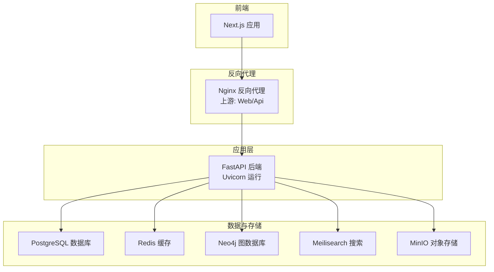
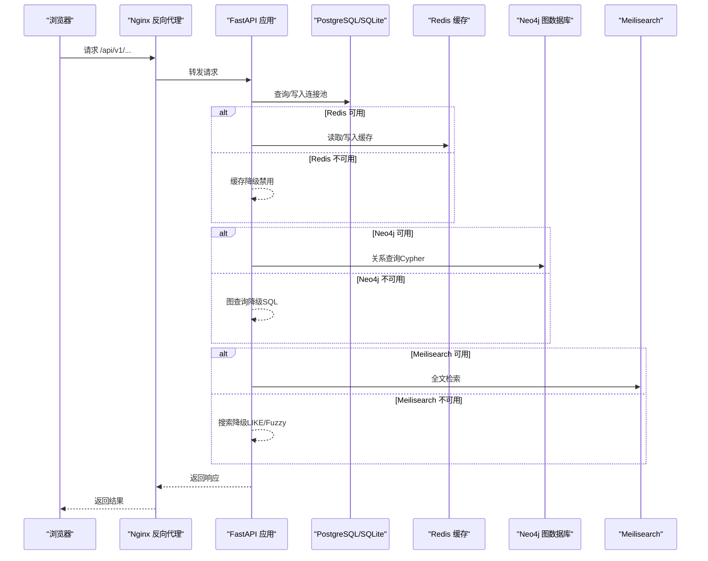
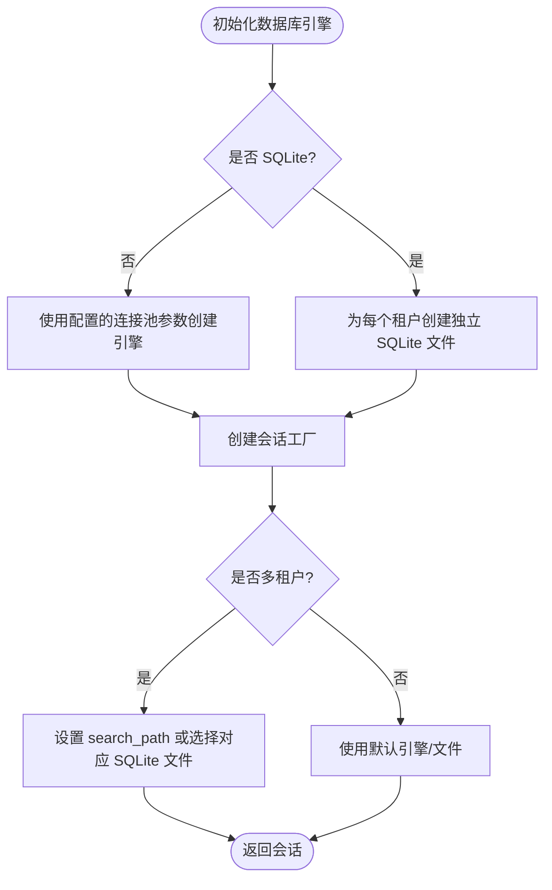
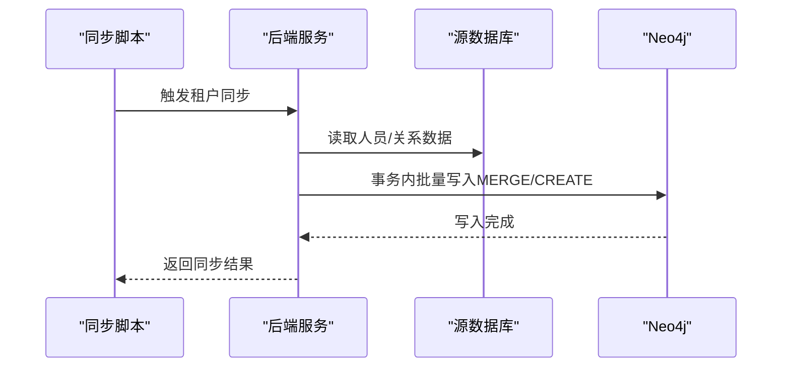
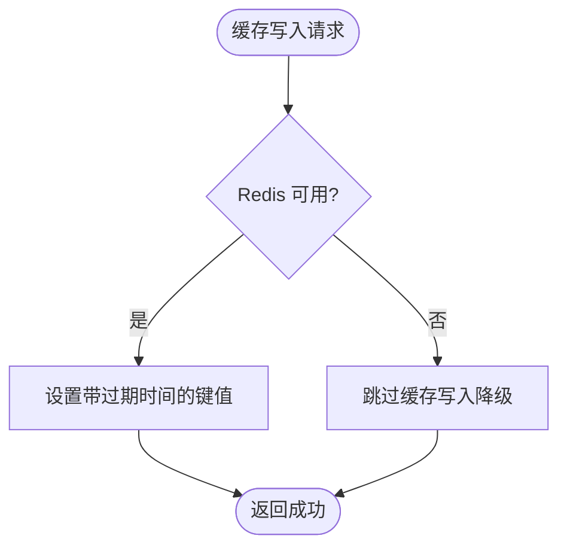
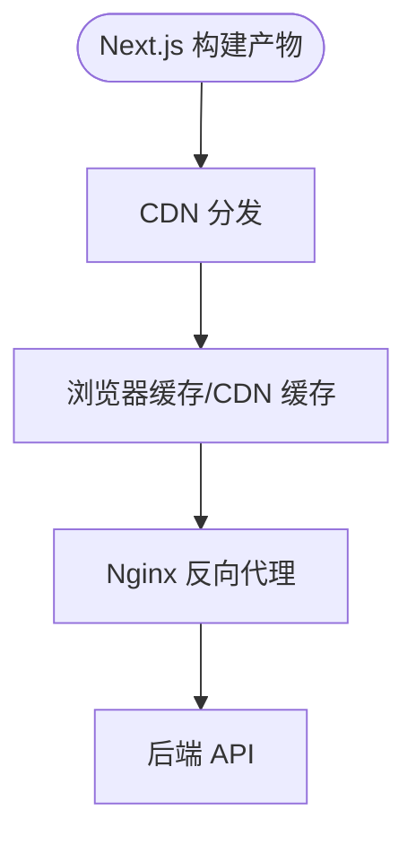
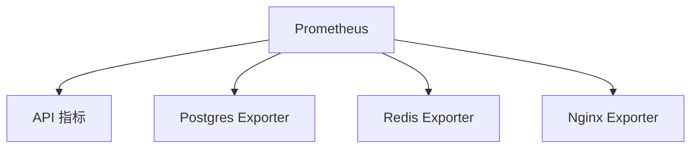
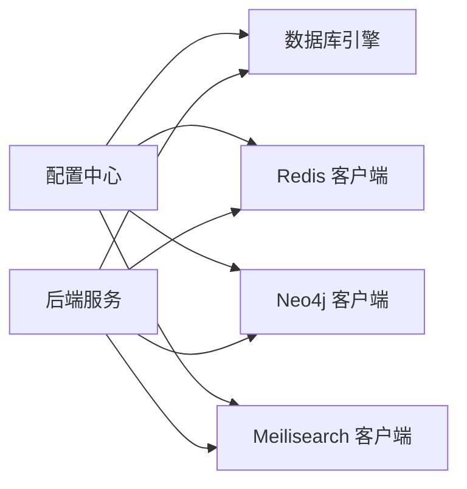

# 性能优化配置

<cite>
**本文引用的文件**
- [backend/app/core/config.py](file://backend/app/core/config.py)
- [backend/app/core/database.py](file://backend/app/core/database.py)
- [backend/app/services/neo4j_service.py](file://backend/app/services/neo4j_service.py)
- [backend/app/core/services.py](file://backend/app/core/services.py)
- [backend/Dockerfile.prod](file://backend/Dockerfile.prod)
- [docker-compose.prod.yml](file://docker-compose.prod.yml)
- [docker/prometheus/prometheus.yml](file://docker/prometheus/prometheus.yml)
- [docker/nginx/nginx.conf](file://docker/nginx/nginx.conf)
- [frontend/next.config.js](file://frontend/next.config.js)
- [backend/app/main.py](file://backend/app/main.py)
- [docker/postgres/init.sql](file://docker/postgres/init.sql)
- [scripts/sync_neo4j.py](file://scripts/sync_neo4j.py)
- [backend/pyproject.toml](file://backend/pyproject.toml)
- [frontend/package.json](file://frontend/package.json)
</cite>

## 目录
1. [简介](#简介)
2. [项目结构](#项目结构)
3. [核心组件](#核心组件)
4. [架构总览](#架构总览)
5. [详细组件分析](#详细组件分析)
6. [依赖分析](#依赖分析)
7. [性能考虑](#性能考虑)
8. [故障排查指南](#故障排查指南)
9. [结论](#结论)
10. [附录](#附录)

## 简介
本文件面向多租户族谱管理系统的生产环境，提供端到端的性能优化配置指南。内容覆盖数据库（PostgreSQL 连接池与索引）、图数据库（Neo4j 内存与查询）、缓存（Redis 配置与淘汰策略）、前端静态资源与 CDN、API 性能监控与慢查询分析、以及容器资源限制与自动扩缩容建议。所有建议均基于仓库现有实现与配置进行提炼与扩展。

## 项目结构
系统采用前后端分离与容器化部署，后端使用 FastAPI + SQLAlchemy Async + Uvicorn，数据库层支持 SQLite/PostgreSQL 多租户模式，图数据通过 Neo4j 提供关系查询能力，缓存与搜索服务可选接入，前端使用 Next.js，反向代理由 Nginx 承担。

图表来源
- [docker-compose.prod.yml:1-217](file://docker-compose.prod.yml#L1-L217)
- [docker/nginx/nginx.conf:46-54](file://docker/nginx/nginx.conf#L46-L54)
- [backend/app/main.py:45-91](file://backend/app/main.py#L45-L91)

章节来源
- [docker-compose.prod.yml:1-217](file://docker-compose.prod.yml#L1-L217)
- [docker/nginx/nginx.conf:1-57](file://docker/nginx/nginx.conf#L1-L57)

## 核心组件
- 应用配置与环境变量：集中于配置类，统一读取 .env 并缓存实例，便于在各模块共享。
- 数据库管理：支持 SQLite/PostgreSQL，按租户动态创建引擎与会话，PostgreSQL 使用连接池参数控制并发。
- 图数据库客户端：提供异步驱动、会话管理与常用查询封装，支持可选启用。
- 缓存与搜索服务：Redis 与 Meilisearch 以可选服务形式接入，失败时提供降级路径。
- 前端构建与运行：Next.js 支持图片优化与环境变量注入；Nginx 提供压缩、安全头与限流。
- 监控与指标：Prometheus 抓取 API、Postgres、Redis、Nginx 指标，配合 Grafana 可视化。

章节来源
- [backend/app/core/config.py:11-89](file://backend/app/core/config.py#L11-L89)
- [backend/app/core/database.py:24-171](file://backend/app/core/database.py#L24-L171)
- [backend/app/services/neo4j_service.py:12-373](file://backend/app/services/neo4j_service.py#L12-L373)
- [backend/app/core/services.py:9-285](file://backend/app/core/services.py#L9-L285)
- [frontend/next.config.js:1-23](file://frontend/next.config.js#L1-L23)
- [docker/nginx/nginx.conf:1-57](file://docker/nginx/nginx.conf#L1-L57)

## 架构总览
下图展示生产环境关键组件交互与数据流向，标注了连接池、缓存、图查询与搜索降级路径。

图表来源
- [docker-compose.prod.yml:98-152](file://docker-compose.prod.yml#L98-L152)
- [backend/app/core/services.py:268-285](file://backend/app/core/services.py#L268-L285)
- [backend/app/services/neo4j_service.py:64-373](file://backend/app/services/neo4j_service.py#L64-L373)

## 详细组件分析

### 数据库性能调优（PostgreSQL 连接池、缓存与索引）
- 连接池参数
  - 默认连接池大小与溢出数在配置中定义，适用于非 SQLite 场景。
  - 租户引擎在 PostgreSQL 模式下使用较小连接池，避免跨租户争用。
- 会话与事务
  - 显式控制会话生命周期，提交/回滚在依赖上下文中处理，减少异常导致的资源泄漏。
- 多租户模式
  - SQLite：每个租户独立数据库文件，避免锁竞争。
  - PostgreSQL：使用 schema 隔离，动态设置 search_path 切换租户。
- 索引与模糊搜索
  - 初始化脚本启用 trigram 扩展与相似度函数，有利于名称模糊匹配场景。

图表来源
- [backend/app/core/database.py:33-106](file://backend/app/core/database.py#L33-L106)
- [docker/postgres/init.sql:1-8](file://docker/postgres/init.sql#L1-L8)

章节来源
- [backend/app/core/config.py:34-50](file://backend/app/core/config.py#L34-L50)
- [backend/app/core/database.py:33-106](file://backend/app/core/database.py#L33-L106)
- [docker/postgres/init.sql:1-8](file://docker/postgres/init.sql#L1-L8)

### Neo4j 图数据库性能优化（内存、查询与批量导入）
- 内存配置
  - 堆大小与页面缓存通过环境变量设置，需结合容器内存限制与数据规模调整。
- 查询优化
  - 使用参数化 Cypher，避免字符串拼接；对高频查询建立节点标签与属性索引（建议在迁移脚本或初始化流程中添加）。
  - 控制遍历深度与返回数量，必要时分页或限制深度。
- 批量导入策略
  - 使用事务批量写入，减少网络往返；导入前清理旧数据或使用 MERGE 避免重复。
  - 提供同步脚本入口，便于按租户执行增量同步。

图表来源
- [scripts/sync_neo4j.py:14-38](file://scripts/sync_neo4j.py#L14-L38)
- [backend/app/services/neo4j_service.py:115-143](file://backend/app/services/neo4j_service.py#L115-L143)

章节来源
- [docker-compose.prod.yml:26-47](file://docker-compose.prod.yml#L26-L47)
- [backend/app/services/neo4j_service.py:12-373](file://backend/app/services/neo4j_service.py#L12-L373)
- [scripts/sync_neo4j.py:1-41](file://scripts/sync_neo4j.py#L1-L41)

### Redis 缓存配置（过期策略与内存淘汰）
- 容器内存与淘汰策略
  - 当前配置设置了最大内存与 LRU 淘汰策略，适合键值热点缓存场景。
- 过期策略
  - 服务层提供带过期时间的写入接口，默认过期时间可按业务调整。
- 建议
  - 为不同业务键空间设置差异化过期时间；对热数据可考虑不淘汰或更长 TTL。
  - 结合监控指标评估命中率与内存使用，动态调整 maxmemory 与策略。

图表来源
- [docker-compose.prod.yml:48-62](file://docker-compose.prod.yml#L48-L62)
- [backend/app/core/services.py:188-192](file://backend/app/core/services.py#L188-L192)

章节来源
- [docker-compose.prod.yml:48-62](file://docker-compose.prod.yml#L48-L62)
- [backend/app/core/services.py:142-199](file://backend/app/core/services.py#L142-L199)

### 前端静态资源优化（Next.js、CDN 与浏览器缓存）
- Next.js 配置
  - 启用 React Strict Mode，开启远程图片优化与环境变量注入。
- Nginx 优化
  - 开启 gzip 压缩、安全响应头、连接复用与连接数上限。
  - 为 API 与登录接口配置限流区段，防止滥用。
- CDN 建议
  - 将静态资源托管至 CDN，结合缓存头与版本化文件名实现长效缓存。
  - 对动态内容使用短缓存或按需失效策略。

图表来源
- [frontend/next.config.js:1-23](file://frontend/next.config.js#L1-L23)
- [docker/nginx/nginx.conf:28-44](file://docker/nginx/nginx.conf#L28-L44)

章节来源
- [frontend/next.config.js:1-23](file://frontend/next.config.js#L1-L23)
- [docker/nginx/nginx.conf:1-57](file://docker/nginx/nginx.conf#L1-L57)

### API 性能监控、慢查询分析与瓶颈识别
- 指标采集
  - Prometheus 抓取 API、Postgres Exporter、Redis Exporter、Nginx Exporter 指标。
- 慢查询与瓶颈定位
  - 在 API 层引入请求耗时日志与追踪；对数据库查询增加 EXPLAIN/ANALYZE 输出。
  - 对图查询与搜索查询记录耗时与返回条数，识别高成本路径。
- 建议
  - 为关键路由添加中间件统计；结合 APM 工具（如 OpenTelemetry）做全链路追踪。

图表来源
- [docker/prometheus/prometheus.yml:12-32](file://docker/prometheus/prometheus.yml#L12-L32)

章节来源
- [docker/prometheus/prometheus.yml:1-32](file://docker/prometheus/prometheus.yml#L1-L32)

### 容器资源限制、自动扩缩容与负载均衡
- 容器资源限制
  - 为 API、Web、数据库、缓存等服务设置 CPU/内存限制与重启策略。
- 自动扩缩容
  - 基于 CPU/内存与请求速率设置 HPA；对 API 与 Web 服务分别配置。
- 负载均衡
  - Nginx 作为入口反向代理，配置上游 keepalive 与连接数上限。
- 生产镜像
  - 后端使用多阶段构建，精简运行时依赖，非 root 用户运行，健康检查完备。

```mermaid
graph TB
LB["负载均衡/入口"]
subgraph "应用实例"
API1["API 实例 #1"]
API2["API 实例 #2"]
WEB1["Web 实例 #1"]
WEB2["Web 实例 #2"]
end
subgraph "基础设施"
PG["PostgreSQL"]
REDIS["Redis"]
NEO4J["Neo4j"]
end
LB --> API1
LB --> API2
LB --> WEB1
LB --> WEB2
API1 --> PG
API1 --> REDIS
API1 --> NEO4J
API2 --> PG
API2 --> REDIS
API2 --> NEO4J
```

图表来源
- [docker-compose.prod.yml:98-152](file://docker-compose.prod.yml#L98-L152)
- [backend/Dockerfile.prod:1-48](file://backend/Dockerfile.prod#L1-L48)

章节来源
- [docker-compose.prod.yml:1-217](file://docker-compose.prod.yml#L1-L217)
- [backend/Dockerfile.prod:1-48](file://backend/Dockerfile.prod#L1-L48)

## 依赖分析
- 组件耦合
  - 应用通过配置中心统一读取外部服务地址与参数，降低硬编码耦合。
  - 数据访问层与租户中间件解耦，租户上下文在请求阶段注入。
- 外部依赖
  - 后端依赖 FastAPI、SQLAlchemy Async、Redis、Neo4j、Meilisearch 等，均以可选服务形式接入，具备降级能力。
- 版本与工具
  - 语言与框架版本在项目配置中声明，测试与类型检查工具已配置。

图表来源
- [backend/app/core/config.py:11-89](file://backend/app/core/config.py#L11-L89)
- [backend/app/core/database.py:24-106](file://backend/app/core/database.py#L24-L106)
- [backend/app/core/services.py:262-285](file://backend/app/core/services.py#L262-L285)

章节来源
- [backend/pyproject.toml:1-61](file://backend/pyproject.toml#L1-L61)
- [frontend/package.json:1-45](file://frontend/package.json#L1-L45)

## 性能考虑
- 数据库
  - 合理设置连接池大小，避免过度连接导致排队；针对 PostgreSQL 使用较小连接池隔离租户。
  - 为高频查询字段建立索引，结合模糊搜索使用 trigram 扩展。
- 图数据库
  - 控制查询深度与返回数量；批量导入使用事务与参数化语句。
- 缓存
  - 为热点数据设置合理 TTL；根据命中率与内存使用动态调整 maxmemory 与淘汰策略。
- 前端
  - 启用静态资源压缩与 CDN；对动态内容设置短缓存或按需失效。
- 监控
  - 建立指标体系与告警；对慢查询与错误率进行持续观测。

## 故障排查指南
- 服务可用性检查
  - 通过健康检查端点确认数据库、图数据库、缓存与搜索服务状态。
- 日志与追踪
  - 查看 Nginx 访问/错误日志；在 API 中增加请求耗时与关键路径日志。
- 连接问题
  - 检查数据库连接串、凭据与网络连通性；核对租户 schema 设置。
- 缓存问题
  - 确认 Redis 可用性与内存剩余；检查键过期与淘汰策略是否符合预期。
- 图查询问题
  - 对高成本查询添加 EXPLAIN；优化遍历深度与过滤条件。

章节来源
- [backend/app/main.py:72-86](file://backend/app/main.py#L72-L86)
- [docker/nginx/nginx.conf:16-20](file://docker/nginx/nginx.conf#L16-L20)
- [backend/app/core/services.py:268-285](file://backend/app/core/services.py#L268-L285)

## 结论
本优化方案以现有配置为基础，围绕数据库连接池、图数据库内存与查询、缓存策略、前端静态资源与 CDN、API 监控与慢查询分析、以及容器资源与扩缩容展开。建议在生产环境中逐步落地，并结合监控数据持续迭代参数与策略，确保系统在高并发与大数据量场景下的稳定性与性能。

## 附录
- 关键配置位置参考
  - 应用配置与参数：[backend/app/core/config.py:11-89](file://backend/app/core/config.py#L11-L89)
  - 数据库引擎与会话：[backend/app/core/database.py:24-171](file://backend/app/core/database.py#L24-L171)
  - Neo4j 客户端与查询：[backend/app/services/neo4j_service.py:12-373](file://backend/app/services/neo4j_service.py#L12-L373)
  - 可选服务连接与降级：[backend/app/core/services.py:262-285](file://backend/app/core/services.py#L262-L285)
  - Nginx 反向代理与限流：[docker/nginx/nginx.conf:1-57](file://docker/nginx/nginx.conf#L1-L57)
  - Prometheus 抓取配置：[docker/prometheus/prometheus.yml:1-32](file://docker/prometheus/prometheus.yml#L1-L32)
  - 生产镜像与运行：[backend/Dockerfile.prod:1-48](file://backend/Dockerfile.prod#L1-L48)
  - Docker Compose 生产编排：[docker-compose.prod.yml:1-217](file://docker-compose.prod.yml#L1-L217)
  - PostgreSQL 初始化脚本：[docker/postgres/init.sql:1-8](file://docker/postgres/init.sql#L1-L8)
  - Neo4j 同步脚本入口：[scripts/sync_neo4j.py:1-41](file://scripts/sync_neo4j.py#L1-L41)
  - 前端 Next.js 配置：[frontend/next.config.js:1-23](file://frontend/next.config.js#L1-L23)
  - 项目依赖与工具：[backend/pyproject.toml:1-61](file://backend/pyproject.toml#L1-L61)、[frontend/package.json:1-45](file://frontend/package.json#L1-L45)