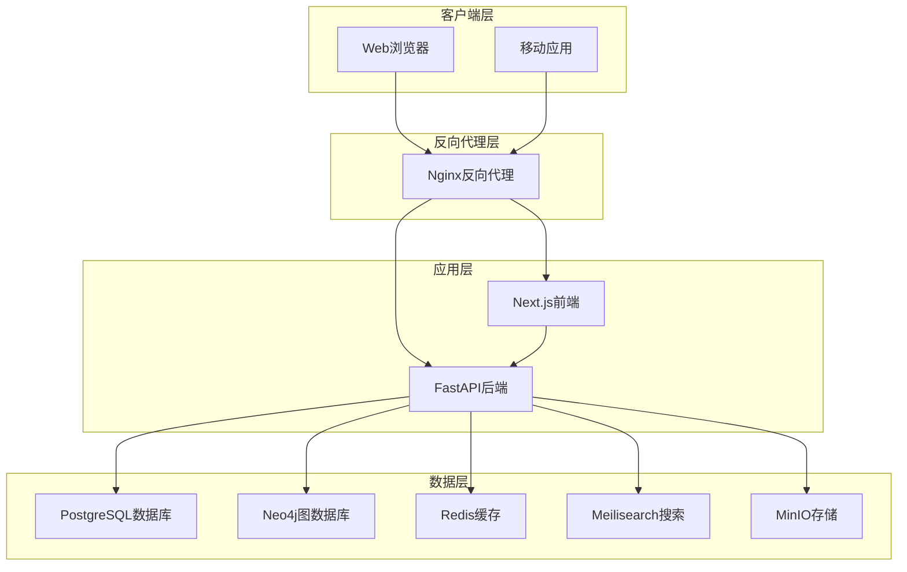
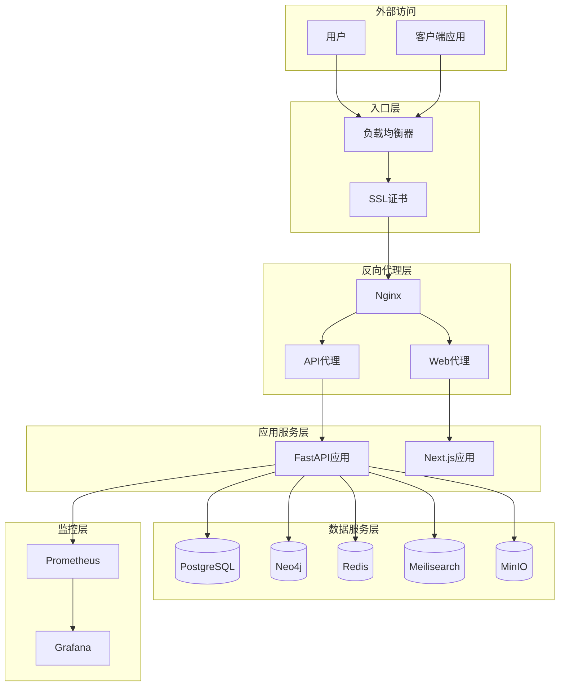
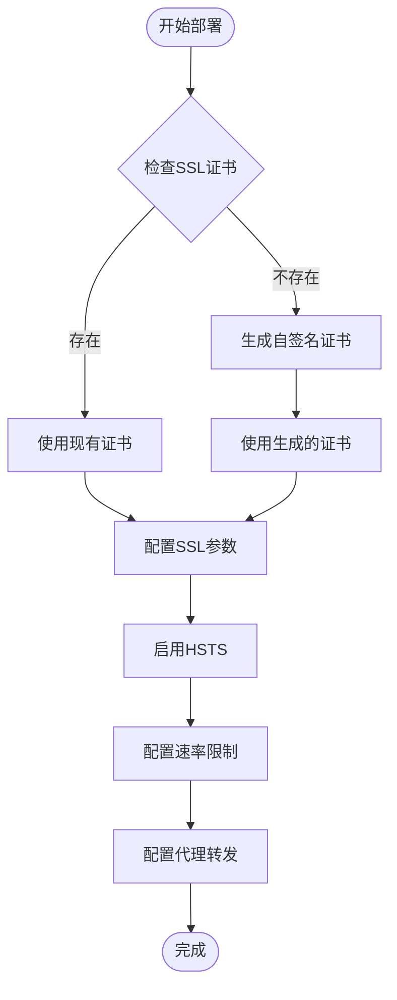
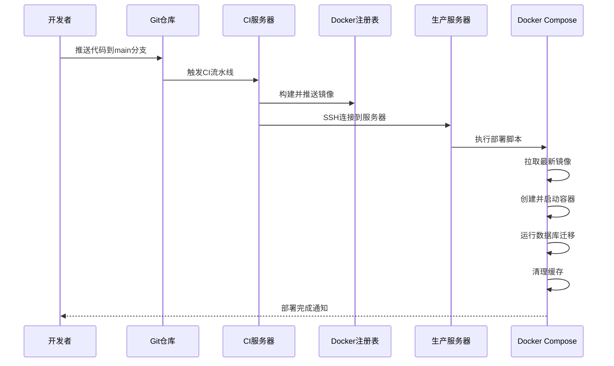
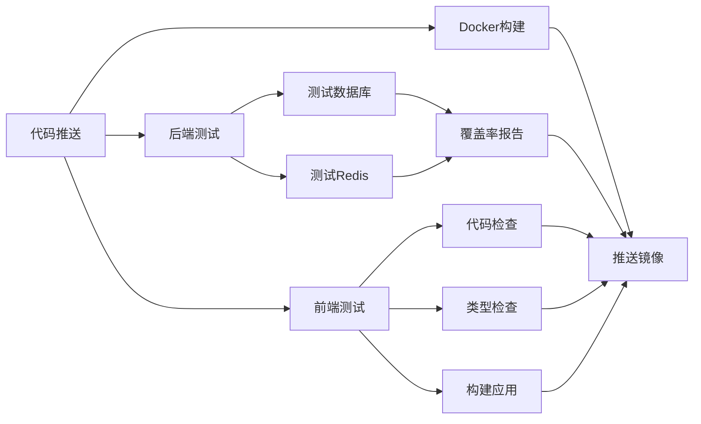
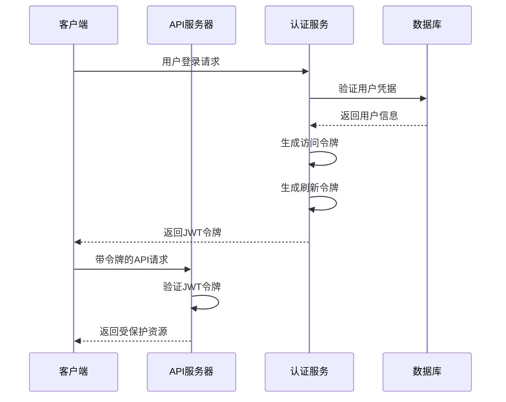
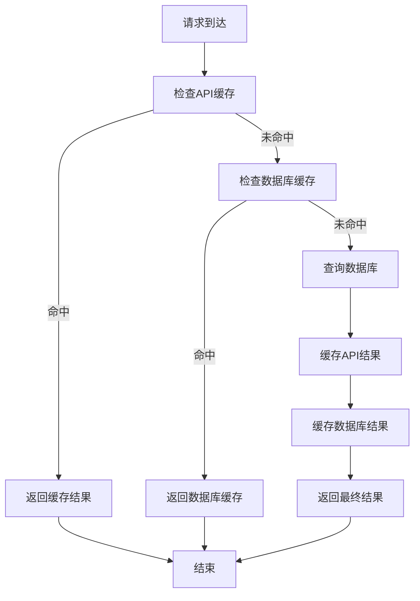
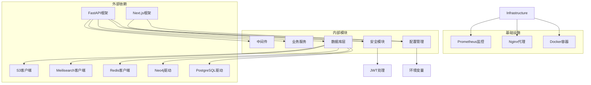
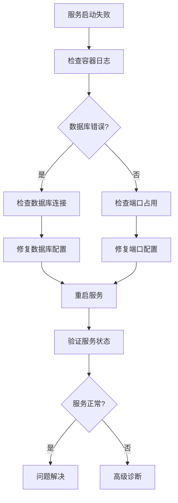

# 生产环境部署

<cite>
**本文档引用的文件**
- [docker-compose.prod.yml](file://docker-compose.prod.yml)
- [docker-compose.yml](file://docker-compose.yml)
- [deploy.sh](file://deploy.sh)
- [.github/workflows/ci-cd.yml](file://.github/workflows/ci-cd.yml)
- [backend/Dockerfile.prod](file://backend/Dockerfile.prod)
- [frontend/Dockerfile](file://frontend/Dockerfile)
- [docker/nginx/nginx.conf](file://docker/nginx/nginx.conf)
- [docker/nginx/conf.d/default.conf](file://docker/nginx/conf.d/default.conf)
- [docker/prometheus/prometheus.yml](file://docker/prometheus/prometheus.yml)
- [backend/app/core/config.py](file://backend/app/core/config.py)
- [backend/app/main.py](file://backend/app/main.py)
- [backend/app/core/security.py](file://backend/app/core/security.py)
- [docker/postgres/init.sql](file://docker/postgres/init.sql)
- [backend/alembic.ini](file://backend/alembic.ini)
- [backend/pyproject.toml](file://backend/pyproject.toml)
- [scripts/create_tenant.py](file://scripts/create_tenant.py)
</cite>

## 目录
1. [简介](#简介)
2. [项目结构](#项目结构)
3. [核心组件](#核心组件)
4. [架构概览](#架构概览)
5. [详细组件分析](#详细组件分析)
6. [依赖关系分析](#依赖关系分析)
7. [性能考虑](#性能考虑)
8. [故障排除指南](#故障排除指南)
9. [结论](#结论)
10. [附录](#附录)

## 简介

多租户族谱管理系统是一个基于现代技术栈构建的企业级应用，支持多个独立的族谱数据隔离和管理。该系统采用微服务架构，通过Docker容器化部署，实现了高可用性和可扩展性。

本项目的核心特性包括：
- 多租户架构：每个族谱拥有独立的数据隔离
- 图数据库支持：使用Neo4j进行家族关系图谱管理
- 搜索功能：集成Meilisearch提供全文检索
- 缓存系统：Redis提升数据访问性能
- 对象存储：MinIO提供S3兼容的存储服务
- 反向代理：Nginx提供负载均衡和SSL终止

## 项目结构

系统采用分层架构设计，主要分为以下层次：

**图表来源**
- [docker-compose.prod.yml:1-217](file://docker-compose.prod.yml#L1-L217)
- [docker-compose.yml:1-145](file://docker-compose.yml#L1-L145)

**章节来源**
- [docker-compose.prod.yml:1-217](file://docker-compose.prod.yml#L1-L217)
- [docker-compose.yml:1-145](file://docker-compose.yml#L1-L145)

## 核心组件

### 数据库组件

系统使用PostgreSQL作为主数据库，支持多租户模式下的Schema隔离。每个租户拥有独立的数据库Schema，实现数据完全隔离。

**章节来源**
- [docker-compose.prod.yml:6-25](file://docker-compose.prod.yml#L6-L25)
- [docker/postgres/init.sql:1-8](file://docker/postgres/init.sql#L1-L8)

### 图数据库组件

Neo4j用于存储和查询复杂的家族关系网络，支持高效的图遍历和关系查询。

**章节来源**
- [docker-compose.prod.yml:26-47](file://docker-compose.prod.yml#L26-L47)

### 缓存组件

Redis提供高性能的键值存储，用于会话管理、缓存和消息队列。

**章节来源**
- [docker-compose.prod.yml:48-63](file://docker-compose.prod.yml#L48-L63)

### 搜索组件

Meilisearch提供实时的全文搜索引擎，支持模糊匹配和高级搜索功能。

**章节来源**
- [docker-compose.prod.yml:64-76](file://docker-compose.prod.yml#L64-L76)

### 存储组件

MinIO提供S3兼容的对象存储服务，用于存储图片、文档等静态资源。

**章节来源**
- [docker-compose.prod.yml:77-95](file://docker-compose.prod.yml#L77-L95)

### 应用组件

#### 后端API服务

基于FastAPI构建的RESTful API服务，提供完整的多租户族谱管理功能。

**章节来源**
- [docker-compose.prod.yml:98-136](file://docker-compose.prod.yml#L98-L136)
- [backend/Dockerfile.prod:1-48](file://backend/Dockerfile.prod#L1-L48)

#### 前端Web服务

基于Next.js构建的现代化前端应用，提供响应式用户界面。

**章节来源**
- [docker-compose.prod.yml:137-153](file://docker-compose.prod.yml#L137-L153)
- [frontend/Dockerfile:1-51](file://frontend/Dockerfile#L1-L51)

### 反向代理组件

Nginx作为反向代理服务器，提供SSL终止、负载均衡和请求路由功能。

**章节来源**
- [docker-compose.prod.yml:154-173](file://docker-compose.prod.yml#L154-L173)
- [docker/nginx/nginx.conf:1-57](file://docker/nginx/nginx.conf#L1-L57)
- [docker/nginx/conf.d/default.conf:1-113](file://docker/nginx/conf.d/default.conf#L1-L113)

## 架构概览

系统采用容器化微服务架构，所有服务通过Docker Compose进行编排管理。

**图表来源**
- [docker-compose.prod.yml:1-217](file://docker-compose.prod.yml#L1-L217)
- [docker/nginx/conf.d/default.conf:1-113](file://docker/nginx/conf.d/default.conf#L1-L113)

## 详细组件分析

### Nginx反向代理配置

Nginx作为系统的统一入口，提供了完整的反向代理、负载均衡和SSL终止功能。

#### SSL证书管理

系统支持多种SSL配置方案：

**图表来源**
- [docker/nginx/conf.d/default.conf:14-28](file://docker/nginx/conf.d/default.conf#L14-L28)
- [docker/nginx/conf.d/default.conf:78-92](file://docker/nginx/conf.d/default.conf#L78-L92)

#### 负载均衡配置

Nginx配置了上游服务器组，支持连接保持和负载分发：

**章节来源**
- [docker/nginx/nginx.conf:45-54](file://docker/nginx/nginx.conf#L45-L54)
- [docker/nginx/conf.d/default.conf:30-44](file://docker/nginx/conf.d/default.conf#L30-L44)

### 容器编排最佳实践

#### Docker Compose生产配置

生产环境使用专门的Compose文件，包含完整的配置选项：

**图表来源**
- [.github/workflows/ci-cd.yml:142-160](file://.github/workflows/ci-cd.yml#L142-L160)
- [deploy.sh:26-52](file://deploy.sh#L26-L52)

#### 资源限制和健康检查

每个服务都配置了适当的资源限制和健康检查机制：

**章节来源**
- [docker-compose.prod.yml:18-22](file://docker-compose.prod.yml#L18-L22)
- [docker-compose.prod.yml:40-44](file://docker-compose.prod.yml#L40-L44)
- [docker-compose.prod.yml:56-60](file://docker-compose.prod.yml#L56-L60)

### CI/CD流水线配置

系统集成了完整的持续集成和持续部署流水线：

#### 测试阶段

**图表来源**
- [.github/workflows/ci-cd.yml:14-71](file://.github/workflows/ci-cd.yml#L14-L71)
- [.github/workflows/ci-cd.yml:72-102](file://.github/workflows/ci-cd.yml#L72-L102)
- [.github/workflows/ci-cd.yml:103-141](file://.github/workflows/ci-cd.yml#L103-L141)

#### 自动化部署流程

**章节来源**
- [.github/workflows/ci-cd.yml:142-160](file://.github/workflows/ci-cd.yml#L142-L160)
- [deploy.sh:1-64](file://deploy.sh#L1-L64)

### 安全配置

#### JWT认证机制

系统使用JWT进行用户身份验证和授权：

**图表来源**
- [backend/app/core/security.py:26-52](file://backend/app/core/security.py#L26-L52)
- [backend/app/core/security.py:55-77](file://backend/app/core/security.py#L55-L77)

#### CORS配置

系统配置了灵活的CORS策略，支持多域名访问：

**章节来源**
- [backend/app/core/config.py:59-80](file://backend/app/core/config.py#L59-L80)
- [backend/app/main.py:57-68](file://backend/app/main.py#L57-L68)

### 性能优化

#### 缓存策略

系统采用了多层次的缓存策略：

**图表来源**
- [docker-compose.prod.yml:53](file://docker-compose.prod.yml#L53)
- [backend/app/core/config.py:46-47](file://backend/app/core/config.py#L46-L47)

#### 数据库优化

PostgreSQL配置了优化的连接池和索引策略：

**章节来源**
- [backend/app/core/config.py:38-40](file://backend/app/core/config.py#L38-L40)
- [docker/postgres/init.sql:1-8](file://docker/postgres/init.sql#L1-L8)

## 依赖关系分析

系统各组件之间的依赖关系如下：

**图表来源**
- [backend/pyproject.toml:7-25](file://backend/pyproject.toml#L7-L25)
- [docker-compose.prod.yml:107-120](file://docker-compose.prod.yml#L107-L120)

**章节来源**
- [backend/pyproject.toml:1-61](file://backend/pyproject.toml#L1-L61)
- [docker-compose.prod.yml:107-120](file://docker-compose.prod.yml#L107-L120)

## 性能考虑

### 资源分配建议

#### 数据库性能调优

- **PostgreSQL**: 建议至少2GB内存，根据并发用户数调整连接池大小
- **Neo4j**: 建议至少1GB内存，根据图数据规模调整堆大小
- **Redis**: 建议至少512MB内存，根据缓存数据量调整maxmemory策略

#### 缓存策略

- **API缓存**: 使用Redis缓存热点数据，设置合理的过期时间
- **静态资源缓存**: 前端静态文件设置长期缓存策略
- **数据库查询缓存**: 对频繁查询的结果进行缓存

### 监控和日志

#### Prometheus监控配置

系统集成了Prometheus监控，支持以下指标：

**章节来源**
- [docker/prometheus/prometheus.yml:17-29](file://docker/prometheus/prometheus.yml#L17-L29)

## 故障排除指南

### 常见问题诊断

#### 服务启动失败

#### 性能问题排查

**章节来源**
- [docker-compose.prod.yml:18-22](file://docker-compose.prod.yml#L18-L22)
- [docker-compose.prod.yml:40-44](file://docker-compose.prod.yml#L40-L44)

### 健康检查

系统为每个服务配置了健康检查机制：

**章节来源**
- [docker-compose.prod.yml:129-134](file://docker-compose.prod.yml#L129-L134)
- [backend/Dockerfile.prod:42-44](file://backend/Dockerfile.prod#L42-L44)

## 结论

多租户族谱管理系统采用现代化的技术栈和架构设计，具备以下优势：

1. **高可用性**: 通过容器化和负载均衡实现服务高可用
2. **可扩展性**: 支持水平扩展和垂直扩展
3. **安全性**: 完善的安全机制和权限控制
4. **可维护性**: 清晰的架构设计和完善的监控体系
5. **自动化**: 完整的CI/CD流水线和自动化部署

该系统适合部署在生产环境中，能够满足多租户族谱管理的各种需求。

## 附录

### 部署环境要求

#### 硬件要求

- **最低配置**: 4核CPU，8GB内存，100GB磁盘空间
- **推荐配置**: 8核CPU，16GB内存，200GB磁盘空间
- **数据库服务器**: 专用服务器，至少16GB内存

#### 软件要求

- **操作系统**: Ubuntu 20.04 LTS或更高版本
- **Docker**: Docker Engine 20.10或更高版本
- **Docker Compose**: Docker Compose v2或更高版本

### 环境变量配置

#### 必需环境变量

**章节来源**
- [docker-compose.prod.yml:11-15](file://docker-compose.prod.yml#L11-L15)
- [docker-compose.prod.yml:32-34](file://docker-compose.prod.yml#L32-L34)
- [docker-compose.prod.yml:82-85](file://docker-compose.prod.yml#L82-L85)

### 备份和恢复

#### 数据备份策略

**章节来源**
- [scripts/create_tenant.py:18-44](file://scripts/create_tenant.py#L18-L44)

### 升级和维护

#### 系统升级流程

**章节来源**
- [deploy.sh:22-29](file://deploy.sh#L22-L29)