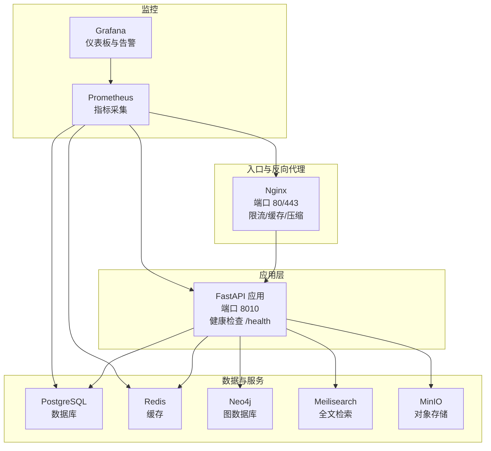
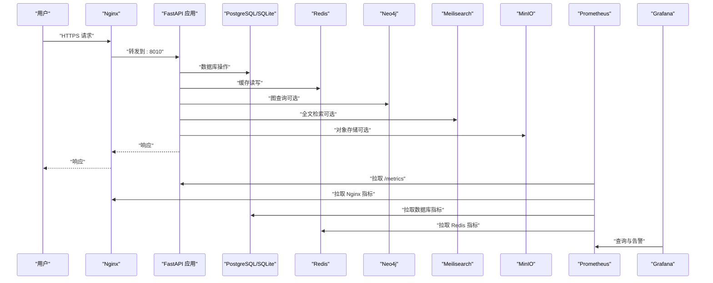
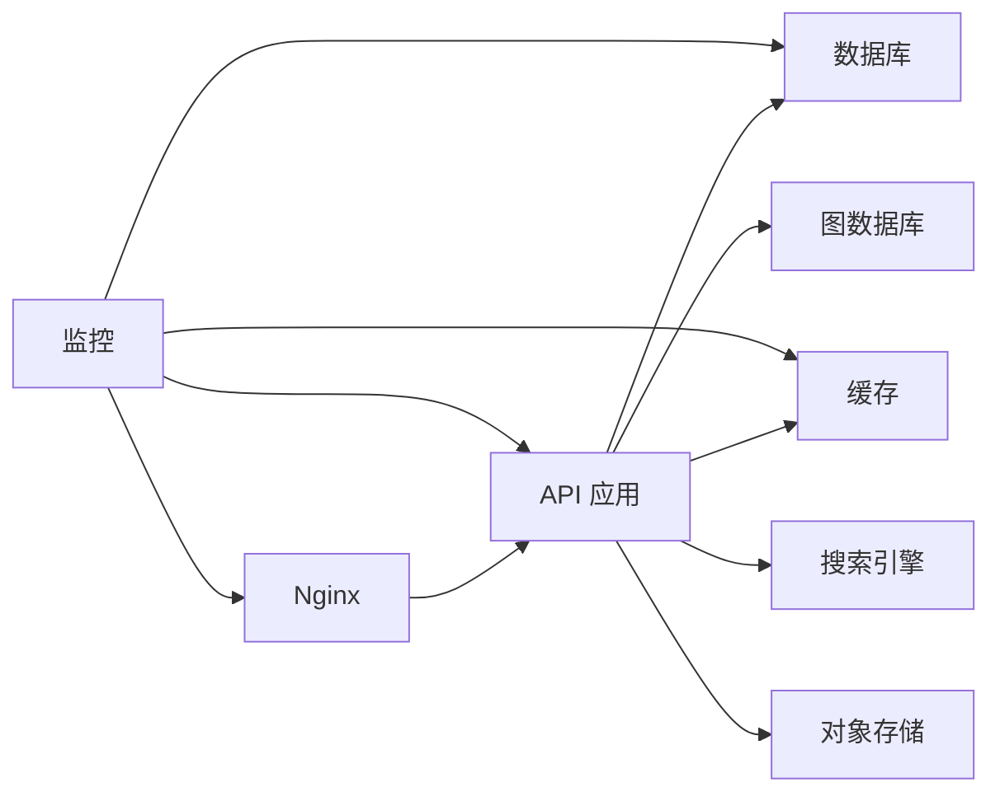

# 监控与日志

<cite>
**本文引用的文件**
- [docker-compose.prod.yml](file://docker-compose.prod.yml)
- [prometheus.yml](file://docker\prometheus\prometheus.yml)
- [nginx.conf](file://docker\nginx\nginx.conf)
- [default.conf](file://docker\nginx\conf.d\default.conf)
- [main.py](file://backend\app\main.py)
- [config.py](file://backend\app\core\config.py)
- [database.py](file://backend\app\core\database.py)
- [services.py](file://backend\app\core\services.py)
- [tenant.py](file://backend\app\middleware\tenant.py)
- [auth.py](file://backend\app\middleware\auth.py)
- [auth.py](file://backend\app\api\v1\endpoints\auth.py)
- [family_tree.py](file://backend\app\api\v1\endpoints\family_tree.py)
- [security.py](file://backend\app\core\security.py)
- [Dockerfile.prod](file://backend\Dockerfile.prod)
- [pyproject.toml](file://backend\pyproject.toml)
- [alembic.ini](file://backend\alembic.ini)
</cite>

## 目录
1. [简介](#简介)
2. [项目结构](#项目结构)
3. [核心组件](#核心组件)
4. [架构总览](#架构总览)
5. [详细组件分析](#详细组件分析)
6. [依赖分析](#依赖分析)
7. [性能考虑](#性能考虑)
8. [故障排查指南](#故障排查指南)
9. [结论](#结论)
10. [附录](#附录)

## 简介
本文件面向多租户族谱管理系统的生产环境，提供完整的监控与日志配置方案，涵盖以下方面：
- Prometheus 指标采集配置：后端 API、数据库、缓存、搜索引擎、Web 服务器等
- Grafana 仪表板设置建议：数据库连接池、查询耗时、缓存命中率、搜索性能、请求量与错误率
- 告警规则定义：服务可用性、错误率阈值、资源使用上限、健康检查失败
- 应用日志结构化、日志聚合与轮转策略：统一格式、集中存储、按天/大小轮转
- 数据库性能监控：连接池使用、慢查询、锁等待、事务回滚
- API 响应时间与错误率监控：P95/P99 延迟、状态码分布、速率限制触发
- 容器资源、网络流量与存储监控：CPU、内存、磁盘 IO、网络带宽、卷使用
- 用户体验监控与业务指标：登录成功率、树图加载时间、搜索返回时间
- 自定义指标收集方法：在关键路径埋点（如数据库会话、外部服务调用）
- 故障排查工具、调试技巧与性能分析方法：日志检索、指标关联、火焰图、追踪链路

## 项目结构
系统由以下主要组件构成：
- 反向代理与入口：Nginx（负载均衡、TLS 终止、限流）
- 后端 API：FastAPI（健康检查、租户中间件、认证中间件）
- 数据层：PostgreSQL（主库）、SQLite（租户隔离场景下的替代）
- 图数据库：Neo4j（可选，用于关系查询）
- 缓存：Redis（可选，用于缓存）
- 搜索：Meilisearch（可选，全文检索）
- 存储：MinIO（S3 兼容对象存储）
- 监控：Prometheus（指标采集）、Grafana（可视化）

图表来源
- [docker-compose.prod.yml:98-172](file://docker-compose.prod.yml#L98-L172)
- [nginx.conf:12-56](file://docker\nginx\nginx.conf#L12-L56)
- [prometheus.yml:12-32](file://docker\prometheus\prometheus.yml#L12-L32)

章节来源
- [docker-compose.prod.yml:1-217](file://docker-compose.prod.yml#L1-L217)
- [nginx.conf:1-57](file://docker\nginx\nginx.conf#L1-L57)
- [prometheus.yml:1-32](file://docker\prometheus\prometheus.yml#L1-L32)

## 核心组件
- 应用入口与健康检查：后端提供 /health 接口，返回服务可用性状态；容器健康检查通过 /health 验证
- 多租户中间件：从子域名、URL 路径或请求头提取租户标识，并设置租户上下文
- 认证中间件：从 Authorization 头解析 Bearer Token，校验并注入当前用户
- 外部服务连接：Neo4j、Redis、Meilisearch 连接采用可选模式，失败不影响应用启动
- 数据库管理：支持 SQLite 与 PostgreSQL，租户隔离通过独立数据库文件或 schema 实现
- Nginx 配置：访问日志格式、Gzip 压缩、安全头、速率限制、上游转发

章节来源
- [main.py:72-86](file://backend\app\main.py#L72-L86)
- [tenant.py:15-142](file://backend\app\middleware\tenant.py#L15-L142)
- [auth.py:15-88](file://backend\app\middleware\auth.py#L15-L88)
- [services.py:268-284](file://backend\app\core\services.py#L268-L284)
- [database.py:24-171](file://backend\app\core\database.py#L24-L171)
- [nginx.conf:16-44](file://docker\nginx\nginx.conf#L16-L44)

## 架构总览
下图展示生产环境监控与日志的关键交互：

图表来源
- [docker-compose.prod.yml:98-172](file://docker-compose.prod.yml#L98-L172)
- [prometheus.yml:17-32](file://docker\prometheus\prometheus.yml#L17-L32)
- [nginx.conf:30-44](file://docker\nginx\nginx.conf#L30-L44)

## 详细组件分析

### Prometheus 指标采集配置
- 采集目标
  - Prometheus 自身：localhost:9090
  - API：api:8010，指标路径 /metrics
  - PostgreSQL Exporter：postgres-exporter:9187
  - Redis Exporter：redis-exporter:9121
  - Nginx Exporter：nginx-exporter:9113
- 建议扩展
  - 在后端应用中增加 /metrics 端点（如使用指标库暴露数据库连接池、请求耗时、外部服务调用耗时）
  - 为 Nginx 配置 exporter 并启用访问日志格式化
  - 为数据库、缓存、搜索引擎分别配置官方 exporter

章节来源
- [prometheus.yml:12-32](file://docker\prometheus\prometheus.yml#L12-L32)
- [docker-compose.prod.yml:176-188](file://docker-compose.prod.yml#L176-L188)

### Grafana 仪表板设置
- 数据源：Prometheus
- 关键面板建议
  - API 性能：请求总量、错误率、P95/P99 延迟、路由级延迟
  - 数据库：连接池使用、活动连接数、慢查询计数、事务回滚率
  - 缓存：命中率、未命中率、过期与驱逐事件
  - 搜索：索引文档数量、搜索耗时、查询失败率
  - Web 层：请求量、状态码分布、上游转发耗时、缓存命中
  - 存储：卷使用率、对象数量、上传/下载字节数
  - 容器资源：CPU 使用、内存使用、网络 I/O、磁盘 I/O

[本节为概念性内容，不直接分析具体文件]

### 告警规则定义
- 服务可用性
  - API /health 不可达持续超过阈值
  - 数据库连接池耗尽或超时激增
- 错误率
  - 5xx 错误率超过阈值
  - 认证/鉴权失败率异常升高
- 资源使用
  - CPU 使用率持续高于阈值
  - 内存使用接近上限
  - 磁盘空间剩余低于阈值
- 外部服务
  - Redis/Neo4j/Meilisearch 连接失败或响应超时
- 业务指标
  - 登录成功率下降
  - 树图加载时间 P95 超过阈值

[本节为概念性内容，不直接分析具体文件]

### 应用日志结构化、日志聚合与轮转
- 结构化日志
  - 统一字段：timestamp、level、service、tenant、trace_id、span_id、module、function、message、extra
  - 在 FastAPI 中使用结构化日志库输出 JSON 格式
- 日志聚合
  - 使用集中式日志系统（如 ELK/EFK 或 Loki + Promtail）收集各容器日志
  - 将 Nginx 访问日志与应用日志统一格式化
- 日志轮转
  - 按天或大小轮转，保留一定周期的历史日志
  - 控制单个日志文件大小，避免单文件过大影响检索

[本节为概念性内容，不直接分析具体文件]

### 数据库性能监控
- 指标
  - 连接池使用率、活跃连接数、排队等待时间
  - 查询执行时间分布、慢查询计数
  - 事务回滚次数、锁等待时间
- 建议
  - 为 PostgreSQL 配置 exporter，采集标准指标
  - 在应用侧记录慢查询与错误统计
  - 对 SQLite 场景关注文件锁与并发写入

章节来源
- [database.py:33-56](file://backend\app\core\database.py#L33-L56)
- [database.py:98-106](file://backend\app\core\database.py#L98-L106)

### API 响应时间与错误率监控
- 指标
  - 请求总量、错误率（4xx/5xx）、P95/P99 延迟
  - 路由级延迟分布、认证失败率
- 建议
  - 在中间件或拦截器中埋点，记录请求开始与结束时间
  - 对认证失败、权限不足、租户不存在等进行分类统计

章节来源
- [auth.py:15-88](file://backend\app\middleware\auth.py#L15-L88)
- [tenant.py:15-142](file://backend\app\middleware\tenant.py#L15-L142)
- [family_tree.py:43-68](file://backend\app\api\v1\endpoints\family_tree.py#L43-L68)

### 容器资源、网络流量与存储监控
- 资源监控
  - CPU 使用率、内存使用、进程数
- 网络监控
  - 上游转发耗时、连接数、错误
- 存储监控
  - 卷使用率、对象数量、上传/下载字节数

章节来源
- [docker-compose.prod.yml:203-212](file://docker-compose.prod.yml#L203-L212)

### 用户体验监控与业务指标
- 用户体验
  - 登录成功率、首次登录耗时、树图渲染时间
- 业务指标
  - 租户数、人员总数、生成代数分布、搜索命中率

[本节为概念性内容，不直接分析具体文件]

### 自定义指标收集方法
- 在关键路径埋点
  - 数据库会话创建/释放、外部服务调用耗时
  - 租户切换、权限校验、认证流程
- 指标类型
  - 计数器（错误数、请求量）、直方图（延迟）、摘要（慢查询）

[本节为概念性内容，不直接分析具体文件]

## 依赖分析
- 组件耦合
  - API 依赖数据库、缓存、搜索引擎、对象存储
  - Nginx 作为统一入口，转发至 API 与前端
  - 监控组件独立于业务，通过 exporter 拉取指标
- 外部依赖
  - PostgreSQL/SQLite、Neo4j、Redis、Meilisearch、MinIO
  - Prometheus/Grafana

图表来源
- [docker-compose.prod.yml:98-172](file://docker-compose.prod.yml#L98-L172)
- [prometheus.yml:17-32](file://docker\prometheus\prometheus.yml#L17-L32)

章节来源
- [docker-compose.prod.yml:1-217](file://docker-compose.prod.yml#L1-L217)
- [prometheus.yml:1-32](file://docker\prometheus\prometheus.yml#L1-L32)

## 性能考虑
- 连接池与并发
  - 数据库连接池参数需结合实例规格调整
  - 缓存命中率优先，避免热点数据频繁回源
- 查询优化
  - 对高频查询建立索引，避免全表扫描
  - 分页与分批处理大数据集
- 外部服务降级
  - 失败时快速返回，记录日志并上报指标
- Nginx 优化
  - 启用 Gzip 压缩、合理设置 keepalive
  - 速率限制保护后端

[本节为通用指导，不直接分析具体文件]

## 故障排查指南
- 快速检查
  - 访问 /health 确认服务状态
  - 查看 Nginx 访问/错误日志
  - 检查数据库连接与外部服务连通性
- 指标关联
  - 将错误率上升与资源使用峰值关联
  - 关注外部服务延迟与失败率
- 日志检索
  - 按 trace_id/tenant 聚合日志
  - 使用正则过滤关键错误信息
- 性能分析
  - 使用火焰图定位热点函数
  - 分析慢查询与锁等待

[本节为通用指导，不直接分析具体文件]

## 结论
通过完善的监控与日志体系，可以实现对多租户族谱管理系统的可观测性覆盖，包括基础设施、应用、数据库、外部服务与用户体验。建议尽快落地 Prometheus 指标采集、Grafana 仪表板与告警规则，并标准化日志格式与轮转策略，以保障生产环境的稳定性与可维护性。

[本节为总结性内容，不直接分析具体文件]

## 附录

### Prometheus 采集配置要点
- 采集间隔与评估间隔：根据业务规模调整
- 指标路径：API 的 /metrics 端点需在应用中实现
- Exporter：确保各组件 exporter 正常运行并暴露指标

章节来源
- [prometheus.yml:1-32](file://docker\prometheus\prometheus.yml#L1-L32)

### Nginx 日志与限流配置
- 访问日志格式：包含客户端 IP、请求、状态码、用户代理
- 速率限制：针对 API 与登录接口设置不同阈值
- 安全头：X-Frame-Options、X-Content-Type-Options、Strict-Transport-Security

章节来源
- [nginx.conf:16-44](file://docker\nginx\nginx.conf#L16-L44)
- [default.conf:42-48](file://docker\nginx\conf.d\default.conf#L42-L48)

### 应用健康检查与容器健康探针
- 应用 /health：返回服务可用性与外部服务状态
- 容器健康探针：基于 /health 的 HTTP 探针

章节来源
- [main.py:72-86](file://backend\app\main.py#L72-L86)
- [Dockerfile.prod:42-47](file://backend\Dockerfile.prod#L42-L47)

### 数据库连接与租户隔离
- 默认引擎初始化：SQLite 与 PostgreSQL 的连接参数
- 租户会话：根据租户 schema 切换或使用独立数据库文件

章节来源
- [database.py:33-56](file://backend\app\core\database.py#L33-L56)
- [database.py:136-171](file://backend\app\core\database.py#L136-L171)

### 外部服务连接与降级
- Neo4j/Redis/Meilisearch：可选连接，失败不影响应用
- 连接状态：通过全局服务实例暴露可用性

章节来源
- [services.py:21-61](file://backend\app\core\services.py#L21-L61)
- [services.py:154-199](file://backend\app\core\services.py#L154-L199)
- [services.py:213-260](file://backend\app\core\services.py#L213-L260)
- [services.py:268-284](file://backend\app\core\services.py#L268-L284)

### 认证与授权中间件
- Token 解析与校验：从 Authorization 头提取 Bearer Token
- 权限依赖：提供超级用户与可选权限检查器

章节来源
- [auth.py:15-88](file://backend\app\middleware\auth.py#L15-L88)
- [security.py:80-103](file://backend\app\core\security.py#L80-L103)

### 租户中间件与路由
- 租户识别：子域名、URL 路径、请求头
- 公共路径：免租户校验的路由集合
- 租户校验：租户不存在或非激活时返回相应错误

章节来源
- [tenant.py:15-142](file://backend\app\middleware\tenant.py#L15-L142)

### API 端点示例与业务逻辑
- 认证端点：注册、登录、刷新令牌、获取当前用户
- 家谱树端点：获取树结构、祖先/后代查询、统计信息

章节来源
- [auth.py:55-179](file://backend\app\api\v1\endpoints\auth.py#L55-L179)
- [family_tree.py:43-274](file://backend\app\api\v1\endpoints\family_tree.py#L43-L274)

### 开发与构建配置
- 生产镜像：多阶段构建、非 root 用户、健康检查
- 依赖管理：Python 包与测试配置

章节来源
- [Dockerfile.prod:1-48](file://backend\Dockerfile.prod#L1-L48)
- [pyproject.toml:1-61](file://backend\pyproject.toml#L1-L61)

### 数据迁移日志配置
- Alembic 日志级别与格式：控制迁移过程中的日志输出

章节来源
- [alembic.ini:21-44](file://backend\alembic.ini#L21-L44)