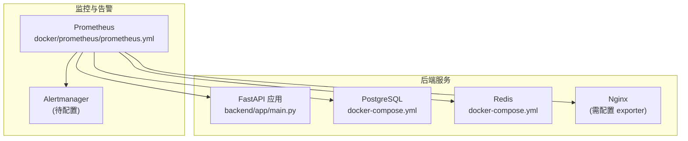
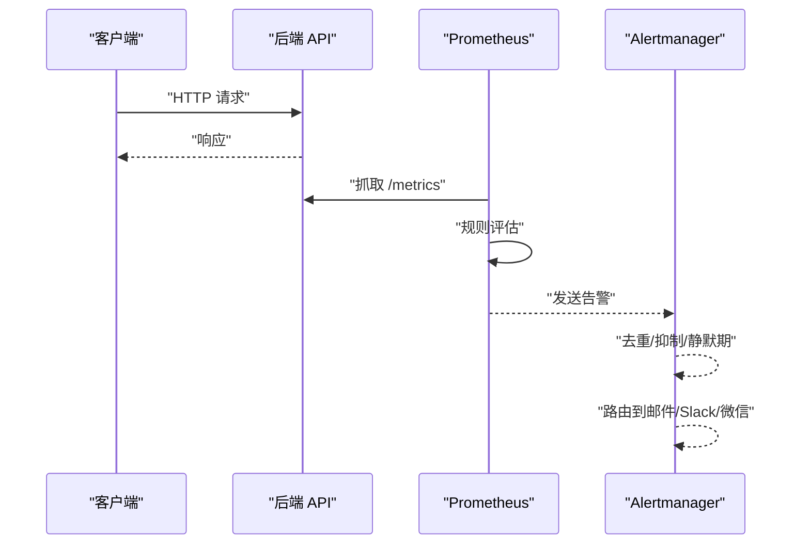
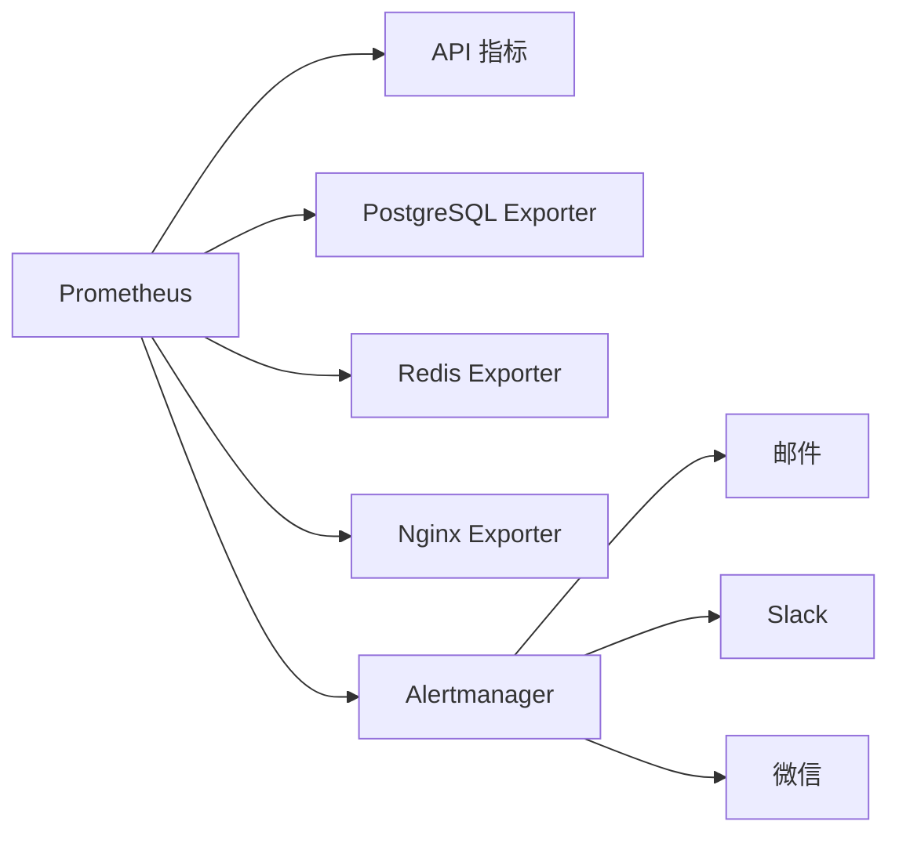

# 告警配置

<cite>
**本文引用的文件**
- [docker\prometheus\prometheus.yml](file://docker\prometheus\prometheus.yml)
- [docker-compose.yml](file://docker-compose.yml)
- [backend\app\core\config.py](file://backend\app\core\config.py)
- [backend\app\main.py](file://backend\app\main.py)
- [backend\app\core\services.py](file://backend\app\core\services.py)
- [backend\app\core\database.py](file://backend\app\core\database.py)
- [backend\pyproject.toml](file://backend\pyproject.toml)
</cite>

## 目录
1. [简介](#简介)
2. [项目结构](#项目结构)
3. [核心组件](#核心组件)
4. [架构总览](#架构总览)
5. [详细组件分析](#详细组件分析)
6. [依赖分析](#依赖分析)
7. [性能考虑](#性能考虑)
8. [故障排查指南](#故障排查指南)
9. [结论](#结论)
10. [附录](#附录)

## 简介
本文件面向多租户族谱管理系统，提供基于 Prometheus 的告警配置与管理指南。内容涵盖：
- 关键告警指标定义：服务可用性、API 错误率、数据库连接池耗尽、Redis 性能下降等
- 告警规则编写语法、告警级别设置与静默期配置
- Alertmanager 配置与多渠道告警通知（邮件、Slack、微信等）
- 告警去重、告警抑制与告警恢复通知机制
- 结合系统实际部署与监控目标，给出可落地的配置建议与流程图示

## 项目结构
系统采用容器化编排，Prometheus 作为核心监控与告警平台，负责采集 API、数据库、缓存与 Web 层指标，并通过 Alertmanager 进行告警聚合与分发。

图表来源
- [docker\prometheus\prometheus.yml:1-32](file://docker\prometheus\prometheus.yml#L1-L32)
- [docker-compose.yml:1-145](file://docker-compose.yml#L1-L145)
- [backend\app\main.py:1-103](file://backend\app\main.py#L1-L103)

章节来源
- [docker\prometheus\prometheus.yml:1-32](file://docker\prometheus\prometheus.yml#L1-L32)
- [docker-compose.yml:1-145](file://docker-compose.yml#L1-L145)

## 核心组件
- Prometheus 采集器配置：已定义 API、PostgreSQL Exporter、Redis Exporter、Nginx Exporter 的抓取任务，但当前未启用 Alertmanager 与规则文件。
- 后端应用：提供健康检查端点与多租户数据库连接管理，便于评估服务可用性与数据库状态。
- 外部服务：Neo4j、Redis、Meilisearch 为可选服务，具备可用性检测与降级能力，适合纳入可用性告警。

章节来源
- [docker\prometheus\prometheus.yml:1-32](file://docker\prometheus\prometheus.yml#L1-L32)
- [backend\app\main.py:72-86](file://backend\app\main.py#L72-L86)
- [backend\app\core\services.py:268-285](file://backend\app\core\services.py#L268-L285)

## 架构总览
下图展示 Prometheus 抓取、规则评估与告警分发的整体流程：

图表来源
- [docker\prometheus\prometheus.yml:1-32](file://docker\prometheus\prometheus.yml#L1-L32)
- [backend\app\main.py:72-86](file://backend\app\main.py#L72-L86)

## 详细组件分析

### Prometheus 抓取与规则配置
- 抓取任务
  - Prometheus 自身：localhost:9090
  - API：api:8010 指向后端容器
  - PostgreSQL Exporter：postgres-exporter:9187
  - Redis Exporter：redis-exporter:9121
  - Nginx Exporter：nginx-exporter:9113
- 当前状态
  - Alertmanager 未配置目标
  - 规则文件未启用
- 建议
  - 在 docker-compose 中添加 Alertmanager 服务与持久化卷
  - 在 prometheus.yml 中启用 rule_files 并指向规则目录
  - 在 alerting.alertmanagers 添加 Alertmanager 目标

章节来源
- [docker\prometheus\prometheus.yml:1-32](file://docker\prometheus\prometheus.yml#L1-L32)
- [docker-compose.yml:1-145](file://docker-compose.yml#L1-L145)

### 健康检查与可用性指标
- 健康检查端点：/health 返回服务状态（数据库、Neo4j、Redis、Search）
- 可用性告警建议
  - API 不可用：当 /health 返回非健康或 HTTP 5xx 持续超阈值
  - 可选服务不可用：Neo4j/Redis/Meilisearch 连接失败或 ping 超时
- 指标来源
  - API 响应时间与错误码（由 Prometheus 抓取 /metrics）
  - 外部服务连接状态（通过服务可用性检测）

章节来源
- [backend\app\main.py:72-86](file://backend\app\main.py#L72-L86)
- [backend\app\core\services.py:268-285](file://backend\app\core\services.py#L268-L285)

### 数据库连接池告警
- 连接池参数
  - 默认池大小与溢出上限来自配置项
  - SQLite 使用不同策略，其他数据库支持池参数
- 告警建议
  - 连接池耗尽：活跃连接数接近池上限且排队等待时间增长
  - 连接泄漏：长时间活跃连接数不降反升
- 指标来源
  - PostgreSQL Exporter 提供连接池相关指标
  - 可结合 API 慢查询与错误率进行关联分析

章节来源
- [backend\app\core\config.py:34-40](file://backend\app\core\config.py#L34-L40)
- [backend\app\core\database.py:33-56](file://backend\app\core\database.py#L33-L56)

### 缓存性能告警（Redis）
- 可用性与性能
  - 可用性：ping 失败或连接异常
  - 性能：命令耗时、内存使用、命中率下降
- 告警建议
  - 可用性：连续失败或超时
  - 性能：延迟超过阈值、内存使用率过高、key 过期事件异常

章节来源
- [backend\app\core\services.py:142-199](file://backend\app\core\services.py#L142-L199)
- [docker-compose.yml:43-57](file://docker-compose.yml#L43-L57)

### API 错误率与响应时间告警
- 指标建议
  - HTTP 5xx 错误率、4xx 错误率
  - P95/P99 响应时间
  - QPS 与并发连接数
- 告警建议
  - 错误率突增：短周期内错误率超过阈值
  - 延迟激增：响应时间持续高于阈值
  - QPS 异常：过低或过高

章节来源
- [docker\prometheus\prometheus.yml:17-20](file://docker\prometheus\prometheus.yml#L17-L20)

### Web 层与 Nginx 告警
- 指标建议
  - 连接数、请求速率、连接状态分布
  - 上游后端健康状态
- 告警建议
  - 连接数异常、上游失败率上升、5xx 增加

章节来源
- [docker\prometheus\prometheus.yml:30-32](file://docker\prometheus\prometheus.yml#L30-L32)

### 告警规则编写语法与级别
- 规则文件结构
  - groups：规则组，包含多个 alert 规则
  - record：记录表达式，用于预计算常用指标
  - alert：告警表达式，包含条件、标签与注释
- 告警级别
  - 即时告警：critical（严重）、warning（警告）、info（信息）
  - 建议按影响范围分级：业务中断、性能退化、容量预警
- 静默期（for）与抑制（match_re）
  - for：等待持续时间，避免抖动
  - inhibit_rules：在更高级别告警触发时抑制较低级别同类告警

章节来源
- [docker\prometheus\prometheus.yml:1-32](file://docker\prometheus\prometheus.yml#L1-L32)

### Alertmanager 配置与多渠道通知
- Alertmanager 服务
  - 在 docker-compose 中新增服务，挂载配置与持久化卷
  - 在 prometheus.yml 中配置 alertmanagers 目标
- 通知渠道
  - 邮件：SMTP 配置
  - Slack：Incoming Webhook 或 Slack App
  - 微信：企业微信机器人或自建 webhook
- 去重与抑制
  - group_by：按服务/租户/实例分组
  - group_wait/group_interval：首次发送与重复发送间隔
  - repeat_interval：重复告警间隔
  - inhibit_rules：抑制规则

章节来源
- [docker\prometheus\prometheus.yml:5-10](file://docker\prometheus\prometheus.yml#L5-L10)
- [docker-compose.yml:1-145](file://docker-compose.yml#L1-L145)

### 告警恢复通知机制
- 恢复信号
  - 条件不再满足自动恢复
  - 可配置恢复通知开关
- 最佳实践
  - 区分“告警中/恢复”两类消息
  - 记录恢复时间与根因说明

章节来源
- [docker\prometheus\prometheus.yml:1-32](file://docker\prometheus\prometheus.yml#L1-L32)

## 依赖分析
- 组件耦合
  - Prometheus 与各 Exporter 之间为弱耦合，通过静态配置发现
  - API 与外部服务（Neo4j/Redis/Meilisearch）为可选依赖，具备降级能力
- 外部依赖
  - PostgreSQL/Redis/Nginx Exporter 由社区维护
  - Alertmanager 与通知通道由运维团队维护

图表来源
- [docker\prometheus\prometheus.yml:1-32](file://docker\prometheus\prometheus.yml#L1-L32)
- [docker-compose.yml:1-145](file://docker-compose.yml#L1-L145)

章节来源
- [docker\prometheus\prometheus.yml:1-32](file://docker\prometheus\prometheus.yml#L1-L32)
- [docker-compose.yml:1-145](file://docker-compose.yml#L1-L145)

## 性能考虑
- 抓取频率与评估频率
  - 全局 scrape_interval 与 evaluation_interval 建议保持一致，避免规则抖动
- 规则复杂度
  - 避免过于复杂的聚合与正则匹配，优先使用简单明确的表达式
- 指标基数
  - 控制标签数量，避免高基数导致内存与查询压力
- 缓存与降级
  - 可选服务不可用时，确保 API 仍可运行并返回健康状态

章节来源
- [docker\prometheus\prometheus.yml:1-4](file://docker\prometheus\prometheus.yml#L1-L4)
- [backend\app\main.py:72-86](file://backend\app\main.py#L72-L86)
- [backend\app\core\services.py:268-285](file://backend\app\core\services.py#L268-L285)

## 故障排查指南
- Prometheus 无法抓取
  - 检查网络连通性与容器暴露端口
  - 确认抓取路径与端口正确
- 告警未触发
  - 检查规则文件是否加载
  - 核对告警条件与阈值
- Alertmanager 未收到告警
  - 检查 prometheus.yml 中 alertmanagers 配置
  - 核对 Alertmanager 容器日志与配置文件
- 可选服务不可用
  - 查看服务可用性检测日志
  - 确认连接参数与网络策略

章节来源
- [docker\prometheus\prometheus.yml:1-32](file://docker\prometheus\prometheus.yml#L1-L32)
- [backend\app\core\services.py:268-285](file://backend\app\core\services.py#L268-L285)

## 结论
通过在现有容器化架构中引入 Alertmanager 与规则文件，结合系统已有的健康检查与外部服务可用性检测，可以构建覆盖服务可用性、API 错误率、数据库连接池与缓存性能的关键告警体系。建议以“业务影响”为导向设定告警级别，并配合去重、抑制与恢复通知机制，提升告警质量与运维效率。

## 附录

### 告警规则编写示例（路径参考）
- API 错误率
  - 表达式路径参考：[docker\prometheus\prometheus.yml:17-20](file://docker\prometheus\prometheus.yml#L17-L20)
- 数据库连接池耗尽
  - 指标路径参考：[docker\prometheus\prometheus.yml:22-24](file://docker\prometheus\prometheus.yml#L22-L24)
- Redis 性能下降
  - 指标路径参考：[docker\prometheus\prometheus.yml:26-28](file://docker\prometheus\prometheus.yml#L26-L28)

### Alertmanager 配置要点（路径参考）
- Alertmanager 服务与持久化：[docker-compose.yml:1-145](file://docker-compose.yml#L1-L145)
- Prometheus 指定 Alertmanager：[docker\prometheus\prometheus.yml:5-10](file://docker\prometheus\prometheus.yml#L5-L10)