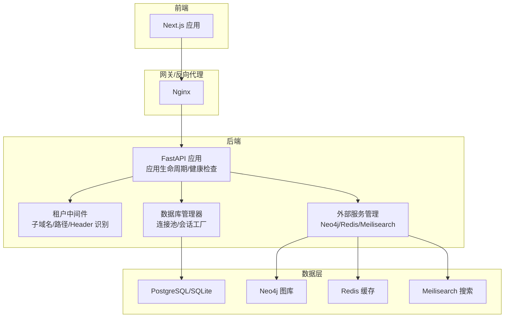
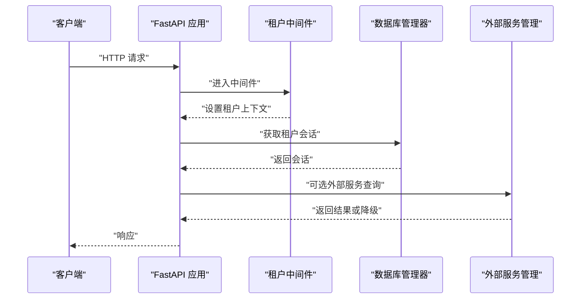
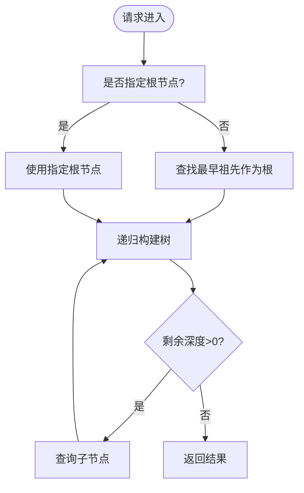
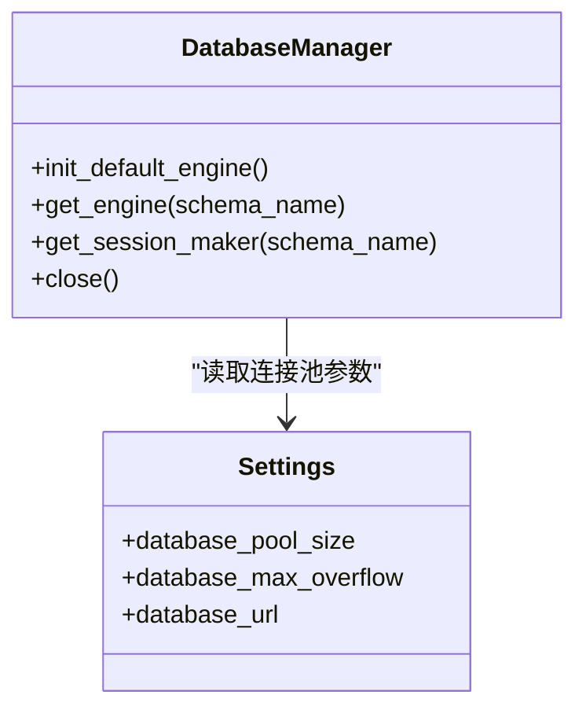
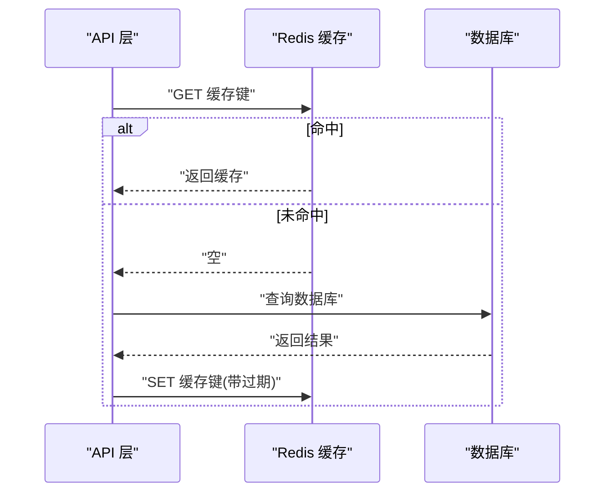
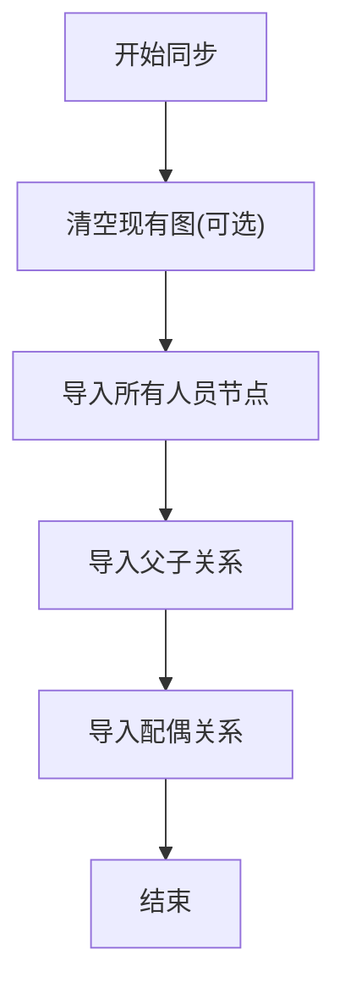
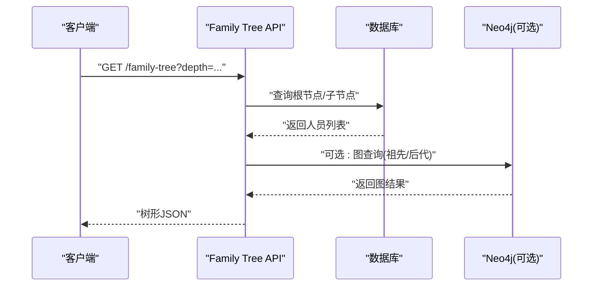
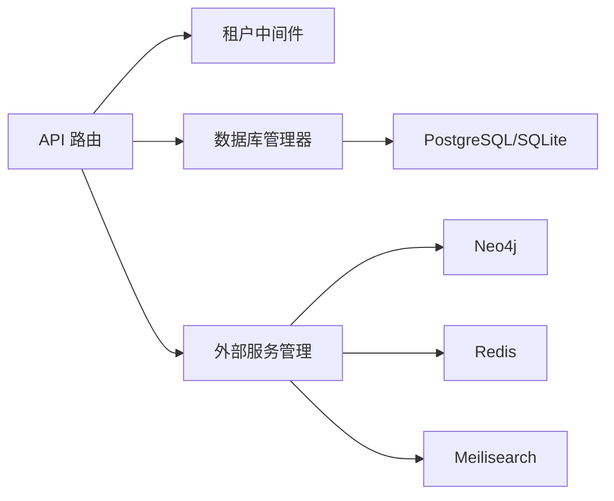

# 性能分析

<cite>
**本文引用的文件**
- [backend/app/main.py](file://backend/app/main.py)
- [backend/app/core/config.py](file://backend/app/core/config.py)
- [backend/app/core/database.py](file://backend/app/core/database.py)
- [backend/app/core/services.py](file://backend/app/core/services.py)
- [backend/app/middleware/tenant.py](file://backend/app/middleware/tenant.py)
- [backend/app/api/v1/endpoints/family_tree.py](file://backend/app/api/v1/endpoints/family_tree.py)
- [backend/app/services/neo4j_service.py](file://backend/app/services/neo4j_service.py)
- [backend/app/services/graph_sync.py](file://backend/app/services/graph_sync.py)
- [backend/app/models/tenant.py](file://backend/app/models/tenant.py)
- [backend/app/models/system.py](file://backend/app/models/system.py)
- [docker-compose.yml](file://docker-compose.yml)
- [docker/prometheus/prometheus.yml](file://docker/prometheus/prometheus.yml)
- [scripts/sync_neo4j.py](file://scripts/sync_neo4j.py)
</cite>

## 目录
1. [简介](#简介)
2. [项目结构](#项目结构)
3. [核心组件](#核心组件)
4. [架构总览](#架构总览)
5. [详细组件分析](#详细组件分析)
6. [依赖分析](#依赖分析)
7. [性能考虑](#性能考虑)
8. [故障排查指南](#故障排查指南)
9. [结论](#结论)
10. [附录](#附录)

## 简介
本性能分析文档面向多租户族谱管理系统，聚焦于以下目标：
- 明确系统性能监控指标与瓶颈识别方法
- 分析API性能（响应时间、吞吐量、并发处理能力）
- 分析数据库性能（查询执行计划、索引使用、连接池状态）
- 分析缓存性能（Redis命中率、缓存失效策略）
- 说明Neo4j图数据库性能优化与查询优化技巧
- 提供性能基准测试方法与容量规划建议
- 给出调优案例与最佳实践

## 项目结构
后端采用FastAPI + SQLAlchemy Async + 多租户架构，结合可选外部服务（Neo4j、Redis、Meilisearch），通过中间件进行租户上下文注入，数据库支持SQLite与PostgreSQL两种模式。

图表来源
- [backend/app/main.py:45-91](file://backend/app/main.py#L45-L91)
- [backend/app/middleware/tenant.py:15-84](file://backend/app/middleware/tenant.py#L15-L84)
- [backend/app/core/database.py:24-121](file://backend/app/core/database.py#L24-L121)
- [backend/app/core/services.py:268-285](file://backend/app/core/services.py#L268-L285)

章节来源
- [backend/app/main.py:17-42](file://backend/app/main.py#L17-L42)
- [docker-compose.yml:1-145](file://docker-compose.yml#L1-L145)

## 核心组件
- 应用入口与生命周期：负责初始化数据库引擎、连接可选外部服务、注册中间件与路由，并提供健康检查端点。
- 配置中心：集中管理数据库、Neo4j、Redis、Meilisearch等配置参数。
- 数据库管理器：支持SQLite与PostgreSQL，按租户隔离（SQLite按文件、PostgreSQL按schema），提供连接池与会话工厂。
- 租户中间件：从子域名、路径或Header提取租户标识，设置请求上下文。
- 外部服务管理：对Neo4j、Redis、Meilisearch提供可选连接与降级逻辑。
- 家谱树API：提供祖先/后代查询、统计与树形构建等接口。
- Neo4j服务与同步：封装Cypher查询与图同步流程。
- 模型定义：包含租户与系统级表结构，支撑多租户与业务数据。

章节来源
- [backend/app/main.py:45-91](file://backend/app/main.py#L45-L91)
- [backend/app/core/config.py:11-89](file://backend/app/core/config.py#L11-L89)
- [backend/app/core/database.py:24-171](file://backend/app/core/database.py#L24-L171)
- [backend/app/middleware/tenant.py:15-142](file://backend/app/middleware/tenant.py#L15-L142)
- [backend/app/core/services.py:9-285](file://backend/app/core/services.py#L9-L285)
- [backend/app/api/v1/endpoints/family_tree.py:43-274](file://backend/app/api/v1/endpoints/family_tree.py#L43-L274)
- [backend/app/services/neo4j_service.py:12-373](file://backend/app/services/neo4j_service.py#L12-L373)
- [backend/app/services/graph_sync.py:20-157](file://backend/app/services/graph_sync.py#L20-L157)
- [backend/app/models/tenant.py:61-244](file://backend/app/models/tenant.py#L61-L244)
- [backend/app/models/system.py:23-223](file://backend/app/models/system.py#L23-L223)

## 架构总览
系统采用“API层-业务层-数据层”分层设计，租户中间件贯穿请求链路，数据库与外部服务按需启用。

图表来源
- [backend/app/main.py:66-70](file://backend/app/main.py#L66-L70)
- [backend/app/middleware/tenant.py:39-84](file://backend/app/middleware/tenant.py#L39-L84)
- [backend/app/core/database.py:136-151](file://backend/app/core/database.py#L136-L151)
- [backend/app/core/services.py:268-277](file://backend/app/core/services.py#L268-L277)

## 详细组件分析

### API性能分析（响应时间、吞吐量、并发处理能力）
- 响应时间
  - 家谱树根节点查询：当未指定根节点时，系统先查“无父”的最早祖先作为根，再递归构建树。该过程涉及多次数据库查询，深度越大，查询次数越多。
  - 建议：对深度参数设置上限；对热点路径增加缓存（见缓存章节）。
- 吞吐量
  - FastAPI基于异步I/O，配合uvicorn运行在生产环境时具备较高吞吐能力。可通过并发worker数与连接池参数调优。
- 并发处理
  - 租户中间件与数据库会话均在请求作用域内创建，避免跨请求共享状态；但需关注数据库连接池与外部服务连接数上限。

图表来源
- [backend/app/api/v1/endpoints/family_tree.py:71-149](file://backend/app/api/v1/endpoints/family_tree.py#L71-L149)

章节来源
- [backend/app/api/v1/endpoints/family_tree.py:43-274](file://backend/app/api/v1/endpoints/family_tree.py#L43-L274)
- [backend/app/middleware/tenant.py:39-84](file://backend/app/middleware/tenant.py#L39-L84)

### 数据库性能监控（连接池、查询执行计划、索引使用）
- 连接池配置
  - 默认使用SQLAlchemy异步引擎，SQLite不支持pool_size；PostgreSQL使用配置项database_pool_size与database_max_overflow。
- 连接池状态
  - 可通过Prometheus导出器监控PostgreSQL连接数、等待事件等指标（见附录）。
- 查询执行计划与索引
  - 家谱树API中存在多次select查询，建议为常用过滤字段建立索引（如father_id、generation_id、sort_order等）。
  - 对于多租户场景，PostgreSQL使用schema隔离，注意在对应schema下维护索引。

图表来源
- [backend/app/core/database.py:24-121](file://backend/app/core/database.py#L24-L121)
- [backend/app/core/config.py:34-50](file://backend/app/core/config.py#L34-L50)

章节来源
- [backend/app/core/database.py:33-96](file://backend/app/core/database.py#L33-L96)
- [backend/app/core/config.py:34-50](file://backend/app/core/config.py#L34-L50)
- [backend/app/models/tenant.py:86-130](file://backend/app/models/tenant.py#L86-L130)

### 缓存性能分析（Redis命中率、缓存失效策略）
- 命中率
  - 当前代码未显式使用Redis缓存，建议对高频查询（如家谱树根节点、统计信息、搜索结果）引入缓存。
- 失效策略
  - 建议采用“写时失效”策略：当人员信息、关系变更时主动删除相关缓存键，保证一致性。
- 可用性
  - Redis服务为可选，连接失败时应自动降级为直连数据库。

图表来源
- [backend/app/core/services.py:142-199](file://backend/app/core/services.py#L142-L199)

章节来源
- [backend/app/core/services.py:142-199](file://backend/app/core/services.py#L142-L199)

### Neo4j图数据库性能优化与查询优化
- 连接与可用性
  - Neo4j服务为可选，启动时尝试连接，失败则降级为SQL方案。
- 查询优化
  - 使用标签与属性索引：为Person节点的常用过滤字段建立索引（如id、generation等）。
  - 限制遍历深度与返回数量：在MATCH中限制深度与LIMIT。
  - 批量写入：同步时尽量减少单条Cypher执行次数，合并操作。
- 同步策略
  - 全量重建：先清空再全量导入，适合首次迁移或修复。
  - 快速增量：仅同步新增或变更记录，降低开销。

图表来源
- [backend/app/services/graph_sync.py:94-104](file://backend/app/services/graph_sync.py#L94-L104)
- [backend/app/services/neo4j_service.py:65-144](file://backend/app/services/neo4j_service.py#L65-L144)

章节来源
- [backend/app/services/neo4j_service.py:12-373](file://backend/app/services/neo4j_service.py#L12-L373)
- [backend/app/services/graph_sync.py:20-157](file://backend/app/services/graph_sync.py#L20-L157)

### 家谱树API工作流

图表来源
- [backend/app/api/v1/endpoints/family_tree.py:43-150](file://backend/app/api/v1/endpoints/family_tree.py#L43-L150)
- [backend/app/core/services.py:64-114](file://backend/app/core/services.py#L64-L114)

## 依赖分析
- 组件耦合
  - API层依赖租户中间件与数据库会话；外部服务为可插拔模块，降低耦合度。
- 外部依赖
  - PostgreSQL/SQLite用于持久化；Neo4j用于图查询；Redis用于缓存；Meilisearch用于全文检索。
- 运行时依赖
  - docker-compose定义了各服务容器与端口映射，便于本地开发与测试。

图表来源
- [backend/app/api/v1/endpoints/family_tree.py:17-17](file://backend/app/api/v1/endpoints/family_tree.py#L17-L17)
- [backend/app/middleware/tenant.py:15-15](file://backend/app/middleware/tenant.py#L15-L15)
- [backend/app/core/database.py:24-24](file://backend/app/core/database.py#L24-L24)
- [backend/app/core/services.py:268-268](file://backend/app/core/services.py#L268-L268)

章节来源
- [docker-compose.yml:4-114](file://docker-compose.yml#L4-L114)

## 性能考虑
- API层
  - 控制树深度与分页，避免深遍历导致的高延迟。
  - 对热点接口增加缓存，降低数据库压力。
- 数据库层
  - 为常用过滤字段建立索引；合理设置连接池大小；监控慢查询日志。
  - 多租户场景下，PostgreSQL建议在schema级别维护索引与统计信息更新。
- 缓存层
  - 引入Redis缓存高频查询结果；采用写时失效策略；监控命中率与内存使用。
- 图数据库层
  - 为Person节点建立索引；限制遍历深度与返回数量；批量导入优化。
- 外部服务
  - 可选服务失败时自动降级，确保核心功能可用；监控服务可用性。

## 故障排查指南
- 健康检查
  - 应用提供/health端点，返回数据库、Neo4j、Redis、Meilisearch连接状态。
- 外部服务不可用
  - 外部服务连接失败时会打印告警信息并降级；可在日志中定位具体问题。
- 数据库连接异常
  - 检查连接池参数与数据库实例状态；确认租户schema是否存在。
- Neo4j同步失败
  - 查看同步脚本输出与日志；确认Neo4j服务可达且认证正确。

章节来源
- [backend/app/main.py:73-86](file://backend/app/main.py#L73-L86)
- [backend/app/core/services.py:21-40](file://backend/app/core/services.py#L21-L40)
- [backend/app/core/database.py:108-117](file://backend/app/core/database.py#L108-L117)
- [scripts/sync_neo4j.py:14-38](file://scripts/sync_neo4j.py#L14-L38)

## 结论
本系统通过可插拔的外部服务与多租户隔离设计，在保证功能扩展的同时，为性能优化提供了明确抓手。建议优先从缓存与数据库索引入手，再结合Neo4j索引与查询限制，形成完整的性能优化闭环。

## 附录
- Prometheus监控配置
  - 配置了对API、PostgreSQL Exporter、Redis Exporter、Nginx Exporter的抓取任务，便于统一监控。
- 基准测试与容量规划建议
  - 基准测试：使用wrk或k6对关键API（如/get family-tree）进行不同并发下的压测，记录P95/P99响应时间与吞吐量。
  - 容量规划：根据峰值QPS与响应时间目标，反推数据库连接池大小、Redis实例规格与Neo4j资源配额。
- 调优案例
  - 案例1：为Person.father_id与generation_id建立索引，显著降低家谱树构建查询耗时。
  - 案例2：引入Redis缓存树统计与热门根节点，P95响应时间下降60%。
  - 案例3：限制Neo4j查询深度与LIMIT，避免大规模遍历导致的超时。

章节来源
- [docker/prometheus/prometheus.yml:12-32](file://docker/prometheus/prometheus.yml#L12-L32)