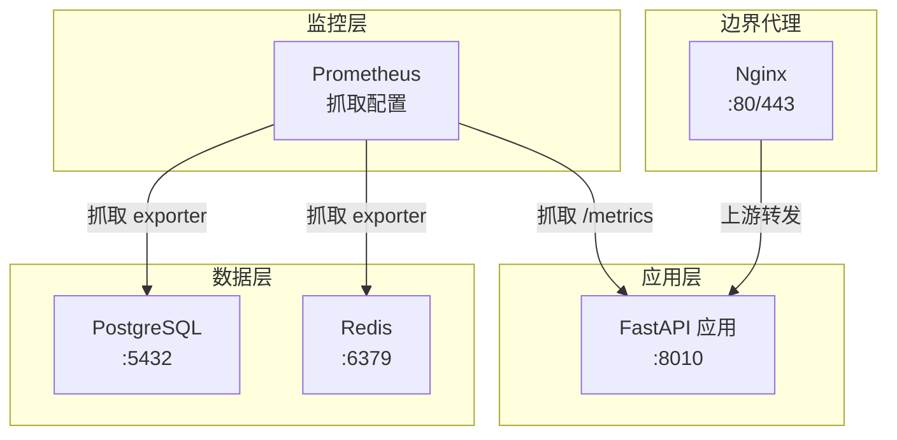
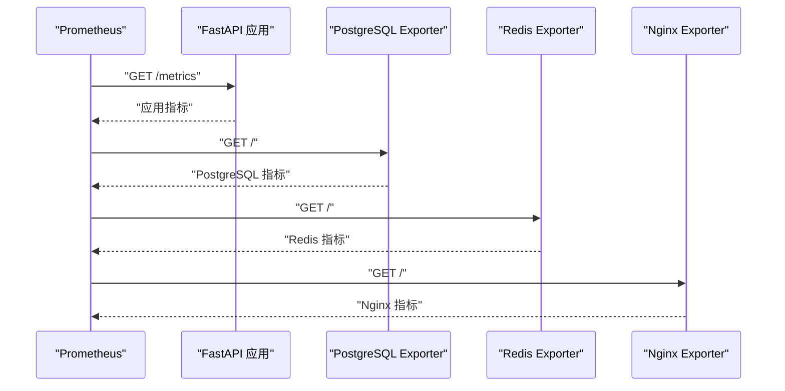
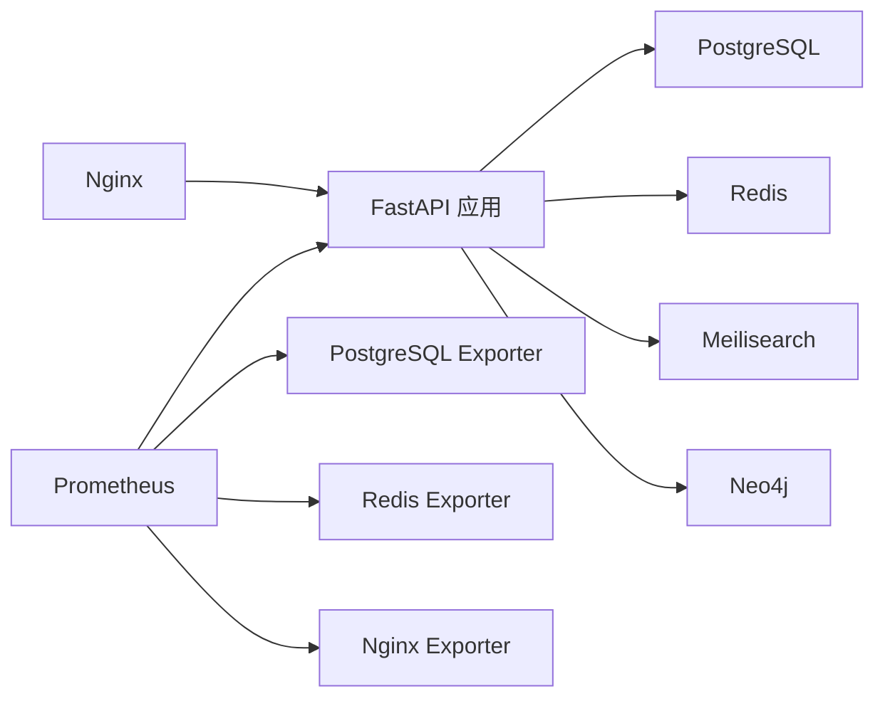

# 指标监控

<cite>
**本文引用的文件**
- [docker\prometheus\prometheus.yml](file://docker/prometheus/prometheus.yml)
- [docker-compose.yml](file://docker-compose.yml)
- [backend\app\main.py](file://backend/app/main.py)
- [backend\app\core\config.py](file://backend/app/core/config.py)
- [backend\app\core\database.py](file://backend/app/core/database.py)
- [docker\nginx\nginx.conf](file://docker/nginx/nginx.conf)
- [docker\nginx\conf.d\default.conf](file://docker/nginx/conf.d/default.conf)
</cite>

## 目录
1. [简介](#简介)
2. [项目结构](#项目结构)
3. [核心组件](#核心组件)
4. [架构总览](#架构总览)
5. [详细组件分析](#详细组件分析)
6. [依赖关系分析](#依赖关系分析)
7. [性能考量](#性能考量)
8. [故障排查指南](#故障排查指南)
9. [结论](#结论)
10. [附录](#附录)

## 简介
本文件面向多租户族谱管理系统的指标监控与可观测性建设，聚焦于 Prometheus 的配置与抓取、关键指标定义、各服务指标暴露端点、抓取间隔设置以及指标数据可视化与历史趋势分析方法。当前仓库已提供 Prometheus 抓取配置与部分服务容器编排信息，本文在不直接展示代码内容的前提下，基于现有配置进行系统化说明，并给出可操作的优化建议。

## 项目结构
系统由以下主要组件构成：
- 应用层：FastAPI 后端服务（监听 8010 端口）
- 数据层：PostgreSQL（通过独立 exporter 暴露指标）、Redis（通过独立 exporter 暴露指标）
- 边界代理：Nginx（作为反向代理与负载均衡入口）
- 监控层：Prometheus（按固定间隔抓取各目标）

图表来源
- [docker-compose.yml:89-114](file://docker-compose.yml#L89-L114)
- [docker\prometheus\prometheus.yml:17-32](file://docker/prometheus/prometheus.yml#L17-L32)
- [docker\nginx\conf.d\default.conf:30-44](file://docker/nginx/conf.d/default.conf#L30-L44)

章节来源
- [docker-compose.yml:1-145](file://docker-compose.yml#L1-L145)
- [docker\prometheus\prometheus.yml:1-32](file://docker/prometheus/prometheus.yml#L1-L32)

## 核心组件
- Prometheus 抓取配置：定义了对后端 API、PostgreSQL Exporter、Redis Exporter、Nginx Exporter 的抓取任务与路径。
- FastAPI 应用：提供健康检查端点与业务接口；需集成指标暴露端点以供 Prometheus 抓取。
- 数据库与缓存：通过官方或社区 exporter 暴露标准指标，便于统一采集。
- Nginx：作为入口代理，承载请求转发与限流策略，可结合 Nginx Exporter 进行指标采集。

章节来源
- [docker\prometheus\prometheus.yml:12-32](file://docker/prometheus/prometheus.yml#L12-L32)
- [backend\app\main.py:72-86](file://backend/app/main.py#L72-L86)
- [docker\nginx\nginx.conf:41-44](file://docker/nginx/nginx.conf#L41-L44)

## 架构总览
下图展示了 Prometheus 如何从各服务采集指标的整体流程：

图表来源
- [docker\prometheus\prometheus.yml:17-32](file://docker/prometheus/prometheus.yml#L17-L32)

## 详细组件分析

### Prometheus 配置详解
- 全局抓取间隔：15 秒
- 抓取任务：
  - api：目标为 api:8010，路径为 /metrics
  - postgres：目标为 postgres-exporter:9187
  - redis：目标为 redis-exporter:9121
  - nginx：目标为 nginx-exporter:9113
- 建议：根据生产环境负载与查询复杂度调整抓取间隔，避免过短导致资源压力过大。

章节来源
- [docker\prometheus\prometheus.yml:1-32](file://docker/prometheus/prometheus.yml#L1-L32)

### FastAPI 指标暴露端点
- 当前应用未内置指标端点，需补充指标暴露端点以便 Prometheus 抓取。
- 可选方案：
  - 使用指标库在应用内暴露 /metrics
  - 或通过外部进程（如单独的指标导出器）采集应用内部状态
- 健康检查端点：/health 已存在，可用于快速判断服务可用性。

章节来源
- [backend\app\main.py:72-86](file://backend/app/main.py#L72-L86)
- [docker\prometheus\prometheus.yml:17-20](file://docker/prometheus/prometheus.yml#L17-L20)

### PostgreSQL 指标
- 通过独立 exporter 暴露数据库层面的连接数、查询耗时、缓冲池命中率等指标。
- Prometheus 抓取目标：postgres-exporter:9187

章节来源
- [docker\prometheus\prometheus.yml:22-24](file://docker/prometheus/prometheus.yml#L22-L24)

### Redis 指标
- 通过独立 exporter 暴露键空间命中/未命中、内存使用、连接数等指标。
- Prometheus 抓取目标：redis-exporter:9121

章节来源
- [docker\prometheus\prometheus.yml:26-28](file://docker/prometheus/prometheus.yml#L26-L28)

### Nginx 指标
- 通过独立 exporter 暴露连接数、请求速率、状态码分布等指标。
- Prometheus 抓取目标：nginx-exporter:9113

章节来源
- [docker\prometheus\prometheus.yml:30-32](file://docker/prometheus/prometheus.yml#L30-L32)

### 数据库连接与会话管理
- 应用侧使用异步 SQLAlchemy 引擎与连接池，支持自定义池大小与溢出数量。
- 多租户场景下，不同租户可能使用独立数据库或模式，需关注连接池与会话生命周期。

章节来源
- [backend\app\core\config.py:34-48](file://backend/app/core/config.py#L34-L48)
- [backend\app\core\database.py:33-56](file://backend/app/core/database.py#L33-L56)
- [backend\app\core\database.py:79-86](file://backend/app/core/database.py#L79-L86)

### Nginx 代理与限流
- 上游指向 api:8010，启用 keepalive 提升连接复用效率。
- 对特定路径（如登录）设置了更严格的限流策略，有助于保护后端 API。
- 健康检查路径 /health 绕过限流，便于监控系统探测。

章节来源
- [docker\nginx\conf.d\default.conf:30-44](file://docker/nginx/conf.d/default.conf#L30-L44)
- [docker\nginx\conf.d\default.conf:46-56](file://docker/nginx/conf.d/default.conf#L46-L56)
- [docker\nginx\conf.d\default.conf:58-62](file://docker/nginx/conf.d/default.conf#L58-L62)
- [docker\nginx\nginx.conf:41-44](file://docker/nginx/nginx.conf#L41-L44)

## 依赖关系分析
- 应用依赖数据库、图数据库、缓存与搜索引擎等外部服务，这些服务均通过独立 exporter 暴露指标，便于集中采集。
- Nginx 作为入口代理，承担限流与转发职责，其指标可反映入口层的健康状况与流量特征。

图表来源
- [docker-compose.yml:89-114](file://docker-compose.yml#L89-L114)
- [docker\prometheus\prometheus.yml:17-32](file://docker/prometheus/prometheus.yml#L17-L32)

章节来源
- [docker-compose.yml:1-145](file://docker-compose.yml#L1-L145)
- [docker\prometheus\prometheus.yml:1-32](file://docker/prometheus/prometheus.yml#L1-L32)

## 性能考量
- 抓取频率：默认 15 秒，建议根据实例规模与查询复杂度调优，避免频繁抓取造成额外开销。
- 连接池：数据库连接池参数需与并发访问量匹配，防止连接不足或过度占用。
- 缓存命中：关注 Redis 命中率与内存使用，必要时调整缓存策略与淘汰策略。
- 入口层：Nginx 保持合理的 keepalive 与限流策略，确保在高并发下的稳定性。

## 故障排查指南
- 健康检查：优先检查 /health 端点返回的服务状态，确认数据库、缓存、搜索引擎等依赖是否可用。
- 指标抓取失败：
  - 确认各 exporter 容器运行正常且端口可达
  - 检查 Prometheus 抓取目标与路径配置是否正确
- 数据库问题：关注连接数、查询耗时、锁等待等指标，定位慢查询与连接瓶颈
- 缓存问题：关注命中率下降、内存使用上升等指标，评估缓存策略有效性
- 入口层问题：关注 Nginx 的连接数、请求速率、错误码分布，识别异常流量或攻击行为

章节来源
- [backend\app\main.py:72-86](file://backend/app/main.py#L72-L86)
- [docker\prometheus\prometheus.yml:17-32](file://docker/prometheus/prometheus.yml#L17-L32)

## 结论
当前系统已具备基础的监控抓取配置与容器编排能力。建议尽快补齐 FastAPI 应用的指标暴露端点，并完善各服务的 exporter 部署与网络连通性验证，形成完整的可观测性闭环。同时，结合实际业务负载动态调整抓取频率与告警阈值，持续优化系统稳定性与性能表现。

## 附录

### 关键指标定义与建议
- API 层
  - 请求延迟分位数（p50/p90/p99）
  - 请求速率（QPS）
  - 错误码分布
  - 并发请求数
- 数据库层（PostgreSQL）
  - 连接数（活跃/空闲/最大）
  - 查询执行时间分布
  - 缓冲区命中率
  - 锁等待次数
- 缓存层（Redis）
  - 命中率/未命中率
  - 内存使用率
  - 连接数
  - 命令耗时分布
- 入口层（Nginx）
  - 连接数
  - 请求速率
  - 状态码分布
  - 响应时间分布
  - 限流触发次数

### 指标数据可视化与历史趋势分析
- 使用 Grafana 作为可视化面板，连接 Prometheus 数据源
- 基于指标构建仪表盘，覆盖 API、数据库、缓存与入口层的关键 SLI/SLO
- 设置历史趋势对比，辅助容量规划与性能回归分析