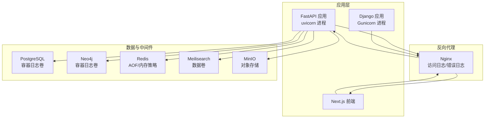
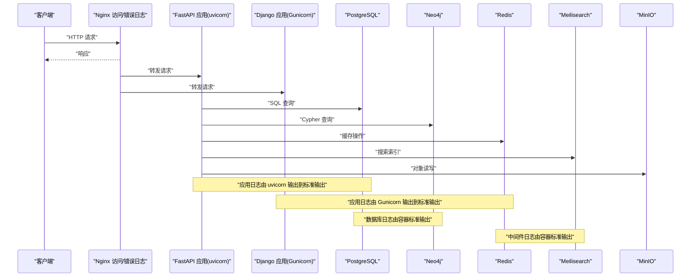
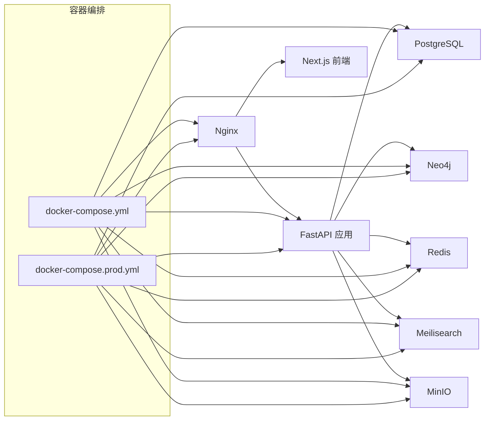

# 日志收集

<cite>
**本文引用的文件**
- [backend/pyproject.toml](file://backend/pyproject.toml)
- [backend/app/core/config.py](file://backend/app/core/config.py)
- [backend/app/main.py](file://backend/app/main.py)
- [backend/Dockerfile](file://backend/Dockerfile)
- [backend/alembic.ini](file://backend/alembic.ini)
- [django_backup/requirements.txt](file://django_backup/requirements.txt)
- [django_backup/liu_genealogy/settings.py](file://django_backup/liu_genealogy/settings.py)
- [django_backup/liu_genealogy/wsgi.py](file://django_backup/liu_genealogy/wsgi.py)
- [django_backup/start.sh](file://django_backup/start.sh)
- [django_backup/Dockerfile](file://django_backup/Dockerfile)
- [docker-compose.yml](file://docker-compose.yml)
- [docker-compose.prod.yml](file://docker-compose.prod.yml)
- [docker/nginx/nginx.conf](file://docker/nginx/nginx.conf)
- [docker/postgres/init.sql](file://docker/postgres/init.sql)
</cite>

## 目录
1. [简介](#简介)
2. [项目结构](#项目结构)
3. [核心组件](#核心组件)
4. [架构总览](#架构总览)
5. [详细组件分析](#详细组件分析)
6. [依赖分析](#依赖分析)
7. [性能考虑](#性能考虑)
8. [故障排查指南](#故障排查指南)
9. [结论](#结论)
10. [附录](#附录)

## 简介
本文件面向多租户族谱管理系统，提供从应用层到数据库与容器层的日志收集与管理方案。内容覆盖：
- Python 应用日志配置（FastAPI、Django）
- 数据库日志参数（PostgreSQL、Neo4j、Redis、Meilisearch）
- 容器日志采集（Docker Compose 生产与开发环境）
- 日志格式标准化、结构化输出与日志级别配置
- 日志聚合方案（ELK Stack、Fluentd、Loki）集成思路
- 日志轮转策略、存储管理与性能优化

## 项目结构
系统由以下主要部分组成：
- 后端 API（FastAPI）：负责多租户族谱业务接口与服务连接
- 前端（Next.js）：多租户前端页面
- 数据库与中间件：PostgreSQL、Neo4j、Redis、Meilisearch、MinIO
- 反向代理：Nginx
- 开发与生产编排：docker-compose（开发）、docker-compose.prod（生产）

图表来源
- [docker-compose.yml:1-145](file://docker-compose.yml#L1-L145)
- [docker-compose.prod.yml:1-217](file://docker-compose.prod.yml#L1-L217)
- [backend/app/main.py:1-103](file://backend/app/main.py#L1-L103)
- [django_backup/start.sh:1-13](file://django_backup/start.sh#L1-L13)
- [docker/nginx/nginx.conf:1-57](file://docker/nginx/nginx.conf#L1-L57)

章节来源
- [docker-compose.yml:1-145](file://docker-compose.yml#L1-L145)
- [docker-compose.prod.yml:1-217](file://docker-compose.prod.yml#L1-L217)

## 核心组件
- FastAPI 应用（uvicorn）：通过命令行参数启动，未内置专用日志配置文件；可通过环境变量与启动参数控制日志输出
- Django 应用（Gunicorn）：通过启动脚本指定访问与错误日志文件路径
- Nginx：统一接入层，具备访问/错误日志格式与轮转能力
- PostgreSQL：容器内默认日志输出至标准输出，可挂载日志卷以持久化
- Neo4j：容器内默认日志输出至标准输出，可挂载日志卷
- Redis：启用 AOF 并配置内存淘汰策略，便于持久化与资源控制
- Meilisearch：容器内数据卷，日志随容器标准输出
- MinIO：对象存储，日志随容器标准输出

章节来源
- [backend/app/main.py:1-103](file://backend/app/main.py#L1-L103)
- [backend/Dockerfile:1-24](file://backend/Dockerfile#L1-L24)
- [django_backup/start.sh:1-13](file://django_backup/start.sh#L1-L13)
- [django_backup/Dockerfile:1-41](file://django_backup/Dockerfile#L1-L41)
- [docker/nginx/nginx.conf:1-57](file://docker/nginx/nginx.conf#L1-L57)
- [docker-compose.yml:1-145](file://docker-compose.yml#L1-L145)
- [docker-compose.prod.yml:1-217](file://docker-compose.prod.yml#L1-L217)

## 架构总览
下图展示日志在系统中的流向与采集点位：

图表来源
- [docker-compose.yml:1-145](file://docker-compose.yml#L1-L145)
- [docker-compose.prod.yml:1-217](file://docker-compose.prod.yml#L1-L217)
- [backend/app/main.py:1-103](file://backend/app/main.py#L1-L103)
- [django_backup/start.sh:1-13](file://django_backup/start.sh#L1-L13)

## 详细组件分析

### Python 应用日志配置（FastAPI）
- 启动方式：uvicorn 直接运行应用入口，未显式配置日志格式或级别
- 建议：
  - 使用环境变量控制日志级别（如 uvicorn 的 LOG_LEVEL）
  - 在应用中注册结构化日志处理器（如 structlog 或标准 logging + JSON Formatter），统一字段：时间戳、级别、服务名、租户标识、请求 ID、模块、消息
  - 对数据库连接池、外部服务调用增加上下文日志（如 Neo4j、Redis、Meilisearch）
  - 将日志输出重定向到标准输出，便于容器日志采集

章节来源
- [backend/app/main.py:1-103](file://backend/app/main.py#L1-L103)
- [backend/Dockerfile:1-24](file://backend/Dockerfile#L1-L24)

### Python 应用日志配置（Django）
- 启动方式：Gunicorn 通过启动脚本绑定地址并指定访问/错误日志文件路径
- 建议：
  - 将 Django 日志路由到标准输出，并配合结构化格式
  - 在中间件中注入请求上下文（租户、用户、请求 ID），便于跨服务关联
  - 与 Nginx 访问日志结合，实现端到端链路追踪

章节来源
- [django_backup/start.sh:1-13](file://django_backup/start.sh#L1-L13)
- [django_backup/liu_genealogy/wsgi.py:1-17](file://django_backup/liu_genealogy/wsgi.py#L1-L17)
- [django_backup/Dockerfile:1-41](file://django_backup/Dockerfile#L1-L41)

### Django 系统日志设置
- 当前未见专门的日志配置文件；建议在 settings 中添加日志配置：
  - handlers：stdout（JSON）或文件（轮转）
  - loggers：root、django、应用模块
  - filters：按环境（开发/生产）与租户切换级别
- 参考路径：[django_backup/liu_genealogy/settings.py:1-164](file://django_backup/liu_genealogy/settings.py#L1-L164)

章节来源
- [django_backup/liu_genealogy/settings.py:1-164](file://django_backup/liu_genealogy/settings.py#L1-L164)

### PostgreSQL 日志参数与容器日志
- 容器默认日志输出至标准输出；生产环境建议：
  - 挂载日志卷（如 docker-compose.prod.yml 中的 neo4j_logs 卷）以持久化日志
  - 在 init 脚本中创建扩展与函数（参考 [docker/postgres/init.sql:1-8](file://docker/postgres/init.sql#L1-L8)）
  - 结合数据库慢查询日志与统计信息，定位性能瓶颈
- 参考路径：
  - [docker-compose.yml:1-145](file://docker-compose.yml#L1-L145)
  - [docker-compose.prod.yml:1-217](file://docker-compose.prod.yml#L1-L217)
  - [docker/postgres/init.sql:1-8](file://docker/postgres/init.sql#L1-L8)

章节来源
- [docker-compose.yml:1-145](file://docker-compose.yml#L1-L145)
- [docker-compose.prod.yml:1-217](file://docker-compose.prod.yml#L1-L217)
- [docker/postgres/init.sql:1-8](file://docker/postgres/init.sql#L1-L8)

### Neo4j 日志
- 容器默认日志输出至标准输出；生产环境建议：
  - 挂载日志卷（neo4j_logs），并开启必要插件（如 APOC）
  - 结合查询日志与性能指标，优化图查询
- 参考路径：
  - [docker-compose.yml:1-145](file://docker-compose.yml#L1-L145)
  - [docker-compose.prod.yml:1-217](file://docker-compose.prod.yml#L1-L217)

章节来源
- [docker-compose.yml:1-145](file://docker-compose.yml#L1-L145)
- [docker-compose.prod.yml:1-217](file://docker-compose.prod.yml#L1-L217)

### Redis 日志与内存策略
- 启用 AOF（appendonly yes），并设置最大内存与淘汰策略，降低丢数据风险
- 建议：
  - 将 Redis 日志输出到标准输出，便于容器采集
  - 结合慢查询日志与内存使用趋势，优化键空间设计
- 参考路径：
  - [docker-compose.yml:1-145](file://docker-compose.yml#L1-L145)
  - [docker-compose.prod.yml:1-217](file://docker-compose.prod.yml#L1-L217)

章节来源
- [docker-compose.yml:1-145](file://docker-compose.yml#L1-L145)
- [docker-compose.prod.yml:1-217](file://docker-compose.prod.yml#L1-L217)

### Meilisearch 日志
- 容器内数据卷与日志随标准输出；建议：
  - 在生产环境设置主密钥与环境变量，避免明文配置
  - 结合查询日志与索引更新日志，评估搜索性能
- 参考路径：
  - [docker-compose.yml:1-145](file://docker-compose.yml#L1-L145)
  - [docker-compose.prod.yml:1-217](file://docker-compose.prod.yml#L1-L217)

章节来源
- [docker-compose.yml:1-145](file://docker-compose.yml#L1-L145)
- [docker-compose.prod.yml:1-217](file://docker-compose.prod.yml#L1-L217)

### Nginx 日志
- 已配置访问日志与错误日志格式，并将日志卷挂载到宿主机
- 建议：
  - 在生产环境启用访问日志轮转（logrotate）
  - 为 API 与静态资源分别配置独立日志格式，便于区分流量类型
- 参考路径：
  - [docker/nginx/nginx.conf:1-57](file://docker/nginx/nginx.conf#L1-L57)
  - [docker-compose.prod.yml:1-217](file://docker-compose.prod.yml#L1-L217)

章节来源
- [docker/nginx/nginx.conf:1-57](file://docker/nginx/nginx.conf#L1-L57)
- [docker-compose.prod.yml:1-217](file://docker-compose.prod.yml#L1-L217)

### Alembic 日志配置
- alembic.ini 中已配置 SQLAlchemy 与 Alembic 的日志记录器与格式
- 建议：
  - 在开发环境提升日志级别，便于迁移调试
  - 在生产环境保持较低级别，减少噪声
- 参考路径：
  - [backend/alembic.ini:1-44](file://backend/alembic.ini#L1-L44)

章节来源
- [backend/alembic.ini:1-44](file://backend/alembic.ini#L1-L44)

## 依赖分析
- 应用与数据库依赖：
  - FastAPI 通过 SQLAlchemy/Asyncpg 连接 PostgreSQL
  - 可选服务：Neo4j（Bolt）、Redis（连接池）、Meilisearch（搜索）
- 容器间依赖：
  - api 服务依赖 postgres、neo4j、redis、meilisearch、minio
  - nginx 作为反向代理，依赖 api 与 web 服务
- 日志采集依赖：
  - 所有服务均输出到标准输出，便于 Docker 日志驱动统一采集

图表来源
- [docker-compose.yml:1-145](file://docker-compose.yml#L1-L145)
- [docker-compose.prod.yml:1-217](file://docker-compose.prod.yml#L1-L217)
- [backend/app/main.py:1-103](file://backend/app/main.py#L1-L103)

章节来源
- [docker-compose.yml:1-145](file://docker-compose.yml#L1-L145)
- [docker-compose.prod.yml:1-217](file://docker-compose.prod.yml#L1-L217)

## 性能考虑
- 日志级别与开销：
  - 生产环境建议将应用日志级别设为 INFO 或更高，避免 DEBUG 带来的 IO 压力
  - 数据库与外部服务日志仅在问题排查时临时降级
- 结构化日志：
  - 统一字段：timestamp、level、service、tenant_id、trace_id、module、msg
  - 便于检索、聚合与告警
- 日志轮转：
  - Nginx 访问/错误日志使用容器卷，建议在宿主机侧使用 logrotate
  - 应用侧可采用 Python logging.handlers.RotatingFileHandler 或第三方库
- 存储与保留：
  - 容器日志卷建议定期清理旧日志，避免磁盘占满
  - 对关键日志（如数据库慢查询、搜索异常）单独归档

## 故障排查指南
- 应用无法启动或健康检查失败：
  - 查看 uvicorn/Gunicorn 标准输出日志，确认端口占用与依赖服务可用性
  - 关注启动阶段打印的服务连接状态
- 数据库连接异常：
  - 检查 PostgreSQL 容器健康状态与初始化脚本执行情况
  - 核对 Alembic 日志与 SQLAlchemy 引擎日志
- 图数据库性能问题：
  - 查看 Neo4j 日志卷与查询计划，优化 Cypher 语句
- 缓存命中率低：
  - 检查 Redis 日志与慢查询，评估键空间与过期策略
- 搜索性能下降：
  - 查看 Meilisearch 日志与索引更新频率，评估分词与权重配置
- 前端/后端联调困难：
  - 结合 Nginx 访问日志与应用日志，定位请求链路与耗时节点

章节来源
- [backend/app/main.py:1-103](file://backend/app/main.py#L1-L103)
- [backend/alembic.ini:1-44](file://backend/alembic.ini#L1-L44)
- [docker-compose.yml:1-145](file://docker-compose.yml#L1-L145)
- [docker-compose.prod.yml:1-217](file://docker-compose.prod.yml#L1-L217)

## 结论
本系统通过容器标准输出实现了统一的日志采集入口，结合 Nginx 访问/错误日志与各中间件容器日志，可满足多租户场景下的可观测性需求。建议进一步完善：
- 应用层引入结构化日志与统一字段
- 明确日志级别与轮转策略
- 选择合适的日志聚合方案（ELK/Fluentd/Loki）进行集中管理与可视化

## 附录

### 日志聚合方案集成思路
- ELK Stack（Elasticsearch + Logstash + Kibana）
  - 使用 Filebeat/Fluent Bit 收集容器标准输出
  - 通过 Logstash 进行解析与过滤，输出到 Elasticsearch
  - 使用 Kibana 进行可视化与告警
- Fluentd
  - 使用 td-agent 收集容器日志，支持多格式解析与输出到多种后端
  - 适合与 Kubernetes 或 Docker Swarm 集成
- Loki（Grafana 生态）
  - 使用 Promtail 收集日志并打上容器标签
  - 与 Grafana 结合，实现日志查询与仪表板

### 日志格式标准化与结构化
- 字段建议：timestamp、level、service、tenant_id、trace_id、module、msg、duration_ms、status_code
- 输出格式：JSON（便于机器解析）或纯文本（兼容传统工具）
- 版本与环境：在日志中包含 app_version、environment，便于回溯

### 日志级别配置
- 开发：DEBUG（便于问题定位）
- 测试：INFO（平衡信息量与性能）
- 生产：WARN（仅关键问题与错误）

### 日志轮转策略
- Nginx：使用 logrotate 对 access.log 与 error.log 进行轮转
- 应用：使用 RotatingFileHandler 或第三方库（如 python-json-logger + 轮转）
- 容器：基于时间/大小轮转，保留最近 N 份副本