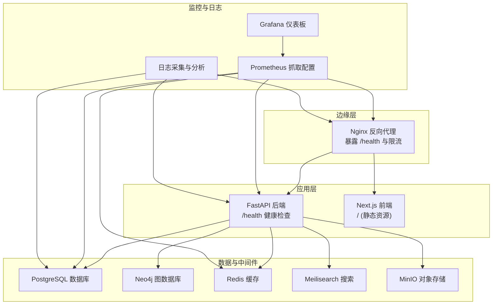
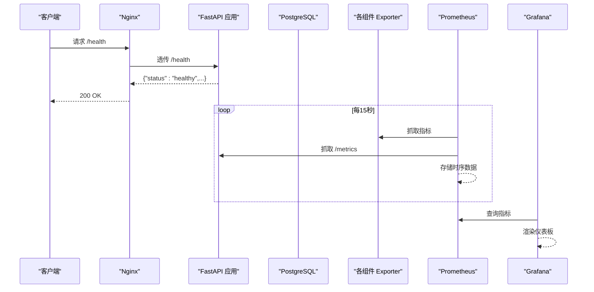
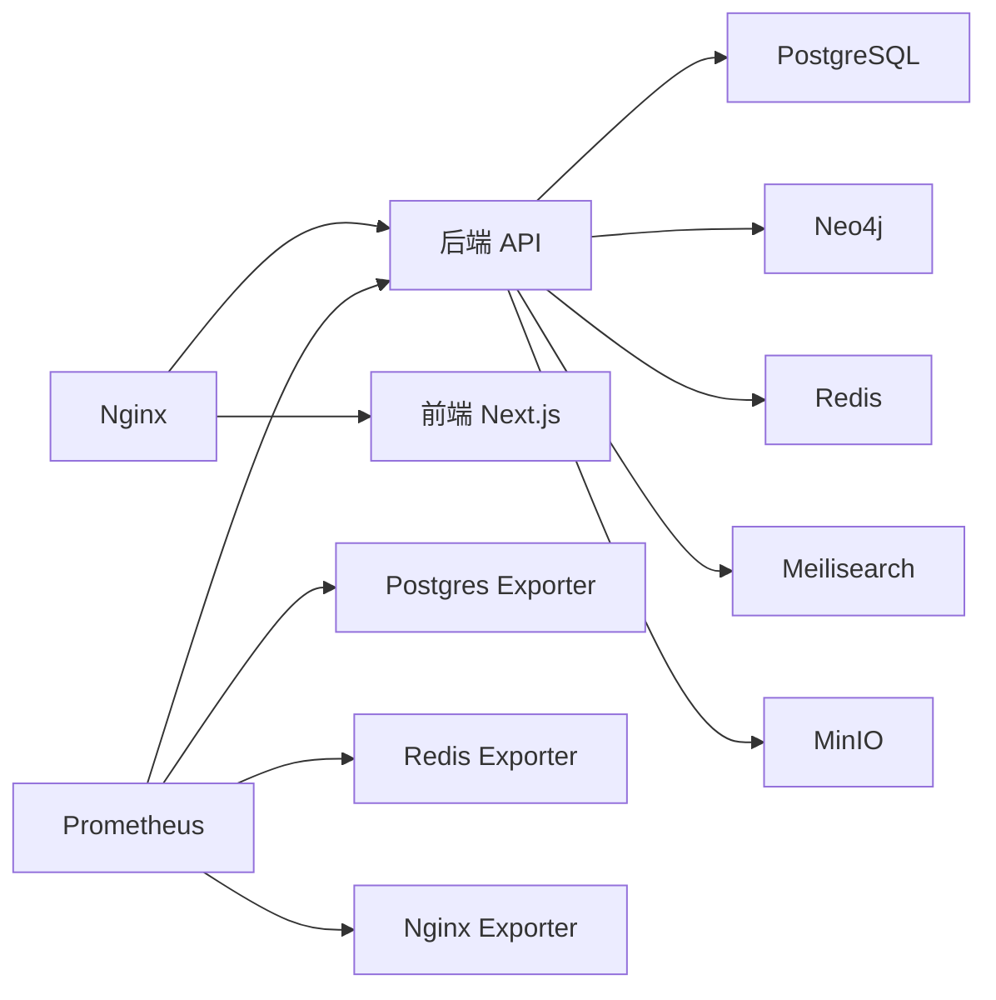

# 监控与日志

<cite>
**本文引用的文件**
- [docker-compose.yml](file://docker-compose.yml)
- [prometheus.yml](file://docker/prometheus/prometheus.yml)
- [main.py](file://backend/app/main.py)
- [config.py](file://backend/app/core/config.py)
- [database.py](file://backend/app/core/database.py)
- [nginx.conf](file://docker/nginx/nginx.conf)
- [default.conf](file://docker/nginx/conf.d/default.conf)
- [Dockerfile](file://backend/Dockerfile)
- [Dockerfile](file://frontend/Dockerfile)
- [pyproject.toml](file://backend/pyproject.toml)
- [alembic.ini](file://backend/alembic.ini)
- [start.sh](file://django_backup/start.sh)
</cite>

## 目录
1. [简介](#简介)
2. [项目结构](#项目结构)
3. [核心组件](#核心组件)
4. [架构总览](#架构总览)
5. [详细组件分析](#详细组件分析)
6. [依赖关系分析](#依赖关系分析)
7. [性能考量](#性能考量)
8. [故障排查指南](#故障排查指南)
9. [结论](#结论)
10. [附录](#附录)

## 简介
本文件面向多租户族谱管理系统，提供监控与日志管理的完整方案。内容涵盖：
- Prometheus 监控配置与关键指标定义
- Grafana 仪表板设置建议
- 应用日志、数据库日志与容器日志的采集与分析
- ELK Stack 或类似方案的集成思路
- 健康检查、性能瓶颈识别与容量规划建议
- 日志轮转、存储管理与合规性要求的实现路径

## 项目结构
系统采用多服务编排，后端使用 FastAPI，前端使用 Next.js，数据库与图数据库、缓存、搜索引擎、对象存储等通过 Docker Compose 统一编排。Prometheus 作为统一监控采集器，负责抓取 API、数据库、缓存与 Nginx 的指标。

图表来源
- [docker-compose.yml](file://docker-compose.yml)
- [prometheus.yml](file://docker/prometheus/prometheus.yml)
- [nginx.conf](file://docker/nginx/nginx.conf)
- [main.py](file://backend/app/main.py)

章节来源
- [docker-compose.yml](file://docker-compose.yml)
- [prometheus.yml](file://docker/prometheus/prometheus.yml)
- [nginx.conf](file://docker/nginx/nginx.conf)

## 核心组件
- 应用健康检查：后端提供 /health 接口，返回服务连接状态；Nginx 配置 /health 路由透传至后端。
- 监控采集：Prometheus 抓取 API（/metrics）、Postgres Exporter、Redis Exporter、Nginx Exporter。
- 日志采集：容器标准输出与文件日志（Nginx 访问/错误日志、Gunicorn 日志、Alembic/SQLAlchemy 日志）。
- 容器健康检查：Nginx、PostgreSQL、Redis、Meilisearch、MinIO、Next.js 均配置 HEALTHCHECK。

章节来源
- [main.py](file://backend/app/main.py)
- [nginx.conf](file://docker/nginx/nginx.conf)
- [default.conf](file://docker/nginx/conf.d/default.conf)
- [docker-compose.yml](file://docker-compose.yml)
- [Dockerfile](file://frontend/Dockerfile)

## 架构总览
下图展示监控与日志在系统中的位置与交互：

图表来源
- [prometheus.yml](file://docker/prometheus/prometheus.yml)
- [main.py](file://backend/app/main.py)
- [nginx.conf](file://docker/nginx/nginx.conf)

## 详细组件分析

### Prometheus 监控配置
- 抓取目标
  - Prometheus 自身：localhost:9090
  - API：api:8010，路径 /metrics
  - PostgreSQL Exporter：postgres-exporter:9187
  - Redis Exporter：redis-exporter:9121
  - Nginx Exporter：nginx-exporter:9113
- 建议补充
  - 在生产环境增加 Alertmanager 并配置告警规则（如服务不可用、响应时间超阈、错误率上升、连接池耗尽等）。
  - 为每个服务配置独立 job，并按需添加 relabel_configs 以区分租户维度（若需要）。

章节来源
- [prometheus.yml](file://docker/prometheus/prometheus.yml)

### Grafana 仪表板设置
- 建议面板类型
  - 服务可用性：后端 /health 返回值、各组件 HEALTHCHECK 状态
  - 性能指标：API 响应时间与吞吐、数据库查询耗时、Redis 命中率、Nginx 连接数与请求速率
  - 资源指标：CPU/内存使用、磁盘空间、网络 I/O
  - 错误与告警：HTTP 5xx、数据库连接失败、缓存未命中率
- 数据源
  - Prometheus 作为主要数据源，结合 Loki/ELK 用于日志检索与关联分析。

章节来源
- [prometheus.yml](file://docker/prometheus/prometheus.yml)

### 关键指标定义
- 应用层
  - 健康状态：/health 返回值
  - 请求延迟：API 响应时间分位数（P50/P90/P99）
  - 请求量：QPS、按端点/租户聚合
  - 错误率：HTTP 4xx/5xx 比例
- 数据库层
  - PostgreSQL：连接数、活动会话、慢查询、表扫描、缓冲区命中率
- 缓存层
  - Redis：连接数、命中率、内存使用、命令耗时
- 中间件层
  - Nginx：连接数、请求速率、状态码分布、上游响应时间

章节来源
- [main.py](file://backend/app/main.py)
- [prometheus.yml](file://docker/prometheus/prometheus.yml)

### 应用日志采集与分析
- FastAPI 应用日志
  - 容器标准输出：后端容器通过 Uvicorn 输出访问与错误日志
  - 建议：将日志格式化为 JSON，便于结构化采集与检索
- Nginx 日志
  - 访问日志与错误日志已启用，支持按租户/端点聚合分析
- 前端日志
  - Next.js 生产健康检查已配置，可在容器日志中查看运行状态
- 数据库日志
  - Alembic 与 SQLAlchemy 日志级别默认较低，建议在开发/测试环境适度提升以辅助诊断

章节来源
- [Dockerfile](file://backend/Dockerfile)
- [nginx.conf](file://docker/nginx/nginx.conf)
- [Dockerfile](file://frontend/Dockerfile)
- [alembic.ini](file://backend/alembic.ini)

### ELK Stack 集成方案
- 方案概述
  - 使用 Filebeat 收集容器日志与文件日志，经 Logstash/直接写入 Elasticsearch，再由 Kibana 展示
  - 与 Prometheus/Grafana 协同：Prometheus 提供时序指标，ELK 提供日志全文检索与上下文关联
- 实施要点
  - 为每类日志设置独立索引策略与保留周期
  - 结合 Nginx、API、数据库日志进行关联分析（如按请求 ID 关联）

（本节为概念性说明，不直接对应具体源文件）

### 容器日志与健康检查
- 健康检查
  - Nginx：HEALTHCHECK 检测 /health
  - PostgreSQL：pg_isready
  - Redis：redis-cli ping
  - Meilisearch：HTTP 健康端点
  - MinIO：Live 健康端点
  - Next.js：HTTP GET / 健康探测
- 日志采集
  - 使用 Docker 日志驱动（json-file）或外部日志代理（如 Fluent Bit/Filebeat）集中采集

章节来源
- [docker-compose.yml](file://docker-compose.yml)
- [Dockerfile](file://frontend/Dockerfile)

### 数据库日志与连接池
- 连接池参数
  - 默认池大小与溢出：settings.database_pool_size、settings.database_max_overflow
  - SQLite 不支持池参数，采用多文件隔离租户
- 日志级别
  - Alembic/SQLAlchemy 日志默认较低，便于生产环境降噪
- 建议
  - 在高并发场景下监控连接池使用率与等待队列长度，必要时调整池大小

章节来源
- [config.py](file://backend/app/core/config.py)
- [database.py](file://backend/app/core/database.py)
- [alembic.ini](file://backend/alembic.ini)

### Nginx 限流与安全
- 限流策略
  - API 限流区：limit_req_zone + limit_req
  - 登录接口更严格：login 区域限流
- 安全头与 HSTS
  - 设置安全响应头与 HSTS
- 健康检查
  - /health 路由透传到后端，禁用访问日志

章节来源
- [nginx.conf](file://docker/nginx/nginx.conf)
- [default.conf](file://docker/nginx/conf.d/default.conf)

### 后端启动与端口
- 后端监听 8010，容器通过 EXPOSE 8010 暴露端口
- 健康检查端点 /health 已内置

章节来源
- [Dockerfile](file://backend/Dockerfile)
- [main.py](file://backend/app/main.py)

## 依赖关系分析
- 组件耦合
  - API 依赖数据库、图数据库、缓存、搜索引擎与对象存储
  - Nginx 作为统一入口，转发到 API 与前端
  - Prometheus 仅依赖各 Exporter 与 API 的 /metrics
- 外部依赖
  - PostgreSQL、Neo4j、Redis、Meilisearch、MinIO、Exporter 均通过 Docker Compose 管理

图表来源
- [docker-compose.yml](file://docker-compose.yml)
- [prometheus.yml](file://docker/prometheus/prometheus.yml)

章节来源
- [docker-compose.yml](file://docker-compose.yml)
- [prometheus.yml](file://docker/prometheus/prometheus.yml)

## 性能考量
- 健康检查
  - 使用 /health 与各组件 HEALTHCHECK 快速定位故障节点
- 指标监控
  - 关注响应时间分位数、错误率、连接池使用率、缓存命中率、Nginx 连接与队列
- 瓶颈识别
  - 若数据库连接池耗尽，优先扩容池大小或优化查询
  - 若缓存命中率低，检查键设计与过期策略
  - 若 Nginx 队列增长，考虑限流策略或上游扩容
- 容量规划
  - 基于 QPS、响应时间与资源使用率的历史趋势，预留 20%-30% 缓冲

（本节为通用指导，不直接对应具体源文件）

## 故障排查指南
- 健康检查失败
  - 检查 /health 返回值与各组件 HEALTHCHECK 状态
  - 查看 Nginx /health 路由是否正确透传
- 日志定位
  - 容器日志：后端、Nginx、前端均输出到标准输出/文件
  - 数据库日志：Alembic/SQLAlchemy 日志级别可按需调整
- 性能异常
  - 结合 Prometheus 指标与 ELK 日志，定位慢查询、缓存失效、限流触发等问题

章节来源
- [main.py](file://backend/app/main.py)
- [docker-compose.yml](file://docker-compose.yml)
- [nginx.conf](file://docker/nginx/nginx.conf)
- [alembic.ini](file://backend/alembic.ini)

## 结论
本方案通过 Prometheus + Grafana 实现时序监控，结合 Nginx 限流与健康检查保障入口稳定，辅以结构化日志与 ELK 进行深度分析。建议在生产环境完善告警规则、日志轮转与合规保留策略，并基于历史指标进行容量规划与性能优化。

（本节为总结性内容，不直接对应具体源文件）

## 附录

### 日志轮转与存储管理
- 容器日志轮转
  - 使用 Docker json-file 驱动的 log-opt 参数控制单文件大小与备份数量
- 文件日志轮转
  - Nginx 访问/错误日志可通过 logrotate 管理
  - Gunicorn 日志（备份方案）可参考 start.sh 中的日志路径

章节来源
- [nginx.conf](file://docker/nginx/nginx.conf)
- [start.sh](file://django_backup/start.sh)

### 合规性要求
- 日志保留周期：根据法规要求设定（如 90/180/365 天）
- 数据最小化：脱敏敏感字段，限制日志中明文存储密码与令牌
- 审计追踪：关键操作（用户登录、数据变更）必须可追溯

（本节为通用指导，不直接对应具体源文件）