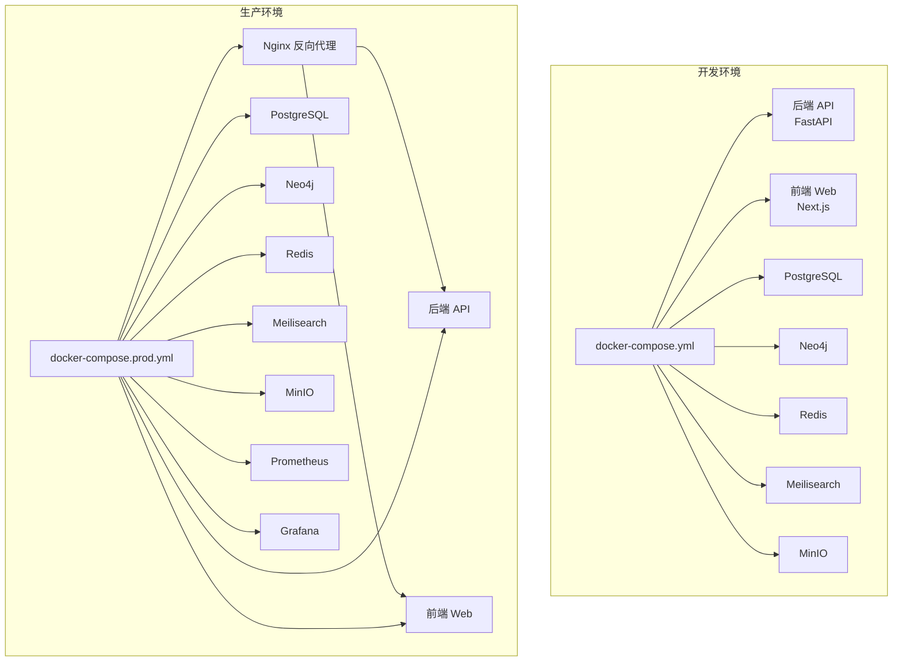
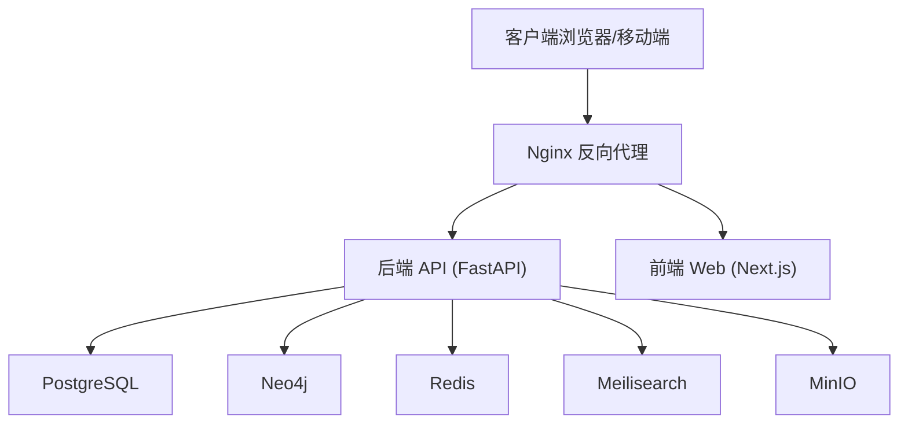
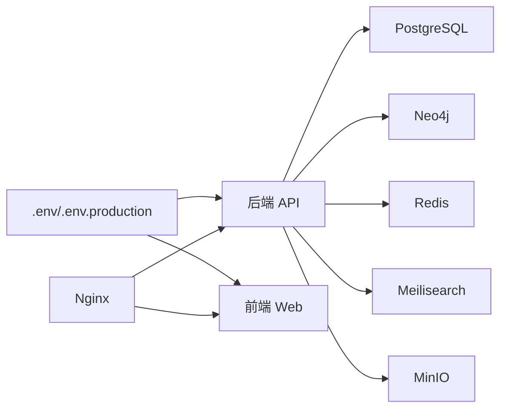

# 部署与运维

<cite>
**本文引用的文件**
- [docker-compose.yml](file://docker-compose.yml)
- [docker-compose.prod.yml](file://docker-compose.prod.yml)
- [Dockerfile（后端）](file://backend/Dockerfile)
- [Dockerfile（前端）](file://frontend/Dockerfile)
- [部署脚本 deploy.sh](file://deploy.sh)
- [Windows 安装脚本 setup.ps1](file://setup.ps1)
- [Windows 开发启动脚本 start-dev.ps1](file://start-dev.ps1)
- [后端项目配置 pyproject.toml](file://backend/pyproject.toml)
- [数据库迁移配置 alembic.ini](file://backend/alembic.ini)
- [Nginx 主配置 nginx.conf](file://docker/nginx/nginx.conf)
- [Nginx 站点配置 default.conf](file://docker/nginx/conf.d/default.conf)
- [Prometheus 配置 prometheus.yml](file://docker/prometheus/prometheus.yml)
- [PostgreSQL 初始化脚本 init.sql](file://docker/postgres/init.sql)
- [租户管理脚本 create_tenant.py](file://scripts/create_tenant.py)
- [系统初始化脚本 init_system.py](file://scripts/init_system.py)
</cite>

## 目录
1. [简介](#简介)
2. [项目结构](#项目结构)
3. [核心组件](#核心组件)
4. [架构总览](#架构总览)
5. [详细组件分析](#详细组件分析)
6. [依赖关系分析](#依赖关系分析)
7. [性能考量](#性能考量)
8. [故障排除指南](#故障排除指南)
9. [结论](#结论)
10. [附录](#附录)

## 简介
本文件面向多租户族谱管理系统，提供从开发到生产的完整部署与运维指南。内容涵盖：
- 开发环境与生产环境的部署步骤
- Docker 容器化配置、服务编排与网络设置
- 生产环境安全加固、SSL 证书与负载均衡
- 监控与日志收集策略（含指标与错误追踪）
- 备份与恢复流程
- 扩展性与高可用配置
- 运维自动化脚本与 CI/CD 流水线建议
- 故障排除与应急响应流程
- 成本优化与资源管理建议

## 项目结构
该仓库采用多模块组织方式：后端（FastAPI）、前端（Next.js）、数据库与中间件（PostgreSQL、Neo4j、Redis、Meilisearch、MinIO）、反向代理（Nginx）、监控（Prometheus/Grafana），以及运维脚本与迁移配置。

图表来源
- [docker-compose.yml:1-145](file://docker-compose.yml#L1-L145)
- [docker-compose.prod.yml:1-217](file://docker-compose.prod.yml#L1-L217)

章节来源
- [docker-compose.yml:1-145](file://docker-compose.yml#L1-L145)
- [docker-compose.prod.yml:1-217](file://docker-compose.prod.yml#L1-L217)

## 核心组件
- 后端 API（FastAPI）：提供多租户族谱相关接口，使用异步数据库驱动与缓存、搜索引擎、图数据库与对象存储集成。
- 前端应用（Next.js）：多租户路由与页面，通过环境变量指向后端 API。
- 数据库层：PostgreSQL（主数据与租户隔离）、Neo4j（族谱关系图）。
- 缓存与搜索：Redis（会话/缓存）、Meilisearch（全文检索）。
- 对象存储：MinIO（S3 兼容）。
- 反向代理：Nginx（SSL 终止、限流、健康检查转发）。
- 监控：Prometheus（指标抓取）、Grafana（可视化）。

章节来源
- [Dockerfile（后端）:1-24](file://backend/Dockerfile#L1-L24)
- [Dockerfile（前端）:1-51](file://frontend/Dockerfile#L1-L51)
- [后端项目配置 pyproject.toml:1-61](file://backend/pyproject.toml#L1-L61)
- [Nginx 主配置 nginx.conf:1-57](file://docker/nginx/nginx.conf#L1-L57)
- [Nginx 站点配置 default.conf:1-113](file://docker/nginx/conf.d/default.conf#L1-L113)

## 架构总览
系统采用“容器化 + 服务编排”的架构，开发与生产环境通过不同的 Compose 文件实现差异化配置。生产环境引入 Nginx 作为统一入口，提供 SSL、限流与健康检查；监控组件可按需启用。

图表来源
- [docker-compose.prod.yml:98-172](file://docker-compose.prod.yml#L98-L172)
- [Nginx 主配置 nginx.conf:46-54](file://docker/nginx/nginx.conf#L46-L54)
- [Nginx 站点配置 default.conf:30-104](file://docker/nginx/conf.d/default.conf#L30-L104)

## 详细组件分析

### 开发环境部署
- 使用 docker-compose.yml 启动所有依赖服务与应用容器，便于本地联调。
- 后端监听 8010，前端监听 3010，数据库与中间件均暴露必要端口以便调试。
- 健康检查用于快速发现服务异常。

章节来源
- [docker-compose.yml:1-145](file://docker-compose.yml#L1-L145)

### 生产环境部署
- 使用 docker-compose.prod.yml 构建生产镜像并启动服务，包含重启策略、健康检查与网络隔离。
- Nginx 提供 80/443 端口，挂载自定义 SSL 证书与站点配置。
- 应用容器通过健康检查端点进行存活探测。

章节来源
- [docker-compose.prod.yml:1-217](file://docker-compose.prod.yml#L1-L217)
- [Nginx 主配置 nginx.conf:1-57](file://docker/nginx/nginx.conf#L1-L57)
- [Nginx 站点配置 default.conf:1-113](file://docker/nginx/conf.d/default.conf#L1-L113)

### 容器与镜像构建
- 后端镜像基于 Python slim，安装系统依赖与项目依赖，暴露 8010 端口。
- 前端镜像采用多阶段构建，最终以非 root 用户运行，具备健康检查。
- 生产镜像通过 Compose 的 build 指令构建，支持参数注入。

章节来源
- [Dockerfile（后端）:1-24](file://backend/Dockerfile#L1-L24)
- [Dockerfile（前端）:1-51](file://frontend/Dockerfile#L1-L51)
- [docker-compose.prod.yml:100-105](file://docker-compose.prod.yml#L100-L105)

### 数据库与迁移
- PostgreSQL 在生产环境通过 init.sql 初始化扩展与函数，支持模糊搜索。
- Alembic 配置用于数据库迁移，开发环境默认连接本地数据库。
- 部署脚本在启动后执行迁移与缓存清理。

章节来源
- [docker\postgres\init.sql:1-8](file://docker/postgres/init.sql#L1-L8)
- [数据库迁移配置 alembic.ini:1-45](file://backend/alembic.ini#L1-L45)
- [deploy.sh:47-51](file://deploy.sh#L47-L51)

### 多租户初始化与租户管理
- 系统初始化脚本负责创建系统表、超级用户、首个租户及其模式。
- 租户管理脚本支持创建租户的数据库模式与基础表，以及 Neo4j 连通性验证。

章节来源
- [系统初始化脚本 init_system.py:1-220](file://scripts/init_system.py#L1-L220)
- [租户管理脚本 create_tenant.py:1-306](file://scripts/create_tenant.py#L1-L306)

### 反向代理与安全
- Nginx 提供 SSL 终止、HSTS、速率限制、健康检查直连等能力。
- API 与 Web 分别配置上游与静态资源缓存策略。

章节来源
- [Nginx 主配置 nginx.conf:35-44](file://docker/nginx/nginx.conf#L35-L44)
- [Nginx 站点配置 default.conf:14-28](file://docker/nginx/conf.d/default.conf#L14-L28)

### 监控与日志
- Prometheus 配置抓取 API、数据库与中间件指标，支持按需启用 Grafana。
- 日志路径在 Compose 中挂载至宿主机卷，便于集中采集。

章节来源
- [Prometheus 配置 prometheus.yml:1-32](file://docker/prometheus/prometheus.yml#L1-L32)
- [docker-compose.prod.yml:176-201](file://docker-compose.prod.yml#L176-L201)

### 开发与运维脚本
- Windows 安装脚本：自动检测并安装 Python/Node.js，创建虚拟环境与前端依赖，生成示例配置。
- Windows 开发启动脚本：分别启动后端与前端服务，输出访问地址。
- 部署脚本：拉取代码、构建镜像、启动服务、健康检查、执行迁移与缓存清理。

章节来源
- [Windows 安装脚本 setup.ps1:1-88](file://setup.ps1#L1-L88)
- [Windows 开发启动脚本 start-dev.ps1:1-94](file://start-dev.ps1#L1-L94)
- [部署脚本 deploy.sh:1-64](file://deploy.sh#L1-L64)

## 依赖关系分析
- 后端对数据库、图数据库、缓存、搜索引擎与对象存储的依赖通过环境变量配置。
- 前端通过 NEXT_PUBLIC_API_URL 指向后端 API。
- Nginx 作为统一入口，向上游转发请求并提供安全与性能增强。

图表来源
- [docker-compose.prod.yml:107-119](file://docker-compose.prod.yml#L107-L119)
- [Nginx 站点配置 default.conf:30-104](file://docker/nginx/conf.d/default.conf#L30-L104)

## 性能考量
- 缓存与索引：Redis 作为 LRU 缓存，PostgreSQL 初始化扩展与函数提升模糊搜索性能。
- 搜索引擎：Meilisearch 提供高性能全文检索，适合大规模族谱数据。
- 反向代理：Nginx 启用 gzip、keepalive、静态资源缓存与健康检查，降低后端压力。
- 数据库与中间件：合理设置内存参数与连接池，避免过载。

章节来源
- [docker-compose.prod.yml:53-53](file://docker-compose.prod.yml#L53-L53)
- [docker\postgres\init.sql:1-8](file://docker/postgres/init.sql#L1-L8)
- [Nginx 主配置 nginx.conf:28-33](file://docker/nginx/nginx.conf#L28-L33)

## 故障排除指南
- 服务健康检查失败
  - 使用部署脚本查看 API 健康端点与日志定位问题。
  - 检查数据库连接字符串、图数据库认证与中间件状态。
- 数据库迁移失败
  - 确认 Alembic 配置与数据库可达性，重新执行迁移。
- 缓存异常
  - 清理缓存并确认 Redis 可用。
- 前端无法访问后端
  - 校验 NEXT_PUBLIC_API_URL 与 Nginx 上游配置。
- SSL 证书问题
  - 确认证书路径与权限，检查 Nginx 站点配置中的证书文件映射。

章节来源
- [deploy.sh:38-43](file://deploy.sh#L38-L43)
- [docker-compose.prod.yml:129-133](file://docker-compose.prod.yml#L129-L133)
- [Nginx 站点配置 default.conf:14-28](file://docker/nginx/conf.d/default.conf#L14-L28)

## 结论
本部署与运维文档提供了从开发到生产的全链路实践指南。通过容器化与服务编排，结合 Nginx 安全加固、监控与日志体系，系统可在保证安全性的同时实现高可用与可观测性。建议在生产环境中进一步完善密钥管理、备份策略与灾难恢复演练。

## 附录

### 开发环境搭建（Windows）
- 安装 Python 与 Node.js，运行安装脚本创建虚拟环境与依赖。
- 启动开发服务，访问后端 API 文档与前端页面。

章节来源
- [Windows 安装脚本 setup.ps1:1-88](file://setup.ps1#L1-L88)
- [Windows 开发启动脚本 start-dev.ps1:1-94](file://start-dev.ps1#L1-L94)

### 生产环境部署流程
- 准备环境变量文件，构建并启动服务，等待健康检查通过。
- 执行数据库迁移与缓存清理。
- 验证 API 与前端访问，开启监控与日志采集。

章节来源
- [部署脚本 deploy.sh:1-64](file://deploy.sh#L1-L64)
- [docker-compose.prod.yml:28-31](file://docker-compose.prod.yml#L28-L31)

### 安全配置要点
- 强制 HTTPS 与 HSTS，使用强密码与随机密钥。
- 限制 API 速率与登录频率，启用健康检查端口白名单。
- 最小权限原则管理数据库与对象存储访问。

章节来源
- [Nginx 站点配置 default.conf:26-28](file://docker/nginx/conf.d/default.conf#L26-L28)
- [docker-compose.prod.yml:108-119](file://docker-compose.prod.yml#L108-L119)

### 监控与日志策略
- 抓取 API、数据库与中间件指标，配置告警规则。
- 将日志持久化到宿主机卷，接入集中式日志平台。

章节来源
- [Prometheus 配置 prometheus.yml:17-29](file://docker/prometheus/prometheus.yml#L17-L29)
- [docker-compose.prod.yml:176-201](file://docker-compose.prod.yml#L176-L201)

### 备份与恢复流程
- 数据库备份：定期导出 PostgreSQL 数据，保留多版本快照。
- 图数据库备份：根据 Neo4j 版本特性执行快照或导出。
- 缓存与搜索：备份 Redis RDB/AOF 与 Meilisearch 数据目录。
- 存储备份：同步 MinIO 数据桶至远端存储。
- 恢复验证：在隔离环境验证备份完整性与可恢复性。

章节来源
- [docker-compose.prod.yml:15-17](file://docker-compose.prod.yml#L15-L17)
- [docker-compose.prod.yml:37-39](file://docker-compose.prod.yml#L37-L39)
- [docker-compose.prod.yml:54-55](file://docker-compose.prod.yml#L54-L55)
- [docker-compose.prod.yml:72-73](file://docker-compose.prod.yml#L72-L73)
- [docker-compose.prod.yml:86-87](file://docker-compose.prod.yml#L86-L87)

### 扩展性与高可用
- 水平扩展：前端与 API 可通过负载均衡横向扩展多个副本。
- 数据库：读写分离、只读副本与连接池优化。
- 缓存与搜索：集群化部署与分片策略。
- 对象存储：启用多区域复制与 CDN 加速。

章节来源
- [Nginx 主配置 nginx.conf:46-54](file://docker/nginx/nginx.conf#L46-L54)
- [docker-compose.prod.yml:107-119](file://docker-compose.prod.yml#L107-L119)

### 运维自动化与 CI/CD
- 构建：在 CI 中执行依赖安装、测试与镜像构建。
- 部署：通过部署脚本或 CI 工具触发 Compose 部署与迁移。
- 回滚：保留镜像版本与配置快照，支持一键回滚。
- 安全扫描：在流水线中集成依赖漏洞扫描与配置审计。

章节来源
- [后端项目配置 pyproject.toml:27-36](file://backend/pyproject.toml#L27-L36)
- [部署脚本 deploy.sh:26-31](file://deploy.sh#L26-L31)

### 成本优化与资源管理
- 资源配额：为数据库与中间件设置合理的 CPU/内存上限与下限。
- 存储：启用压缩与生命周期管理，清理临时与冗余数据。
- 缓存：调整缓存策略与淘汰策略，减少无效命中。
- 计费：按需选择云厂商实例规格与计费模式，结合预留实例降低成本。

章节来源
- [docker-compose.prod.yml:33-36](file://docker-compose.prod.yml#L33-L36)
- [docker-compose.prod.yml:53-53](file://docker-compose.prod.yml#L53-L53)
- [docker-compose.prod.yml:68-71](file://docker-compose.prod.yml#L68-L71)