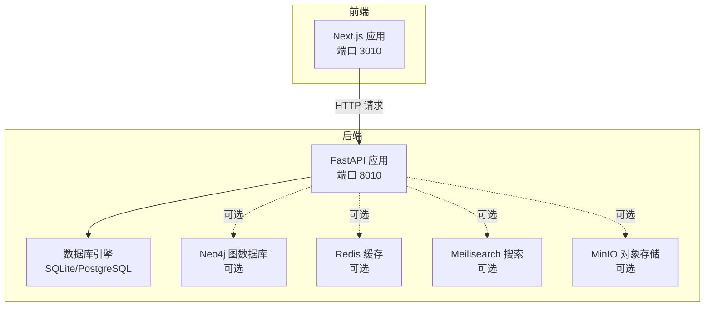
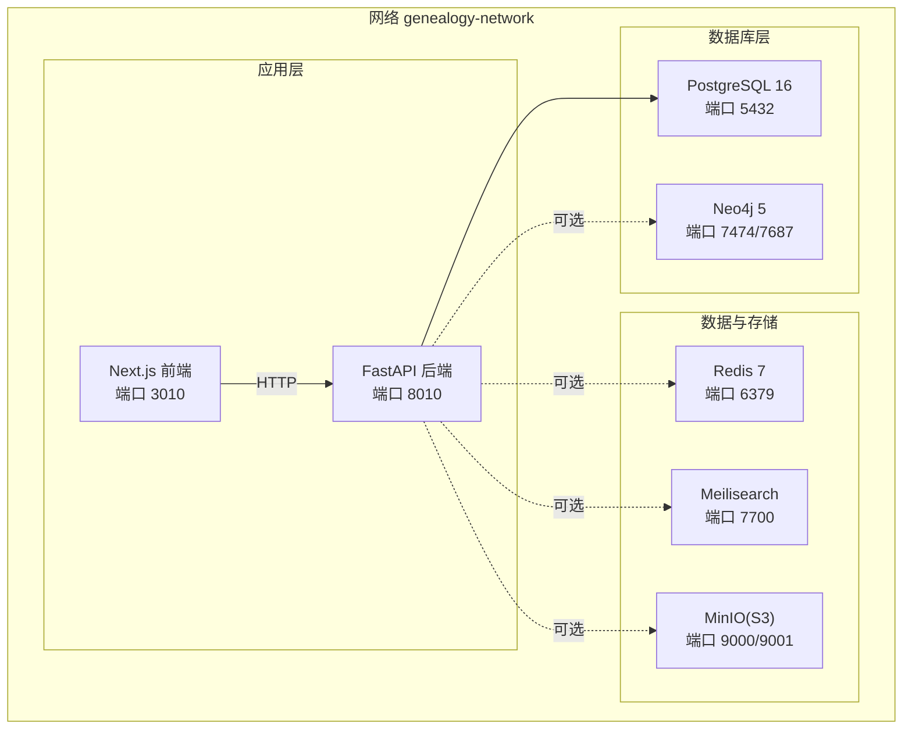
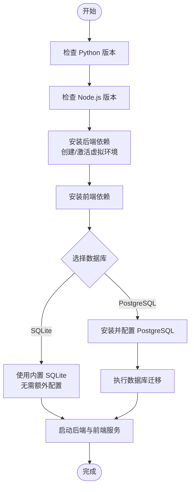
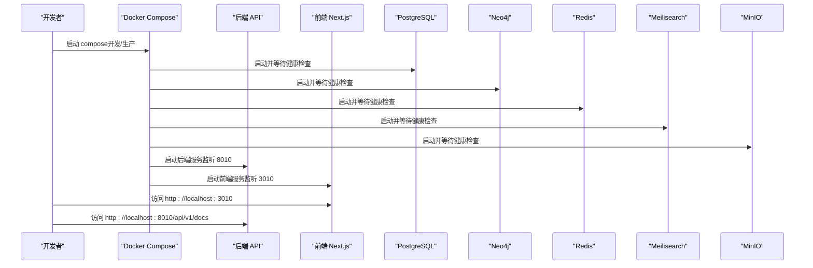
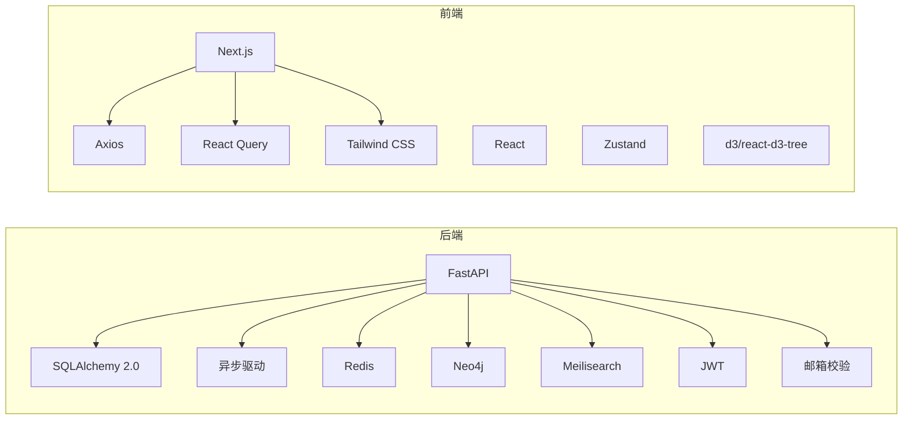

# 快速开始

<cite>
**本文引用的文件**
- [根目录说明](file://README.md)
- [本地开发指南](file://docs/LOCAL_DEVELOPMENT.md)
- [后端说明](file://backend/README.md)
- [后端项目配置](file://backend/pyproject.toml)
- [后端应用入口](file://backend/app/main.py)
- [后端核心配置](file://backend/app/core/config.py)
- [后端 Dockerfile](file://backend/Dockerfile)
- [后端 Alembic 配置](file://backend/alembic.ini)
- [前端包配置](file://frontend/package.json)
- [前端构建配置](file://frontend/next.config.js)
- [前端 Dockerfile](file://frontend/Dockerfile)
- [开发环境编排](file://docker-compose.yml)
- [生产环境编排](file://docker-compose.prod.yml)
- [Windows 安装脚本](file://setup.ps1)
- [Windows 启动脚本](file://start-dev.ps1)
- [租户初始化脚本](file://scripts/create_tenant.py)
</cite>

## 目录
1. [简介](#简介)
2. [项目结构](#项目结构)
3. [核心组件](#核心组件)
4. [架构总览](#架构总览)
5. [详细组件分析](#详细组件分析)
6. [依赖关系分析](#依赖关系分析)
7. [性能考虑](#性能考虑)
8. [故障排除指南](#故障排除指南)
9. [结论](#结论)
10. [附录](#附录)

## 简介
本指南帮助你在30分钟内成功启动“族谱云”多租户族谱管理系统，支持两种部署方式：
- 本地开发环境（Windows/macOS/Linux，仅需 Python 3.11+ 与 Node.js 18+）
- Docker Compose 部署（开发与生产）

你将能够访问：
- 前端界面：http://localhost:3010
- 后端 API：http://localhost:8010
- API 文档：http://localhost:8010/api/v1/docs

## 项目结构
项目采用前后端分离架构，包含：
- 后端：FastAPI + SQLAlchemy 2.0 + 异步数据库驱动
- 前端：Next.js 15 + React 19 + Tailwind CSS
- 可选服务：PostgreSQL 16、Neo4j 5、Redis 7、Meilisearch、MinIO、Nginx、Prometheus/Grafana（生产可选）

图表来源
- [开发环境编排:1-145](file://docker-compose.yml#L1-L145)
- [后端应用入口:45-91](file://backend/app/main.py#L45-L91)
- [后端核心配置:34-67](file://backend/app/core/config.py#L34-L67)

章节来源
- [根目录说明:1-133](file://README.md#L1-L133)
- [本地开发指南:1-299](file://docs/LOCAL_DEVELOPMENT.md#L1-L299)

## 核心组件
- 后端应用入口负责创建 FastAPI 实例、注册中间件与路由、健康检查端点以及生命周期事件。
- 核心配置集中管理数据库、缓存、搜索、存储、CORS、JWT 等参数。
- 前端 Next.js 应用通过环境变量调用后端 API，提供族谱树可视化、人员管理、租户管理等页面。

章节来源
- [后端应用入口:17-91](file://backend/app/main.py#L17-L91)
- [后端核心配置:11-89](file://backend/app/core/config.py#L11-L89)
- [前端包配置:1-45](file://frontend/package.json#L1-L45)
- [前端构建配置:16-19](file://frontend/next.config.js#L16-L19)

## 架构总览
下图展示开发环境下的容器化架构与服务交互：

图表来源
- [开发环境编排:3-145](file://docker-compose.yml#L3-L145)

章节来源
- [开发环境编排:1-145](file://docker-compose.yml#L1-L145)

## 详细组件分析

### 本地开发环境（Windows/macOS/Linux）
- 环境要求
  - Python 3.11+（建议使用 venv）
  - Node.js 18+
  - 可选：PostgreSQL 16、Neo4j 5、Redis 7、Meilisearch
- 快速启动
  - Windows：执行安装脚本与启动脚本，自动创建虚拟环境、安装依赖并启动后端与前端。
  - macOS/Linux：使用 shell 脚本一键安装与启动。
- 手动启动（不依赖脚本）
  - 后端：进入 backend 目录，创建并激活虚拟环境，安装开发依赖，启动 Uvicorn。
  - 前端：进入 frontend 目录，安装依赖，启动 Next.js 开发服务器。
- 数据库迁移
  - SQLite：默认使用，无需额外迁移。
  - PostgreSQL：创建数据库并执行迁移。

图表来源
- [Windows 安装脚本:14-58](file://setup.ps1#L14-L58)
- [Windows 启动脚本:43-78](file://start-dev.ps1#L43-L78)
- [本地开发指南:45-88](file://docs/LOCAL_DEVELOPMENT.md#L45-L88)
- [后端项目配置:6-25](file://backend/pyproject.toml#L6-L25)

章节来源
- [根目录说明:29-68](file://README.md#L29-L68)
- [本地开发指南:1-299](file://docs/LOCAL_DEVELOPMENT.md#L1-L299)
- [Windows 安装脚本:1-88](file://setup.ps1#L1-L88)
- [Windows 启动脚本:1-94](file://start-dev.ps1#L1-L94)

### Docker Compose 部署
- 开发环境
  - 使用 docker-compose.yml 启动所有服务：PostgreSQL、Neo4j、Redis、Meilisearch、MinIO、后端 API、前端 Next.js。
- 生产环境
  - 使用 docker-compose.prod.yml，包含 Nginx 反向代理、健康检查、可选监控（Prometheus/Grafana）。
  - 需要复制并配置 .env.production 为 .env，准备 SSL 证书。
- 端口映射
  - 前端：3010
  - 后端：8010
  - PostgreSQL：5432
  - Neo4j：7474/7687
  - Redis：6379
  - Meilisearch：7700
  - MinIO：9000/9001
  - Nginx：80/443（生产）

图表来源
- [开发环境编排:89-132](file://docker-compose.yml#L89-L132)
- [生产环境编排:98-151](file://docker-compose.prod.yml#L98-L151)

章节来源
- [根目录说明:51-68](file://README.md#L51-L68)
- [开发环境编排:1-145](file://docker-compose.yml#L1-L145)
- [生产环境编排:1-217](file://docker-compose.prod.yml#L1-L217)

### 配置与环境变量
- 后端配置
  - 数据库：默认 SQLite；可切换 PostgreSQL。
  - Neo4j、Redis、Meilisearch：可选，未就绪时不影响核心功能。
  - CORS、JWT、存储、租户策略等集中于配置模块。
- 前端配置
  - NEXT_PUBLIC_API_URL 默认指向本地后端 API。
  - 支持远程图片优化与严格模式。

章节来源
- [后端核心配置:34-67](file://backend/app/core/config.py#L34-L67)
- [后端应用入口:45-87](file://backend/app/main.py#L45-L87)
- [前端构建配置:16-19](file://frontend/next.config.js#L16-L19)

### 数据库与迁移
- SQLite（默认）
  - 无需额外安装，自动创建表。
- PostgreSQL（生产推荐）
  - 创建数据库并执行迁移。

章节来源
- [本地开发指南:94-118](file://docs/LOCAL_DEVELOPMENT.md#L94-L118)
- [后端 Alembic 配置:8-8](file://backend/alembic.ini#L8-L8)

### 租户初始化与示例
- 提供脚本用于创建租户、初始化模式与表结构，并验证 Neo4j 连接。
- 可直接运行脚本创建示例租户。

章节来源
- [租户初始化脚本:231-282](file://scripts/create_tenant.py#L231-L282)

## 依赖关系分析
- 后端依赖
  - FastAPI、SQLAlchemy 2.0、异步数据库驱动、Redis、Neo4j、Meilisearch、JWT、邮件校验等。
  - 开发依赖：pytest、ruff、mypy 等。
- 前端依赖
  - Next.js、React、Tailwind CSS、TanStack React Query、Axios、Zustand、可视化库等。

图表来源
- [后端项目配置:7-25](file://backend/pyproject.toml#L7-L25)
- [前端包配置:12-31](file://frontend/package.json#L12-L31)

章节来源
- [后端项目配置:1-61](file://backend/pyproject.toml#L1-L61)
- [前端包配置:1-45](file://frontend/package.json#L1-L45)

## 性能考虑
- 本地开发优先使用 SQLite，零配置、易上手；高并发场景建议 PostgreSQL。
- 可选服务（Neo4j、Redis、Meilisearch）按需启用，避免不必要的资源占用。
- 生产环境使用 Nginx 反向代理与健康检查，结合 Prometheus/Grafana 监控。

## 故障排除指南
- 后端启动失败
  - 确认已在虚拟环境中安装开发依赖。
  - 检查 .env 配置项是否正确。
- 数据库连接问题
  - SQLite：确认数据库文件路径与权限。
  - PostgreSQL：确认服务运行、凭据正确、数据库已创建并执行迁移。
- 可选服务未就绪
  - Neo4j/Redis/Meilisearch 未安装或未运行属于可接受状态，核心功能仍可用。
- 端口冲突
  - 若端口被占用，请修改对应服务的端口映射或释放端口。
- 前端无法访问 API
  - 确认 NEXT_PUBLIC_API_URL 指向正确的后端地址。

章节来源
- [本地开发指南:237-296](file://docs/LOCAL_DEVELOPMENT.md#L237-L296)
- [后端应用入口:72-86](file://backend/app/main.py#L72-L86)

## 结论
通过本指南，你可以快速完成本地开发或 Docker 部署，30 分钟内访问前端界面、后端 API 与 API 文档。建议在本地开发阶段使用 SQLite，生产阶段迁移到 PostgreSQL 并启用可选服务以提升性能与功能完整性。

## 附录

### 环境要求与版本
- 本地开发：Python 3.11+、Node.js 18+
- Docker：Docker 与 Docker Compose
- 生产环境：PostgreSQL 16、Neo4j 5（可选）、Redis 7、Meilisearch、MinIO、Nginx、Prometheus/Grafana（可选）

章节来源
- [根目录说明:62-81](file://README.md#L62-L81)

### 命令行与预期输出
- 本地开发（Windows）
  - 安装：执行安装脚本，自动创建虚拟环境并安装依赖。
  - 启动：执行启动脚本，分别在新窗口启动后端与前端服务。
- 本地开发（macOS/Linux）
  - 安装与启动：参考本地开发指南中的脚本与手动启动步骤。
- Docker（开发/生产）
  - 开发：docker-compose up -d
  - 生产：复制并配置 .env.production，再执行 docker-compose -f docker-compose.prod.yml up -d

章节来源
- [根目录说明:29-68](file://README.md#L29-L68)
- [本地开发指南:45-88](file://docs/LOCAL_DEVELOPMENT.md#L45-L88)
- [开发环境编排:54-60](file://docker-compose.yml#L54-L60)
- [生产环境编排:57-60](file://docker-compose.prod.yml#L57-L60)