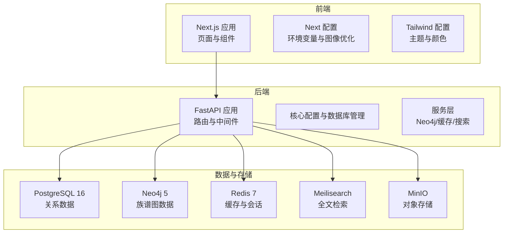
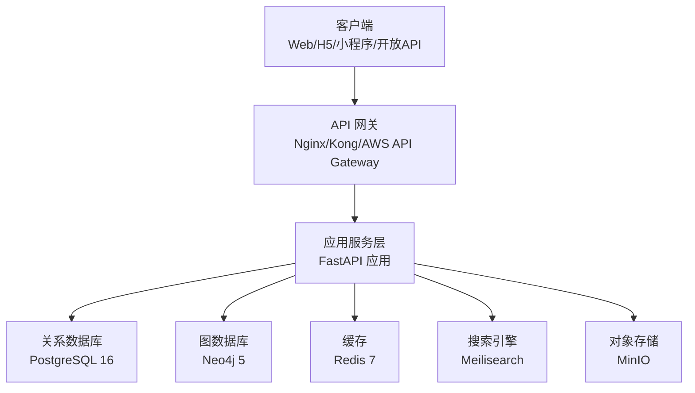
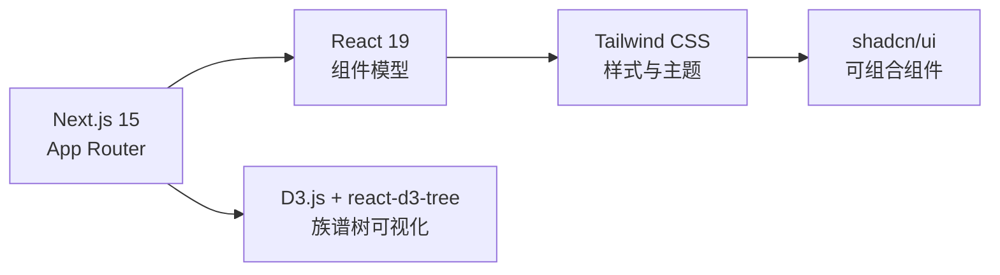
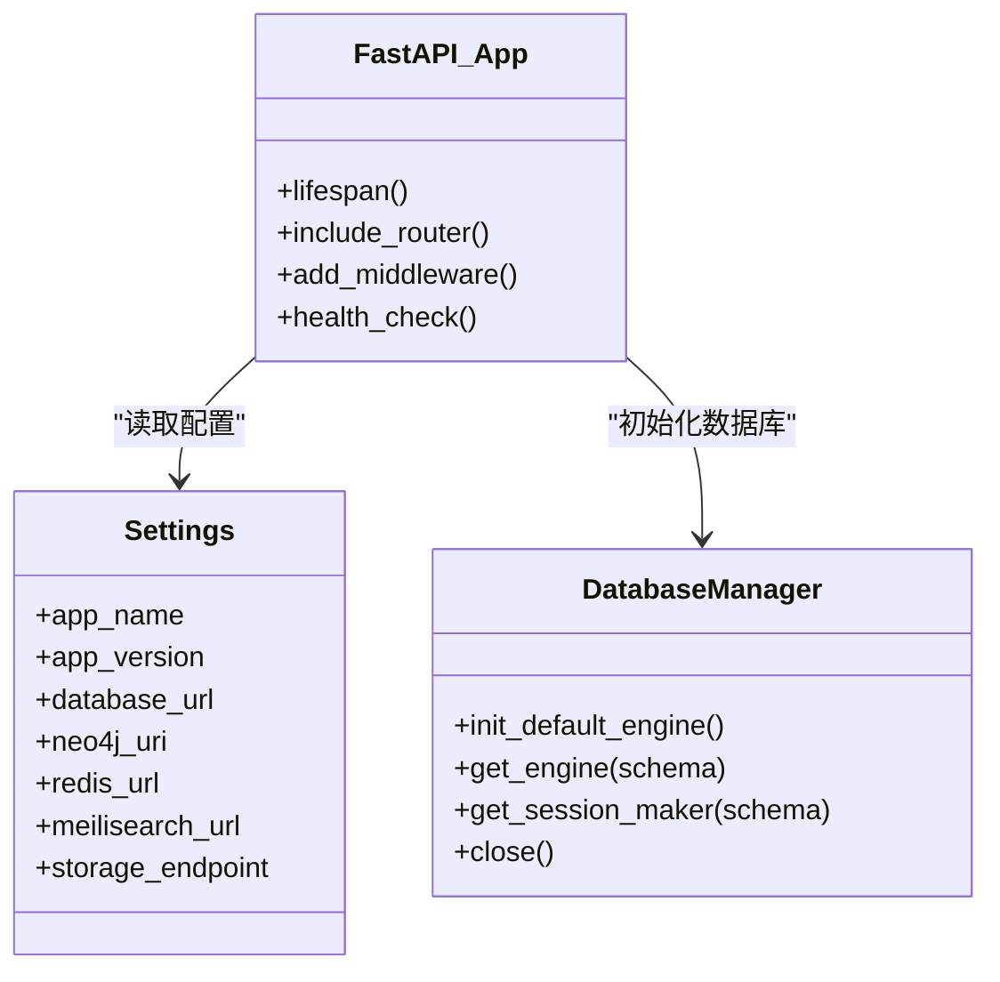
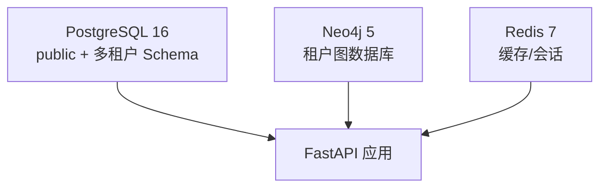
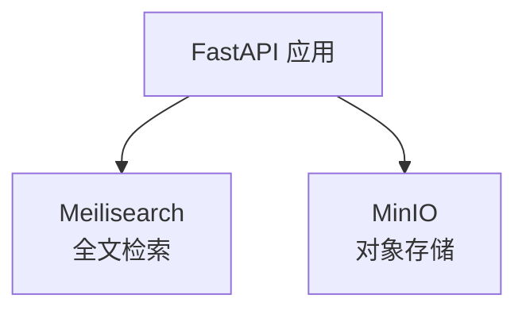
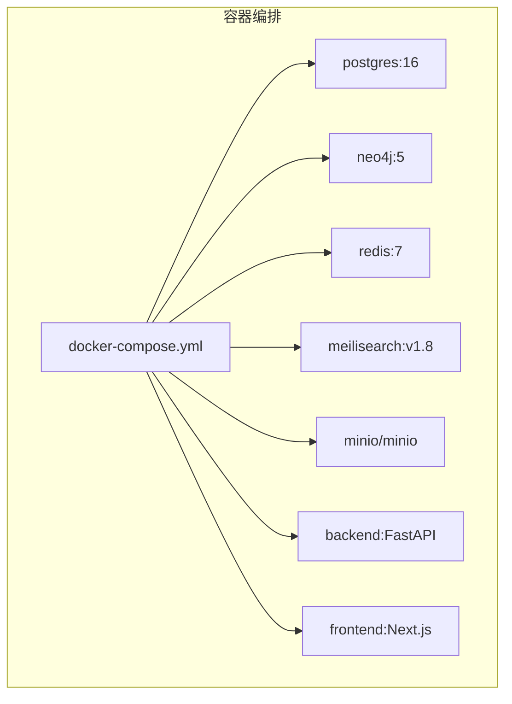
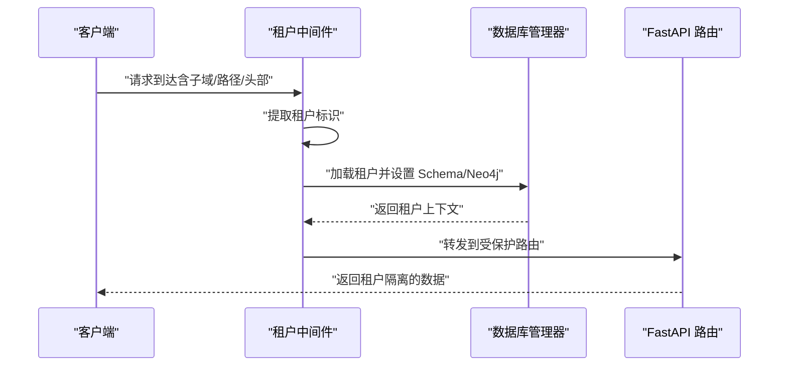
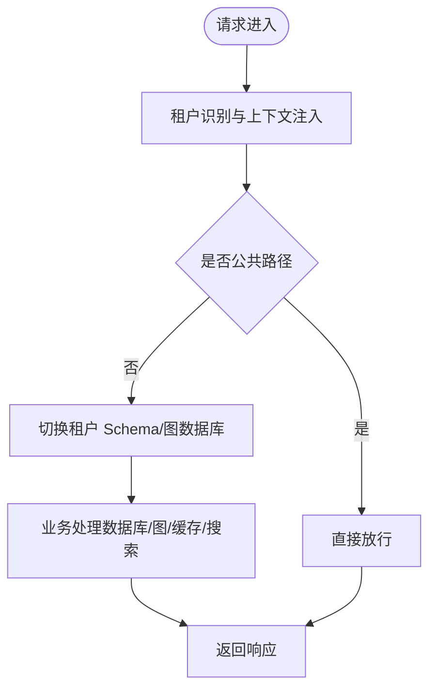
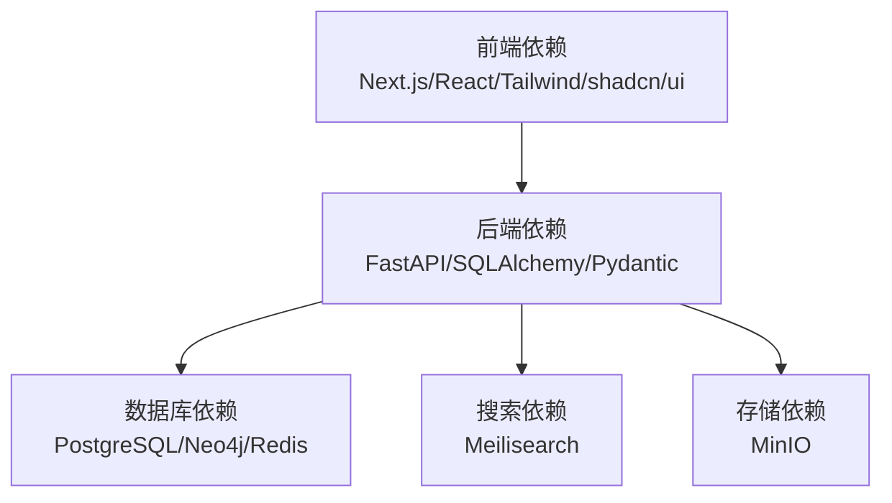

# 技术栈概览

<cite>
**本文引用的文件**
- [backend/pyproject.toml](file://backend/pyproject.toml)
- [frontend/package.json](file://frontend/package.json)
- [docker-compose.yml](file://docker-compose.yml)
- [backend/app/main.py](file://backend/app/main.py)
- [backend/app/core/config.py](file://backend/app/core/config.py)
- [backend/app/core/database.py](file://backend/app/core/database.py)
- [backend/app/middleware/tenant.py](file://backend/app/middleware/tenant.py)
- [backend/app/api/v1/endpoints/tenants.py](file://backend/app/api/v1/endpoints/tenants.py)
- [backend/app/services/neo4j_service.py](file://backend/app/services/neo4j_service.py)
- [frontend/next.config.js](file://frontend/next.config.js)
- [frontend/tailwind.config.ts](file://frontend/tailwind.config.ts)
- [backend/Dockerfile](file://backend/Dockerfile)
- [frontend/Dockerfile](file://frontend/Dockerfile)
- [docs/ARCHITECTURE.md](file://docs/ARCHITECTURE.md)
</cite>

## 目录
1. [简介](#简介)
2. [项目结构](#项目结构)
3. [核心组件](#核心组件)
4. [架构总览](#架构总览)
5. [详细组件分析](#详细组件分析)
6. [依赖关系分析](#依赖关系分析)
7. [性能考量](#性能考量)
8. [故障排查指南](#故障排查指南)
9. [结论](#结论)
10. [附录](#附录)

## 简介
本项目是一个多租户族谱管理系统，采用前后端分离架构与容器化部署。前端使用 Next.js 15 与 React 19，结合 Tailwind CSS 与 shadcn/ui 组件库构建现代化界面；后端基于 FastAPI，配合 SQLAlchemy 2.0 与 Pydantic 实现高性能异步 API；数据库层采用 PostgreSQL 16 与 Neo4j 5，并辅以 Redis 7、Meilisearch 与 MinIO 形成完整的数据与存储生态。通过 Docker 与 Docker Compose 实现本地开发与生产部署的一致性。

## 项目结构
项目采用分层清晰的目录组织：
- 前端：Next.js 应用，包含页面路由、组件与样式配置
- 后端：FastAPI 应用，包含 API 路由、中间件、核心配置与服务
- 数据与存储：PostgreSQL、Neo4j、Redis、Meilisearch、MinIO
- 容器化：Dockerfile 与 docker-compose.yml

图表来源
- [docker-compose.yml:1-145](file://docker-compose.yml#L1-L145)
- [backend/app/main.py:1-103](file://backend/app/main.py#L1-L103)
- [frontend/next.config.js:1-23](file://frontend/next.config.js#L1-L23)
- [frontend/tailwind.config.ts:1-36](file://frontend/tailwind.config.ts#L1-L36)

章节来源
- [docker-compose.yml:1-145](file://docker-compose.yml#L1-L145)
- [backend/app/main.py:1-103](file://backend/app/main.py#L1-L103)
- [frontend/next.config.js:1-23](file://frontend/next.config.js#L1-L23)
- [frontend/tailwind.config.ts:1-36](file://frontend/tailwind.config.ts#L1-L36)

## 核心组件
- 前端技术栈
  - Next.js 15：App Router 与服务端渲染/静态生成能力，提升 SEO 与首屏性能
  - React 19：最新 React 特性，增强组件模型与并发特性
  - Tailwind CSS：原子化样式与高度可定制的主题系统
  - shadcn/ui：高质量可复用 UI 组件，与 Tailwind 协同
  - 辅助库：D3.js 与 react-d3-tree 用于族谱树可视化
- 后端技术栈
  - FastAPI：高性能异步框架，自动生成 OpenAPI 文档
  - SQLAlchemy 2.0：类型安全的 ORM 与异步引擎
  - Pydantic：数据验证与序列化，确保接口契约
- 数据与存储
  - PostgreSQL 16：关系型数据与多租户 Schema 隔离
  - Neo4j 5：图数据库，高效表达族谱关系
  - Redis 7：缓存与会话存储
  - Meilisearch：轻量级全文检索
  - MinIO：S3 兼容的对象存储
- 容器化
  - Docker 与 Docker Compose：统一开发与生产环境

章节来源
- [frontend/package.json:1-45](file://frontend/package.json#L1-L45)
- [backend/pyproject.toml:1-61](file://backend/pyproject.toml#L1-L61)
- [docker-compose.yml:1-145](file://docker-compose.yml#L1-L145)

## 架构总览
系统采用“客户端层 → API 网关层 → 应用服务层 → 数据存储层”的分层架构。前端通过 Next.js 访问后端 API，后端通过 FastAPI 提供 RESTful 服务，数据访问通过 SQLAlchemy 与 Neo4j 客户端完成，缓存、搜索与对象存储分别由 Redis、Meilisearch、MinIO 提供。

图表来源
- [docs/ARCHITECTURE.md:32-78](file://docs/ARCHITECTURE.md#L32-L78)
- [docker-compose.yml:1-145](file://docker-compose.yml#L1-L145)

章节来源
- [docs/ARCHITECTURE.md:1-1020](file://docs/ARCHITECTURE.md#L1-L1020)

## 详细组件分析

### 前端技术栈（Next.js 15、React 19、Tailwind CSS、shadcn/ui）
- Next.js 15
  - 使用 App Router 组织页面与布局，支持服务端渲染与静态生成
  - 环境变量通过 next.config.js 暴露给浏览器，便于 API 地址等配置
- React 19
  - 与 Next.js 15 协同，利用并发特性与新的 Hooks
- Tailwind CSS
  - 主题与颜色扩展，支持深色模式与字体配置
- shadcn/ui
  - 基于 Radix UI 的可组合组件，与 Tailwind 协同，保证一致的设计语言
- 族谱可视化
  - D3.js 与 react-d3-tree 用于渲染交互式族谱树

图表来源
- [frontend/package.json:1-45](file://frontend/package.json#L1-L45)
- [frontend/next.config.js:1-23](file://frontend/next.config.js#L1-L23)
- [frontend/tailwind.config.ts:1-36](file://frontend/tailwind.config.ts#L1-L36)

章节来源
- [frontend/package.json:1-45](file://frontend/package.json#L1-L45)
- [frontend/next.config.js:1-23](file://frontend/next.config.js#L1-L23)
- [frontend/tailwind.config.ts:1-36](file://frontend/tailwind.config.ts#L1-L36)

### 后端技术栈（FastAPI、SQLAlchemy 2.0、Pydantic）
- FastAPI
  - 异步生命周期管理、CORS 中间件、健康检查端点
  - 自动生成 OpenAPI 文档，便于前后端协同
- SQLAlchemy 2.0
  - 异步引擎与会话管理，支持多租户 Schema 隔离
  - 提供数据库连接池参数与回滚机制
- Pydantic
  - 配置校验与运行时类型检查，确保环境变量与请求/响应数据结构正确

图表来源
- [backend/app/main.py:1-103](file://backend/app/main.py#L1-L103)
- [backend/app/core/database.py:1-171](file://backend/app/core/database.py#L1-L171)
- [backend/app/core/config.py:1-89](file://backend/app/core/config.py#L1-L89)

章节来源
- [backend/app/main.py:1-103](file://backend/app/main.py#L1-L103)
- [backend/app/core/database.py:1-171](file://backend/app/core/database.py#L1-L171)
- [backend/app/core/config.py:1-89](file://backend/app/core/config.py#L1-L89)

### 数据库技术栈（PostgreSQL 16、Neo4j 5、Redis 7）
- PostgreSQL 16
  - 多租户隔离：系统级表位于 public，租户数据按 Schema 分离
  - 异步连接与连接池配置，支持高并发
- Neo4j 5
  - 专用于族谱关系建模，提供父子、配偶、支系等关系查询
  - 支持按租户数据库隔离
- Redis 7
  - 缓存热点数据与会话，提升响应速度

图表来源
- [docker-compose.yml:4-56](file://docker-compose.yml#L4-L56)
- [backend/app/core/database.py:58-96](file://backend/app/core/database.py#L58-L96)
- [backend/app/services/neo4j_service.py:1-373](file://backend/app/services/neo4j_service.py#L1-L373)

章节来源
- [docker-compose.yml:4-56](file://docker-compose.yml#L4-L56)
- [backend/app/core/database.py:1-171](file://backend/app/core/database.py#L1-L171)
- [backend/app/services/neo4j_service.py:1-373](file://backend/app/services/neo4j_service.py#L1-L373)

### 搜索引擎（Meilisearch）与对象存储（MinIO）
- Meilisearch
  - 轻量级全文检索，适合中文场景，支持异步客户端
- MinIO
  - S3 兼容的对象存储，用于图片、视频与文档的统一管理

图表来源
- [docker-compose.yml:58-87](file://docker-compose.yml#L58-L87)
- [backend/app/core/config.py:62-67](file://backend/app/core/config.py#L62-L67)

章节来源
- [docker-compose.yml:58-87](file://docker-compose.yml#L58-L87)
- [backend/app/core/config.py:1-89](file://backend/app/core/config.py#L1-L89)

### 容器化（Docker、Docker Compose）
- Dockerfile
  - 后端：Python 3.12，安装系统依赖与应用依赖，暴露 8010 端口
  - 前端：Node.js 20，多阶段构建，生产镜像非 root 用户运行
- docker-compose.yml
  - 统一编排：PostgreSQL、Neo4j、Redis、Meilisearch、MinIO、API、Web
  - 环境变量与健康检查，确保服务可用性

图表来源
- [docker-compose.yml:1-145](file://docker-compose.yml#L1-L145)
- [backend/Dockerfile:1-24](file://backend/Dockerfile#L1-L24)
- [frontend/Dockerfile:1-51](file://frontend/Dockerfile#L1-L51)

章节来源
- [docker-compose.yml:1-145](file://docker-compose.yml#L1-L145)
- [backend/Dockerfile:1-24](file://backend/Dockerfile#L1-L24)
- [frontend/Dockerfile:1-51](file://frontend/Dockerfile#L1-L51)

### 多租户协作流程（租户识别与数据隔离）
- 租户识别顺序：子域 → 路径 → 请求头
- 中间件加载租户信息，切换数据库 Schema 与 Neo4j 数据库
- API 路由对公共路径放行，其余请求需绑定租户上下文

图表来源
- [backend/app/middleware/tenant.py:1-142](file://backend/app/middleware/tenant.py#L1-L142)
- [backend/app/core/database.py:58-106](file://backend/app/core/database.py#L58-L106)
- [backend/app/api/v1/endpoints/tenants.py:1-164](file://backend/app/api/v1/endpoints/tenants.py#L1-L164)

章节来源
- [backend/app/middleware/tenant.py:1-142](file://backend/app/middleware/tenant.py#L1-L142)
- [backend/app/core/database.py:1-171](file://backend/app/core/database.py#L1-L171)
- [backend/app/api/v1/endpoints/tenants.py:1-164](file://backend/app/api/v1/endpoints/tenants.py#L1-L164)

### 数据流向与处理逻辑
- 数据写入：前端 → API → SQLAlchemy/Neo4j → 存储
- 数据读取：前端 → API → 缓存/搜索/存储 → 前端渲染
- 多租户隔离：中间件在请求进入时注入租户上下文，数据库与图数据库按租户隔离

图表来源
- [backend/app/middleware/tenant.py:39-84](file://backend/app/middleware/tenant.py#L39-L84)
- [backend/app/main.py:72-86](file://backend/app/main.py#L72-L86)

章节来源
- [backend/app/middleware/tenant.py:1-142](file://backend/app/middleware/tenant.py#L1-L142)
- [backend/app/main.py:1-103](file://backend/app/main.py#L1-L103)

## 依赖关系分析
- 前端依赖
  - Next.js 15、React 19、Tailwind CSS、shadcn/ui 组件库
  - D3.js 与 react-d3-tree 用于可视化
- 后端依赖
  - FastAPI、SQLAlchemy 2.0、Pydantic、Redis、Neo4j、Meilisearch、Python-JOSE、Passlib、HTTPX 等
- 容器编排
  - docker-compose 统一启动所有服务，设置环境变量与健康检查

图表来源
- [frontend/package.json:1-45](file://frontend/package.json#L1-L45)
- [backend/pyproject.toml:1-61](file://backend/pyproject.toml#L1-L61)
- [docker-compose.yml:1-145](file://docker-compose.yml#L1-L145)

章节来源
- [frontend/package.json:1-45](file://frontend/package.json#L1-L45)
- [backend/pyproject.toml:1-61](file://backend/pyproject.toml#L1-L61)
- [docker-compose.yml:1-145](file://docker-compose.yml#L1-L145)

## 性能考量
- 异步与并发
  - FastAPI 与 SQLAlchemy 2.0 异步引擎，减少阻塞
  - Next.js 15 支持 SSR/SSG，降低首屏延迟
- 缓存与索引
  - Redis 7 作为缓存层，降低数据库压力
  - Meilisearch 提供快速全文检索
- 数据库隔离
  - PostgreSQL Schema 与 Neo4j 数据库隔离，避免跨租户干扰
- 容器化与资源
  - docker-compose 设置健康检查与资源限制，保障稳定性

## 故障排查指南
- 健康检查
  - 后端提供 /health 端点，检查数据库、Neo4j、Redis、搜索服务状态
- 健康检查配置
  - 各服务均配置健康检查命令，便于容器编排监控
- 常见问题定位
  - 数据库连接失败：检查 DATABASE_URL 与网络连通
  - Neo4j 连接失败：确认 URI、用户名与密码
  - 搜索服务异常：确认 Meilisearch 端口与密钥
  - 对象存储异常：确认 MinIO 端点与凭证

章节来源
- [backend/app/main.py:72-86](file://backend/app/main.py#L72-L86)
- [docker-compose.yml:16-87](file://docker-compose.yml#L16-L87)

## 结论
该技术栈围绕“高性能、可扩展、易维护”进行选型：前端以 Next.js 15 与 React 19 为基础，结合 Tailwind CSS 与 shadcn/ui 构建一致且可定制的 UI；后端以 FastAPI 为核心，配合 SQLAlchemy 2.0 与 Pydantic 实现强类型与异步能力；数据库层通过 PostgreSQL 与 Neo4j 的互补，满足关系与图数据需求；Redis、Meilisearch、MinIO 提供缓存、搜索与对象存储支撑；Docker 与 docker-compose 实现开发与生产的统一。整体架构清晰、组件职责明确，具备良好的扩展性与可运维性。

## 附录
- 技术选型背景与替代方案
  - 前端：Next.js 15 相比 Nuxt 3/SvelteKit 更契合 React 生态与 SSR/SSG 需求
  - UI：shadcn/ui 相比 Ant Design/MUI 更易定制与遵循设计系统
  - 后端：FastAPI 相比 Django REST Framework 在异步与自动文档方面更具优势
  - 数据库：PostgreSQL 16 相比 MySQL 8 更适合复杂查询与 Schema 隔离
  - 图数据库：Neo4j 5 相比 ArangoDB 更贴合族谱关系建模
  - 搜索：Meilisearch 相比 Elasticsearch 更轻量且中文支持更好
  - 缓存：Redis 7 相比 Memcached 更丰富的能力与更好的会话支持
  - 存储：MinIO 相比 AWS S3 更易本地化部署与成本控制
  - 消息队列：RabbitMQ/Redis Streams 相比 Kafka 更简洁
  - 容器化：Docker + docker-compose 相比 Kubernetes 更适合中小型团队

章节来源
- [docs/ARCHITECTURE.md:80-95](file://docs/ARCHITECTURE.md#L80-L95)