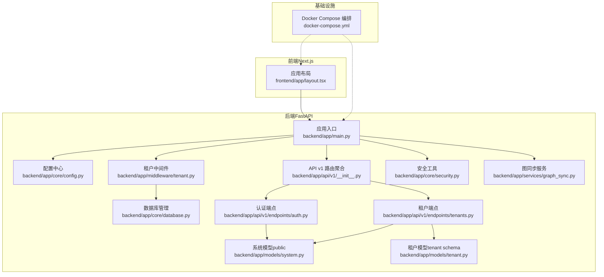
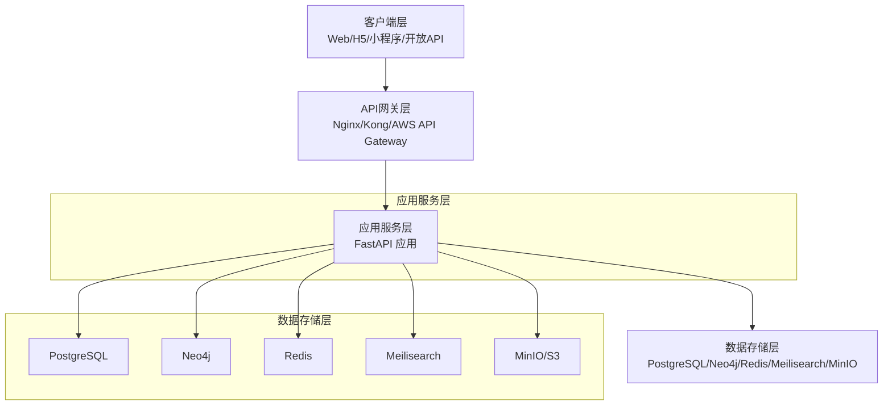
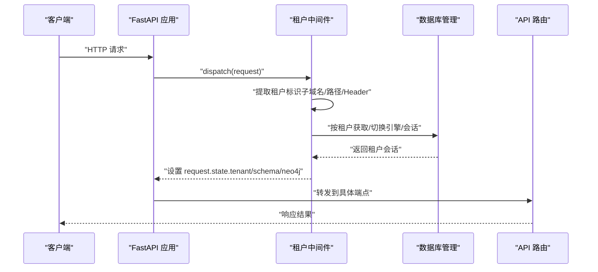
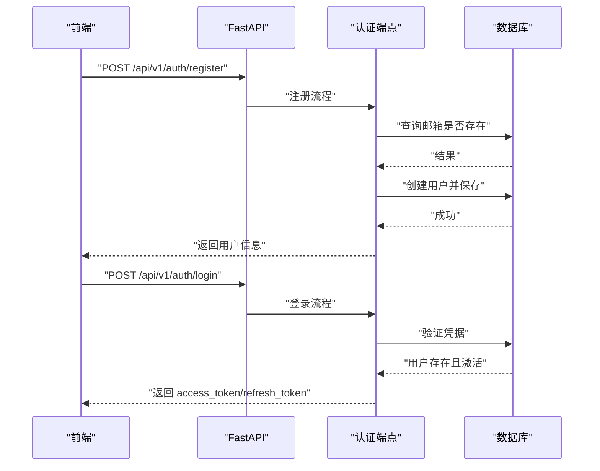
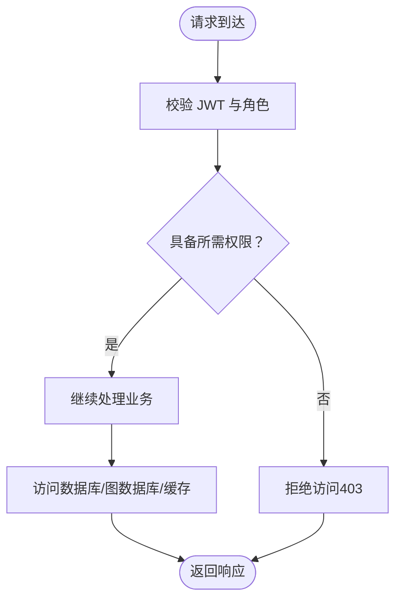
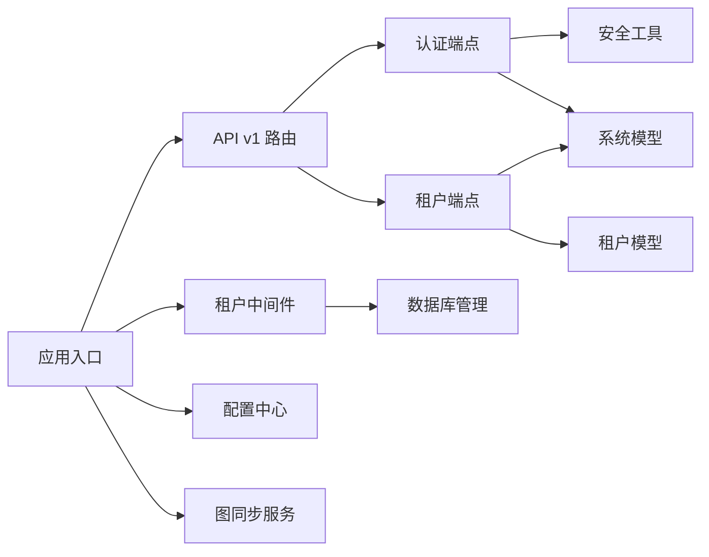

# 架构设计理念

<cite>
**本文引用的文件**   
- [backend/app/main.py](file://backend/app/main.py)
- [backend/app/core/config.py](file://backend/app/core/config.py)
- [backend/app/middleware/tenant.py](file://backend/app/middleware/tenant.py)
- [backend/app/core/database.py](file://backend/app/core/database.py)
- [backend/app/models/system.py](file://backend/app/models/system.py)
- [backend/app/models/tenant.py](file://backend/app/models/tenant.py)
- [backend/app/api/v1/__init__.py](file://backend/app/api/v1/__init__.py)
- [backend/app/api/v1/endpoints/tenants.py](file://backend/app/api/v1/endpoints/tenants.py)
- [backend/app/api/v1/endpoints/auth.py](file://backend/app/api/v1/endpoints/auth.py)
- [backend/app/services/graph_sync.py](file://backend/app/services/graph_sync.py)
- [backend/app/core/security.py](file://backend/app/core/security.py)
- [frontend/app/layout.tsx](file://frontend/app/layout.tsx)
- [docker-compose.yml](file://docker-compose.yml)
- [docs/ARCHITECTURE.md](file://docs/ARCHITECTURE.md)
</cite>

## 目录
1. [引言](#引言)
2. [项目结构](#项目结构)
3. [核心组件](#核心组件)
4. [架构总览](#架构总览)
5. [详细组件分析](#详细组件分析)
6. [依赖分析](#依赖分析)
7. [性能考虑](#性能考虑)
8. [故障排查指南](#故障排查指南)
9. [结论](#结论)
10. [附录](#附录)

## 引言
本项目旨在将单租户的“刘氏乾正公族谱”系统重构为多租户 SaaS 平台，支持多个姓氏/家族独立管理族谱数据，并在数据层面实现严格隔离。本文围绕多租户架构的设计理念进行深入解析，涵盖数据隔离策略、租户识别机制、资源分配方案；阐述前后端分离架构的优势与实现方式；说明 API 设计原则与数据传输协议；介绍微服务化思路与模块边界；结合 Clean Architecture 与领域驱动设计（DDD）给出落地实践；并从安全、可扩展性（水平/垂直扩展）、技术权衡与性能考量等维度提供系统性指导。

## 项目结构
后端采用 FastAPI + SQLAlchemy Async + PostgreSQL/Neo4j/Redis/Meilisearch 的组合，前端使用 Next.js App Router，通过 Docker Compose 将各组件编排为开发环境。整体采用“系统级公共表 + 租户级 Schema/数据库”的双层隔离策略，配合租户中间件在请求生命周期内注入租户上下文，确保所有业务路由均在正确的数据域中运行。

图表来源
- [backend/app/main.py:45-91](file://backend/app/main.py#L45-L91)
- [backend/app/api/v1/__init__.py:6-19](file://backend/app/api/v1/__init__.py#L6-L19)
- [backend/app/middleware/tenant.py:15-84](file://backend/app/middleware/tenant.py#L15-L84)
- [backend/app/core/database.py:24-121](file://backend/app/core/database.py#L24-L121)
- [backend/app/models/system.py:23-71](file://backend/app/models/system.py#L23-L71)
- [backend/app/models/tenant.py:23-40](file://backend/app/models/tenant.py#L23-L40)
- [backend/app/core/security.py:26-77](file://backend/app/core/security.py#L26-L77)
- [backend/app/services/graph_sync.py:20-63](file://backend/app/services/graph_sync.py#L20-L63)
- [frontend/app/layout.tsx:12-24](file://frontend/app/layout.tsx#L12-L24)
- [docker-compose.yml:89-132](file://docker-compose.yml#L89-L132)

章节来源
- [backend/app/main.py:45-91](file://backend/app/main.py#L45-L91)
- [backend/app/api/v1/__init__.py:6-19](file://backend/app/api/v1/__init__.py#L6-L19)
- [docker-compose.yml:89-132](file://docker-compose.yml#L89-L132)

## 核心组件
- 应用入口与生命周期：负责初始化数据库引擎、连接可选服务（Neo4j/Redis/Meilisearch）、注册中间件与路由、健康检查端点。
- 配置中心：集中管理应用、数据库、缓存、搜索、存储、JWT、CORS 等配置项。
- 数据库管理：统一管理默认引擎与按租户隔离的引擎/会话，支持 SQLite（每租户独立文件）与 PostgreSQL（Schema 隔离）两种模式。
- 租户中间件：在请求进入时提取租户标识（子域名/路径/Header），加载租户信息，设置租户 Schema/Neo4j 数据库上下文。
- 系统与租户模型：系统级表（public）用于租户、用户、订阅等；租户级表（tenant schema）用于人物、关系、支系等族谱数据。
- 安全与认证：密码哈希、JWT 签发与校验、刷新令牌、用户角色与权限体系。
- 图同步服务：将 PostgreSQL 中的人物与关系同步至 Neo4j，支撑族谱树渲染与关系查询。
- 前端布局：Next.js 根布局，承载全局样式与国际化字体变量。

章节来源
- [backend/app/main.py:17-42](file://backend/app/main.py#L17-L42)
- [backend/app/core/config.py:11-89](file://backend/app/core/config.py#L11-L89)
- [backend/app/core/database.py:24-121](file://backend/app/core/database.py#L24-L121)
- [backend/app/middleware/tenant.py:15-84](file://backend/app/middleware/tenant.py#L15-L84)
- [backend/app/models/system.py:23-71](file://backend/app/models/system.py#L23-L71)
- [backend/app/models/tenant.py:23-40](file://backend/app/models/tenant.py#L23-L40)
- [backend/app/core/security.py:26-77](file://backend/app/core/security.py#L26-L77)
- [backend/app/services/graph_sync.py:20-63](file://backend/app/services/graph_sync.py#L20-L63)
- [frontend/app/layout.tsx:12-24](file://frontend/app/layout.tsx#L12-L24)

## 架构总览
系统采用“客户端层 → API 网关层 → 应用服务层 → 数据存储层”的分层架构。前端通过 Next.js 提供 SSR/SSG 与静态资源能力；后端通过 FastAPI 提供高性能异步 API；数据层包含 PostgreSQL（关系数据）、Neo4j（图数据）、Redis（缓存/会话）、Meilisearch（全文检索）、MinIO（对象存储）。租户中间件贯穿请求生命周期，确保每个请求都在正确的租户上下文中执行。

图表来源
- [docs/ARCHITECTURE.md:34-78](file://docs/ARCHITECTURE.md#L34-L78)
- [docker-compose.yml:4-88](file://docker-compose.yml#L4-L88)

章节来源
- [docs/ARCHITECTURE.md:30-95](file://docs/ARCHITECTURE.md#L30-L95)
- [docker-compose.yml:4-88](file://docker-compose.yml#L4-L88)

## 详细组件分析

### 多租户数据隔离与租户识别
- 隔离策略
  - PostgreSQL：系统级表位于 public 模式，租户级表位于各自 schema；SQLite 场景下每租户一个数据库文件。
  - Neo4j：每个租户拥有独立数据库实例，避免跨租户关系污染。
  - 缓存/搜索/存储：可按租户维度隔离键空间或桶命名空间。
- 租户识别机制
  - 优先级：子域名（liu.genealogy.com）→ URL 路径（/t/liu/...）→ 请求头（X-Tenant-ID）。
  - 对于公开路径（如 /api/v1/auth、/api/v1/tenants、/health 等）不强制要求租户上下文。
- 上下文注入
  - 租户中间件在请求 state 中写入租户对象、schema 名称、Neo4j 数据库名，后续路由与服务读取该上下文执行数据操作。

图表来源
- [backend/app/middleware/tenant.py:39-84](file://backend/app/middleware/tenant.py#L39-L84)
- [backend/app/core/database.py:58-106](file://backend/app/core/database.py#L58-L106)
- [backend/app/api/v1/__init__.py:14-19](file://backend/app/api/v1/__init__.py#L14-L19)

章节来源
- [backend/app/middleware/tenant.py:15-84](file://backend/app/middleware/tenant.py#L15-L84)
- [backend/app/core/database.py:58-106](file://backend/app/core/database.py#L58-L106)
- [backend/app/api/v1/__init__.py:14-19](file://backend/app/api/v1/__init__.py#L14-L19)

### API 设计原则与数据传输协议
- 路由组织
  - /api/v1/auth：认证相关（注册/登录/刷新/当前用户）。
  - /api/v1/tenants：系统级租户管理（列表/详情/创建）。
  - /api/v1/t/{tenant_slug}：租户级 API（人物、族谱树、搜索、成员、设置等）。
- 响应格式
  - 成功：包含 success 与 data/meta 字段。
  - 错误：包含 success 与 error/code/message/details。
- 协议与安全
  - 使用 HTTPS 与 CORS 白名单。
  - JWT 作为认证载体，支持刷新令牌。
  - 前端通过 NEXT_PUBLIC_API_URL 指向后端 API。

图表来源
- [backend/app/api/v1/endpoints/auth.py:55-124](file://backend/app/api/v1/endpoints/auth.py#L55-L124)
- [backend/app/core/security.py:26-77](file://backend/app/core/security.py#L26-L77)

章节来源
- [backend/app/api/v1/endpoints/auth.py:55-124](file://backend/app/api/v1/endpoints/auth.py#L55-L124)
- [backend/app/core/security.py:26-77](file://backend/app/core/security.py#L26-L77)
- [docker-compose.yml:122-132](file://docker-compose.yml#L122-L132)

### 微服务化设计思路与模块边界
- 模块划分依据
  - 按业务域划分：租户域、用户域、族谱域、搜索域、文件域、订阅域。
  - 按职责划分：表示层（API）、应用层（业务编排）、领域层（模型/规则）、基础设施层（数据库/缓存/搜索）。
- 边界定义
  - 租户中间件与数据库管理器作为横切关注点，贯穿所有模块。
  - 端点层仅负责参数校验与调用应用服务，避免直接访问底层存储。
  - 图同步服务作为外部集成点，负责与 Neo4j 的数据同步。
- 实践建议
  - 逐步拆分：先以单一 FastAPI 进程承载，再按域拆分为独立进程/容器。
  - 事件驱动：对非实时场景采用消息队列解耦（如导入/导出、图重建）。

章节来源
- [backend/app/middleware/tenant.py:15-84](file://backend/app/middleware/tenant.py#L15-L84)
- [backend/app/core/database.py:24-121](file://backend/app/core/database.py#L24-L121)
- [backend/app/services/graph_sync.py:20-63](file://backend/app/services/graph_sync.py#L20-L63)

### Clean Architecture 与 DDD 的应用实践
- Clean Architecture
  - 外层：FastAPI 路由与端点。
  - 中间层：应用服务（业务用例）。
  - 内层：领域模型（Tenant/User/Person 等）与仓储接口。
  - 基础设施：数据库、缓存、搜索、对象存储。
  - 依赖方向：始终朝向“用例”，避免反向依赖。
- DDD
  - 领域模型：Person、SpouseRelation、Branch、Generation 等体现族谱领域概念。
  - 领域服务：GraphSyncService 将关系持久化到图数据库，体现跨实体的业务行为。
  - 值对象与聚合根：Person 作为聚合根，包含性别、出生/死亡、支系等值对象。
  - 领域事件：可引入“人物变更待审阅”等事件，驱动审核流程。

章节来源
- [backend/app/models/tenant.py:61-142](file://backend/app/models/tenant.py#L61-L142)
- [backend/app/models/system.py:23-71](file://backend/app/models/system.py#L23-L71)
- [backend/app/services/graph_sync.py:20-63](file://backend/app/services/graph_sync.py#L20-L63)

### 安全架构设计
- 认证授权
  - JWT：签发 access_token/refresh_token，支持过期时间与类型校验。
  - 密码：bcrypt 哈希存储，登录时比对。
  - 角色与权限：系统级（super_admin/operator/support）与租户级（tenant_admin/editor/reviewer/member/guest）双层角色体系。
- 数据加密与访问控制
  - 传输加密：HTTPS。
  - 存储加密：敏感字段（如密码）仅以哈希形式存储。
  - 访问控制：基于角色的权限矩阵，端点层进行权限校验。
- 会话与缓存
  - Redis 用于会话与热点数据缓存，需注意键空间隔离与过期策略。

图表来源
- [backend/app/core/security.py:80-103](file://backend/app/core/security.py#L80-L103)
- [backend/app/api/v1/endpoints/auth.py:90-124](file://backend/app/api/v1/endpoints/auth.py#L90-L124)

章节来源
- [backend/app/core/security.py:26-77](file://backend/app/core/security.py#L26-L77)
- [backend/app/api/v1/endpoints/auth.py:90-124](file://backend/app/api/v1/endpoints/auth.py#L90-L124)

### 可扩展性设计
- 水平扩展
  - API 服务：通过负载均衡与副本数扩展，状态尽量无状态化（会话可使用 Redis 集群）。
  - 数据库：PostgreSQL/Neo4j/Redis/Meilisearch 均支持主从/集群部署。
  - 前端：静态资源由 CDN 分发，Next.js 支持多实例与边缘缓存。
- 垂直扩展
  - 单实例优化：调整连接池大小、缓存命中率、索引与查询计划。
  - 存储：对象存储采用 S3 兼容接口，便于横向扩展。
- 架构演进
  - 开发/测试：Docker Compose 单机编排。
  - 生产：CDN/WAF + 负载均衡 + 多副本 API + 数据库主从/集群 + 缓存/搜索/存储集群。

章节来源
- [docs/ARCHITECTURE.md:915-950](file://docs/ARCHITECTURE.md#L915-L950)
- [docker-compose.yml:89-132](file://docker-compose.yml#L89-L132)

## 依赖分析
- 组件耦合
  - 租户中间件与数据库管理器耦合度低，通过配置中心与路由层解耦。
  - 端点层依赖模型与安全工具，避免直接依赖底层存储。
  - 图同步服务与 Neo4j 客户端耦合，但通过服务抽象降低对上层影响。
- 外部依赖
  - FastAPI、SQLAlchemy Async、Pydantic、JWALib、PassLib、Docker Compose。
- 潜在风险
  - SQLite 每租户文件模式在高并发下可能成为瓶颈，建议生产使用 PostgreSQL。
  - Neo4j 每租户数据库实例需合理规划资源与备份策略。

图表来源
- [backend/app/api/v1/endpoints/auth.py:55-124](file://backend/app/api/v1/endpoints/auth.py#L55-L124)
- [backend/app/api/v1/endpoints/tenants.py:45-88](file://backend/app/api/v1/endpoints/tenants.py#L45-L88)
- [backend/app/api/v1/__init__.py:6-19](file://backend/app/api/v1/__init__.py#L6-L19)
- [backend/app/middleware/tenant.py:15-84](file://backend/app/middleware/tenant.py#L15-L84)
- [backend/app/core/database.py:24-121](file://backend/app/core/database.py#L24-L121)
- [backend/app/core/security.py:26-77](file://backend/app/core/security.py#L26-L77)
- [backend/app/services/graph_sync.py:20-63](file://backend/app/services/graph_sync.py#L20-L63)

章节来源
- [backend/app/api/v1/endpoints/auth.py:55-124](file://backend/app/api/v1/endpoints/auth.py#L55-L124)
- [backend/app/api/v1/endpoints/tenants.py:45-88](file://backend/app/api/v1/endpoints/tenants.py#L45-L88)
- [backend/app/api/v1/__init__.py:6-19](file://backend/app/api/v1/__init__.py#L6-L19)
- [backend/app/middleware/tenant.py:15-84](file://backend/app/middleware/tenant.py#L15-L84)
- [backend/app/core/database.py:24-121](file://backend/app/core/database.py#L24-L121)
- [backend/app/core/security.py:26-77](file://backend/app/core/security.py#L26-L77)
- [backend/app/services/graph_sync.py:20-63](file://backend/app/services/graph_sync.py#L20-L63)

## 性能考虑
- 数据库层
  - 连接池：根据并发与硬件配置调整 pool_size/max_overflow。
  - 查询优化：为常用过滤字段建立索引；对分页查询使用覆盖索引。
  - 分库分表：当单租户数据量过大时，可考虑按时间/ID 分表。
- 缓存层
  - Redis：热点数据缓存、会话存储；注意键空间隔离与过期策略。
  - 前端缓存：CDN 与浏览器缓存结合，减少重复请求。
- 搜索层
  - Meilisearch：针对中文优化，建立合适索引与分词策略。
- 图计算
  - Neo4j：合理建模节点与关系标签，使用索引与查询计划分析。
- API 层
  - 异步 I/O：FastAPI 异步特性充分利用；避免阻塞操作。
  - 响应压缩与限流：在网关层实施限流与压缩策略。

## 故障排查指南
- 健康检查
  - /health 返回数据库、Neo4j、Redis、搜索服务的可用性状态。
- 租户上下文
  - 若出现“租户未找到/未激活”，检查租户中间件的识别顺序与数据库中的租户状态。
- 认证失败
  - 核对 JWT 密钥、算法与过期时间；确认刷新令牌是否有效。
- 数据库连接
  - 检查连接池配置与目标数据库健康状态；SQLite 每租户文件需确保目录权限正确。
- 图同步异常
  - 确认 Neo4j 连接参数与数据库名；检查同步服务日志输出。

章节来源
- [backend/app/main.py:73-86](file://backend/app/main.py#L73-L86)
- [backend/app/middleware/tenant.py:48-84](file://backend/app/middleware/tenant.py#L48-L84)
- [backend/app/core/security.py:80-103](file://backend/app/core/security.py#L80-L103)
- [backend/app/core/database.py:108-121](file://backend/app/core/database.py#L108-L121)
- [backend/app/services/graph_sync.py:94-104](file://backend/app/services/graph_sync.py#L94-L104)

## 结论
本项目以“系统级公共表 + 租户级 Schema/数据库”的双层隔离为核心，结合租户中间件在请求生命周期内的上下文注入，实现了强隔离的多租户架构。通过 Clean Architecture 与 DDD 的实践，明确了领域模型与业务边界；借助 JWT、角色与权限矩阵构建了安全体系；在前后端分离与容器化编排的基础上，具备良好的可扩展性与运维弹性。建议在生产环境中优先采用 PostgreSQL 与 Neo4j 集群，配合 CDN/WAF 与负载均衡，持续优化数据库与图计算性能，保障大规模家族数据的稳定运行。

## 附录
- 前端项目结构与租户上下文
  - Next.js App Router 提供清晰的路由分组与页面组织，便于按租户/角色划分视图。
- 开发与生产编排
  - Docker Compose 提供本地开发的一致环境；生产环境可迁移到 Kubernetes 或云原生平台。

章节来源
- [frontend/app/layout.tsx:12-24](file://frontend/app/layout.tsx#L12-L24)
- [docker-compose.yml:89-132](file://docker-compose.yml#L89-L132)