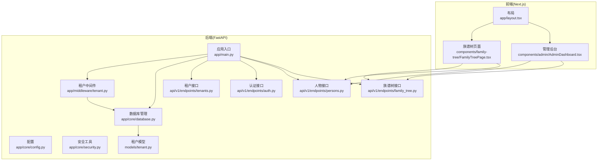
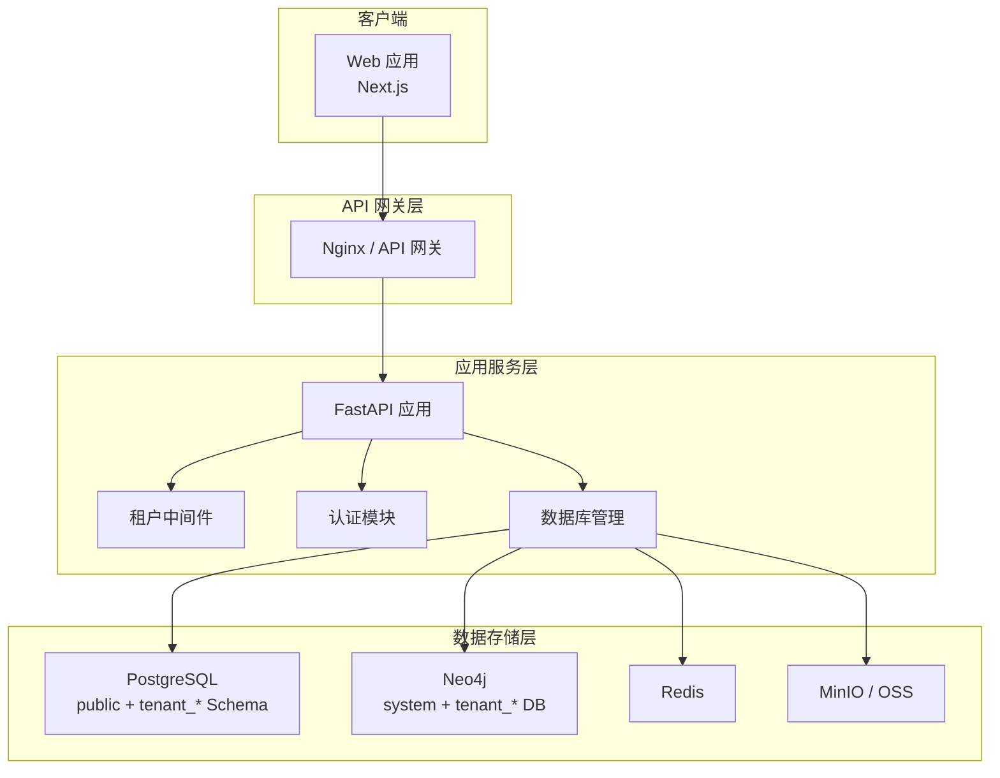
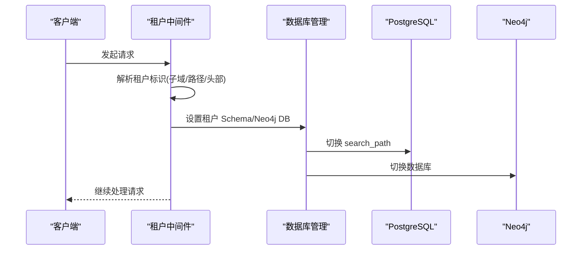
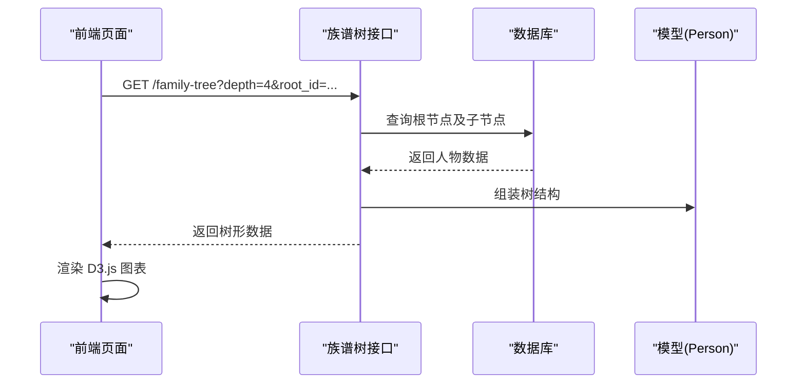
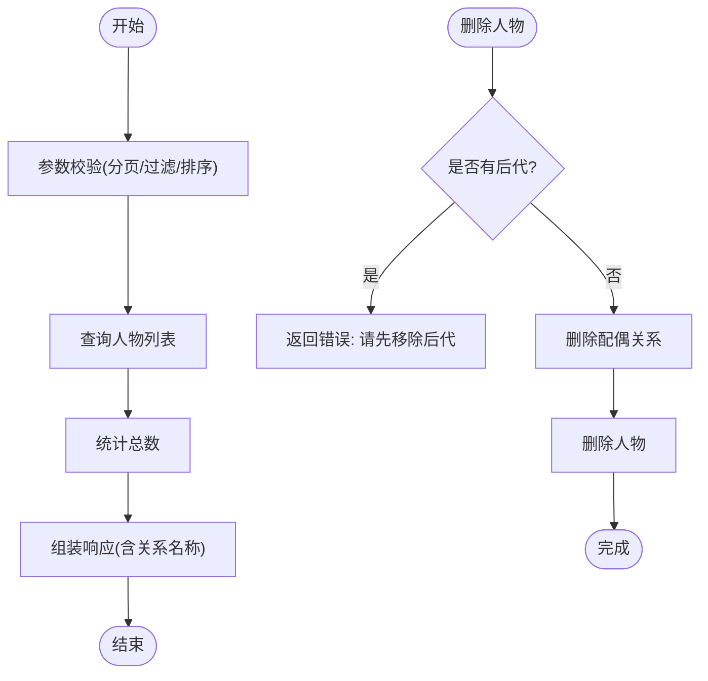
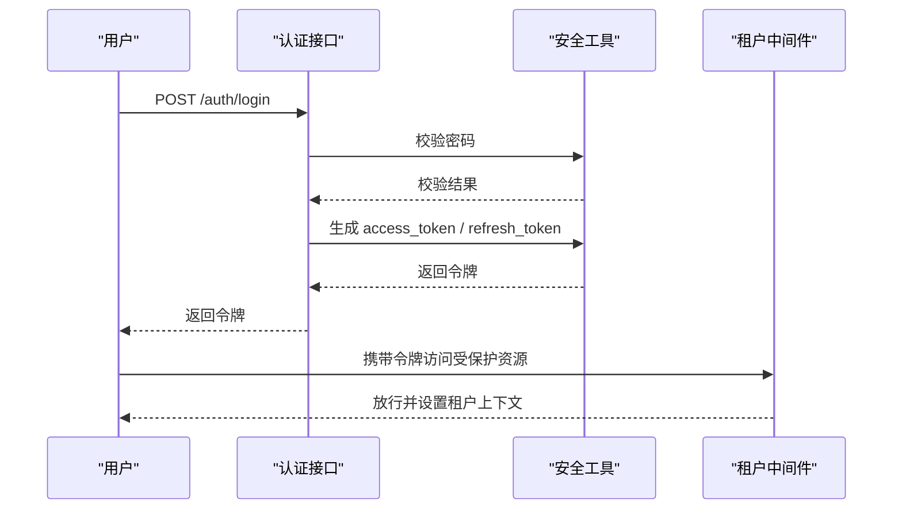
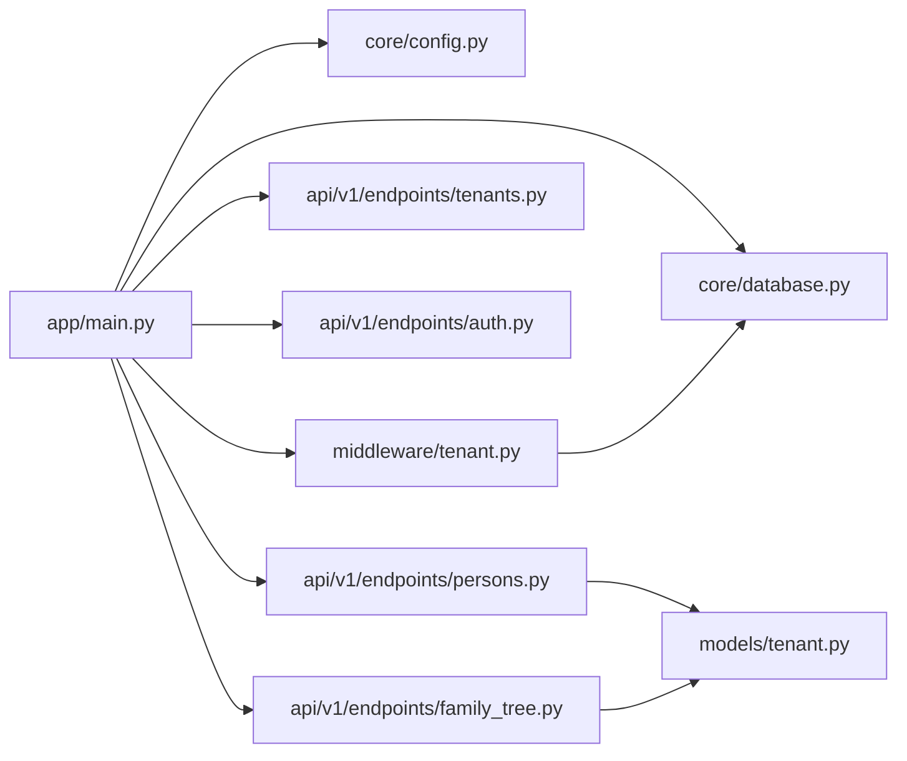

# 核心功能特性

<cite>
**本文引用的文件**
- [backend/app/main.py](file://backend/app/main.py)
- [backend/app/core/config.py](file://backend/app/core/config.py)
- [backend/app/middleware/tenant.py](file://backend/app/middleware/tenant.py)
- [backend/app/models/tenant.py](file://backend/app/models/tenant.py)
- [backend/app/api/v1/endpoints/tenants.py](file://backend/app/api/v1/endpoints/tenants.py)
- [backend/app/api/v1/endpoints/auth.py](file://backend/app/api/v1/endpoints/auth.py)
- [backend/app/api/v1/endpoints/persons.py](file://backend/app/api/v1/endpoints/persons.py)
- [backend/app/api/v1/endpoints/family_tree.py](file://backend/app/api/v1/endpoints/family_tree.py)
- [backend/app/core/security.py](file://backend/app/core/security.py)
- [backend/app/core/database.py](file://backend/app/core/database.py)
- [frontend/app/layout.tsx](file://frontend/app/layout.tsx)
- [frontend/components/family-tree/FamilyTreePage.tsx](file://frontend/components/family-tree/FamilyTreePage.tsx)
- [frontend/components/admin/AdminDashboard.tsx](file://frontend/components/admin/AdminDashboard.tsx)
- [scripts/create_tenant.py](file://scripts/create_tenant.py)
- [docs/ARCHITECTURE.md](file://docs/ARCHITECTURE.md)
</cite>

## 目录
1. [引言](#引言)
2. [项目结构](#项目结构)
3. [核心组件](#核心组件)
4. [架构总览](#架构总览)
5. [详细组件分析](#详细组件分析)
6. [依赖分析](#依赖分析)
7. [性能考虑](#性能考虑)
8. [故障排查指南](#故障排查指南)
9. [结论](#结论)
10. [附录](#附录)

## 引言
本文件面向多租户族谱管理系统的核心功能特性，围绕以下主题进行系统化说明：
- 多租户架构：如何通过数据库 Schema 隔离与 Neo4j 数据库隔离实现数据严格隔离与资源共享
- 族谱树可视化：基于 D3.js 的交互式可视化、关系查询与动态生成
- 人物管理系统：完整的 CRUD、关系维护与批量导入导出能力
- 用户认证与权限控制：JWT 令牌管理与角色权限体系
- 文件管理：图片、视频、文档的上传与管理
- 搜索功能：全文搜索、高级筛选与实时搜索
- 管理后台：功能与用户体验设计

## 项目结构
系统采用前后端分离架构，后端使用 FastAPI 提供多租户 API，前端使用 Next.js 构建多页面应用与管理后台。

**图表来源**
- [backend/app/main.py:45-91](file://backend/app/main.py#L45-L91)
- [backend/app/core/config.py:11-89](file://backend/app/core/config.py#L11-L89)
- [backend/app/core/database.py:24-121](file://backend/app/core/database.py#L24-L121)
- [backend/app/middleware/tenant.py:15-84](file://backend/app/middleware/tenant.py#L15-L84)
- [backend/app/api/v1/endpoints/tenants.py:14-164](file://backend/app/api/v1/endpoints/tenants.py#L14-L164)
- [backend/app/api/v1/endpoints/auth.py:22-179](file://backend/app/api/v1/endpoints/auth.py#L22-L179)
- [backend/app/api/v1/endpoints/persons.py:17-717](file://backend/app/api/v1/endpoints/persons.py#L17-L717)
- [backend/app/api/v1/endpoints/family_tree.py:17-274](file://backend/app/api/v1/endpoints/family_tree.py#L17-L274)
- [backend/app/models/tenant.py:23-244](file://backend/app/models/tenant.py#L23-L244)
- [frontend/app/layout.tsx:12-24](file://frontend/app/layout.tsx#L12-L24)
- [frontend/components/family-tree/FamilyTreePage.tsx:41-129](file://frontend/components/family-tree/FamilyTreePage.tsx#L41-L129)
- [frontend/components/admin/AdminDashboard.tsx:12-172](file://frontend/components/admin/AdminDashboard.tsx#L12-L172)

**章节来源**
- [backend/app/main.py:45-91](file://backend/app/main.py#L45-L91)
- [frontend/app/layout.tsx:12-24](file://frontend/app/layout.tsx#L12-L24)

## 核心组件
- 多租户中间件：负责从请求中提取租户标识（子域、路径或头部），加载租户并设置数据库 Schema 与 Neo4j 数据库上下文
- 数据库管理：支持 SQLite 与 PostgreSQL，针对不同数据库类型采用不同的隔离策略；提供租户会话切换
- 安全与认证：密码哈希、JWT 访问/刷新令牌生成与校验
- 租户模型：定义每个租户下的世代、支系、人物、配偶关系、图片、视频与变更日志等核心实体
- API 层：提供认证、租户管理、人物管理、族谱树查询与统计等接口
- 前端组件：族谱树可视化页面与管理后台仪表盘

**章节来源**
- [backend/app/middleware/tenant.py:15-142](file://backend/app/middleware/tenant.py#L15-L142)
- [backend/app/core/database.py:24-171](file://backend/app/core/database.py#L24-L171)
- [backend/app/core/security.py:16-103](file://backend/app/core/security.py#L16-L103)
- [backend/app/models/tenant.py:23-244](file://backend/app/models/tenant.py#L23-L244)
- [backend/app/api/v1/endpoints/tenants.py:14-164](file://backend/app/api/v1/endpoints/tenants.py#L14-L164)
- [backend/app/api/v1/endpoints/auth.py:22-179](file://backend/app/api/v1/endpoints/auth.py#L22-L179)
- [backend/app/api/v1/endpoints/persons.py:17-717](file://backend/app/api/v1/endpoints/persons.py#L17-L717)
- [backend/app/api/v1/endpoints/family_tree.py:17-274](file://backend/app/api/v1/endpoints/family_tree.py#L17-L274)

## 架构总览
系统采用“多租户 + 多数据库”的架构设计：
- PostgreSQL 使用 Schema 隔离（public 存放系统级表，tenant_* 存放租户业务表）
- Neo4j 使用独立数据库隔离（tenant_*）
- 前端 Next.js 通过 API 路由调用后端接口，后端通过中间件解析租户上下文

**图表来源**
- [docs/ARCHITECTURE.md:34-78](file://docs/ARCHITECTURE.md#L34-L78)
- [backend/app/middleware/tenant.py:15-84](file://backend/app/middleware/tenant.py#L15-L84)
- [backend/app/core/database.py:58-106](file://backend/app/core/database.py#L58-L106)

**章节来源**
- [docs/ARCHITECTURE.md:98-140](file://docs/ARCHITECTURE.md#L98-L140)

## 详细组件分析

### 多租户架构与数据隔离
- 租户识别顺序：子域 → 路径 → 头部；公共路径（如认证、租户注册、系统管理）不强制要求租户上下文
- 数据库隔离：SQLite 为每个租户创建独立数据库文件；PostgreSQL 使用 Schema 隔离并通过 search_path 切换
- Neo4j 隔离：为每个租户创建独立数据库（或在节点上加前缀以兼容社区版）

**图表来源**
- [backend/app/middleware/tenant.py:93-125](file://backend/app/middleware/tenant.py#L93-L125)
- [backend/app/core/database.py:136-171](file://backend/app/core/database.py#L136-L171)

**章节来源**
- [backend/app/middleware/tenant.py:15-142](file://backend/app/middleware/tenant.py#L15-L142)
- [backend/app/core/database.py:24-171](file://backend/app/core/database.py#L24-L171)
- [scripts/create_tenant.py:18-44](file://scripts/create_tenant.py#L18-L44)

### 族谱树可视化与关系查询
- 族谱树接口支持从指定根节点构建树、查找祖先链、后代树与统计信息
- 前端使用 D3.js 与 react-d3-tree 实现交互式可视化，支持点击节点查看人物详情
- 支持深度控制与按代数统计

**图表来源**
- [backend/app/api/v1/endpoints/family_tree.py:43-150](file://backend/app/api/v1/endpoints/family_tree.py#L43-L150)
- [frontend/components/family-tree/FamilyTreePage.tsx:41-129](file://frontend/components/family-tree/FamilyTreePage.tsx#L41-L129)

**章节来源**
- [backend/app/api/v1/endpoints/family_tree.py:17-274](file://backend/app/api/v1/endpoints/family_tree.py#L17-L274)
- [frontend/components/family-tree/FamilyTreePage.tsx:110-129](file://frontend/components/family-tree/FamilyTreePage.tsx#L110-L129)

### 人物管理系统（CRUD、关系维护、批量导入导出）
- CRUD：支持分页、过滤、排序与字段更新；删除前检查是否有后代
- 关系维护：支持配偶关系的创建、查询与删除；父子关系通过人物表的 father_id/mother_id 维护
- 批量导入导出：迁移脚本提供数据导出与转换示例，便于后续对接

**图表来源**
- [backend/app/api/v1/endpoints/persons.py:172-235](file://backend/app/api/v1/endpoints/persons.py#L172-L235)
- [backend/app/api/v1/endpoints/persons.py:444-492](file://backend/app/api/v1/endpoints/persons.py#L444-L492)

**章节来源**
- [backend/app/api/v1/endpoints/persons.py:17-717](file://backend/app/api/v1/endpoints/persons.py#L17-L717)
- [scripts/create_tenant.py:69-206](file://scripts/create_tenant.py#L69-L206)

### 用户认证与权限控制（JWT 令牌管理、角色权限体系）
- 认证流程：注册、登录、刷新令牌；登录成功后返回 access_token 与 refresh_token
- 安全工具：密码哈希、JWT 编解码与过期时间控制
- 权限体系：系统级与租户级角色，支持公开、访客、成员、编辑、审核、家族管理员、超级管理员等角色

**图表来源**
- [backend/app/api/v1/endpoints/auth.py:55-124](file://backend/app/api/v1/endpoints/auth.py#L55-L124)
- [backend/app/core/security.py:26-77](file://backend/app/core/security.py#L26-L77)
- [backend/app/middleware/tenant.py:39-84](file://backend/app/middleware/tenant.py#L39-L84)

**章节来源**
- [backend/app/api/v1/endpoints/auth.py:22-179](file://backend/app/api/v1/endpoints/auth.py#L22-L179)
- [backend/app/core/security.py:16-103](file://backend/app/core/security.py#L16-L103)
- [docs/ARCHITECTURE.md:174-271](file://docs/ARCHITECTURE.md#L174-L271)

### 文件管理（图片、视频、文档）
- 存储：通过 MinIO/OSS 等对象存储统一管理媒体文件
- 媒体模型：人物图片与视频模型分别维护 URL、标题、描述与排序
- 前端：管理后台提供媒体上传与列表展示

**章节来源**
- [backend/app/models/tenant.py:167-212](file://backend/app/models/tenant.py#L167-L212)
- [frontend/components/admin/AdminDashboard.tsx:12-172](file://frontend/components/admin/AdminDashboard.tsx#L12-L172)

### 搜索功能（全文搜索、高级筛选、实时搜索）
- 基础搜索：人物名称、字、号、别名模糊匹配
- 高级筛选：按代数、支系、性别、可见性筛选
- 实时搜索：前端输入框实时触发搜索请求
- 全文搜索：可选集成 Meilisearch（在配置中启用）

**章节来源**
- [backend/app/api/v1/endpoints/persons.py:172-235](file://backend/app/api/v1/endpoints/persons.py#L172-L235)
- [frontend/components/family-tree/FamilyTreePage.tsx:74-83](file://frontend/components/family-tree/FamilyTreePage.tsx#L74-L83)
- [backend/app/core/config.py:49-51](file://backend/app/core/config.py#L49-L51)

### 管理后台（功能与用户体验设计）
- 仪表盘：展示人物总数、世代分布、最早与最新世代等关键指标
- 快捷操作：跳转至人物管理与族谱树查看
- 响应式卡片与图标：提升信息密度与可读性

**章节来源**
- [frontend/components/admin/AdminDashboard.tsx:12-172](file://frontend/components/admin/AdminDashboard.tsx#L12-L172)

## 依赖分析
- 应用启动：初始化数据库引擎、连接可选服务（Neo4j、Redis、Meilisearch）、注册路由与健康检查
- 中间件：在请求进入业务逻辑前注入租户上下文
- 数据层：根据数据库类型选择 Schema 或文件隔离策略

**图表来源**
- [backend/app/main.py:17-42](file://backend/app/main.py#L17-L42)
- [backend/app/middleware/tenant.py:15-84](file://backend/app/middleware/tenant.py#L15-L84)
- [backend/app/core/database.py:24-121](file://backend/app/core/database.py#L24-L121)
- [backend/app/models/tenant.py:23-244](file://backend/app/models/tenant.py#L23-L244)

**章节来源**
- [backend/app/main.py:17-42](file://backend/app/main.py#L17-L42)

## 性能考虑
- 数据库连接池：PostgreSQL 使用连接池与溢出配置，SQLite 在开发环境默认配置
- 查询优化：分页与条件过滤减少一次性返回数据量；树查询限制深度避免递归过深
- 可选服务：Neo4j、Redis、Meilisearch 作为可选增强，不影响核心功能运行
- 前端渲染：D3.js 图表按需加载，避免 SSR 对图表库的不兼容

**章节来源**
- [backend/app/core/config.py:34-51](file://backend/app/core/config.py#L34-L51)
- [backend/app/api/v1/endpoints/family_tree.py:46-68](file://backend/app/api/v1/endpoints/family_tree.py#L46-L68)
- [frontend/components/family-tree/FamilyTreePage.tsx:11-22](file://frontend/components/family-tree/FamilyTreePage.tsx#L11-L22)

## 故障排查指南
- 租户未找到或未激活：中间件返回明确错误码与提示
- 数据库连接失败：检查数据库 URL、连接池配置与服务可用性
- JWT 校验失败：确认密钥、算法与过期时间配置正确
- 前端图表不显示：确认动态导入与 SSR 配置，检查网络请求与响应

**章节来源**
- [backend/app/middleware/tenant.py:52-74](file://backend/app/middleware/tenant.py#L52-L74)
- [backend/app/core/security.py:80-103](file://backend/app/core/security.py#L80-L103)
- [frontend/components/family-tree/FamilyTreePage.tsx:11-22](file://frontend/components/family-tree/FamilyTreePage.tsx#L11-L22)

## 结论
该系统通过多租户架构实现了家族数据的严格隔离与资源共享，结合 PostgreSQL Schema 与 Neo4j 数据库隔离，满足多家族并发管理需求。前端以 D3.js 为核心实现族谱树可视化，配合完善的认证与权限体系、人物管理与文件管理能力，以及可扩展的搜索与管理后台，形成一套完整的 SaaS 化族谱管理解决方案。

## 附录
- 租户创建脚本：提供 PostgreSQL Schema 初始化、表结构创建与 Neo4j 数据库准备的自动化流程
- 架构文档：包含整体架构图、技术栈选型、权限矩阵与 API 路由结构

**章节来源**
- [scripts/create_tenant.py:231-282](file://scripts/create_tenant.py#L231-L282)
- [docs/ARCHITECTURE.md:528-577](file://docs/ARCHITECTURE.md#L528-L577)