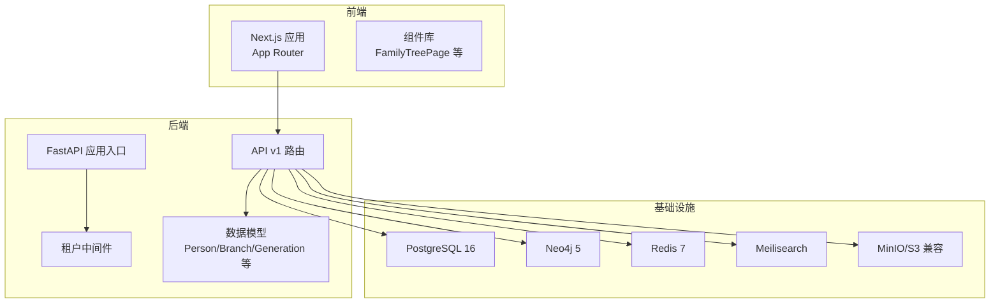
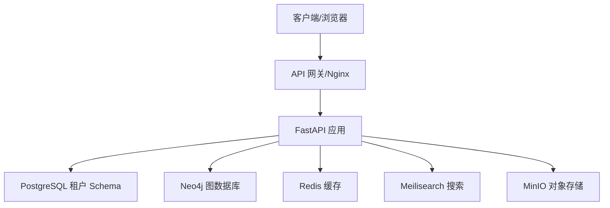
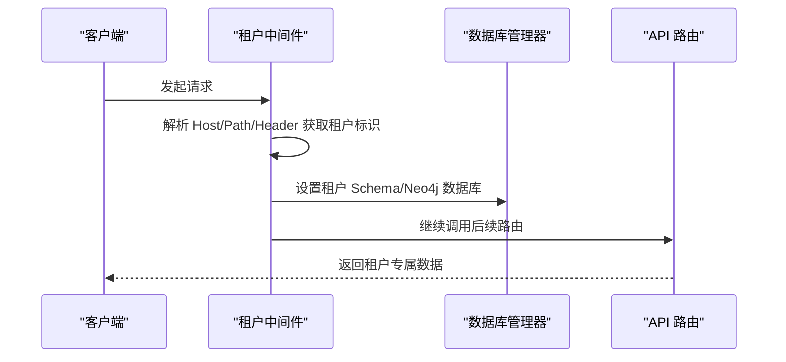
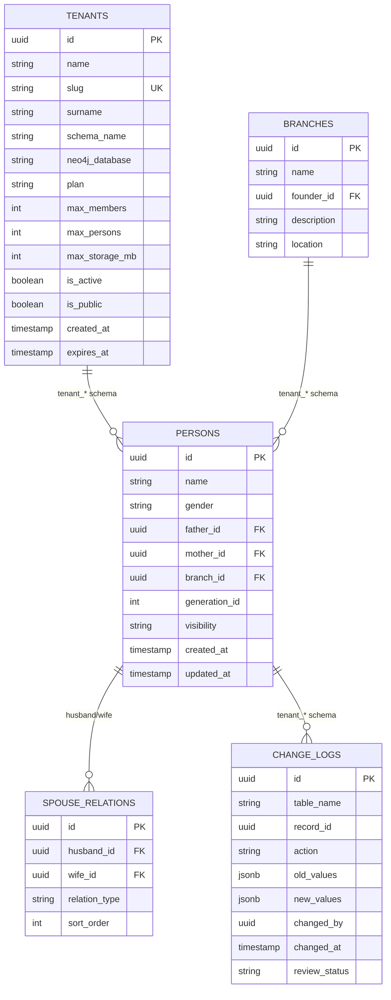
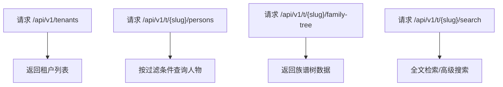
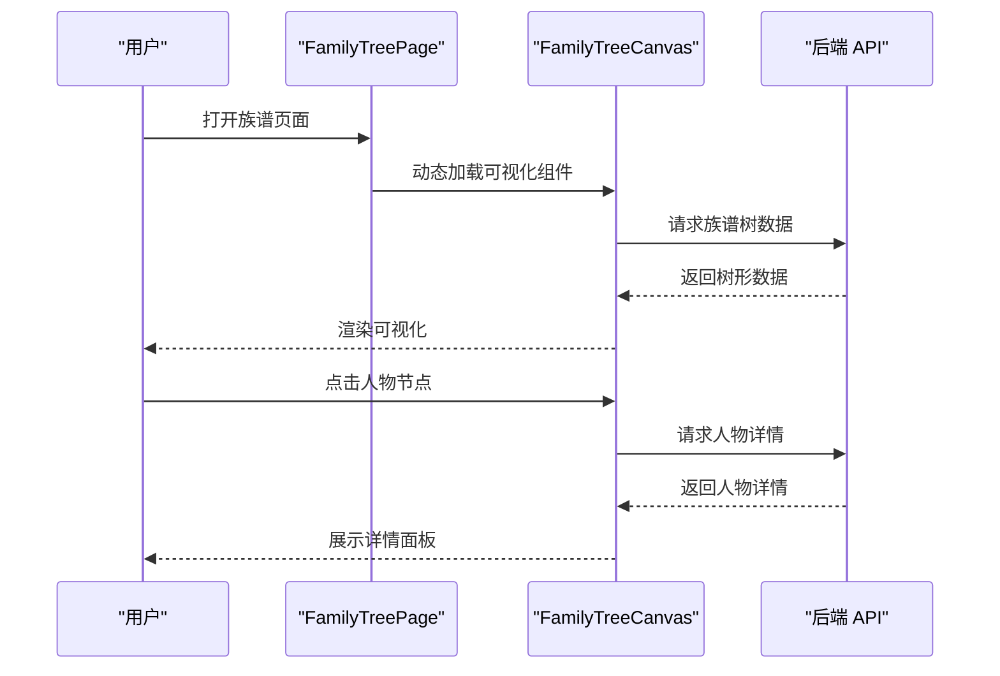
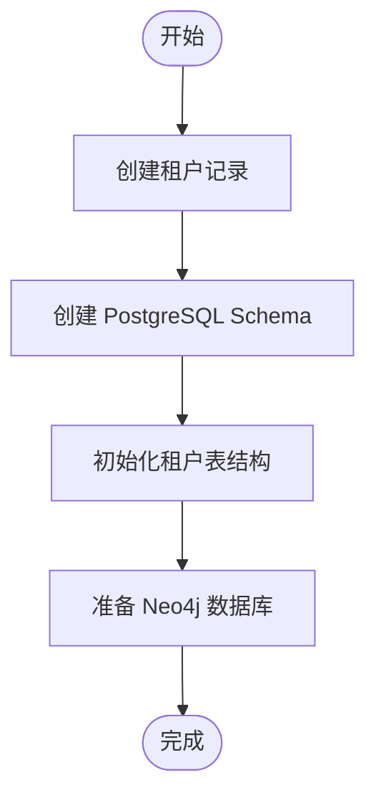
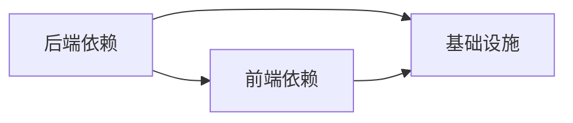

# 项目概述

<cite>
**本文引用的文件**
- [README.md](file://README.md)
- [docs/ARCHITECTURE.md](file://docs/ARCHITECTURE.md)
- [backend/README.md](file://backend/README.md)
- [backend/app/main.py](file://backend/app/main.py)
- [backend/app/middleware/tenant.py](file://backend/app/middleware/tenant.py)
- [backend/app/models/tenant.py](file://backend/app/models/tenant.py)
- [backend/app/api/v1/endpoints/tenants.py](file://backend/app/api/v1/endpoints/tenants.py)
- [backend/app/api/v1/endpoints/persons.py](file://backend/app/api/v1/endpoints/persons.py)
- [frontend/package.json](file://frontend/package.json)
- [frontend/app/layout.tsx](file://frontend/app/layout.tsx)
- [frontend/components/family-tree/FamilyTreePage.tsx](file://frontend/components/family-tree/FamilyTreePage.tsx)
- [scripts/create_tenant.py](file://scripts/create_tenant.py)
- [docker-compose.yml](file://docker-compose.yml)
- [backend/pyproject.toml](file://backend/pyproject.toml)
</cite>

## 目录
1. [简介](#简介)
2. [项目结构](#项目结构)
3. [核心组件](#核心组件)
4. [架构总览](#架构总览)
5. [详细组件分析](#详细组件分析)
6. [依赖分析](#依赖分析)
7. [性能考虑](#性能考虑)
8. [故障排查指南](#故障排查指南)
9. [结论](#结论)
10. [附录](#附录)

## 简介
本项目是一个现代化的多家族族谱管理 SaaS 平台，采用多租户架构，支持多个家族独立管理各自的族谱数据。系统通过前后端分离与微服务化设计，结合 PostgreSQL + Neo4j 的混合数据存储，实现高性能的族谱树可视化、成员管理与历史记录追踪。项目提供完整的开发与部署流程，支持本地开发、Docker Compose 以及生产环境部署，并内置了完善的权限体系与数据隔离策略。

## 项目结构
项目采用分层清晰的目录组织：
- backend：基于 FastAPI 的后端 API，包含路由、中间件、模型、服务与数据库管理
- frontend：基于 Next.js 15 的前端应用，采用 App Router，提供族谱树可视化与管理界面
- docker：包含数据库初始化脚本与 Prometheus 配置
- docs：架构设计与本地开发指南
- scripts：租户创建与数据迁移脚本
- django_backup：历史 Django 单租户版本备份，用于迁移参考

**图表来源**
- [backend/app/main.py:45-91](file://backend/app/main.py#L45-L91)
- [backend/app/middleware/tenant.py:15-84](file://backend/app/middleware/tenant.py#L15-L84)
- [backend/app/models/tenant.py:61-132](file://backend/app/models/tenant.py#L61-L132)
- [docker-compose.yml:4-145](file://docker-compose.yml#L4-L145)

**章节来源**
- [README.md:5-27](file://README.md#L5-L27)
- [docs/ARCHITECTURE.md:32-78](file://docs/ARCHITECTURE.md#L32-L78)

## 核心组件
- 多租户中间件：负责从请求中识别租户（子域名、路径或头部），并设置租户上下文，确保后续数据库访问在正确的 Schema/数据库中进行
- 数据模型：以 SQLAlchemy ORM 映射 PostgreSQL 租户 Schema 的人物、世代、支系、配偶关系等实体
- API 路由：提供认证、租户管理、人物管理、族谱树查询、成员管理等接口
- 前端应用：基于 Next.js 15，提供族谱树可视化、人物详情、管理后台等功能
- 基础设施：PostgreSQL、Neo4j、Redis、Meilisearch、MinIO，支撑数据存储、图计算、缓存与搜索

**章节来源**
- [backend/app/middleware/tenant.py:15-142](file://backend/app/middleware/tenant.py#L15-L142)
- [backend/app/models/tenant.py:61-244](file://backend/app/models/tenant.py#L61-L244)
- [backend/app/api/v1/endpoints/persons.py:172-493](file://backend/app/api/v1/endpoints/persons.py#L172-L493)
- [frontend/package.json:12-44](file://frontend/package.json#L12-L44)

## 架构总览
系统采用“客户端层 → API 网关层 → 应用服务层 → 数据存储层”的分层架构。前端通过 Next.js 提供 Web 与管理后台，后端通过 FastAPI 提供 REST API；数据层采用 PostgreSQL（关系数据）与 Neo4j（图数据）双写策略，辅以 Redis、Meilisearch、MinIO 等组件提升性能与可用性。

**图表来源**
- [docs/ARCHITECTURE.md:32-78](file://docs/ARCHITECTURE.md#L32-L78)
- [docker-compose.yml:4-145](file://docker-compose.yml#L4-L145)

## 详细组件分析

### 多租户中间件与租户识别
多租户中间件负责从请求头、URL 路径或自定义头部提取租户标识，并在请求上下文中注入租户信息，随后切换数据库连接至对应 Schema 或 Neo4j 数据库。该机制确保不同家族的数据严格隔离。

**图表来源**
- [backend/app/middleware/tenant.py:39-84](file://backend/app/middleware/tenant.py#L39-L84)
- [backend/app/main.py:66-67](file://backend/app/main.py#L66-L67)

**章节来源**
- [backend/app/middleware/tenant.py:15-142](file://backend/app/middleware/tenant.py#L15-L142)

### 数据模型与关系设计
系统采用 PostgreSQL 租户 Schema 隔离与 Neo4j 图数据库相结合的方式：
- PostgreSQL（public Schema）：存储系统级租户、用户、订阅等元数据
- PostgreSQL（tenant_* Schema）：存储各家族的人员、世代、支系、配偶关系、变更日志等
- Neo4j：存储人物关系图，支持族谱树快速查询与遍历

**图表来源**
- [docs/ARCHITECTURE.md:278-494](file://docs/ARCHITECTURE.md#L278-L494)
- [backend/app/models/tenant.py:61-244](file://backend/app/models/tenant.py#L61-L244)

**章节来源**
- [docs/ARCHITECTURE.md:274-525](file://docs/ARCHITECTURE.md#L274-L525)
- [backend/app/models/tenant.py:61-244](file://backend/app/models/tenant.py#L61-L244)

### API 设计与路由结构
API 采用版本化前缀 /api/v1，区分系统级与租户级路由：
- 系统级：/auth、/tenants、/admin
- 租户级：/t/{tenant_slug}/persons、/family-tree、/search、/members、/settings

**图表来源**
- [docs/ARCHITECTURE.md:528-577](file://docs/ARCHITECTURE.md#L528-L577)
- [backend/app/api/v1/endpoints/tenants.py:45-116](file://backend/app/api/v1/endpoints/tenants.py#L45-L116)
- [backend/app/api/v1/endpoints/persons.py:172-235](file://backend/app/api/v1/endpoints/persons.py#L172-L235)

**章节来源**
- [docs/ARCHITECTURE.md:528-577](file://docs/ARCHITECTURE.md#L528-L577)
- [backend/app/api/v1/endpoints/tenants.py:17-164](file://backend/app/api/v1/endpoints/tenants.py#L17-L164)
- [backend/app/api/v1/endpoints/persons.py:172-717](file://backend/app/api/v1/endpoints/persons.py#L172-L717)

### 前端架构与族谱树可视化
前端采用 Next.js 15 App Router，动态加载族谱树组件以避免 SSR 问题。组件通过 API 请求获取族谱树数据并渲染，支持树形视图与列表视图切换、人物详情面板等交互。

**图表来源**
- [frontend/components/family-tree/FamilyTreePage.tsx:41-129](file://frontend/components/family-tree/FamilyTreePage.tsx#L41-L129)
- [frontend/app/layout.tsx:12-24](file://frontend/app/layout.tsx#L12-L24)

**章节来源**
- [frontend/package.json:12-44](file://frontend/package.json#L12-L44)
- [frontend/components/family-tree/FamilyTreePage.tsx:1-226](file://frontend/components/family-tree/FamilyTreePage.tsx#L1-L226)

### 租户创建与初始化流程
系统提供脚本用于创建租户、初始化 PostgreSQL Schema 与表、以及准备 Neo4j 数据库。该流程确保新家族可以快速上线并拥有独立的数据空间。

**图表来源**
- [scripts/create_tenant.py:231-282](file://scripts/create_tenant.py#L231-L282)

**章节来源**
- [scripts/create_tenant.py:18-306](file://scripts/create_tenant.py#L18-L306)

## 依赖分析
- 后端依赖：FastAPI、SQLAlchemy、asyncpg、Alembic、Pydantic、Redis、Neo4j、Meilisearch、python-dotenv 等
- 前端依赖：Next.js 15、React 19、Tailwind CSS、@tanstack/react-query、axios、zustand、d3 与 react-d3-tree 等
- 基础设施：PostgreSQL 16、Neo4j 5、Redis 7、Meilisearch、MinIO、Nginx

**图表来源**
- [backend/pyproject.toml:7-25](file://backend/pyproject.toml#L7-L25)
- [frontend/package.json:12-44](file://frontend/package.json#L12-L44)
- [docker-compose.yml:4-145](file://docker-compose.yml#L4-L145)

**章节来源**
- [backend/pyproject.toml:1-61](file://backend/pyproject.toml#L1-L61)
- [frontend/package.json:1-45](file://frontend/package.json#L1-L45)
- [docker-compose.yml:1-145](file://docker-compose.yml#L1-L145)

## 性能考虑
- 数据库：PostgreSQL 使用租户 Schema 隔离，减少跨家族查询；Neo4j 用于高效的关系查询与族谱树遍历
- 缓存：Redis 用于会话、热点数据缓存，降低数据库压力
- 搜索：Meilisearch 提供轻量级全文检索，支持中文
- 可视化：前端使用 D3 与 react-d3-tree，支持树形图渲染与交互
- 部署：Docker Compose 提供开发与生产环境的一致化部署

[本节为通用性能建议，不直接分析具体文件]

## 故障排查指南
- 健康检查：后端提供 /health 接口，可检查数据库、Neo4j、Redis、搜索服务的连通性
- 日志与健康检查：数据库、Neo4j、Redis、Meilisearch、MinIO 均配置了健康检查，便于容器化环境监控
- 租户识别失败：确认请求头、URL 路径或自定义头部是否正确传递租户标识
- 数据库连接：检查 PostgreSQL 与 Neo4j 的连接参数与网络可达性

**章节来源**
- [backend/app/main.py:73-86](file://backend/app/main.py#L73-L86)
- [docker-compose.yml:16-87](file://docker-compose.yml#L16-L87)

## 结论
本项目通过多租户架构实现了多家族数据的严格隔离与独立管理，结合 PostgreSQL 与 Neo4j 的混合存储策略，满足了族谱数据的复杂关系与高并发访问需求。前后端分离与容器化部署提升了开发效率与运维稳定性。项目已具备完整的开发、测试与部署能力，适合进一步扩展为成熟的 SaaS 平台。

[本节为总结性内容，不直接分析具体文件]

## 附录
- 快速开始：本地开发与 Docker Compose 部署
- 技术栈：前端（Next.js 15）、后端（FastAPI）、数据库（PostgreSQL 16 + Neo4j 5）、缓存（Redis 7）、搜索（Meilisearch）、存储（MinIO）
- 开发进度：已完成架构设计、项目骨架、数据模型、租户中间件、认证系统、族谱树可视化、人物管理 API、管理后台、前端页面、测试用例与部署配置

**章节来源**
- [README.md:29-133](file://README.md#L29-L133)
- [backend/README.md:1-4](file://backend/README.md#L1-L4)